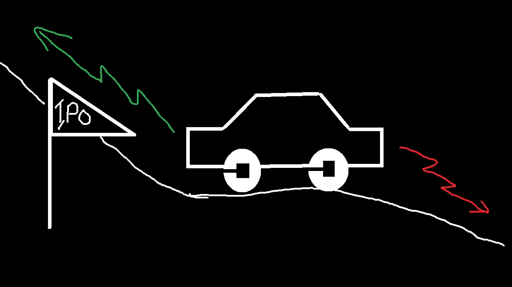

# 优步:十年内从 0 到 900 亿美元——初创公司的收获(以及优步面临的障碍)

> 原文：<https://medium.com/hackernoon/0-to-90-bn-in-a-decade-uber-takeaways-for-startups-and-roadblocks-ahead-for-uber-b17c3bee2a3f>

> 优步退出中国、俄国和东南亚的决定标志着优步的战略从高速增长向合理增长的转变。它帮助该公司遏制了亏损和现金消耗，否则情况可能会糟糕得多。优步不可能在与中国的滴滴、印度的 Ola、新加坡的 Grab、印尼的 Go-Jek 和俄罗斯的 Yandex 同时作战的情况下继续航行。

围绕优步 IPO 的热议显而易见。这无疑是有史以来最令人期待的 IPO 之一。每个汤姆、迪克和哈里都变成了估值大师，预测公司的估值。最初的迹象表明，优步可能寻求 1200 亿美元的估值。但鉴于 Lyft 股价上周的下滑，优步更有可能会更加保守，寻求 800-900 亿美元的估值。股票市场对优步是看涨还是看跌还是未知。尽管如此，优步的迅速崛起还是给了初创公司一些成功之道。

# 1)快速增长的关键是权力下放

优步是科技产业的雷普利的信不信由你！一个 2009 年成立的公司，扩张到了 65 个国家 600+以上的城市，是不是很不可思议？这是一个不可思议的成就。自 2010 年 7 月 5 日优步(当时的 UberCab)提供第一次乘车服务以来，优步肯定每 5.3 天就扩张到一个新城市，在 3219 天内达到 600 个城市(假设连续推出)。优步如何完成这项艰巨的任务？优步建立了本地运营团队，并给予他们充分的自主权。这导致了多个微型组织推动了优步的发展。这种分散战略帮助优步更快地扩张。这种分散的方法可能带来不一致和失败的风险。优步在法国、美国和其他地方的当地球队因为错误的原因出现在新闻中时遇到了一些小问题。但总体而言，这一策略帮助优步超越了竞争对手。

这个故事的关键是——找到聪明的人并授权。想要在地理上扩张的公司需要给当地单位更多的自主权，并抵制从总部掌控全局的诱惑。在我看来，Booking.com 是打算走向全球的公司之一，但不能让重大决策从总部溜走。如果所有的电话都是由总部打来的，那么当地部门就很难充分发挥潜力，也很难根据当地需求对产品进行本地化。

对于一个没有全球抱负的公司来说，能得到什么？优步的模型甚至对当地的公司也非常适用。这个想法是将责任委派给每个团队，并为他们提供完全的操作自主权。有些错误是必然会发生的。但是每个团队都从这些错误中学习和发展。

# 2)胸怀大志

> “在优步，我们通过让世界运转起来来点燃机遇。”

优步从未将自己局限于打车服务。它总是将自己视为移动性的推动者。正是因为这个原因，优步吃饭，优步自行车(收购跳转)和优步货运可能会出现。如果有人想知道一家尚未盈利的公司如何获得如此有吸引力的估值，答案就在优步的宏伟愿景中。通过拓宽流动性的视野，优步进入了一个潜在的巨大市场。到目前为止，增长故事与愿景一致，优步已经实现了其他形式的食品和货物运输。这反过来允许优步向投资者收取溢价。
每个公司都应该“胸怀大志”，设定远大目标，并努力实现它们。雄心勃勃和浮夸之间只有一线之隔。前者是成功的秘诀，而后者肯定会失败。如果一个公司设定的愿景太不切实际，以至于它不能采取合理的步骤向既定的愿景靠近，利益相关者就不会相信这个故事。因此，公司将无法获取最佳价值。与此同时，如果一家公司倾向于通过狭隘地定义其愿景来限制自己，它就给自己的增长设置了一个玻璃天花板。

# 3)投资未来

希腊哲学家赫拉克利特说:

> "变化是生活中唯一不变的东西。"

他的话与充满活力和颠覆性的技术行业最为相关。技术领域变化迅速，进入壁垒几乎不存在。新的玩家可能会出现并席卷市场。今天是摇钱树的产品线在不久的将来可能会过时。因此，在新玩家出现之前，不断创新和自我颠覆是至关重要的。优步显示出通过投资自动驾驶汽车和进军城市航空运输来证明自己的意图。没有人知道对自动驾驶汽车的投资是否会产生回报。即使如此，时间表也不确定。但优步的远见卓识让利益相关者相信，该公司将在未来保持相关性，并将做出正确的投资，以保持竞争优势。

对每个公司来说，投资未来是非常重要的。不是每个公司都需要投资技术创新。对于许多传统企业来说，随着自动化和数字化转型的到来，当务之急是投资于员工的技能发展，以适应新的角色。底线是；如果公司做得很好，它并不要求我们坐以待毙，变得自满。相反，我们应该保持敏捷，为不确定的未来做好准备。

# 4)选择你的战斗

快速扩张伴随着自身的一系列危险。如果你太分散，就有被撕裂的危险。优步付出了惨痛的代价，很快撤退并集中精力。我认为，优步从中国、俄国和东南亚撤出的决定标志着优步战略从高速增长向合理增长的转变。它帮助该公司遏制了亏损和现金消耗，否则情况可能会糟糕得多。选择正确的战斗使优步在 2018 年首次实现季度利润。尽管公司很快又陷入亏损，投资者还是看到了曙光。

对每家公司来说，有价值的教训是明智地选择战斗。同时与所有邻居开战无异于搬起石头砸自己的脚。优步不可能在与中国的滴滴、印度的 Ola、新加坡的 Grab、印尼的 Go-Jek 和俄罗斯的 Yandex 同时作战的情况下继续航行。我敢肯定，如果优步没有放弃其他几个市场的话，它会把印度市场拱手让给 Ola。有必要偶尔放松一下，看看我们是不是把自己铺得太薄而无法生存。

# 5)砖墙是为了考验你的决心

让我引用*《最后的演讲》*中我最喜欢的一句台词，

> “砖墙的存在是有原因的。砖墙不是为了把我们挡在外面。砖墙的存在是为了给我们一个机会来展示我们是多么渴望得到某样东西。因为砖墙的存在是为了阻止那些不够想要的人。他们在那里阻止其他人。”

相信优步总是一帆风顺，就是忘记了优步所经历的艰辛和斗争。瓶颈比比皆是。首先:出租车工会对优步造成的生存威胁并不特别满意。这意味着优步总是面临当地出租车工会的抵制。没有自己车队的打车服务的概念本身就非常新颖独特。围绕打车的政策要么不存在，要么模糊不清。这意味着优步总是不得不先发制人应对不利的政策变化，并与地方政府合作制定有利的政策。除此之外，优步也有自己的丑闻、诉讼和抗议。但是优步从未放弃过。该公司一直在这种情况下战斗，并作为一个组织发展，越过每一堵砖墙。

我们很自然地认为，每一个成功的公司都有一段梦想之旅。我们经常忽视经济低迷。独角兽公司和“爆米花”公司的区别不是缺少砖墙，而是不达目的誓不罢休的毅力和韧性。每一个渴望成功的公司都应该有直面每一堵砖墙的意图。如果一艘船害怕潮汐，它应该停泊在港口。

# 6)增长与利润

对于像优步这样的公司来说，快速增长的同时保持盈利是不可能的。优步有意识地选择了增长而不是利润。它可能不是最赚钱的公司(优步正在亏损)，但它肯定是增长最快的公司之一。正是这种规模帮助优步完成了 100 亿次全球旅行，每天增加 1500 万次。这些数字证明了优步对全球流动性的影响。这反过来会赢得投资者的信任，这些投资者为公司的发展提供了资金。对每个公司来说，理解他们的最终目标并确保每个利益相关者都是一致的是非常重要的。

# 优步面临的障碍:

优步的轻资产策略帮助其迅速扩张。不需要大量的资本投资。司机和骑手都是自由行。因此，除了车手和车手之间的交易之外，优步没有任何合同义务。这是一把双刃剑。司机和骑手几乎没有任何转换成本。用户只需从一个应用程序注销，然后登录到另一个应用程序。一点粘性都没有。任何本地玩家都可以加入这股潮流，为车手和车手带来更好的交易，并挑战优步。打车服务 Bolt 在 30 个国家的 50 个城市的扩张证明了这一事实。当优步试图对骑手或车手施加压力时，它就有可能在竞争中失去他们。促销和折扣推动了优步的增长。看看在没有这些的情况下，市场如何运转将会很有趣。

优步预计将大规模启动的网络效应仍然暗示着公司。此外，打车业务打破了盈利的商业模式。像优步和 Lyft 这样的主导者正在赔钱。对优步来说，尽管亏损占销售额的百分比已经下降，但盈利能力仍然遥遥无期。按照目前的烧钱速度，筹集到新资金后，优步将能够维持几年。接下来呢？为了长期的可持续性，优步需要为自己的增长提供资金。

出租车工会和政府监管是并行的问题。不时会有新的政府政策威胁要在世界某些地方禁止叫车公司。出租车工会不断试图使公司脱离正轨。火上浇油的是，司机们的不满情绪似乎在增长。随着优步试图合理化他们的激励计划，司机们冒着赚更少钱的风险。

简而言之，对优步来说，IPO 不是结束，而是开始。优步在规划下一步行动时需要有超级战略眼光，以确保他们在未来的日子里保持相关性。

