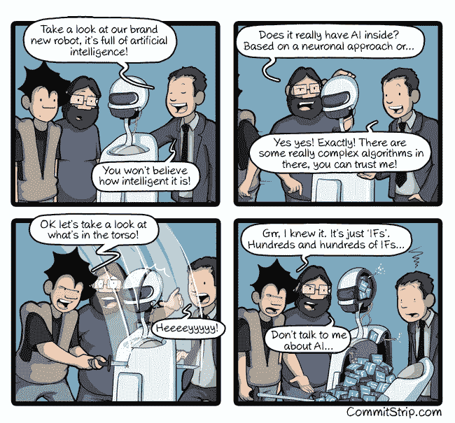

# 关于数据科学和编程的 10 篇好文章！

> 原文：<https://medium.com/hackernoon/10-great-articles-on-data-science-and-programming-eec816941896>

随着计算、知识库和最佳实践的不断改进，数据科学和编程是两个不断扩展和发展的主题。这使得很难跟上所有新的文章和思想。因此，我们编制了一个列表，列出了过去一年左右我们或其他人喜欢的 10 篇文章，主题是编程、数据科学和机器学习。我们希望它们能给你提供新的视角和实用的建议。

# 1.为什么企业在机器学习上失败了

凯西·科兹尔科夫

想象一下，雇一个厨师为你造一个烤箱，或者雇一个电气工程师为你烤面包。当谈到机器学习时，这是我看到企业一次又一次犯的错误。

如果你要开一家面包店，雇佣一名经验丰富的面包师是个好主意，他精通制作美味面包和糕点的细微差别。你也会想要一个烤箱。虽然它是一个重要的工具，但我敢打赌，你不会让你的顶级糕点师承担知道如何制作烤箱的任务；那么，为什么你的公司专注于机器学习的等价物呢？

你是做面包的吗？还是做烤箱？

[点击此处了解更多](https://hackernoon.com/why-businesses-fail-at-machine-learning-fbff41c4d5db)

# 2.R vs Python:有什么区别？

由[穆阿迈尔·胡塞伊努卢](https://hackernoon.com/@moimaere)

随着大数据、机器学习和数据科学在软件行业或软件服务公司中的重要性的大幅增长，两种语言已经成为对开发者最有利的语言。r 和 Python 已经成为数据科学家和数据分析师最流行和最喜欢的两种语言。这两者相似，但方式不同，这使得开发人员很难从两者中选择一个。

[点击此处阅读更多内容](https://hackernoon.com/r-vs-python-whats-the-difference-4eed706890ae)

# 3.自动机器学习:学习如何学习

**Iddo Drori** ，CDS 兼职副教授， **Kyunghyun Cho** ，计算机科学和数据科学助理教授， **Claudio Silva** 和 **Juliana Freire** ，数据科学、计算机科学和工程学教授， **Remi Rampin** ，CDS 研究工程师， **Yamuna Krishnamurthy** ， **Raoni de Paula 洛伦索**，**Jorge Piazentin**

[在此阅读更多内容](/center-for-data-science/automatic-machine-learning-learning-how-to-learn-2de9193bd828)

# 4.如何毫不费力地用 GitHub 页面免费创建一个网站

安妮·邦纳

你需要一个你的工作的在线作品集，让潜在的雇主检查，但你不知道如何制作一个网站？你想创建一个博客或商业网站，但你不知道从哪里开始？有没有可能你只是不想处理(或支付)网站托管，域名，以及其他一切？

[在这里阅读更多内容](https://towardsdatascience.com/how-to-create-a-free-github-pages-website-53743d7524e1)

# 5.我如何训练一个人工智能来玩雅达利太空入侵者

维丹·古普塔

每个人都在谈论人工智能和人类智能的竞赛。AI 什么时候会完全超越人类的能力，控制我们大部分的日常生活？当人类花时间去上学和自学时，人工智能在竞争中取得优势做了什么？人工智能需要加强它的游戏！

[阅读更多](https://hackernoon.com/how-i-trained-an-ai-to-play-atari-space-invaders-b3e8756ef026)

# 6.为什么模型可解释性是下一个数据科学超级大国

一些人认为机器学习模型是黑盒，对预测有用，但在其他方面难以理解；但是最好的数据科学家知道从任何模型中提取真实世界洞察力的技术。对于任何给定的模型，这些数据科学家可以很容易地回答如下问题

*   模型认为数据中的哪些特征最重要？
*   对于模型中的任何单个预测，数据中的每个特征是如何影响该特定预测的
*   要素之间的哪些交互对模型的预测影响最大

[阅读更多](https://towardsdatascience.com/why-model-explainability-is-the-next-data-science-superpower-b11b6102a5e0)

# 7.为什么平台模式被打破了

由[莱昂内尔·马丁](https://hackernoon.com/@getlionel)

几年前一个疫情重创了我们。那个时候，每个初创公司都在为这个或那个的优步建造 Airbnb。科技行业相信，初创公司只有看起来像一个平台，才有价值；如果他们渴望成为下一个脸书。

在 Airbnb、优步、亚马逊、脸书和易贝等巨头成功的背后，我们的行业正在将每一个商业案例硬塞进一个平台商业模式。这成了默认。不幸的是，这种神经症仍然在我们的文化中根深蒂固。

[点击此处了解更多](https://hackernoon.com/why-the-platform-model-is-broken-a51478b1b4ee)

# 8.4 每个数据科学家都应该学习的技能

本·罗戈扬

我们想继续上一篇关于如何[成长为一名数据科学家](https://www.theseattledataguy.com/grow-data-scientist/)的文章，学习一些高级数据科学家应该具备的其他技能。我们希望通过为高级数据科学家设定明确的目标，在业务经理和技术数据科学家之间架起一座桥梁。这两个实体不得不面对非常不同的问题。当他们在同一页上时，双方都受益。这就是为什么前一篇文章如此关注交流。这看起来很简单，但是随着每年新技术的不断涌现，技术和业务之间的差距不断扩大。因此，我们发现经理和数据科学家有一个清晰的期望路径非常重要。

[点击此处了解更多信息](/coriers/4-must-have-skills-every-data-scientist-should-learn-8ab3f23bc325)

# 9.如何使用 Dash 和 Plotly 构建报告仪表板

由[大卫安慰](https://towardsdatascience.com/@davidcomfort)

我将报告仪表板构建为一个多页面应用程序，以便将仪表板分成不同的页面，这样就不会太多，并以一种有组织的方式呈现数据。在每个仪表板页面上，有两个数据表、一个日期范围选择器、一个数据下载链接，以及两个仪表板下方的一组图表。我在构建仪表板时遇到了几个技术挑战，我详细描述了我是如何克服这些挑战的。

[在此阅读更多内容](https://towardsdatascience.com/how-to-build-a-complex-reporting-dashboard-using-dash-and-plotl-4f4257c18a7f)

# 10.这很自然:过度深入自然梯度优化

由[科迪·玛丽·怀尔德](https://towardsdatascience.com/@cody.marie.wild)

对于一阶近似，所有现代深度学习模型都是使用梯度下降来训练的。在梯度下降的每一步，您的参数值从某个起点开始，您将它们向损失减少最大的方向移动。你可以通过对你的损失对整个参数向量求导来做到这一点，也就是所谓的雅可比矩阵。然而，这只是你损失的一阶导数…

[点击此处了解更多](https://towardsdatascience.com/its-only-natural-an-excessively-deep-dive-into-natural-gradient-optimization-75d464b89dbb)

