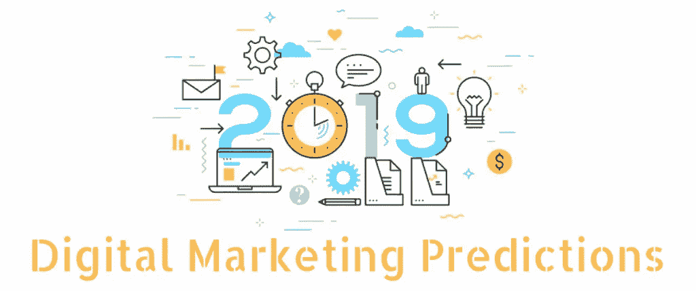

# 2019 年值得关注的 11 个有影响力的数字营销预测

> 原文：<https://medium.com/hackernoon/11-impactful-digital-marketing-predictions-to-watch-out-for-in-2019-1e1d6d149360>

过去五年来,“数字化或回家”一直是大多数企业和营销人员的口号。潮流观察家们一直在关注数码领域的下一步动向。在这个动态的数字营销环境中，现代营销人员需要非常自信，并预见到可能影响其核心营销战略的变化。

变化是新的常数。一年中的这个时候，营销人员会进行反思，并急切地等待来年数字领域会发生什么变化。随着对数据隐私的多重监管，市场营销变得更加不稳定，在传统和创新之间徘徊。

与每年不同的是，今年还围绕着前一年的数字营销趋势进行即兴创作和工作。我们看到许多企业将营销工作转向数字化，创新是他们战略的重中之重。

事不宜迟，让我们深入数字营销预测，这肯定会对营销多元宇宙产生影响。这些预测分为两类:

1.  高影响力预测
2.  低影响预测

**高影响力数字营销预测:**

1.  **收紧数据法规&隐私政策**

作为数据驱动型营销人员，您需要处理大量的客户数据，这些数据是您增强营销战略的生命线，也是成功营销活动的基础。虽然我们试图根据现有数据了解和描述客户，但尊重他们的数据隐私是强制性的。

自从 [GDPR 于 2018 年 5 月](https://ec.europa.eu/commission/priorities/justice-and-fundamental-rights/data-protection/2018-reform-eu-data-protection-rules_en)在欧洲生效以来，不同国家的立法者和立法者已经转而支持建立类似的严格的隐私法律，以管理企业如何使用客户的数据以及他们可以在多大程度上使用客户的数据。这意味着营销人员必须为他们投放的每个广告提供选择加入和选择退出，数据采集表格/调查应符合 GDPR，最重要的是以合法利益开展营销。

**2。数字营销自动化**

营销人员现在已经转变为聪明的营销人员。在这里，数据和指标是他们构思的每个策略和执行的每个活动的基石。虽然针对利基受众的营销更容易，而且大多是手工操作，但在这个数字时代，针对大众受众的营销变得更加困难。

到 2018 年，[全球 78%的智能手机用户将每月发送短信](https://www.emarketer.com/Report/Messaging-App-Usage-Worldwide-eMarketers-Updated-Forecast-Leaderboard-Behavioral-Analysis/2001939)，预计这一趋势还将持续。到 2021 年，移动通讯应用的全球[用户群将增加 24%](https://www.facebook.com/business/news/insights/why-messaging-businesses-is-the-new-normal) 。因此，数字营销自动化将在 2019 年全面展开。在众多数字营销形式中——付费广告、社交媒体营销、电子邮件营销、短信和推送通知——将实现自动化，以扩展和优化营销人员的工作。

**3。** **AI 会让营销更人性化**

人工智能不仅仅是这个行业的一种时尚。人工智能无处不在，它的应用将引领大规模创新。人工智能现在将在数字营销中得到更广泛的采用。几年前，数字营销人员对将人工智能纳入他们的战略犹豫不决，因为它模糊不清。但现在，营销人员已经开始拥抱人工智能，并在其营销策略中利用其真正的潜力。

人工智能实际上可以通过破坏传统营销来使现代营销更加人性化，传统营销严重依赖于对目标市场的不充分和不准确的了解。人工智能将使营销人员从简单的“知道”发展到真正的“理解”他们的客户。[谷歌的 RankBrain](https://searchengineland.com/library/google/google-rankbrain) 已被证明是数字营销人员的一只金鹅，通过提供高意图的相关搜索来完善 SEO。我们将能够看到人工智能在内容营销、内容监管、用户体验、电子邮件营销、语音搜索等方面的效果。有了人工智能，营销人员将能够全面了解他们客户的兴趣，建立更智能的市场细分，并以更高的意图开展活动。

**4。更多支持语音搜索的内容**

我们已经看到语音搜索在 2018 年的崛起，毫无疑问它将继续存在。2019 年将是语音助手和语音服务的一年。有了语音作为内容媒介，营销人员必然会将其用于营销工作。预计到 2020 年， [50%的搜索将通过语音进行](https://www.campaignlive.co.uk/article/just-say-it-future-search-voice-personal-digital-assistants/1392459)。

如今，智能电视和智能扬声器已经开始充斥每个家庭。无论是谷歌助手、亚马逊的 Alexa、苹果的 Siri 还是微软的 Cortana，语音助手已经成为我们日常使用的许多设备不可或缺的一部分。数字内容营销人员将把他们所有的注意力转向语音搜索引擎优化，将语音搜索整合到他们的内容策略中。数字广告商将在智能电视和语音设备上挖掘广告业务。

**5。社交媒体清洗**

今年，社交媒体平台在打击“虚假账户”方面打了一个硬仗。大多数营销人员追求虚荣指标，如喜欢、分享、转发和评论。为了追求这样的指标，企业最终会在这些平台上遇到篡改数字的假账户。因此，今年，[脸书据报道在 6 个月内移除了超过 15 亿个虚假账户](https://www.engadget.com/2018/11/15/facebook-transparency-report-fake-account-removal/)， [Twitter 暂停了超过 7000 万个不活跃和可疑账户](https://www.washingtonpost.com/technology/2018/07/06/twitter-is-sweeping-out-fake-accounts-like-never-before-putting-user-growth-risk/?utm_term=.c8bee4328dd4)。

2019 年，我们可以期待这两个平台和其他社交媒体平台进行更多这样的清理。虽然这可能不会直接影响业务，但营销人员肯定会受益，因为结果将更加集中和真实。

**6。不再有点击诱饵**

如果你是一名数字营销人员，那么你一定读过尼尔·帕特尔的“[为什么 Clickbait 有效](https://neilpatel.com/blog/why-clickbait-works/)”。但是现在点击诱饵不再是一种营销策略。近 78%的消费者表示，个性化和相关的内容增加了他们的购买意愿。这意味着你的内容必须是独特的，相关的和个性化的。

消费者现在知道哪个是点击诱饵，哪个不是。因此，营销人员需要创造更多的内容，真正解决消费者的问题陈述，并增加他们的价值。今年，我们将见证一些独特且相关的特殊内容。

**低影响力数字营销预测:**

1.  **视频&视频广告将继续流行**

你登录脸书，你可以看到视频。你登录推特，你可以看到视频。你登录 LinkedIn，你也会看到一个视频。视频正在慢慢爬上每一个社交媒体平台，被认为是消费最多的内容形式。我们已经看到品牌利用脸书、Twitter、LinkedIn 和 Instagram 进行视频广告和视频内容创作。但在 2019 年，我们可以期待看到营销人员挖掘更多的平台和渠道。抖音最近收购的“Musical.ly”就是这样一个平台。这也将确保微观影响者的增加。

**2。人工智能聊天机器人的崛起**

更多人工智能聊天机器人将在 2019 年崛起。聊天机器人处于人工智能、自动化和不断变化的互联网使用之间的最佳位置，为未来的技术进步提供了更多空间。据 [Gartner](http://www.gartner.com/smarterwithgartner/gartner-predicts-a-virtual-world-of-exponential-change/) 称，到 2020 年，聊天机器人将驱动 85%的客户服务互动。对于大多数数字营销人员来说，回应客户的询问和关注是一个棘手的问题。由人工智能驱动的自动化对话，聊天机器人可以建立有意义的关系，快速缩短响应时间，并使品牌响应更加人性化。

**3。OTT 的崛起&视频内容**

2018 年，互联网已经赶上了电视，2019 年将占互联网电视观看时间的更多。这为 OTT 应用创造了更多独家内容，并确保营销人员获得更多广告机会和品牌关联。OTT 使数字营销人员能够在消费者在其设备上使用的特定视频内容上投放广告。广告可以夹在在线流媒体节目之间，让品牌获得最大的曝光率和影响力，有助于建立品牌联系。

**4。内部代理**

更多的企业将在 2019 年削减广告代理，并将营销工作内部化。大多数品牌严重依赖外部机构进行数字营销和品牌推广。在 CMO 的一项调查中，营销人员表示，他们非常重视使用内部技能，而不是将工作委托给供应商。当 Booking.com 切断了与媒体购买机构的联系，并在内部雇佣了一个团队时，广告公司受到了冲击。我们将会看到更多数据驱动的营销人员将他们所有营销工作的责任交给内部，并拥有 100%的控制权和透明度。

**5。视觉搜索**

这是技术行业中最复杂、竞争最激烈的领域之一。虽然谷歌、Pinterest 和微软在行动上与之较量，但我们将看到更多公司涉足视觉搜索游戏。虽然 Pinterest 为极少数营销人员的 SEO 做出了贡献，但它将在 2019 年继续占据主导地位，并增强内容营销人员，以创建更具视觉吸引力的内容。我们都知道 Flipkart 在其 big billion 活动中如何在活动中使用视觉搜索来吸引用户并提高客户参与度。我们可能会看到更多的品牌利用和尝试视觉搜索。

# 结论

我们距离 2019 年还有一个月的时间，这一切都将与人工智能技术、自动化以及通过个性化增强客户体验有关。营销人员别无选择，只能接受它，保持领先地位，并在来年增加收入。虽然这些是我认为将在 2019 年推动数字营销的一些关键预测，但聆听您的想法并获得新的视角将非常棒。

 [## 黑客正午

### 黑客如何开始他们的下午？

hackernoon.com](https://hackernoon.com)