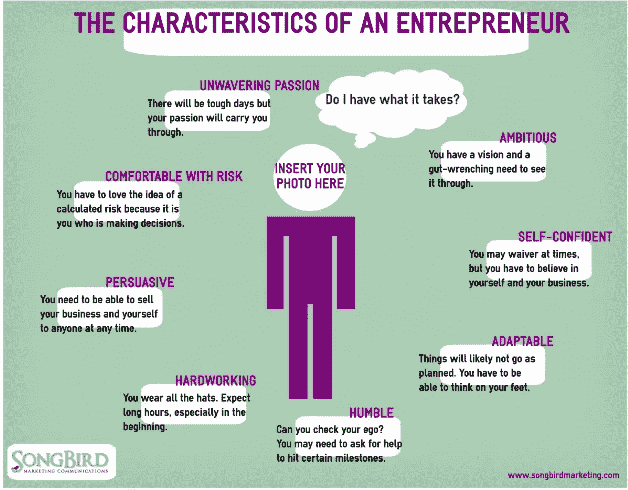
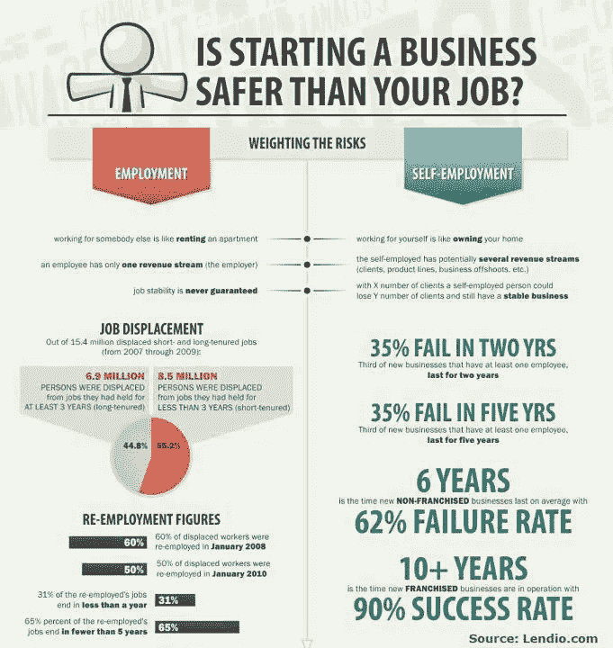
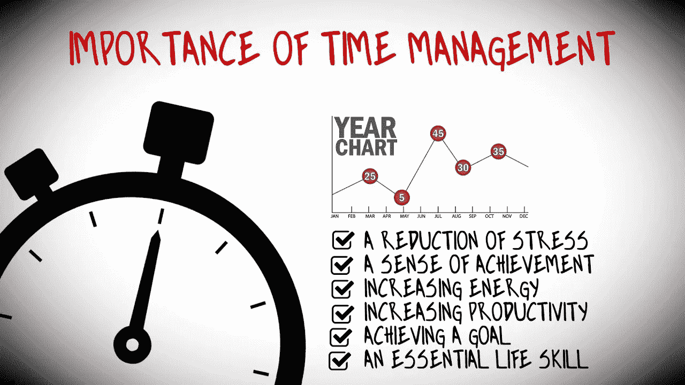
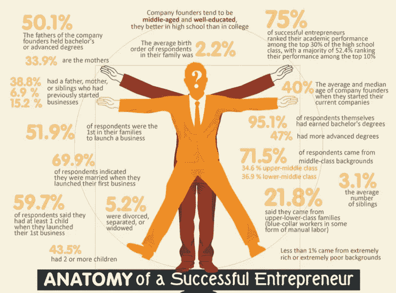

# 优秀企业家的 20 个必备素质

> 原文：<https://medium.com/hackernoon/20-essential-qualities-of-a-good-entrepreneur-cb8684a6f53c>

**一个优秀的企业家有哪些品质和特点？要成为或成为一名优秀的企业家，需要培养哪些技能？如何成为一个优秀的企业家？**

企业家的工作**要求特别高。**对个人来说，需要很多素质、**知识**、**诀窍**、**专长。**

然而，成功的企业家并不总是那些拥有最长品质清单的人……**精通业务的各个方面**比在一个或多个方面做到优秀更重要。

## 质量# 1——了解你自己。

知己知彼，百战不殆。**就是要认识到一个人并不能控制一切。**在特定情况下，也可以质疑自己，接受自己不在这个水平，并寻找其他解决方案。

为了更好地了解自己的优势和劣势，企业家可以进行技能评估或修改简历。在任何情况下，他都必须问以下问题

1.  我能做好什么？我做得怎么样？
2.  我不太了解什么？
3.  什么让我反感，为什么？
4.  对我的主要批评是什么？
5.  我的环境认可我的哪些品质？
6.  什么让我变得脆弱？
7.  是什么让我对过去的工作感到失败或难过？

有缺点本身并不是一个真正的问题。成功的关键其实是寻找绕过自己弱点的解决方案。

报纸的管理使我泄气:为什么不每周半天给一个独立的行政秘书打电话？我不能很好地控制互联网:为什么不请一个朋友来管理网上交流？我不能控制生产:为什么不求助于分包商？

懂得围绕自己，寻找伙伴或者训练都是解决的办法。

## 品质 2——知道如何倾听他人

为了做出正确的决定，在正确的时间和正确的地点提供正确的产品，未来的企业家必须倾听他人，对他人感兴趣，了解他们和他们的“特殊兴趣”。

设身处地理解他人的行为和言语是至关重要的，这需要一定的思想开放度

顾客:你必须知道他们的期望，他们的行为，他们的特点。最复杂的是了解客户的深层思想，他或她的基本动机，

**供应商和销售人员:**他们有时能在市场上给出好的暗示，但也不利于你购买他们卖不出去的产品；有必要破译他们的语言，

竞争对手:你必须站在他们的角度，试着理解他们在市场上的行为，

**开处方者和合作伙伴:**这些人谈论你的业务，可能会给你带来客户。理解他们为什么同意玩这个游戏以及他们期望的回报是很重要的。开始为学校或学院的学生提供[推荐信](https://bestlettertemplate.com/recommendation-letter-sample-example/)，提供实习、培训等。他们可以传播良好的评论，你和你的企业也会得到认可。

亲戚:询问他们对你做事方式的看法是很有趣的。但有必要弄清楚他们的发言中哪些是相关的，哪些是不相关的。所有的东西肯定都不好拿。

了解别人可以**破译他们的言语:**他们所说的话中真假的份额是多少，虚张声势的份额是多少，非理性的份额是多少？他们对歪曲事实有什么兴趣？

## 品质 3——相信自己，但不要太多。

要想成功，企业家必须对自己有起码的信心。为此，他必须很好地了解自己(见第 1 点)，也要很好地了解他人，才能保留住他们说话的相关部分(见上一点)。

自信不是与生俱来的，它是基于过去的经历、失败和成功而获得的。充分的信任将允许企业家敢于实现他的想法，战胜他人，并在竞争者中创造自己的位置。相反，脆弱的自信会成为决策的障碍。

**但是要注意，自信是一把双刃剑:**过于自信会导致创业者不再听从环境和随从，一头撞墙……

## 质量# 4——有战略眼光。

拥有战略眼光就是能够**确定一个长期战略(至少 5 年)并坚持下去。他的想法要稳定，不像有些人会随时改变主意。**

商业定位的稳定性让每个人都放心:**客户、合作伙伴、说明符、随行人员……这将鼓励他们更频繁地拜访你。**

但稳定并不意味着一切都必须永远保持冻结。企业家必须感觉到合适的时机来发展他的战略和定位，平稳地，**，**而不发出负面信号。

## 品质 5——在任何情况下都保持清醒。

保持清醒就是接受面对现实。如果他的假设不现实，回顾一下。接受出现的数字。如果不能让你满意，即使你付出了代价，也要改变策略。即使已经进行了重大投资，如果无利可图，也要有勇气决定停产。哀悼一个不如预期好的想法。

保持清醒就是记住**第一目标仍然是活下去。**既不悲观也不乐观。

**保持现实的唯一方法是倾听环境的信号**(随行人员、合作伙伴、客户的话语)，并通过寻求额外的信息来验证或否定它们。这是字面上的**“精确定位”的情况。**

因此，保持清醒就是不断地获得充分的信息，这样就不会“做梦”，不会做出反应，也不会害怕。

## 品质 6——充满激情，不夸张。

对你的创业项目或产品充满热情是件好事，因为这是动力的主要来源。但是**激情总会结束，**所以避免被它牵着鼻子走，避免被它淹没，冒着某天早上醒来想要停止一切的风险。

激情还有一个缺点:**令人目眩。它掩盖了现实、真正的问题和企业家萎靡不振的动机。一个充满激情的企业家会专注于自己的梦想，而不是客户的梦想……这是一个严重的错误。**

如果激情在工作中转化为持久的快乐，或者转化为对他人的快乐，那就有趣了。它不应该掩盖真正倾听消费者的有用性，因此**良好的市场调查。**

## 品质# 7——坚持不懈……如此耐心。

恒心和耐心是企业家必备的素质。不幸的是，这些品质往往在一开始就不存在，领导者过于热情、积极，急于战斗。

企业家必须从种子需要时间发芽这个前提出发。谁能想到一个客户群能在几周内建立起来？有些活动可能需要几年时间来建立或多或少稳定的客户群。

缺乏耐心会导致沮丧和某种形式的幻灭。相反，坚忍不拔的企业家会谨慎地开始，倾听环境的信号，逐渐适应，并将每一笔销售视为积极和令人鼓舞的信号。

## 品质 8——足智多谋。

永远不要缺少想法或工具，这是一个商业领袖的健康品质。

你必须假设任何问题都有解决的办法，去得到它。在现金、营业额、发展、人事、生产或物流方面面临阻碍或**困难时，有人可以帮助你、给你建议或给你提供有趣的工具。**

拿起你的电话，激活你的网络，询问你的随从，请求我们联系你。

我们的经济结构为**提供了大量的解决方案和机会:**各个领域都有专家，创造者为各种情况设计了工具，企业家协会也在那里帮助你。互联网是识别他们的一个特别有效的方法(这个网站也是！).

## 质量# 9——为商业努力做好准备。

一个优秀的商业领袖知道成功的关键在于他将领导的商业努力。规则很清楚:高管必须花 80%的时间寻找客户或与客户接触。

花时间做预测表或销售增长图是没有意义的，重点是去实地。

然而，许多企业创始人认为他们是糟糕的交易者，并愿意将这一不领情的工作留给其他人，如商业代理人。**可是畅销书竟然是领导本人！**

## 品质# 10——知道如何包围自己并寻求帮助。

**哪个创业者能认为自己一个人就能搞定一切？然而，有许多人觉得他们不得不做所有的事情，包括家务和记账，以避免雇用或只是为了省钱。这是计算错误。**

**实际上，关键是为自己保留那些具有战略意义的任务，**那些能产生收入并使**成为企业价值的任务。其他任务可以分包出去:注册会计师可以记账，独立秘书可以管理行政和商业文件，清洁公司可以及时介入。**

如果公司战略的核心是产品的营销和定价，领导者将不得不致力于商业方面和沟通，即使将生产分包出去。

## 质量# 11——知道如何管理优先级。

知道如何管理优先事项在于不被日常生活淹没。一个商业主管的一生是各种任务和责任的总和:与客户和合作伙伴的关系，与会计和行政部门的关系，打开邮件，管理国库，电话，转移，传递订单，接收货物，管理未付的账单和索赔，等等。

目标是在要做的事情之间建立一个**层级，**清楚一些文件的紧急性，同时不忘记本质:保持良好的生活卫生，照顾家人，知道如何说不，知道寻求帮助。为什么不获取工具来自动化效率最低的任务呢？

当然，最理想的是永远不要推迟当天能做的事情。

## 质量# 12——知道如何决定，决定。

**许多商业领袖害怕做决定，**大多数时候不害怕犯错误。例如雇用员工、改变状态或购买机器。

这种行为**阻碍了公司的发展**，并且会给领导留下一个自己的坏形象，让他失去信心。

但是正是信息的缺乏带来了怀疑和恐惧。为了能够做出正确的决定，有必要增加观点的数量:向他的兄弟、合作伙伴、供应商、会计甚至朋友征求意见。他们肯定会有更多的观点，他们的讲话将通过消除对离开的恐惧来“照亮”局势。

## 质量# 13——知道如何管理你的时间。

一个业务经理一天或一周要工作多长时间？他应该从哪里开始他的一天或一周？他什么时候可以去度假？这些问题没有现成的答案。

面对不计其数的任务和责任，领导者尤其必须**提高生产力和效率，简而言之就是达到本质。IT 工具的实施可以自动完成某些任务(催款、邮寄、银行对账……Excel 培训有时也很受欢迎)。**

对一个企业主来说，最糟糕的事情是有“痛苦”的感觉，没有时间做任何事情。这种印象可能来自于难以确定优先事项(见第 11 点)，或者来自于企业家脑海中出现的太多未列出的任务，只要它们没有被处理。

**议程仍然是企业家最好的盟友。他必须让统治者的思想安息；后者还可以对花在各种任务上的时间进行准时评估，以便从中学习。**

## 质量# 14——知道如何理财

在商业中，理财首先意味着控制你的现金流。

财政部是企业首脑的日常法官:现金的问题会逐渐蚕食企业家的士气，直到停止。相反，一个舒适的现金流会压倒经理。

管理你的现金流需要严谨、预期和沉着。还需要**分析能力，**知道钱的问题从哪里来(盈利能力的问题，增加**营运资金需求**？).

为了避免被金钱问题压垮，领导者必须使用适当的计算机工具，向他的会计师寻求建议，并和他的财务顾问在桌上打牌。

## 质量# 15——知道如何管理风险。

一家公司的生活永远不会稳定，也不会被收购。环境在不断演变:竞争对手的出现、法规的演变、周期性或地理风险、与员工或其随行人员相关的风险、变化的天气、经济或社会危机、新趋势的出现、技术革命……风险数不胜数。

**一个优秀的企业家需要制定风险管理策略:**

1.  。首先，我们必须预测并**列出**风险，以便预测最危急的情况。
2.  然后需要从最重要到最不重要对**风险进行优先级排序。**
3.  然后你必须**对待**每一个风险。
4.  风险一旦发生是否可以**规避**？
5.  我们能相对化或接受某些风险吗？我错过了什么信息才能正确处理这个或那个？
6.  有没有处理特定风险的**工具或解决方案**？费用是多少？是否有可能与合作伙伴或竞争对手共同承担这些成本？

最好预测一下！

## 品质# 16——投机取巧。

好的领导也有机会主义的一面。具体来说，这意味着他必须分析并抓住每一个机会，做得比今天更好。

机会主义意味着对市场和环境的变化保持好奇和开放。这需要消息灵通，紧跟潮流，并与行业专业人士保持联系。有工具可以做到这一点:新闻或专业网站、活动或会议、警报系统(例如谷歌警报)…或者只是口头传播。

然而，机会主义并不意味着突然放弃一个策略而采用另一个。在做任何事情之前，必须对机会进行测试和分析。

## 质量# 17——乐于服务

任何企业主都应该乐于提供服务，因为这实际上是他的核心业务。这也是一个关键的成功因素，因为如果客户觉得他是因为自己而不是因为他的钱包而受到喜爱，他会更容易回来。

热爱服务也能在工作中省钱。一个关心体贴的商业领袖对日常生活越满意，就会越持久。

## 质量# 18——谈判和衡量权力平衡的能力。

一位潜在客户提议向你订购 20 000 美元的产品，但价格要降低 40%。**做什么？**如果你同意，你就跨越了很大一部分空白。如果你拒绝，你就错过了一个很好的命令…

**要想在这种情况下谈判成功，有必要尽可能多地收集对方的信息:潜在客户的动机是什么？我在和谁竞争？顾客着急吗？他习惯这样谈判吗？为什么他谈判如此艰难？虚张声势的份额是多少？**

良好的谈判意味着对自己和你的产品或服务的质量有信心。请记住，质量总是有代价的。突出自己的优点，不要贬低自己。提供额外的服务而不是降低价格。

## 品质# 19——不要害怕失败。

失败并不可耻！最重要的是了解哪些没有奏效，以便下次做得更好。有些创业的人在成功之前失败过几次，也没有人对他们小心翼翼。

## 质量# 20——得到支持。

家人和朋友的支持对商业项目的成功尤为重要。

**这首先需要寻找和培养这种支持:**通过向他的配偶或子女准确地解释他的项目，或者通过具体地联系他们，他们将能够加入并真正支持它。

**然后，被支持，值得。抛弃家庭和孩子的企业家不应该指望从他们那里得到任何支持…**