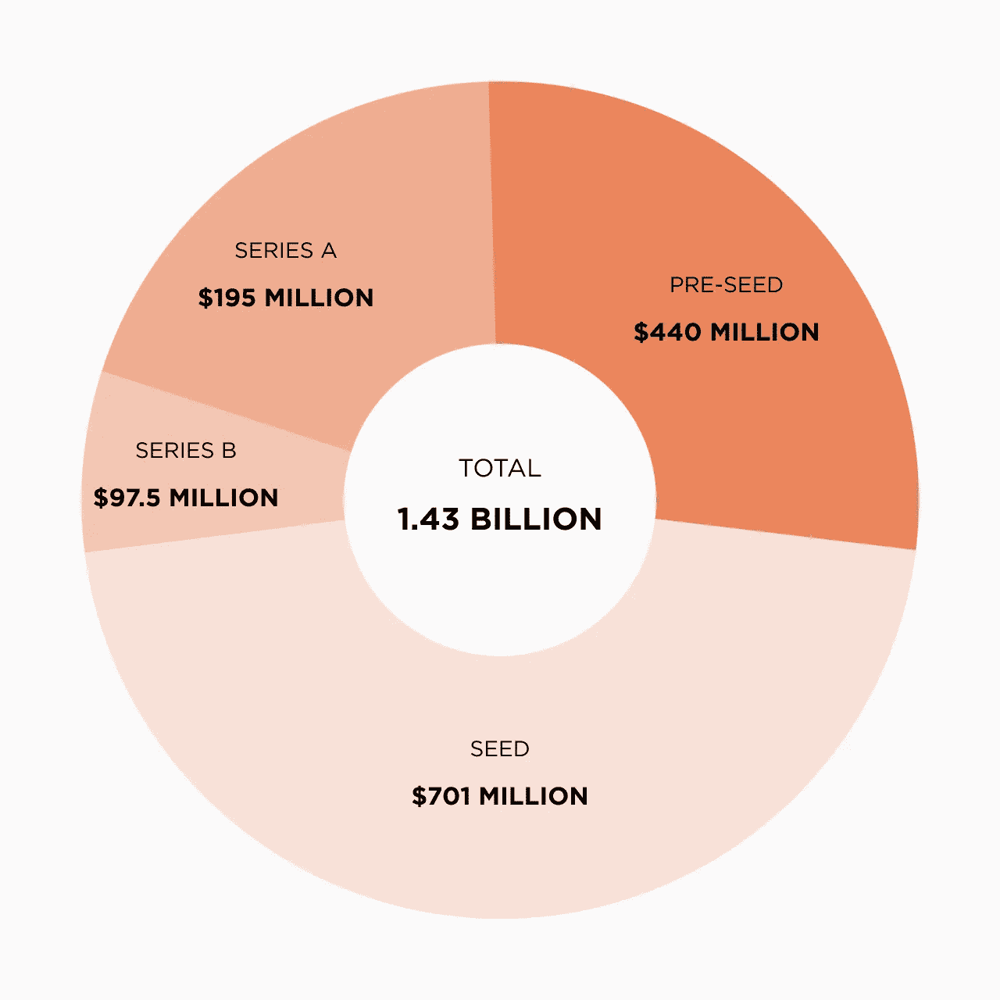

# 2018 隐形资本报告:追踪隐藏的十亿

> 原文：<https://medium.com/hackernoon/2018-stealth-capital-report-tracking-hidden-billions-39744c1f1726>

对科技初创公司的投资正在蓬勃发展，这一点也不奇怪。2018 年，早期创业公司今年的融资额有望超过 80 亿美元，而晚期创业公司的融资额超过 700 亿美元。

但这对隐形创业公司意味着什么？如果你没听说过创业公司，它真的存在吗？拥有真正风险资金的可信创业公司在开发技术的过程中是否会更长时间保持低调？

我们在 Brex 看到的是，隐形创业经济正在蓬勃发展。Brex 已确定超过 14.3 亿美元的隐形资本，其中绝大部分是在过去两年筹集的。这些秘密创业公司占据了整个创业市场的 3-5%。机器学习、自动驾驶和金融科技领域一些最受瞩目的初创公司宣布直接秘密进行大规模融资。

那么，风险投资人把他们的钱投资到了哪里？我们对数千家公司进行了全面分析，以了解哪些行业正在获得资金，哪些行业没有获得资金的主要趋势。

## 隐形资本

*单击以展开图形

## 什么是热门

去年，风险投资公司预测，将获得投资的主要行业是:人工智能、机器人、金融科技和安全。这些预测适用于隐形公司吗？如果不适用，风投投资的前五大隐形行业是什么？以下是我们在秘密创业公司中的发现:

*   金融服务业见证了今年最高金额的隐形风险投资
*   医疗保健排在第二位。令人惊讶的是，风投在这一领域投资的公司比第一名少 23%
*   消费者和企业软件是第三个发展最快的隐形行业
*   房地产和生物技术位居第二
*   人工智能和安全是隐形风险投资的前 40%

## 什么不是

那么今年隐形创业公司的 VC 投资哪里去了呢？取决于你问谁，特定行业的风险投资减少可能意味着 2019 年新兴创业公司的巨大市场机会。回顾我们的数据发现，有一些惊喜。

以下是 2018 年隐形创业投资最少的行业:

*   就今年的风险投资而言，自然资源、政府技术和操作系统都表现不佳
*   活动技术领域的风险投资放缓
*   视频、信息、技术以及内容和出版今年也有少量投资
*   2018 年游戏投资减少，这是自 2014 年以来游戏投资整体下降的一部分，也是对虚拟现实领域游戏投资的转变

## 结论

秘密运营是许多初创公司战略性使用的一种策略，通常用于开发更复杂的技术，保护知识产权，或在产品公开发布前增加人们对其产品的兴趣。虽然有些人猜测投资隐形公司有风险，但我们的研究结果显示，隐形创业公司的风险投资没有放缓的迹象。

作为一家新兴的创业公司，很难全面了解你所在的行业——尤其是当许多其他公司都在秘密运作的时候。对于默默无闻的创业公司，我们希望这份分析能揭示出你们中有多少人，以及你们对风险世界的影响有多大。

方法学

Brex 分析了数千家公司。我们将这些公司与已知初创公司的综合出站数据库进行了比较，包括 Crunchbase 等来源。如果一家公司存在于我们的注册中，但不在我们的出站数据库中，那么我们将这家初创公司归类为隐形公司。我们发现超过 3%的人是秘密行动的。

因为我们是公司信用卡，所以我们可以了解客户的金融活动，包括融资。我们使用所有银行账户的最大值来确定他们收到的资金量。我们汇总了每个阶段的资本，并对总的潜在隐形市场进行了类似的分配，得出 14.3 亿美元的早期隐形资本总额。要求不共享其数据的公司未被使用，并且任何不希望共享其数据用于未来汇总分析的公司可以请求将其从汇总中排除。