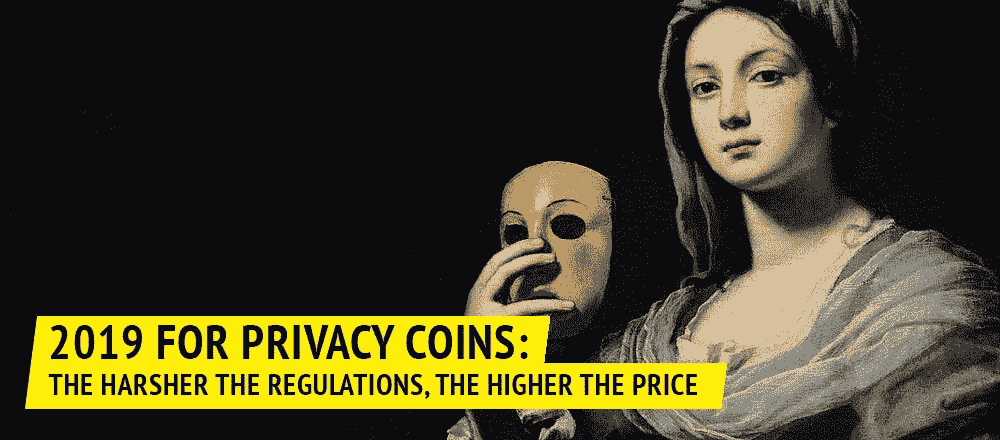
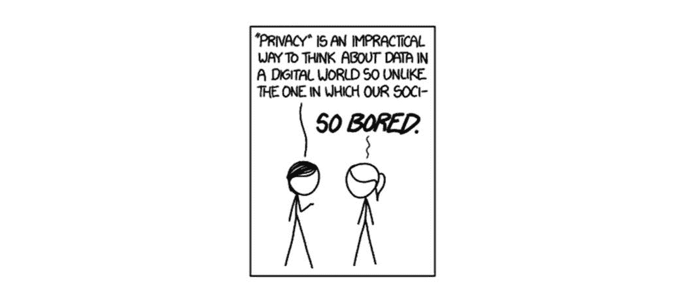
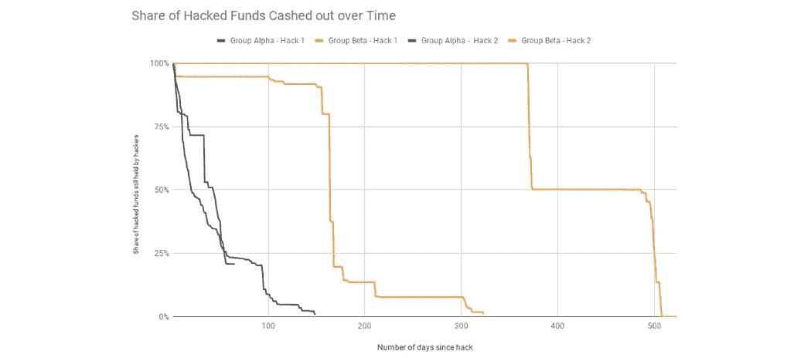
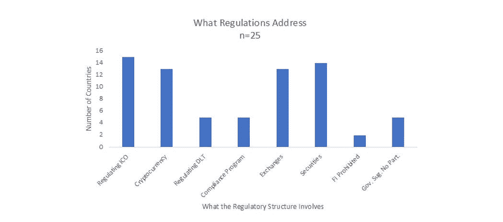

# 2019 对于隐私币:规定越苛刻，价格越高

> 原文：<https://medium.com/hackernoon/2019-for-privacy-coins-the-harsher-the-regulations-the-higher-the-price-7cae8dc3fcb>

对于隐私币来说，2019 年(在密码界也被称为监管的“[年](https://www.btcwires.com/c-buzz/2019-just-might-be-the-year-of-crypto-regulations/)”)意味着什么？它们会受到监管的沉重打击，还是会成为加密货币所有者在远离政府的地方进行真正匿名交易的唯一途径？

在这篇文章中，我们将理解双方，为什么监管机构禁止加密货币交易所上市隐私硬币，以及为什么这一行动可能导致其价格飙升。

# 为什么是隐私币？

首先，我们需要在这里做一个更正:我们正在谈论“注重隐私的硬币”，因为这些加密货币旨在消除用户与其交易历史之间的联系。为什么？对于那些不想公开自己日常交易账目的人来说，这是一种完全的隐私。这就是为什么我们称它们为**隐私币**。

[https://xkcd.com/1269/](https://xkcd.com/1269/)

我们以比特币为例。是隐私币吗？不会，尽管它声称像所有加密货币一样匿名。比特币交易记录在**公共**账本上。不是私人的；[公](https://www.technologyreview.com/s/608716/bitcoin-transactions-arent-as-anonymous-as-everyone-hoped/)。这就是区块链科技的运作方式。即使用户的身份和比特币地址之间没有直接的联系，也绝对有可能追踪到一个地址的所有交易细节，比如 BTC 币的数量和地点。

公司已经在开发使加密货币可追踪的解决方案。实际上，其中最先进的技术[chain analysis](https://cryptobriefing.com/first-chainalysis-came-for-bitcoin/)正在与执法机构合作，通过数据和统计来追踪整个区块链的交易和活动。他们已经宣布，他们的软件正在成功地监控比特币、以太坊、比特币现金和莱特币。这意味着所有这些硬币都没有兑现它们的隐私承诺。使用它们中的任何一个都有可能让其他人在未经你允许的情况下看到你的财务交易细节。隐私币正试图通过将自己重新设计成一种新的结构来改善比特币等传统协议，这种新的结构可以让交易和身份无论如何都无法被追踪。

[https://twitter.com/chainalysis](https://twitter.com/chainalysis)

“在一个不注重隐私的区块链，所有交易都可以被完全追踪和分析。

如果加密货币被用作互联网货币，对使用它们的每个人进行深度剖析将成为可能——相比之下，当前关于脸书、剑桥分析公司和个人数据的讨论就相形见绌了。加密货币咨询平台 CoFound.it 的联合创始人丹尼尔·扎克里森。

# 是什么让隐私币变得更好？

隐私币使用 masternode 技术、环形签名和隐形钱包地址等功能，使第三方很难追踪其区块链上的交易。没错。他们的交易仍然记录在区块链上，公众可以访问，但没有识别信息与用户的地址相关联。

*   [Monero](https://www.getmonero.org/) 使用工作证明协议和环签名，这使得无法检测交易的来源和端点。
*   [Zcash](https://z.cash/) 有两种交易选择:可以匿名发送，就像上面提到的 Monero，或者透明发送，就像比特币。
*   Dash 有一个可选特性 PrivateSend，可以用于用户希望对其公共区块链隐藏的交易。
*   PivX 是 Dash 的一个股权证明分支，该分支正在进一步扩展，在其网络上建立了一个隐私硬币的链上市场 zDEX。
*   [另一方面，TELE](https://www.telecoin.info/) 建立在 Dash 和 PivX 的基础上，将他们的创新进一步推向点对点网络，以创建一个基于具有主节点功能的利益证明协议的混合隐私币。这种功能组合在隐私币中是独一无二的:
*   混淆——使用硬币混合技术的匿名交易；
*   SwiftTX —以保证零确认交易为特色的快速交易
*   Masternode 技术—保护网络并提供基于共识的投票。

TELE Wallet 中的任何用户都可以使用所有这些功能。最重要的是，TELE 正在开发一个引领潮流的平台，一个面向各行各业的会员奖励平台，以及一款允许通过区块链进行加密互动的 Android 手机。

很明显，隐私硬币领域已经取得了技术进步。现在剩下的问题是，政府是否能跟上他们，并设法阻止已经发生的革命。

# 隐私币的规定？

对密码的监管不可避免且迫在眉睫。没人能对此提出异议。虽然，隐私硬币会像所有其他 ICO 硬币一样受到这些即将到来的法规的沉重打击吗？

政府主要关注加密货币交易的问责和透明，以保护投资者，并确保交易所不会成为犯罪分子的滋生地。这就是为什么许多监管要求包括反洗钱(AML)和了解您的客户(KYC)规则。似乎隐私币正在打破这两者。

[https://stanford-jblp.pubpub.org/pub/ico-comparative-reg](https://stanford-jblp.pubpub.org/pub/ico-comparative-reg)

让我们来看看世界各地的权威人士对此有何评论:

*   “至关重要的是，美国继续在国际上努力改善与数字货币相关的控制。我们还应该考虑额外的立法或监管行动，以应对与匿名增强加密货币相关的潜在挑战，这种服务旨在掩盖区块链的交易。”——[罗伯特·诺维，众议院恐怖主义和非法金融小组委员会成员](https://www.forbes.com/sites/astanley/2018/06/20/u-s-secret-service-action-needed-to-address-anonymous-cryptocurrencies/#2e2d22243ca1)。
*   美国财政部长史蒂文·姆努钦[表示](https://www.investopedia.com/news/treasury-secretary-steven-mnuchin-wants-prevent-bitcoin-becoming-swiss-bank-account/?)他希望确保加密货币不会落入“坏人”手中
*   美国特勤局调查办公室副助理主任 Robert Novy [建议](https://www.investopedia.com/news/no-surprises-sec-and-cftc-chairs-congressional-testimony-cryptocurrency-regulation/)应该监管**注重隐私的加密货币**以防止欺诈。
*   日本金融服务厅[正在考虑](https://www.forbes.com/sites/adelsteinjake/2018/04/30/japans-financial-regulator-is-pushing-crypto-exchanges-to-drop-altcoins-favored-by-criminals/#72ae85861b8a)禁止加密货币交易所在其平台上上市或接受**私人硬币**。由于政府承认数字资产是货币，加密货币交易所能够在日本作为合法企业运作。当地交易所 Coincheck 已经宣布将停止在 Monero、Zcash 和 Dash 的交易。然而，在此之前，同一个交易所已经遭受了 5 亿美元的抢劫，这使我们认为监管压力对他们来说是沉重的。

# 监管行动会蔓延得更广吗？

在像日本这样有明确法律的地区，也许是的。然而，对世界其他地区来说，可能不会。

对于这些代表中的大多数人来说，对隐私硬币的监管还不是当务之急。他们仍在讨论如何将加密货币归类为一种资产类别。美国国会仍专注于将它们归类为证券、大宗商品还是一个全新的资产类别。他们仍然很难理解加密货币的概念。转向隐私硬币将是一场全新的辩论。即使他们想扳倒他们，他们有资源这么做吗？

当局唯一可以施加影响的地方是加大菲亚特的转型难度。这就是为什么在日本，他们不追求所有者，而是追求交易所。然而，我们已经有了[dex](https://www.investopedia.com/news/what-are-decentralized-cryptocurrency-exchanges/)，你可以将它们转换成比特币或任何其他“合法”的硬币，在这个过程中只增加了一个“跳”。对于更大数额的钱来说，这可能还是有点问题，但现在你可以把它们放进一个“[平底玻璃杯](https://en.wikipedia.org/wiki/Cryptocurrency_tumbler)”里，让它们干净地出来。他们只是让这个过程变得更加复杂，而不是不可能。

与此同时，将它们摘牌会减少供应，鉴于需求的持续增长，价格将呈指数级上涨。监管越严厉，价格就会涨得越高。这也将激励社区在交易所外开发安全的交易解决方案。政府在这个问题上不会赢。

来源:[https://www . cnl securities . com/blog/private-capital/making-private-equity-work-for-retail-investors-smoothing-the-j-curve . stml](https://www.cnlsecurities.com/blog/private-capital/making-private-equity-work-for-retail-investors-smoothing-the-j-curve.stml)

# 隐私硬币何去何从？

美国政府一度反对 SSL 的发明，因为它有可能帮助互联网上的罪犯。现在，不仅 SSL 证书在网络上几乎无处不在，而且所有美国政府网站都被要求使用它。

“加强审查可能会使它们(加密货币)成为更传统的交易者/投资者的更高风险投资，但注重隐私的硬币总是会在限制个人自由的地方有使用案例。”— [谢菲尔德·克拉克，比特币自动取款机运营商 Coinsource 的首席执行官](https://www.investopedia.com/news/what-does-increased-government-regulation-mean-privacyfocused-coins/)。

总会有人想隐瞒他们的资金去向，无论是出于他们自己邪恶的目的，还是仅仅为了维护自己的隐私权。隐私是一种真正的用途，这些特定硬币的分散性质，如 TELE、Monero 或 Zcash，意味着当局很难完全关闭它们。在所有不同类型的加密货币中，隐私币似乎最有可能在今年即将到来的监管风暴中幸存下来。