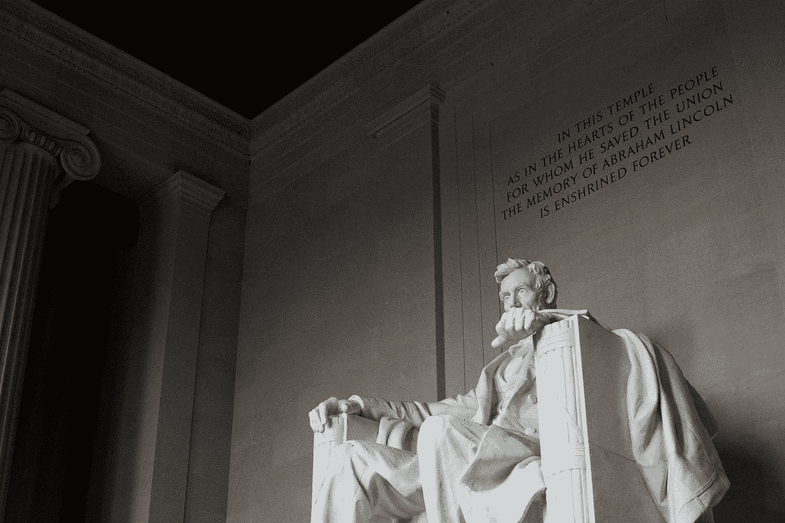
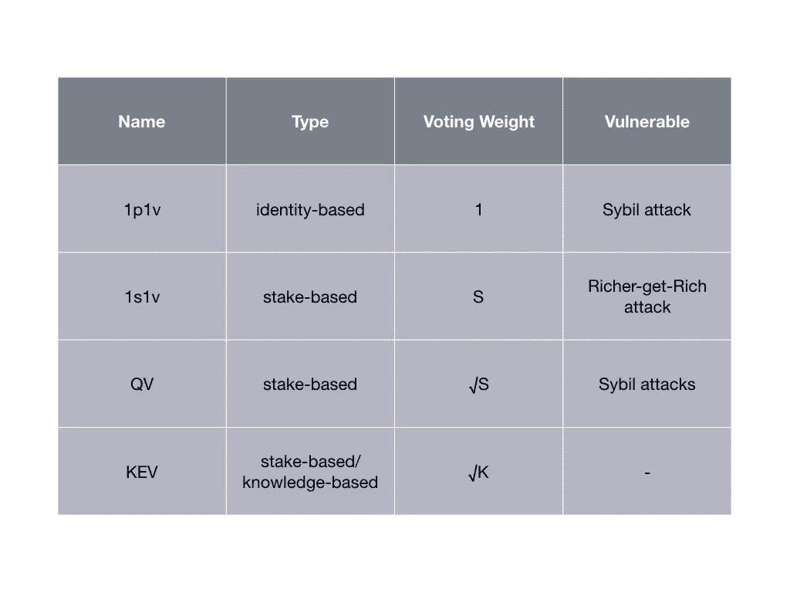
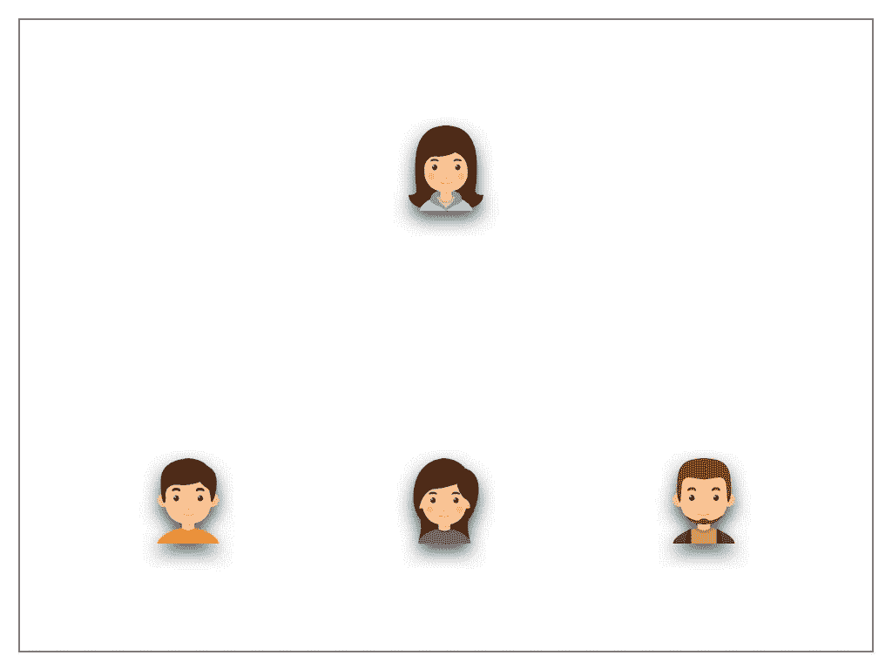
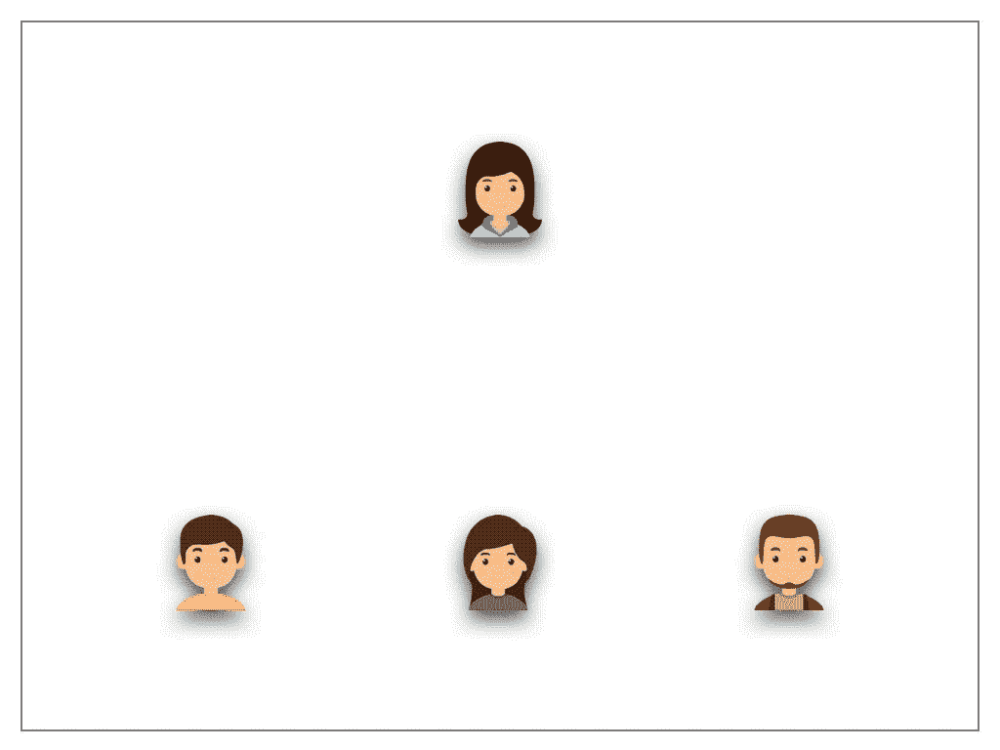
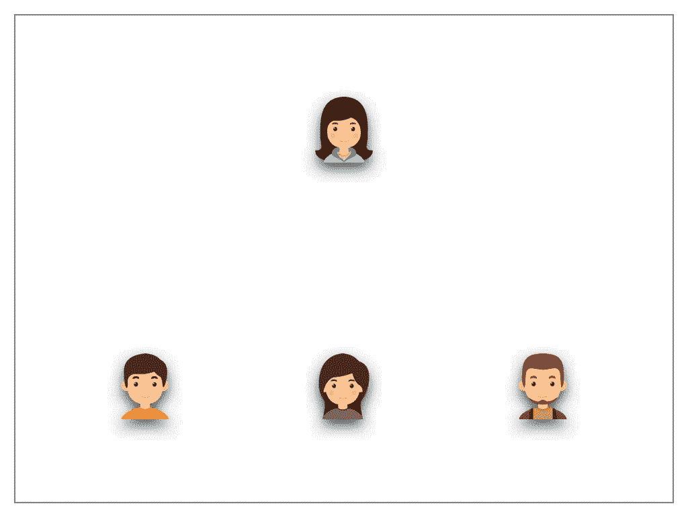

# 2019 年是 DAOs 年-现在我们迫切需要为人民制定强有力的共识协议

> 原文：<https://medium.com/hackernoon/2019-is-the-year-of-daos-9728618873f5>

U.S. president Abraham Lincoln (1809–1865) defined **democracy** as: “Government of the people, by the people, for the people“ Democracy is by far the most challenging form of government — both for politicians and for the people. DAOs are challenging all forms of governance in dimensions we have not seen before.

# 1.介绍

2018 年夏天标志着区块链爱好者的灾难性时刻。作为区块链历史上的黑色星期五，那是加密价格崩溃、ico 下降和加密泡沫破裂的时候。从那以后，我们目睹了达尔文定律的野蛮实施。区块链市场自我修复，避免了薄弱(和虚假)的项目，而具有实质内容和强大技术愿景的项目得以幸存。也有很多证据表明，这类解决复杂技术挑战并有助于确认权力下放的项目得到了社区的支持。虽然 ico 在市场崩溃后被谴责为“死亡”,但具有强大深度技术愿景的项目从社区获得的资助却在下降。最值得注意的是 [Fetch 的 ico。AI](https://medium.com/u/62c8e4668df0?source=post_page-----9728618873f5--------------------------------) 和[海洋议定书](https://medium.com/u/1abde5075f9b?source=post_page-----9728618873f5--------------------------------)分别筹资 600 万和 180 万美元。远离过去的狂热，这些是早期风险企业展示其技术可行性和证明产品适合市场的合理数字。

# 2.机会— DAOs

暴风雨过后是太阳。2019 充满了实证和创新。人们对与*分权自治组织*相关的项目寄予厚望。它们将区块链的核心原则——权力下放、激励和民主化——提升到了一个新的水平。不是机器就网络的全局状态达成一致，而是人们通过民主协议就社区的下一个状态达成一致。这个想法就像区块链一样强大。它扰乱了组织、政府或企业的运作和执行方式。例如，考虑一个 DAO，其中

*   在开源项目中工作的开发人员投票决定代码提案的整合。这样，他们扰乱了中心项目所有者，该所有者倾向于将开发引向他认为正确的方向，但这与社区的利益形成了鲜明的对比。任务追击，比如 [ditcraft.io](https://ditcraft.io) 项目。
*   足球俱乐部的球迷对新球员和教练的预算进行投票，这种方式实现了管理“他们”俱乐部的梦想，而不是接受收购俱乐部的寡头的选择。

从哲学上和技术上来说，Dao 实现了非常强大的区块链愿景——打破中央集权——略有不同的是，中央各方更像是人类当局、政府或所有者。在这种背景下，分散的自治组织具备成为区块链网络上的下一个杀手级应用的一切条件。

# 3.挑战——区块链上的投票方案

在协议层，区块链网络和 Dao 也有许多共同之处。

> 共识协议对于区块链节点来说是什么，投票协议对于 DAO 参与者来说是什么。

事实上，人们可以称投票方案为具有投票和投票人隐私附加属性的共识。隐私属性是必要的，以确保投票是独立和匿名的。后者是第一项财产的先决条件，并保护选民在投票或胁迫后免受反弹。

Comparison of voting schemes for permissionless blockchain. S denotes no. of stake and K denotes no. of knowledge tokens.

令人惊讶的是，只有为数不多的投票协议允许区块链存在。然而很少有研究分析它们是否适合 Dao。

## 3.1.一人一票(1p1v)协议

一人一票方案是在治理问题(如总统选举)上达成共识的首选方法，也可能是大多数人在投票协议下所理解的方法。该方案允许每个合格的投票人投票。通常，可信的第三方(如政府)管理和协调选举，以确保选举遵循行为协议。一旦投票期结束，政府代表和审计员计算票数，并根据多数法定人数宣布结果。

One-person-one-vote (1p1v) protocol.

有人可能会想把 1p1v 改编成区块链的场景。然而，这也有问题。在一个*无许可* *网络*中，钱包地址是识别投票者的唯一手段。只要没有身份层将地址与现实世界的身份联系起来，1p1v 就会成为 **Sybil 攻击**的牺牲品。在 Sybil 攻击中，恶意的投票者只需创建多个钱包地址，每个地址允许他在投票中投票。由于区块链网络的无许可性质，这种攻击是不可避免的，因此使得 1p1v 方案不适合投票方案。

> 1p1v 在无权限区块链中是一种不合适的投票机制(只要没有身份层)。

## 3.2.一桩一票(1s1v)协议

“一股一票”方案是在没有许可的情况下进行选举的事实上的标准机制。受利益证明共识协议的启发，以及 1p1v 对区块链的天真适应在 1s1v 协议中失败的事实，每个投票者存入一个利益。赌注的数量决定了他的选票。法定人数由多数股权决定，少数股权被削减。

One-Stake-One-Voter (1s1v) protocol.

必须谨慎考虑 1s1v，因为该协议可能会损害 DAOs 中的民主选择。尽管 1s1v 解决了 1p1v 方案中的 Sybil 攻击问题(因为股份的大小决定了投票权，所以不再需要创建多个地址)，但是新的弱点出现了。该协议赋予金融寡头(例如能够拿出高额赌注的富裕选民)在操纵投票结果方面不可忽视的优势。事实上，他们可以通过滞留所有(少数)选民并收取他们的股份来劫持投票机制。一场富人变得更富的攻击可能会爆发:投票“机器人”不仅收获诚实选民的赌注，还会更戏剧性地污染民主的概念。有人可能会想当然地认为，限制每位选民的总持股量可能会解决这一漏洞。通过发动西比尔攻击，寡头仍然可以操纵投票结果，从而劫持协议。

Rich-get-Richer Attack against 1s1v protocols. A major stake holder can game the outcome of the decision and collect the slashed stake of the minority voters.

## 3.2 二次投票(QV)协议

史蒂文·拉利和[格伦·维尔](https://medium.com/u/efb5397d83d0?source=post_page-----9728618873f5--------------------------------)提出了一个全新的想法来缓解财富分配不公的问题。作者提出了二次投票的美丽概念。他们的想法是建立在购买选票的基础上的。更准确地说，每个选民都可以通过在一个基金中支付代币来购买任意数量的选票，但有一个条件。投票人必须支付票数的平方。然后，这笔钱按人均计算返还给选民。例如，假设一个选民打算投 10 票。然后他支付 10 =100 代币来获得选票。在高层次上，二次定价函数就像一种财富减速机制。拉里和韦勒已经证明，在某些假设下，QV 是一种反对多数股东暴政的机制。

Quadratic voting (QV) protocol

虽然他们的结果适用于现实世界的决策，但将该方案转移到无需许可的区块链环境并没有带来预期的结果。区块链世界的问题是**西比尔袭击**。区块链技术公司的设计允许一个投票者投许多匿名的身份。因此，为了积累 10 张选票，sybil 攻击者只需在不同的身份下创建 10 个帐户。这样，攻击者总共需要 10 个令牌来投 10 票。然而，我们想要强调的是，在基于许可的设置的情况下，玩家的身份是已知的，并且在系统的整个生命周期中是固定的(例如，基于授权证明的系统)，QV 可以满足期望的结果。

> QV 协议容易受到 Sybil 攻击。

## 3.4.知识提取投票协议

受 QV 背后的全新而卓越的想法的启发，知识可提取投票将决策建立在一些稀疏且更适合区块链应用的东西上——即知识 **—** 以实现(部分)独立于财富的决策。与财富相反，知识是通过经验或教育，通过感知、发现或学习获得的。它不能在交易所买到。它不能从一个有知识的人身上转移到一个不太有知识或富有的人身上。此外，知识是不可替代的，因为知识与特定的兴趣和专长领域相关。

Knowledge-extractable voting (KEV) protocol

知识可提取投票为 1s1v 协议的机制增加了第二个令牌，称为**知识令牌**。知识令牌的一个重要属性是它们*不可购买*和*不可转让*。创造知识令牌的唯一方法是参与决策，并证明由其他投票人审查的知识。如果投票人在投票中偏离法定人数决定，那么不仅他的股份被削减，而且投票人的知识令牌也被彻底烧毁(到平方根)。因此，特定领域中增加数量的知识标记允许量化投票者的专业知识。正是这种专业知识被用来衡量投票者在投票中的权力。

# 4.结论

投票方案对于 Dao 的稳定性就像共识协议对于区块链网络一样重要。看看投票方案对 Dao 的影响，理解它们为基于区块链的应用程序提供的安全保证是至关重要的。我们分析了建议的投票协议，并得出结论，在选择正确的投票方案时必须谨慎小心。我们比较了事实上的投票协议，并得出结论，知识可提取投票是一个有吸引力的候选人，以克服越富越富攻击的区块链。这意味着对西比尔攻击的抵抗，其他基于股份的投票方案成为牺牲品。

# 确认

这是与马文克鲁斯的合作，所有的动画都是他的好意。