# 2019 隐私令牌回顾

> 原文：<https://medium.com/hackernoon/2019-privacy-token-review-c28b6ceef637>

## 隐私令牌与令牌经济学的比较研究

供稿@ [Dennis_Z](/@dennis_z)

这篇文章包含了你需要知道的关于隐私令牌的**的一切。它有点长，可以随意使用目录跳转到特定的部分。如果觉得文章有帮助，请**跟我来**和**拍 50 次**【对，可以拍多次】。**

## 目录:

*   [1。为什么是隐私令牌？](#7c74)
*   [2。隐私令牌回顾](#bc71)
*   [3。隐私令牌经济学](#8812)
*   [4。困境—监管监控与隐私](#5716)

## 1.为什么是隐私令牌？

区块链是一个允许对等交易而无需授权的网络，同时保持交易对手匿名。**隐私**是个人或群体将自己或关于自己的信息隐藏起来，从而有选择地表达自己的能力。然而，每一笔交易都是公开的，所有人都可以在公共账本上看到。基于具有已知身份的特定钱包的交易模式，可以使用社会工程来描述账户所有者。就像电影***Ready One Player***里说的，“绿洲里没人说出自己的真实姓名！”

对于隐私，它意味着以下几件事，在区块链是隐私问题。下表总结了隐私令牌的主要功能。

*   **发件人隐私【钱包/地址隐私】**
*   **加密隐私【交易隐私】**
*   **平衡可见性【数据/内容隐私】**

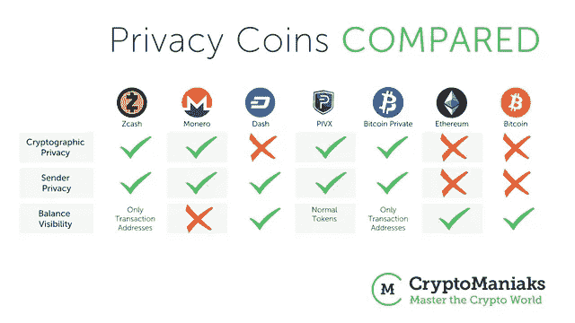

## 2.隐私令牌综述

已经有一些隐私令牌使用不同的技术来解决上述隐私问题，包括 Dash、Monera、Zcash。还有其他几个，包括 PIVX，Grin，Verge，NavCoin。此外，诸如 LTC 之类的传统代币考虑向代币添加隐私特征，以获得作为交易和支付的主要参与者的一些比较优势。本节将单独讨论每个隐私令牌。

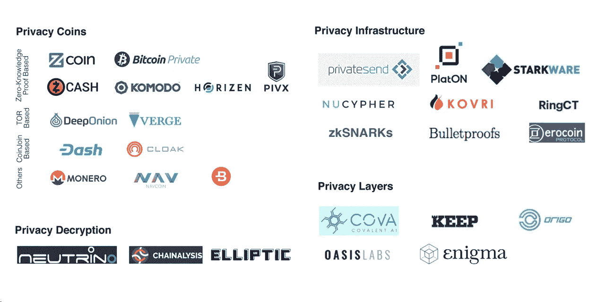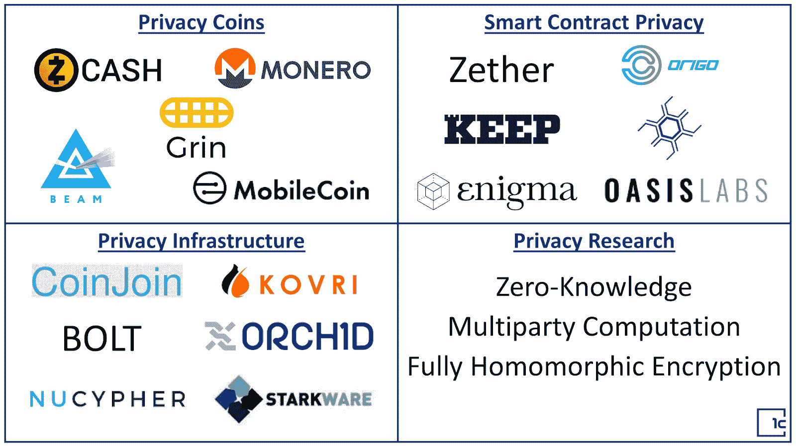

## 2.1 仪表板(Dash)

**DASH** 成立于 2014 年的一次比特币分叉之后，并没有加密私有。Dash 通过混合来保证安全性，使用 CoinJoin 的调整版本——这是一种最初用于“匿名化”比特币的策略。Dash 是一个工作验证框架，在系统上有两种集线器；主节点和挖掘者。主节点提供即时发送和私有发送能力。

CoinJoin 是由 Gregory Maxwell 提出的一种匿名交换技术。CoinJoin 依靠标准的集合在一起交换，使联合分期付款。基于 CoinJoin 的混合技术增加了所有客户的安全性，因为对交换的所有贡献不再可能来自一个单独的钱包，并且从此不再能够可靠地与一个单独的客户连接。

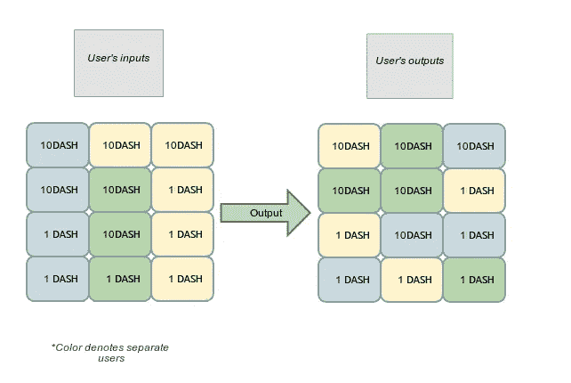

## 2.2 Monero (XMR)

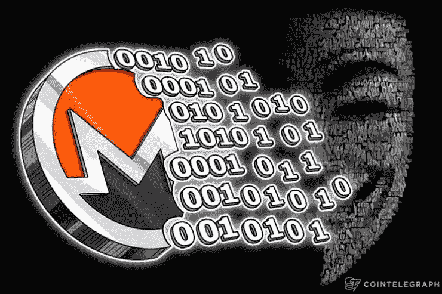

**Monero** 被认为是加密货币领域最好的**隐私加密货币**之一。Monero 于 2014 年由 Bytecoin 从**硬分叉创建，它使用隐藏地址和传输数量的编码交易，还添加了欺诈性交易，使人们无法知道操作的内容。**

编码使用了**环 CT** 来维护匿名交易和钱包。该团队还集成了通过 TOR 网络传递交易的操作系统 **Tails，以进一步保护隐私。**

此外，Monero 还使用了一个由**秘密地址**组成的网络，允许用户隐藏他们的钱包地址。秘密地址是为每笔交易创建的一次性地址。Monero 用户也有一个公布在区块链上的公共地址，但他们的大多数(如果不是全部)交易都将通过唯一的秘密地址进行。

基本上，Dash 将小额交易分组，而 Monero 则为了隐私而分解成小额交易。因此，Monero 非常依赖网络资源。它们与比特币的不同之处在于，普通 PC 可以运行 Monero 的节点服务。

## 2.3 Zcash (ZEC)

[**Zcash**](https://z.cash/) 是另一个比特币分叉的隐私币，使用 zk-SNARKs 的隐私功能。 **zk-Snarks** ，又名零知识简洁的非交互式知识论证，是一种允许矿工在不知道谁发送/接收硬币的情况下验证交易的技术。协议团队已经在 JP Morgan 的 Quorum 上实现了 zk-Snarks，这是以太坊的企业版。该团队与其他团队合作，将隐私功能添加到他们的项目/平台中。

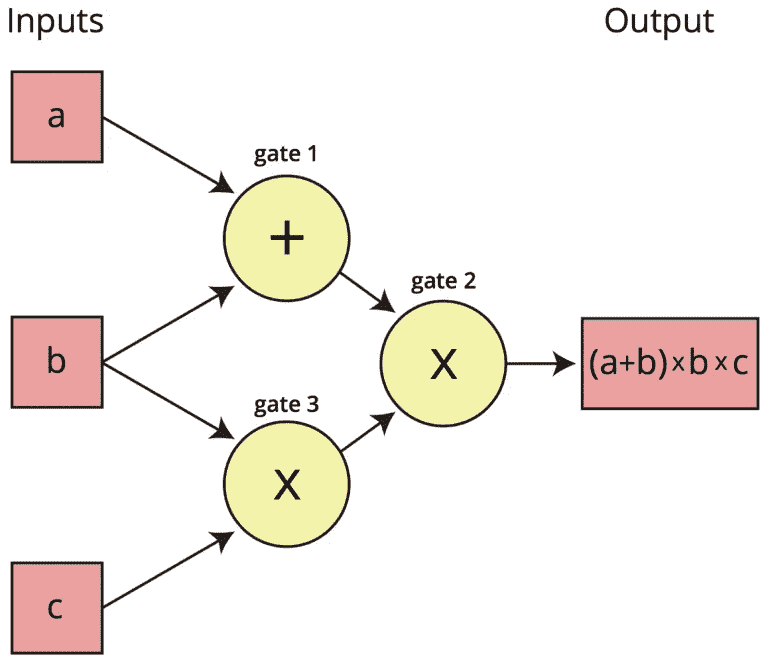

## 2.4 PIVX (PIVX)

[**PIVX**](https://pivx.org/zpiv/) 是暗网币的再品牌，代表私人即时验证交易。PIVX 是 Dash 的一个分支，实现比特币改进提案(BIP)，并利用 PoS 来保护网络。

PIVX 用户可以运行至少有 10，000 个令牌的主节点(而 DASH 只需要 1，000 个 Dash)。

## 2.5 研磨(GRN)

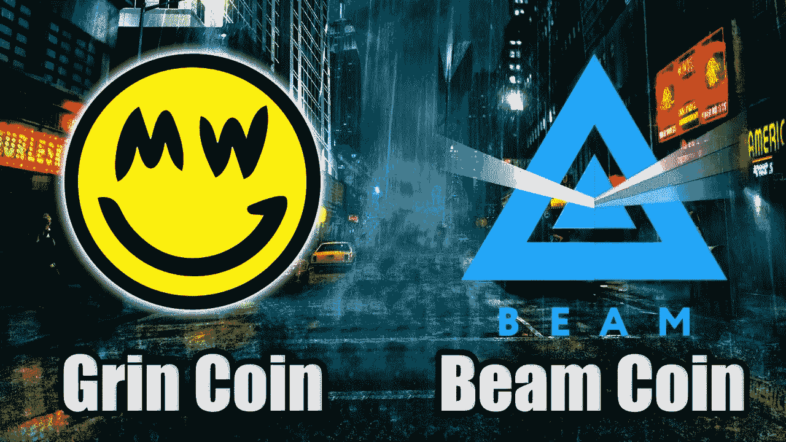

Mimblewimble 是一个新的以隐私为中心的区块链项目，基于比特币的设计。2016 年 7 月 19 日，“汤姆·埃尔维斯·杰杜索尔”将[白皮书](https://download.wpsoftware.net/bitcoin/wizardry/mimblewimble.txt)丢进一个比特币研究频道，然后消失了。后来，“Ignotus Peverell”开始了一个名为 [Grin](https://grin-tech.org/) 的 Github 项目，并开始将 Mimblewimble 论文转化为实际应用。

Mimblewimble refers to the tongue-tying curse in Harry Potter. Tom Elvis Jedusor is Lord Voldemort’s French name and Ignotus Peverell is the original owner of the invisibility cloak.

Mimblewimble/Grin 是对比特币的保密交易和 CoinJoin 的改进。主要特点包括没有公共地址，完全隐私，和一个紧凑的区块链。最近有很多关于研磨采矿兴奋，因为研磨币，像比特币一样，只能通过粉末采矿来制造。Grin 使用 **Cuckoo Cycle** PoW 算法，该算法最初是为抗 ASIC 设计的，但现在被认为是 ASIC 友好的。

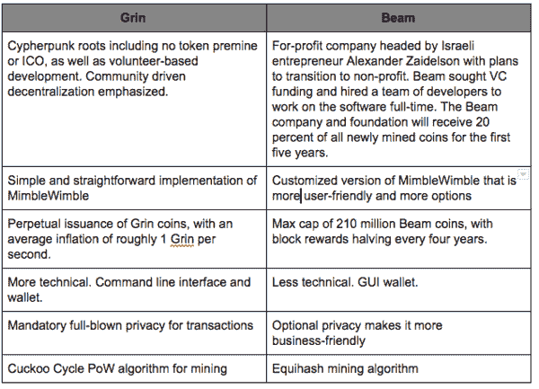

## Grin 的主要特点:

*   默认为完全隐私
*   可伸缩事务
*   屡试不爽的加密技术
*   个人对个人交易的简易设计
*   社区驱动—旨在分散发展和采矿

其他相对早期开发的有趣的隐私币包括 [MobileCoin](https://www.mobilecoin.com/) 和 [BEAM](https://www.beam-mw.com/) 。

## 2.6 边缘(XVG)

2014 年，Verge Coin 以 DogeCoinDark 的名字开始了它的旅程，它是以世界上最受欢迎的迷因加密货币命名的。2016 年，这枚硬币被更名为 Verge Cryptocurrency，此后在技术和投资界获得了巨大的吸引力。

*   **边缘币可开采。**但是，Verge 矿工可以选择三种采矿方法中的一种来获得他们的 Verge，而不是提供给比特币矿工的昂贵而有限的选择。
*   **Verge 允许日常支付。**但在比特币支付不是匿名的情况下，Verge coin 交易用 TOR 和 i2P 掩盖，用于完全私人的交易。
*   **Verge 是去中心化的钱。**但是，Verge 也正在增加智能合约功能，使其能够比比特币更好地满足世界的需求。
*   **Verge 有几个关键的合作伙伴**，包括色情行业巨头 MindGeek，其子公司包括 Pornhub 和 Brazzers。

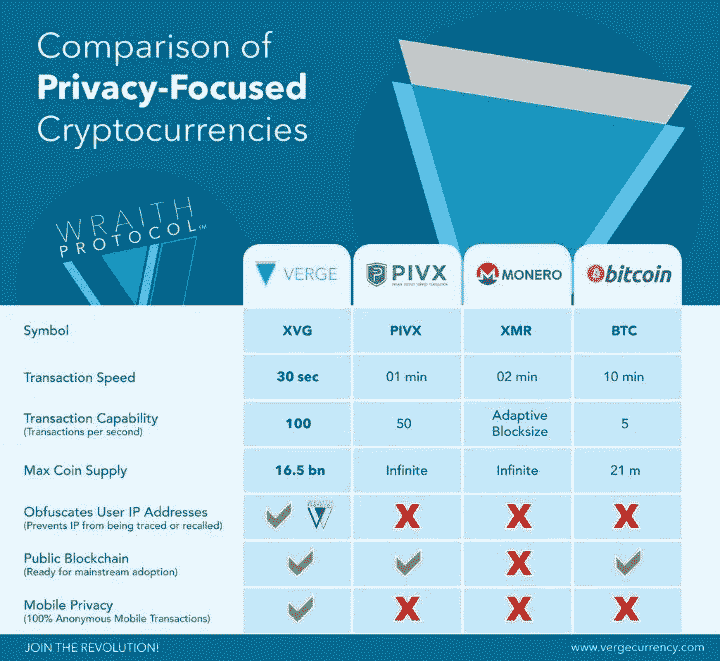

## 2.7 莱特币

莱特币已经厌倦了站在比特币的阴影下。多年来，莱特币的核心开发者一直是比特币的副手，他们越来越有兴趣效仿 Monero 和 Zcash (ZEC)等隐私币。

查理·李开启了关于可替代性的讨论，并在 2019 年的*“全节点实现的未来版本”*中暗示增加了保密交易。这将使 LTC 作为交易和支付媒介获得更多的比较优势。

## 2.8 导航币(NAV)

**NavCoin** 是一种去中心化的加密货币，由比特币派生而来。它旨在解决区块链平台中常见的两个问题:

*   区块链上的数据是公开的，容易受到非法用户的恶意攻击。
*   大多数区块链使用“回滚”作为数据漏洞的解决方案。在数据泄露后，他们将区块链重置到备份点，这意味着回滚前的交易将被擦除。

NavTech 系统是传统比特币区块链和 NAV 子链的结合。使用两个链允许用户以完全匿名的方式发送交易。

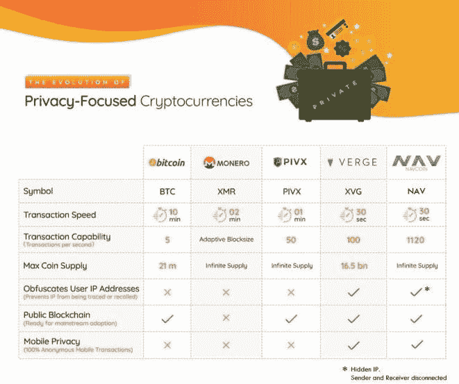

## 2.9 斗篷硬币

斗篷是一种成熟的隐私硬币，虽然它已经在隐私领域活跃了大约 4 年，但增长缓慢。区块链使用利害关系证明共识协议运行。它的阻塞时间相对较短，处理事务的速度也很快。

该平台还提供了两种不同的方法来使您的交易不可追踪。首先是他们的洋葱路由隐私协议。洋葱路由包括用许多层加密消息(类似于洋葱)。

它还提供了 Enigma 过程，为交易提供额外的隐私保护。当用户请求隐藏的 Enigma 交易时，应用 enigma 隐藏。

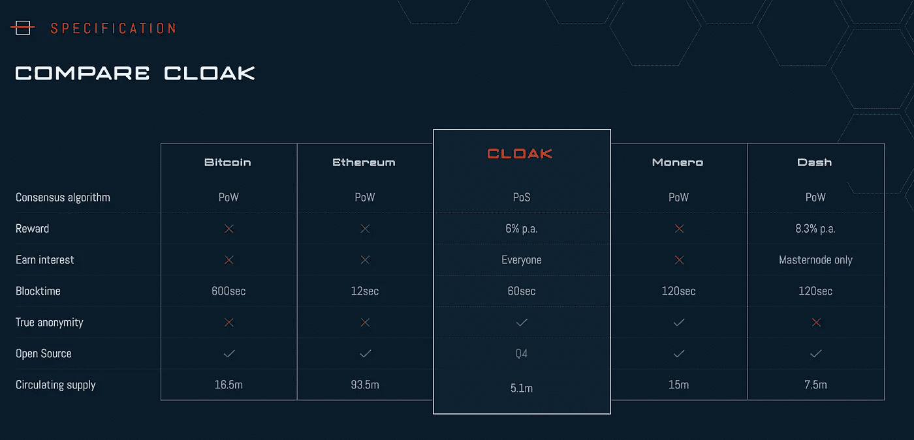

## 2.10 英格玛(英语)

英格玛项目完全独立于隐形硬币交易中使用的英格玛隐形过程。英格玛不是加密货币，也不是区块链；相反，它是一个隐私协议，可以部署在区块链和分散的应用程序上。因此，它的标志 ENG 是顶级隐私硬币名单中的一个独特成员。

Enigma 网络通过使节点看不到它们计算的数据来提供隐私。尽管这些节点不能清楚地看到它们正在做什么，但是它们仍然能够验证它们的计算已经正确运行。通过这样掩盖数据，Enigma 希望为他们所谓的新型智能合同——“秘密合同”——打开大门，其中智能合同中处理的底层数据始终保持加密。

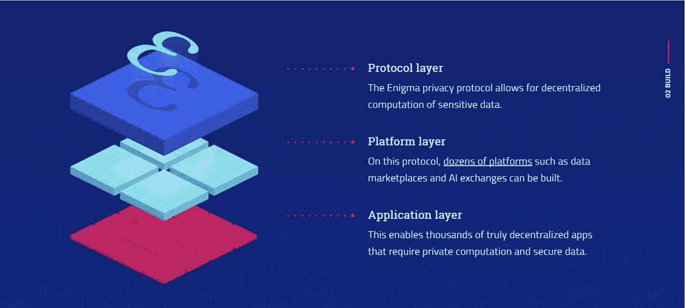

## 2.11 深洋葱

**DeepOnion** 是一个新的隐私币项目，在社区中产生了一些兴趣。像这个列表中的其他一些硬币一样，DeepOnion 使用 TOR 来发送无法追踪的交易。它还混合使用风险证明和工作证明协议来提供快速确认时间。

DeepOnion 还使用秘密地址来保持交易的私密性。DeepOnion 团队目前正在开发 DeepSend 和 DeepVault。DeepSend 将使用多重签名方法来防止付款被追踪。DeepVault 是一项信息存储服务，允许用户将数据永久存储在区块链中。为了验证文件的完整性，用户只需将文件的当前版本与备份进行比较。这对于验证重要文档的完整性是有益的。

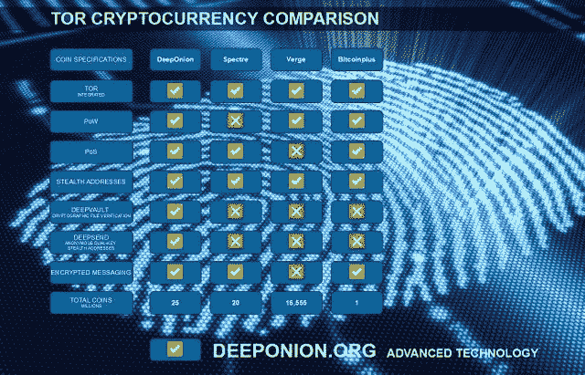

## 2.12 证金

[**Zencash**](https://cryptonomist.ch/en/?s=Zencash) 不仅仅是一种**隐私加密货币**，因为它还包含一个消息传递平台，一个分布式自治组织(DAO)。用户可以匿名(“Z”地址)或假名(“T”地址)发送令牌。就连 Zcoin 的硬叉 Zencash 也想进行同等程度隐私的交换。

## 2.13 先令

**Zcoin** 也使用 Zerocoin 协议。Zcoin 在 Zcoin 交易中被烧掉，Zerocoin 被创建和转移，但是因为它们没有历史，所以它们是不可追踪的。这需要 0.01 兹币的费用。收钱的才知道收到了。

## 2.14 字节币(BCN)

鉴于其诞生可追溯到 2012 年，字节币可能是最古老的处理隐私问题的加密货币，但最近出现了闪回。作为一个安全系统，它结合了一个用于加入到环形 CT 的地址的秘密系统和一个称为 Cryptonote 的协议。这个隐私令牌是 Monero 的父亲。

## 2.15 比特币私有

**比特币私有**来源于一个硬分叉和一个融合，即比特币的一个硬分叉，然后与 Zclassic 合并，依次是 Zcash 的硬分叉，其中取消了对创作者的奖励。比特币私有也实现了 zk- Snarks。

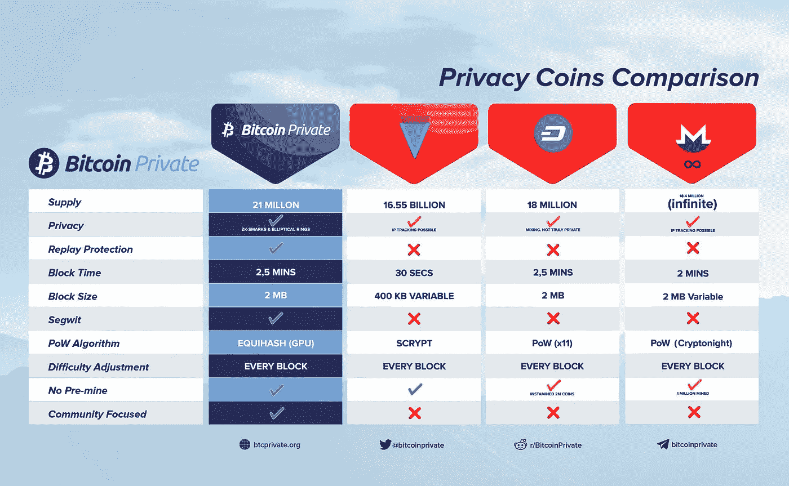

## 2.16 SpectreCoin (XSPEC)

[**spectre coin**](https://spectreproject.io/)(XSPEC)创建于 2016 年 12 月，是 ShadowCash (SDC)的一个分支，它最初的不同之处在于它通过 tor 网络运行，以增加隐私。自那以后，它继续取得进展，发展成为一种更加用户友好和匿名的加密货币。这些改进包括 OBFS4 桥、钱包 UI 改进、改进的隐形地址、更新的 tor 和更好的同步。在一年多一点的时间里，该项目已经取得了很大的进展，并对未来有很大的计划，如隐形赌注(任何加密的第一次)和 Android 和 iOS 移动钱包的实施。

## 主要特点:

*   Tor 隐藏位置，使追踪更加困难
*   隐藏地址以保持接收者匿名
*   环形签名隐藏发送者

## 3.隐私令牌经济学

由于实现隐私功能的技术堆栈不同，令牌经济学设计可以不同，以激励各种生态系统利益相关者。在本节中，我们将讨论 DASH 和 Enigma 协议的不同令牌经济学设计。

首先，让我们总结一下 Privacy Token 使用的一些技术。

*   **CoinJoin** —将多个交易加入一个组，这样交易就不会链接到单个钱包/地址。这是一个基于混合的隐私解决方案。
*   **TOR 网络** — TOR 让交易无法追踪。另一种理解 TOR 的方式是 VPN。它使用多层代理进行交易，以隐藏交易对手的身份。[ [点击此处查看 2 分钟视频](https://www.torproject.org/videos/Tor_Animation_en.mp4)
*   **i2P**—**隐形互联网项目** ( **I2P** )是一个匿名网络层(实现为[混合网络](https://en.wikipedia.org/wiki/Mix_network))，允许[防审查](https://en.wikipedia.org/wiki/Internet_censorship_circumvention)、[点对点](https://en.wikipedia.org/wiki/Peer-to-peer)通信。匿名连接是通过加密用户的流量(使用端到端加密)并通过分布在世界各地的大约 55，000 台计算机组成的志愿者网络发送来实现的。
*   **RingCT** — RingCT 代表 Ring Confidential Transactions，通过在区块链的一组 *n* 其他输出中隐藏真实发送方的输出，使交易更难追踪，其金额无法区分。这是一个基于混合的隐私解决方案。
*   **隐形地址** —隐形地址意味着创建的隐形地址在交易中只使用一次。也就是说，每笔交易对应一个秘密地址，这使得不可能将交易与单个钱包/地址联系起来。
*   zk-SNARKS 代表知识的零知识简洁非交互论证。它是一种加密算法，可以在不泄露地址和余额的情况下验证交易。
*   **Mimblewimble**—Mimblewimble 使用椭圆曲线加密技术，与其他加密类型相比，它需要更小的密钥。在使用 Mimblewimble 协议的网络中，区块链上没有地址，网络的数据存储效率很高。[ [一个简单的例子](https://cryptopotato.com/what-is-mimblewimble-the-complete-beginners-guide/)

## 3.1 仪表板

然而，Dash 的工作方式与比特币略有不同，因为它有一个双层网络。第二层由 masternodes(完整节点)提供支持，实现了财务隐私(PrivateSend)、即时交易(InstantSend)以及去中心化的治理和预算系统。因为这第二层非常重要，当矿工发现新的区块时，主节点也会得到奖励。细分如下:45%的块奖励归矿工，45%归 masternodes，10%留给预算系统(每月由超级块创建)。

截至 2019 年 2 月，运营 masternode 的 DASH 持有者获得~ **7%的年度区块奖励**。[https://masternodes.online/currencies/DASH/](https://masternodes.online/currencies/DASH/)是实时 DASH 网络指标的绝佳资源。

现在的格挡奖励是 3.35 破折号，或者矿工 1.5075，主节点 1.5075，每格挡 DAO 0.335 破折号。Dash 的数据块间隔约为 2.5 分钟，每天约 550 个数据块。

每个 masternode 需要 1,000 DASH 作为抵押。1，000 DASH 用作抵押担保品，需要获得通货膨胀基金的整体奖励。在主节点操作期间，抵押品始终是安全的，不会被没收。

由于主节点奖励固定为块奖励的 45%，即每个块 1.5075 DASH，并且网络上活动主节点的数量是动态的，预期主节点奖励将根据当前活动主节点的总数而变化。主节点目前的收益率约为 7.01%。

Dash masternode 的平均奖励频率不到 9 天。

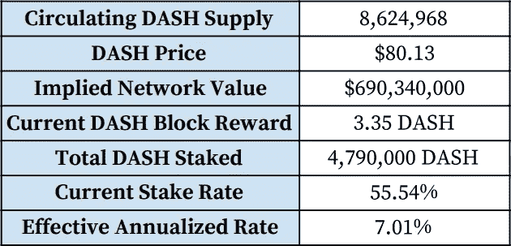

## 3.2 谜

Enigma 是一种与安全处理信息相关的协议。必须购买它的令牌才能在它们的网络上运行一个节点。购买 Enigma 令牌后，您可以获得处理数据的奖励。但是为了处理数据，每个节点都必须缴纳保证金。如果数据在验证过程中被篡改，存款将在处理数据无误的任何节点之间分割。

实际上，拥有 ENG 可以让人们开始使用网络。ENG 也作为参与网络的奖励。

影响代币经济性的其他因素包括:挖掘器/节点选择的随机性、提供挖掘服务的前期成本(例如，ASIC 对 PC)以及硬币奖励数和硬币价格。

## 4.两难境地——监管监控与隐私

最近，对于 SEC 批准 BTC ETF 提案有不同的声音。对于那些认为它不会很快到来的人来说[ [布莱恩·凯利](https://cointelegraph.com/news/crypto-analyst-brian-kelly-no-shot-for-bitcoin-etf-in-2019)。

2018 年，SEC 收到了来自不同参与者的多个比特币 ETF 申请，如[文克莱沃斯双胞胎](https://cointelegraph.com/news/cnbc-winklevoss-twins-bitcoin-etf-application-rejected-by-sec)，但尚未批准其中任何一个。凯利进一步阐述了自己的观点，他说，该机构不太可能在近期改变意见，因为“有太多的问题没有解决。”

出于多种原因，SEC 官员要求在批准 BTC ETF 申请之前加强加密货币的监控和保管:

*   对黑客事件和市场操纵的担忧
*   对无交易可追溯性的洗钱的担忧
*   出于税务原因将交易与钱包/地址关联的顾虑。

这就是监管监控与隐私之间的两难境地。在达成平衡/妥协之前，下一轮牛市可能会尽可能拖延。

## 免责声明:

项目的所有信息都来源于在线资料，并不一定反映项目的当前状态。这里的信息不构成任何投资建议或任何投资的后果。

## 参考

*   [https://hacker noon . com/an-overview-of-privacy-tokens-19 F6 af 8077 b 7](https://hackernoon.com/an-overview-of-privacy-tokens-19f6af8077b7)
*   [https://steemit . com/cryptocurrency/@ develop . unicorns/privacy-tokens](https://steemit.com/cryptocurrency/@develop.unicorns/privacy-tokens)
*   [https://the control . co/an-overview-of-privacy-in-cryptocurrences-893 DC 078 d0d 7](https://thecontrol.co/an-overview-of-privacy-in-cryptocurrencies-893dc078d0d7)
*   [https://masterthecrypto . com/privacy-coins-anonymous-cryptocurrences/](https://masterthecrypto.com/privacy-coins-anonymous-cryptocurrencies/)
*   [https://www.investinblockchain.com/top-privacy-coins/](https://www.investinblockchain.com/top-privacy-coins/)
*   [https://coin savage . com/content/2018/08/privacy-coins-comparison-review/](https://coinsavage.com/content/2018/08/privacy-coins-comparison-review/)
*   [https://cryptonomist.ch/en/2018/06/04/privacy-tokens-2/](https://cryptonomist.ch/en/2018/06/04/privacy-tokens-2/)
*   [https://www.bitstarz.com/blog/introduction-to-grin-coin](https://www.bitstarz.com/blog/introduction-to-grin-coin)
*   [https://zcoin . io/zcoins-隐私-技术-比较-竞争/](https://zcoin.io/zcoins-privacy-technology-compares-competition/)
*   【https://coinlist.me/altcoins/verge/ 
*   [https://medium.com/@staked/dash-staking-guide-e8d671d0ce03](/@staked/dash-staking-guide-e8d671d0ce03)
*   [https://dash pay . atlassian . net/wiki/spaces/DOC/pages/56655887/Mining+vs .+master node](https://dashpay.atlassian.net/wiki/spaces/DOC/pages/56655887/Mining+vs.+Masternode)