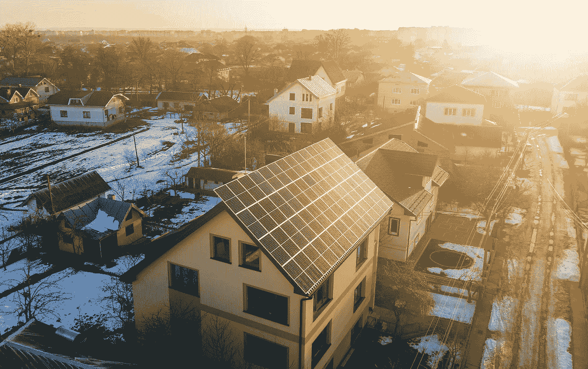
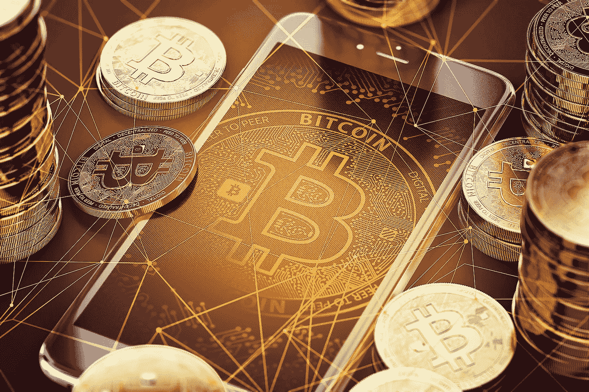
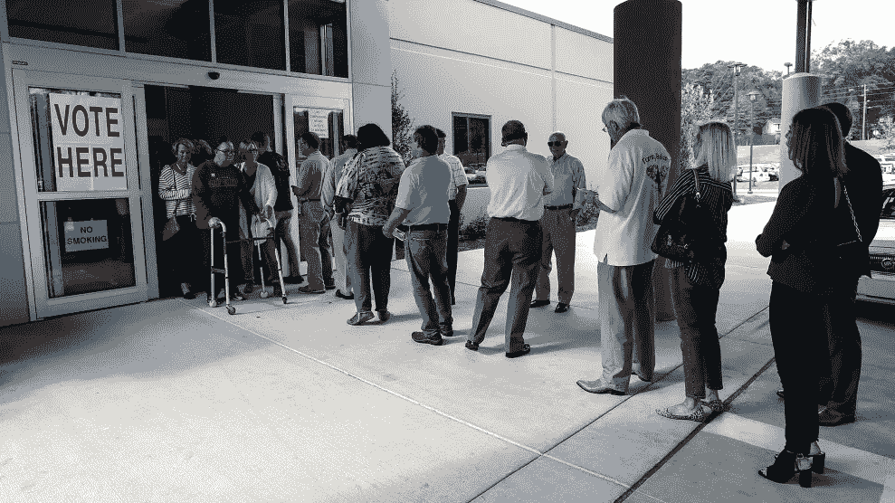

# 受益于区块链技术的 3 个行业

> 原文：<https://medium.com/hackernoon/3-industries-benefiting-from-blockchain-tech-1a8762d5631e>

长期以来，社会完全依赖银行、能源零售商和政府等大型中介机构来建立对我们经济的信任。我们依靠这些中介来执行所有的业务和事务逻辑—从身份验证到人员识别，一直到清理和结算记录。

总体而言，中介机构做得很好，但仍存在成长的烦恼。首先，中介往往是集中的——这意味着他们可以被黑客攻击，而且现在越来越多。其次，它们会减慢速度。例如，通过银行在一个城市汇款可能需要几天甚至几周的时间。中间人也倾向于拿走很大一部分佣金——比如，10%到 20%的佣金只是为了把钱汇往另一个国家。通过获取我们的数据，我们的隐私被破坏了。

幸运的是，时代在变，我们现在正在进入一个新的技术时代，一个为每个企业、社会和个人带来巨大希望的时代。随着我们过渡到共享经济，区块链技术在促进新商业模式的创建方面正占据中心位置，这些新商业模式更加高效，与我们不断发展的社会更加兼容。

最简单的形式是，区块链是一个记录交易的公共分类账，它通过在没有传统中介参与的情况下促进可信的价值转移，大大加快了交易速度，同时降低了成本。那么……哪些行业可以或正在从区块链技术中获益最多？

## **1。能源部门**

据估计，全球电力市场价值约为 2 万亿美元，主要由少数几家公司垄断。该部门的这些主要参与者控制着市场动态，强调更高的能源生产水平，以确保利润最大化。因此，在这一模式中，消费者和终端用户的贡献仅限于能源服务的订购。

在现代世界中，消费者行为除了花钱之外，还倾向于更大程度地参与市场，这种模式似乎有许多缺点，因为现代电力消费者希望在发电和配电中有更大的发言权。

因此，在未来五年，区块链技术在电力行业最有前途的应用预计将出现在“点对点能源交易”和“电动汽车充电和共享”领域。

**P2P 能源交易**

区块链使能源创新者能够创建一个系统，商业部门或私人家庭的能源消费者可以在没有中央当局干预的情况下进行电力交易。这不仅仅是理论，因为 SunContract 团队已经在区块链建立了一个能源交易平台，斯洛文尼亚的公众已经使用了一年多。

**电动汽车**

此外，随着电动汽车的持续增长，区块链还承诺提供充足的公共充电基础设施，通过让个人付费向公众提供私人电动汽车充电站来解决“里程不足”的挑战。

## **2。银行业**

没人能确定未来几年区块链会对银行业产生什么影响。但目前，与传统银行相比，它有三大优势，这也是金融科技对未来充满信心的原因。

***更快的交易***

传统的金融交易通过第三方进行，耗费大量时间。例如，正常的支付通过网关、证券交易所或票据交换所进行。多达 10 个实体可能参与交易、交换信息、对账或担保，这意味着卖方只能在天后收到付款。

区块链通过分散一切来减少这种延长的时间框架。它可以在几秒钟内完成通常需要三天或更长时间才能完成的交易。

***透明度和可访问性***

区块链记录并锁定交易，用户可以轻松访问完整的历史数据。因此，与更为隐秘的传统银行业相比，它提供了更大的透明度。

***降低交易成本***

传统的国际交易通过相关国家的中央银行，然后通过当地银行进行。这意味着一家全球性企业可能最终为一笔交易支付高达 25 美元。

区块链加速了交易，降低了相关成本。它使第三方及其费用变得不必要。因此，进行跨国交易的企业将从中受益。

## **3。政治**

无论是在世界的哪个角落，政治体系在许多选举过程中都存在一些漏洞和道德问题。许多国家用来选择政治家的电子投票机选票容易受到黑客攻击，但由于区块链技术，选举机构现在可以阻止任何人干涉公民的民主权利和责任。

***隐私担忧***

操纵投票和“投票违规”可能会成为过去，对手政府或恐怖组织黑客投票的威胁也可能成为过去。用区块链技术保护的投票系统将完全不可破解。从选民登记到验证身份再到计票，这个系统是无可争议的。重新计票和“挂支票”的日子将一去不复返。好消息是许多国家已经开始研究区块链的投票，爱沙尼亚是先驱之一。

***增加选民参与度***

尽管他们有资格并持有选民登记卡，但太多的公民不投票。原因多种多样，包括排长队、没有时间、冷漠等。区块链投票将在瞬间克服这些障碍。一旦智能手机或台式机支持电子投票，选民将能够在几分钟内从任何地方投票。这将提高选民的参与度，从而带来更强大的民主。

## **结论**

区块链技术还处于早期阶段，业内人士仍在考虑合并的方式。但有一点是明确的，区块链有能力通过其破坏性力量进一步建立民主和平等意识。

[*Winfred k . Mandela*](https://www.linkedin.com/in/winfred-k-mandela/)*是区块链领域卓有成就的营销人员和业务开发人员。她负责将各公司产品团队的创新与业务部门以客户为中心的运营联系起来，以建立区块链品牌，在实施项目的地区创造消费者意识，并每天通过他们的渠道推动客户对品牌的偏好。Winfred 喜欢在户外骑自行车，喜欢分析市场，并且总是喜欢读一本好书！*