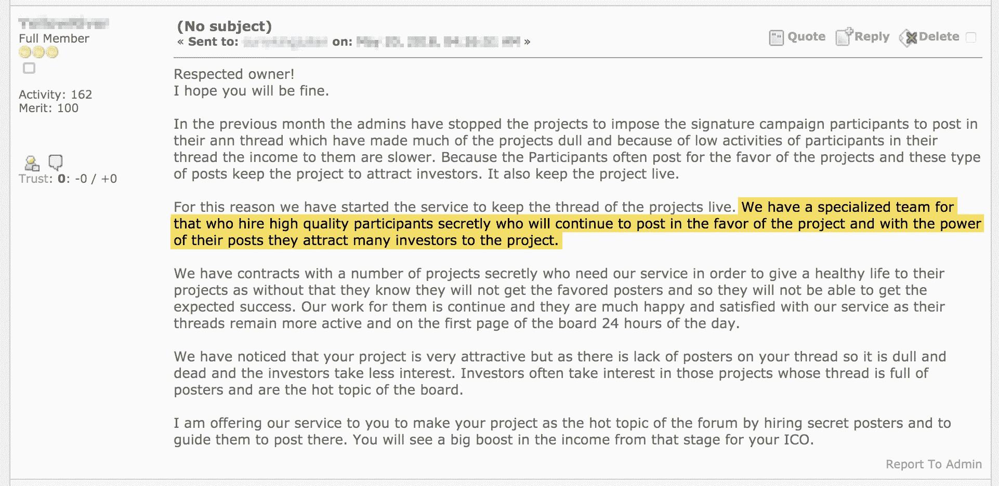
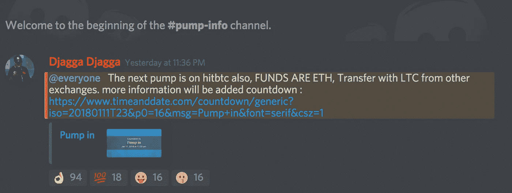
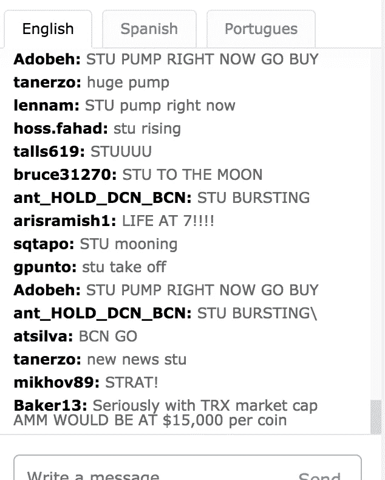
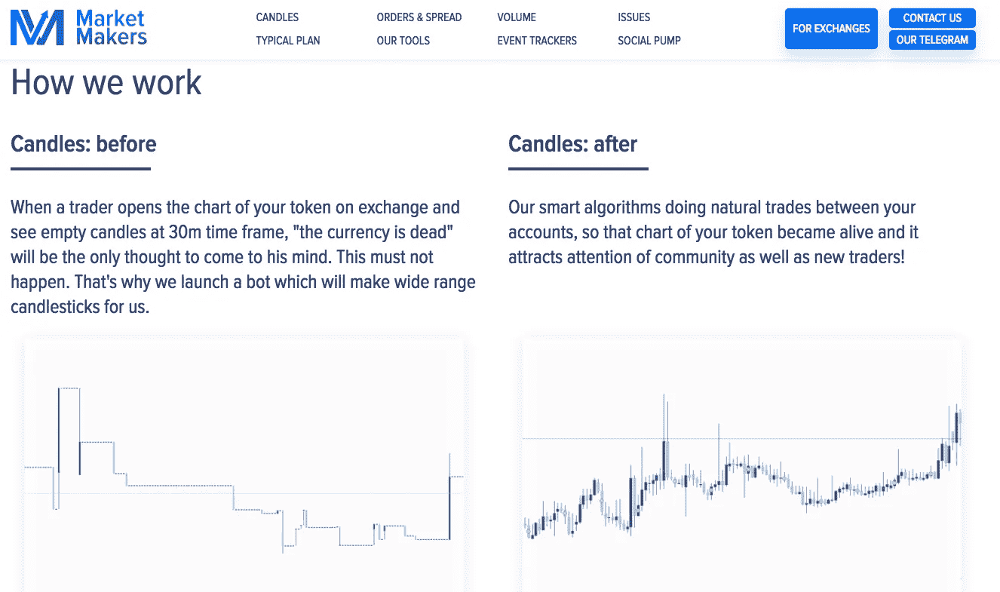
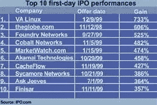

# ICO 泡沫三分钟解释

> 原文：<https://medium.com/hackernoon/3-moments-in-history-that-explain-the-ico-bubble-e7c42896ca6f>

## 我们可以有把握地说，ICO 泡沫现在已经结束。

当去年泡沫最终破裂时，所有加密技术的“市值”下降了 7000 多亿美元，比 1 月份的峰值下降了 85%，比网络泡沫 78%的崩溃还要严重。媒体呆呆地看着这场崩溃，并像往常一样，宣称这是加密货币的棺材钉。

歇斯底里和我告诉过你的求救已经够多了。在这篇文章中，我只想回答一个简单的问题:

**ICO 泡沫为什么会发生？**

很容易相信，发生在不受审查的公共区块链的 ICO 泡沫是一个全新的现象。

催生泡沫的技术总是新的，但潜在的社会动态却不是。区块链的开放性和无许可性允许任何人使用它们。因此，区块链让多种社会力量在同一个网络中互动，所有这些力量都具体化为“ICO 泡沫”

在这篇博文中，我将考察历史上的三个重要时刻，它们揭示了在 ICO 泡沫中发挥作用的三种不同的社会动力。

第一个是 2000 年代末的点对点文件共享革命，这解释了去中心化的意识形态、革命的宣言和试图规避证券法的公司。

第二个是 90 年代的细价股热潮，这解释了 shitcoin 赌博的赌场、市场操纵和组成 ICOs 长尾的欺诈者。

第三个是互联网泡沫，它解释了投机者的数量、分散化公司的新范式、风险投资硬币和财富的再分配。

通过探究这些事件，我希望向你展示 ICO 泡沫是如何再现众所周知的人类行为模式的。

历史不会重复，但有一些它喜欢重复的部分。

*(如果你喜欢听，我录了这篇博文的一段* [*音频版本*](https://softwareengineeringdaily.com/2019/03/17/crypto-bubble-with-haseeb-qureshi/) *。)*

# 一.文件共享革命

比特币与 P2P 网络有着深厚的渊源。文件共享协议成为世界上第一个全球分散网络。比特币基于八卦的网络模型受到了 Gnutella 的启发，Gnutella 是 LimeWire 背后的协议。许多 P2P 巨头是加密运动的基础:eDonkey2000 的杰德·麦卡勒，Mojo Nation 的佐科·威尔库克斯，BitTorrent 的布拉姆·科恩等等。他们还有一个共同的哲学血统——劳伦斯·莱斯格，盗版文化的思想教父，是“[代码就是法律](http://codev2.cc/download+remix/Lessig-Codev2.pdf)”这句话的创始人

P2P 文件共享革命始于 1999 年，当时有一个叫 Napster 的小应用。从表面上看，Napster 很简单:登录，搜索你想要的歌曲，双击，它就是你的了。

这听起来很简单，但很难描述 Napster 的范式转变有多大。

还记得 1999 年购买音乐是什么样的吗:站在 CD 通道上，周围是一排排的唱片封套，脑子里在争论应该花 20 美元买哪张专辑。Jay-Z？Smashmouth？或者是 J-Lo？每一次购买都是谨慎的权衡。音乐稀缺而珍贵。

Napster 改变了这一切。这就像是一个敞开的音乐银行金库，任何人都可以随意掠夺。完全通过口口相传，Napster 像一场暴乱一样传遍了美国，堵塞了大学校园和拨号线路的带宽。

很快，来自金属乐队和德瑞医生的法律挑战将 Napster 推上新闻头条。Napster 抓住了国民的良知。在 2001 年的高峰期，这项服务拥有超过 8000 万注册用户。RIAA 注意到了。

在与 RIAA 进行了漫长的法庭斗争后，一名法官裁定 Napster 应对其所有用户的版权侵权行为负责，尽管事实上 Napster 的服务器没有托管任何受版权保护的内容。这一法律原则被称为替代侵权，是 Napster 和任何基于文件共享的商业模式的丧钟。Napster 被逼破产，被迫取缔所有非法文件共享。但是 Napster 的投降只是这场战争的开始。

对于数字革命者来说，Napster 的教训是显而易见的。尽管所有的下载都是点对点的，Napster 运行着一个中央服务器，主要用于搜索索引和对等点发现。这是它垮台的原因。如果文件共享革命要继续下去，它将不得不去中心化，变得对法律禁令有弹性。

传统战争不得不演变成游击战。

Napster 的分散替代方案逐渐出现，有意围绕这一法律约束进行设计。像 Gnutella (LimeWire)和 eDonkey2000 (eMule)这样的后继者将会有分散的架构，这将会更加难以摧毁。

随着 Napster 的孩子越来越多，一种哲学开始围绕互联网盗版固化。口号具体化了:“信息想要免费”、“开放的文化”、“分享就是关怀。”一个名为[盗版党](https://en.wikipedia.org/wiki/Pirate_Parties_International)的新政党成立，倡导网络自由和版权改革，赢得了欧洲多个政治任命。探索了知识产权方面的突破性创新，如[知识共享](https://en.wikipedia.org/wiki/Creative_Commons)和[版权所有](https://en.wikipedia.org/wiki/Copyleft)许可。这场革命获得了自己的能量和身份。

布拉姆·科恩于 2001 年创立的 BitTorrent 可以说是 P2P 文件共享发展的最后阶段。BitTorrent 协议超越了 KaZaA、Limewire、DC++、SoulSeek 和所有其他 P2P 网络。据估计，到 2012 年，每月活跃用户将达到惊人的 4-5 亿，几乎是当时整个脸书用户群的一半。在巅峰时期，BitTorrent 是世界上最大的互联网流量来源。

值得一问:为什么 BitTorrent 主宰了文件共享，而其他网络却陷入了无关紧要的境地？

# BitTorrent 的力量

BitTorrent 公司的前高管 Simon Morris 写了一篇精彩的四部分杰作，分析了 BitTorrent 和 crypto 之间的相似之处(如果你不愿意看完整本书，我鼓励你去读最后一章)。在这里，我将基于他的许多见解。

BitTorrent 的结构有意不同于其他 P2P 文件共享项目。该项目的原始主页是这样开始对 BitTorrent 的[解释的:](http://www.bittorrent.org/introduction.html)

> *BitTorrent 是一个自由言论工具。BitTorrent 给你同样的自由来发表以前只有少数拥有特殊设备和大量资金的人才能享受的东西。(“*新闻自由仅限于那些拥有一个*的人”——记者 A.J .利布林。)*

这是一份出人意料的枯燥、理智的宣言。

与 KaZaA 的信条相比:

布拉姆·科恩明确否认 BitTorrent 的所有非法文件共享使用。他从未承认这是对该服务的合法使用。核心团队和他们的信息是无可指责的。这正是 BitTorrent 在其合法用途的背后繁荣发展的原因:Linux 发行版、魔兽世界更新、数据集共享等等。

BitTorrent 从未被认为是互联网盗版的一场革命；这应该是低成本文件分发的一场革命。这一无可非议的使命声明使得 BitTorrent 安全地脱离了 RIAA 或任何其他受侵害的版权所有者的控制。

与 crypto 有一个惊人的相似之处:Vitalik 和以太坊核心团队从未认可 ico 的泛滥——他们[经常谴责它们](https://www.investopedia.com/news/ethereum-founder-cautions-ico-bubble-vitalek-buterin/)。这正是以太坊得以蓬勃发展的原因，尽管出于投机和法外目的被 ICOs 颠覆。如果以太坊没有将自己标榜为去中心化计算的一场革命，称为“世界计算机”，它就会被监管机构贴上非法 ICO 平台的标签。

如果快进到今天，P2P 文件共享的故事就是 BitTorrent 的故事。所有其他协议都变得晦涩难懂了。但是 BitTorrent 在西方世界已经不再用于下载音乐了。

为什么不呢？

我给你三个理由:Spotify，Apple Music，Pandora。音乐行业的新来者已经适应了，这些服务改变了发现和聆听音乐的体验。

P2P 文件共享曾经与开车去沃尔玛买一张 20 美元的受 DRM 保护的 CD 来听一首热门歌曲的体验相竞争。在两个选项之间，决定简单得可笑:只是盗版。

uTorrent 的前首席执行官丹尼尔·埃克(Daniel Ek)对此深有体会。在目睹了新的分散式文件共享网络取代 Napster 后，埃克萌生了创办一家公司的想法，并最终将其命名为 Spotify:

> 我意识到你永远无法立法禁止盗版。法律肯定会有所帮助，但并不能解决问题。解决这个问题的唯一方法是创造一种比盗版更好的服务，同时补偿音乐行业——这给了我们 Spotify。

今天 P2P 文件共享[已经明显下降](https://www.plagiarismtoday.com/2017/06/01/the-long-slow-decline-of-bittorrent/)。但毫无疑问:数字盗版革命推动了产业发展。它迫使音乐和电影迎合数字优先的世界，并最终刺激了网络流媒体的发明。没有适应的公司，现在都是历史的注脚。那些成功的人将在未来十年建立媒体王朝。

# P2P 文件共享的教训

如果你听劳伦斯·莱斯格或 T4 和彼得·桑德的歌，很容易认为文件共享革命源于意识形态。但是今天很少有文件共享老手仍然致力于盗版。试图通过诉诸知识产权改革来解释文件共享就像试图通过诉诸约翰·洛克来解释波士顿倾茶事件一样。意识形态虽然重要，但通常是事后的。

真实的故事比这简单得多。

文件共享革命的兴起是因为人们反对一条规则:*你只能按照唱片业的规定消费音乐*。

人们讨厌这条规则。所以他们打破了它。P2P 协议让这群巨大的、势不可挡的规则破坏者展示了他们认为音乐应该工作的方式。

今天，音乐就是这样运作的。无论你在哪里，通过搜索和双击，你可以听到几乎所有创作过的歌曲。

西蒙·莫里斯声称这是 BitTorrent 的存在理由，更广泛地说是分散式网络的存在理由。分权允许规则被打破。当一个规则遭到足够广泛和强烈的反对时，人们会发明技术来打破这个规则，这个技术就会传播开来。

> 如果没有这种破坏规则的行为(无论是意外还是有意)，很难想象为什么去中心化的区块链技术会如此重要。这是一个分布式数据存储，具有复杂而缓慢的更新机制……每个人似乎都同意区块链科技的一个价值主张是，它们是“审查证明”。只有当你有某人想要审查的东西时，这才重要。

# 每个反叛者都想要一个目标

那么为什么 ico 需要去中心化呢？为什么泡沫不能像互联网泡沫那样，通过股权支持的区块链初创企业开始？

对 Simon Morris 来说，答案是显而易见的:因为 ico 不仅仅是投资投机性区块链项目的机会。它们还与打破规则有关:围绕资本形成的规则。

这就引出了一个问题，为什么人们如此渴望打破资本形成的规则？

答案很复杂。

考虑一下 ICO 泡沫的初始条件。泡沫主要是由高储蓄率和收入不平等的亚洲国家——中国、日本和韩国——推动的。在过去十年中，我们目睹了收入不平等的加剧、全球中产阶级工资增长的下降、对政府信任的下降以及大量受过过度教育的年轻人机会的减少。

ICO 泡沫是这个牢笼的一声巨响。

世界上最大规模的财富创造活动发生在过去十年，但都流向了其他人。**你**一个都没拿到。这一新的技术浪潮已经征服了你的数字生活和注意力，但它的果实属于硅谷的资本家，而不是你。

ICO 泡沫让年轻人说服自己:嘿，说不定我也能分到一份。我看到了比特币，以太坊，它们是如此的新颖和革命性，为什么它们不能改变世界呢？

难道他们不会有一点点确信，这一次，他们比他们的父母领先一步，比看门人领先一步，比华尔街和硅谷领先一步吗？

所以他们提前到了。他们开始使用 VPN。他们让朋友和家人开设海外账户。他们违反了规则。除了[操纵富人系统](https://nypost.com/2019/01/29/most-americans-believe-the-economy-is-rigged-to-favor-the-rich-poll/)，这些规则对他们有什么好处？为什么世界上没有人可以随心所欲地投资呢？如果未来是开源的，谁还需要公开呢？

市场不断证明他们是对的。因此，他们推测，他们加入 Subreddits 和辩论的想法，并说服自己，他们的投资将彻底改变世界的基础设施。一个去中心化的未来正在快速逼近，他们将第一次成为引领未来的先锋。

当然，当现实最终赶上时，它向他们展示了违反这些规则的后果。2018 年一切都崩溃了，暴露了所有的骗局、欺诈和广泛的市场操纵。曾经欣喜若狂的市场变得像煎饼一样平坦。

在这里，我们还必须承认市场的另一面:企业家。对他们来说，ICOs 代表了一个伟大的均衡器。毕竟，ico 分散在国际上，在硅谷之外仍然很难获得风险投资。在互联网的时代，在区块链的时代，为什么科技还没有让竞技场变得公平？只要企业家懂编程语言，他们住在哪里或者说什么语言有什么关系呢？

有了 ICOs，你不需要介绍红杉就能创办自己的公司。现在你只需要一个好主意和一份白皮书，世界的首都就会找到你。

还记得那些穿着巴塔哥尼亚背心颤抖的风投们担心自己被取代的故事吗？

然后还有[反向 ico](https://www.investopedia.com/terms/r/reverse-ico.asp)，老牌公司 ico 自己的令牌，就像 [Kik](https://kinecosystem.org/) 或 [Kakao](https://bitcoinist.com/south-korea-chat-giant-will-launch-ico-new-blockchain-drive-report/) 的情况一样。如果你想为一项与区块链相关的内部计划提供资金，但想跳过股东保护或创收方面的所有繁重开销，这是再好不过的了。

即使在由 Y Combinator(世界上最热门的加速器)资助的初创公司中，我也听说有惊人数量的公司在考虑 ico。甚至硅谷精英也想打破规则！在这种情况下，他们想要摆脱缺乏流动性的创业公司所有权，投机者非常乐意为他们提供这种方式。

只有回想起来，他们才会意识到当初为什么会有这些规则。crypto 再一次重新学习了传统金融早已吸收的经验。

# 喊狼来了的革命

让我们承认，ICO 泡沫是由打破资本形成规则的欲望引发的。如今，随着尘埃落定，ICO 泡沫成为一个尴尬的记忆，我们可以更清晰地重新审视它的战斗口号。

人们真的关心改变资本形成的规则吗？他们真的关心投资渠道的民主化吗？他们真的关心改革合格投资者法律、财务披露和反洗钱/KYC 要求吗？

许多知识分子评论员[在竞选期间联合](https://messari.substack.com/p/securities-law-and-crypto-unqualified) [反对](https://vinnylingham.com/democratizing-crypto-investing-133f3108ecb6) [这些](http://averagejoecrypto.com/crypto-accredited-investors-fix-rules/)，但这也可能只是革命狂潮的一部分。2019 年我看不到有太多叫嚣这个的。

至于文件共享革命——从所有的意图和目的来看，版权法在 20 年后基本保持不变。

那么，关于 ICO 泡沫，文件共享革命告诉了你什么？

首先，它告诉你不应该相信意识形态。革命的潜在原因通常比看起来更实际。

这也解释了 ico 的供应方(希望绕开传统资本形成渠道的公司)和需求方(渴望获得高增长投机性投资的个人)。一旦打破规则的动机减弱，革命就可能停止。这正是我们在文件共享和 ICOs 中看到的情况。

但是还有另一个更黑暗的方面来解释 ICO 泡沫——作为欺诈、操纵和赌博的推动者。为此，我们转向第二个历史模型:90 年代的细价股热潮。

# 二。低价股票

Balaji Srinivasan 曾经声称代币将会把区块链变成世界上最大的股票市场。也许有一天这是真的——但是现在，区块链似乎已经成为世界上最大的廉价股票市场。

“细价股”这个词让人想起锅炉房里可疑股票经纪人的形象，这是有充分理由的。你应该还记得 2013 年电影《华尔街之狼》的主角乔丹·贝尔福特，他靠做廉价股票经纪人发家致富。

在不同的国家，仙股的定义是不同的，但在美国，仙股是由一家小公司发行的股票，每股交易低于 5 美元(最初是交易低于 1 美元的股票，但通货膨胀和所有)。它们通常在 T2 场外交易，很少在国内交易所交易。它们流动性低，公开信息少，不需要进行重大的财务披露。

因此，他们饱受欺诈之苦。

# 细价股的历史

1929 年股市崩盘后，开始对细价股进行法律指定，随后引发了大萧条。人们认为，崩溃的部分原因是对低价股的肆无忌惮的投机，这导致了 1934 年的[证券交易法](https://www.investopedia.com/terms/s/seact1934.asp)指定了对低价股交易的法律限制。

在 20 世纪的大部分时间里，细价股票发行不能合法地刊登在报纸上。订单只能通过电话下。最高质量的细价股每年只提供一次财务报告，而最差的细价股根本没有财务披露。鉴于这些障碍，低价股往往不会受到太多关注。

但是从 90 年代中期开始，随着互联网的发展，细价股票交易开始激增。折扣经纪人出现了，提供自动化的界面和低得多的交易费用。随着散户投资者大量涌入，这个市场的增长速度超过了监管者的追踪速度，市场操纵变得猖獗。

最终，美国证券交易委员会介入并提起了一系列针对黑手党犯罪家族的高调案件。所有这些骗局最终都是由互联网促成的:它加快了欺诈的速度，让坏人直接与投机者联系起来。

在更严格的监管监督下，细价股交易又回来了，但它仍然极具投机性，操纵行为很常见。在 1989 年，也就是细价股的全盛时期，一项调查发现，美国人被欺诈性的细价股骗局每年至少骗走[2B](http://articles.latimes.com/1989-09-08/business/fi-1942_1_penny-stock)美元。

这与 ICO 泡沫有明显的相似之处。

萨迪斯集团估计 [81% (!)的 ico 是骗局](https://www.investopedia.com/news/80-icos-are-scams-report/)，据广泛报道，2018 年每天有超过[900 万美元被盗(按年计算，一年将超过 3B 美元)。从数量上看，绝大多数 ico 都可以这样解释。但是 ico 和细价股之间的相似性更深。](https://www.investopedia.com/news/beware-9m-are-lost-each-day-crypto-scams/)

让我们后退一步，问一问:考虑到细价股有多么令人担忧，为什么人们首先会如此被它们吸引？

作为一名前职业扑克玩家，我可以告诉你答案很简单:人们喜欢赌博。人类将永远被扭转命运、智胜权势、跳过社会阶梯的想法所吸引。无论赌博被打上多少烙印，受到多少管制，或者被宣布为非法，它总是以这样或那样的方式存活下来。

对于细价股，他们利用了所有快速致富计划背后同样贪婪的轻信。基础公司做什么并不重要。

但我们也必须承认这个市场的另一面:骗子和诈骗犯。对他们来说，细价股是一份礼物。他们也不关心股票代表什么——他们只是需要一个有股票代码和故事的公司来操纵。贪婪会解决剩下的问题。

让你想起什么了吗？

# 财富的尴尬

这里有一篇发表于 2000 年的关于普通互联网低价股抛售计划的文章。我们来对比一下 ICOs。

> *在网络出现之前，这些推销商雇佣了一群电话推销员向不知情的投资者推销他们的股票。现在，这就像发电子邮件一样简单，或者如果他们很勤奋，维护一个网站。*

现代版:雇佣一个 [ICO 营销代理](https://hackernoon.com/the-top-21-icomarketing-agencies-pr-firms-ab3d41e279c9)，它将管理你的 Telegram chat、Subreddit、Medium account 和 BitcoinTalk 线程。

没有一个真正的社区？没问题，买个假的。

> *当前的时尚是宣布发现了一种新的廉价方法，通过电话线以远远超过现有技术的速度发送宽带信号……推广者不断发布新闻稿，记录开发突破、营销协议和合格科学家对该技术的认可。*

“供应链管理”的“超可扩展”“量子抵抗协议”怎么样？让一些有资格的顾问来称赞你的方案？可能是传言中的与几家财富 100 强公司的合作？

> 乐观的帖子开始出现在互联网股票留言板上，比如雅虎和愤怒的公牛。因为很少有人听说过这家新公司，发起人在其他经常光顾的论坛上传播信息。

> 如果发起人工作出色，市场强劲，股票价格可以从每股几美分飙升至 10 美元，在某些情况下，甚至更高。最终，在推销者卖出股票并停止推销后，股价暴跌。

(这些例子中有许多摘自[泵的解剖图&倾卸组](https://bitfalls.com/2018/01/12/anatomy-pump-dump-group/))

你知道吉格舞。奖金、推荐奖金、空投、预售、顾问股份、购买评论、付费关注者、社交媒体机器人、洗盘交易、画 TA 信号等等。当 ICO 热潮成为主流时，这个程序已经是一台运转良好的机器了。

ico 的大部分长尾理论——而且这条尾巴非常长——完全是胡说八道。根据大多数追踪者的说法，ico 的总数已经达到数千个，而且这还只是计算那些能够超越噪音的 ico。

就像之前的每一次细价股热潮一样，ICO 热潮以针对最严重违规者的多重监管行动而告终。但监管者无法触及所有人，大多数泵和倾卸机要么继续前进，要么继续在更小的范围内操纵硬币。

# 那么 ICO 热潮是为了谁？

ico 就像仙股一样，是一个双边市场。投机者不关心技术，他们只是想让庄家下注发财。诈骗犯也不在乎，只想让票贩子操纵发财。每个人都得到了自己需要的东西，市场充满了活力，每个人都赚了钱——直到他们赚不到钱。

仔细想想，全球性的、不受审查的区块链基本上是另一轮细价股热潮的最佳平台。难怪糟糕的演员和投机者会很快向它靠拢。但是，尽管有技术装备，这是一个古老的故事。

那么，对于 ICO 泡沫，仙股说明了什么？细价股解释了狗屎硬币、骗局、未注册证券、市场操纵和 ICO 泡沫的大部分长尾现象。还是那句话，按体积计算，这是*泡沫中发生的最*的事情。

但是我想在这里小心点。低价股欺诈者很快就采用了 ICO，但 ICO 的概念并不是这样产生的。ICO 起源于区块链社区众筹，2013 年由 [Mastercoin](https://www.forbes.com/sites/laurashin/2017/09/21/heres-the-man-who-created-icos-and-this-is-the-new-token-hes-backing/#16058fb21183) 首创，2015 年[August](https://www.coinmama.com/guide/history-of-ethereum)成为以太坊上的第一个 ICO。他们的大多数投资者都是书呆子，热衷于支持一些他们可以尝试的新技术。

我们不应该将加密货币这一基础技术与 ICO 泡沫混为一谈，ICO 泡沫是一种投机现象，集中体现在 ICO 泡沫之上。**ICO 泡沫是 crypto 发生的事情，而不是它固有的事情。**

大多数建造这些东西的技术专家和密码朋克只是被建造一个新的金融系统所驱使。即使在投机者和欺诈者蜂拥而至之后，它们仍在逐渐消失。

因此，我们将 P2P 文件共享和细价股与 ICO 泡沫进行了对比。但是，到目前为止，我还没有解决泡沫的一个方面——技术创新。

毕竟，我一秒钟也不相信加密的繁荣主要是为了欺骗人们，或者它的底层技术是不相关的。恰恰相反 ICO 泡沫发生在真正技术创新的火种之上。为了充分理解这一点，我们不得不求助于上一个历史先例:互联网泡沫及其预言家卡洛塔·佩雷斯。

# 三。泡沫和技术革命

> 所有的泡沫都与贪婪有关……但有些泡沫也与技术革命有关。——卡洛塔·佩雷斯

万维网——大多数人都知道的互联网——是蒂姆·伯纳斯·李在 1989 年创建的。它的发明是开启信息时代的火花，与之相伴的是这一代人最大的股市泡沫。

与之前的技术相比，网络发展迅速。当马赛克浏览器在 1993 年推出时，互联网在美国只有 2%的渗透率。六年后，在泡沫最盛的时候，整整 36%的美国人都在网上(T3)。(T4 用了 30 多年才达到同样的普及率。)

互联网的迅速崛起，加上低利率和 1997 年克林顿政府的减税政策，导致了对互联网增长潜力的不可思议的乐观。风险资本变得廉价且投机。企业家们涌向硅谷。

网景公司建立了网络上最主要的浏览器，开启了这个时代。1995 年，网景公司以 29 亿美元上市。一家不盈利的公司如此成功地上市有点不寻常，但网景公司的收入增长如此之快，以至于人们很快就会忘记这一点。

1996 年，雅虎紧随网景公司的首次公开募股。、Excite 和 Lycos，这些公司的首次公开募股都非常成功，而且发展迅速。尽管像网景一样，他们正在烧钱，但这似乎并不重要。互联网公司已经成为受膏者。

任何公司，只要它有一个”。com”的名字中，[吸引了巨大的估值](https://www.investopedia.com/terms/d/dotcom-bubble.asp)。投资者将资金从增长较慢的公司撤出，将更多资本投入网络公司。最近获得退税的散户投资者蜂拥而至。互联网本身通过 E-Trade(也于 1996 年上市)等平台成为许多投资者的界面。许多出版物报道了白领专业人士辞职全职交易科技股的故事。

仅仅五年时间，纳斯达克指数就上涨了 400%以上。这激起了全面的狂热。仅在 1999 年，高通的股价就上涨了 26 倍。分析师不再强调市盈率，开始引用梅特卡夫定律。《华尔街日报》1999 年的一篇文章提出了这样一个问题:利润是否只是一个不再重要的“[古怪概念](https://www.wsj.com/articles/SB9270768713268007)？2000 年 1 月的超级碗中有不少于 [16 个网络广告](https://en.wikipedia.org/wiki/Dot-com_commercials_during_Super_Bowl_XXXIV)。

像 Pets.com 这样的公司在一年内从成立到上市。几乎每一笔 IPO 都以平均 68%的首日涨幅成功上市。投资科技股 IPO 被广泛认为是让你的钱增值的万无一失的方法。网络聚会的现象在硅谷蔓延开来，那些与创始人关系密切的人经常收到“朋友和家人”的股份作为慷慨的象征。

那是一个放纵的时代。这种趋势令华尔街、东海岸的精英们和老一代人感到困惑。像老虎管理公司这样久负盛名的对冲基金因无法跟上不断变化的市场结构而破产。但是技术人员——他们一直都知道，他们告诉自己。

互联网会改变一切。

# 秋天

2000 年 3 月 10 日，纳斯达克指数将达到顶峰。第一次疲软发生在 4 月 14 日，可能是由税收抛售引发的。到那个周末，纳斯达克指数暴跌了惊人的 25%。

很快，网络公司意识到他们的烧钱速度是不可持续的。美联储宣布了大幅加息的计划，未来几个月，美国经济将经历六次这样的紧缩。资本动摇了。

到 5 月 18 日，Boo.com 破产了。11 月，Pets.com 紧随其后。几个月后，Webvan 停止了运营。这场演出比开始时更快地结束了，资金几乎消失了。到 2001 年底，在 911 袭击后，大多数公开上市的网络公司都破产了。数万亿美元的投资资本蒸发了。

随后的衰退将持续数年。直到 2004 年，第一家主要的互联网公司谷歌才再次上市。

其首日涨幅为 18%。

事后看来，我们可以说投资互联网显然是正确的。显而易见，互联网极大地改变了世界。然而，互联网泡沫似乎已经偏离了一个极其错误的方向。

发生了什么事？为什么当时的人看不出来？关于 ICO 泡沫，它能告诉我们什么？

# 技术革命和金融资本

要理解互联网泡沫，我们必须从卡洛塔·佩雷斯说起。

卡洛塔·佩雷斯是风险投资家的守护神。她的开创性工作 [*技术革命和金融资本*](https://www.amazon.com/Technological-Revolutions-Financial-Capital-Dynamics/dp/1843763311) 被[马克·安德森](http://fortune.com/2014/02/13/marc-andreessen-tech-is-recovering-from-a-depression/)和[弗雷德·威尔森](https://avc.com/2015/02/the-carlota-perez-framework/)称为他们理解科技行业的关键。

我不会在这里对她的书进行公正的评价，但我会尝试总结与互联网泡沫和 ICO 泡沫相关的关键观点。我会大量引用卡洛塔本人的话。

# 创新循环往复

Carlota Perez 赞同长波经济周期理论，被称为[康德拉蒂耶夫波](https://en.wikipedia.org/wiki/Kondratiev_wave)，其中技术创新发生在 45-60 年的波浪中。

根据佩雷斯的说法，这些创新浪潮包括三个阶段:

1.  装置
2.  倒塌
3.  部署

**安装**是一项新技术首先被探索、安装，然后被推测的时期。这种投机导致了不可持续的资产泡沫和壮观的崩溃。接下来是一个更加冷静的部署时期，在此期间，技术逐渐成熟，并持续改变着社会的许多方面。在一个完整的部署周期耗尽其经济增长后，一项新技术引发了新的创新浪潮，周期重新开始。

> 在 240 年里，有五次技术革命……每一次都推动了巨大的发展浪潮，并影响了半个世纪或更长时间的增长。

在每个周期中可以观察到相同的大致形状。

每一次革命都是由一个催化技术的开创性项目启动的——阿克莱特的克拉姆福德工厂引发的工业革命，利物浦-曼彻斯特铁路引发的蒸汽和铁路时代，卡内基的贝塞麦钢铁厂引发的钢铁和重型工程时代，福特装配线引发的汽车时代，以及英特尔 4004 微处理器引发的计算机时代。

以这种模式，拉开 ICO 泡沫序幕的时刻，一定是以太坊的推出。以太坊不是第一种加密货币，但它是第一种产生天文回报的 ICO，它为即将到来的狂热奠定了基础。以太坊于 2015 年推出，距离 1971 年的英特尔 4004 正好 44 年。

> 然而，为什么称之为革命呢？因为它们远远超越了强大的新兴产业；它们还通过提供一种新的技术经济范式改变了整个经济。

她所说的“技术经济范式”是什么意思？

简而言之，技术经济范式是一种新的被接受的做事方式。当一项新技术形成并开始推动创新时，它会带来一种新的商业结构逻辑。例如，随着汽车的出现，这种范式鼓励企业采用大规模生产、规模经济和标准化产品来吸引大众市场——这就是工厂的逻辑。在这种模式下，每个美国人不仅应该拥有一辆大规模生产的汽车，还应该拥有一台电视、一台冰箱、一台洗衣机等等。

> *新兴的启发式程序和方法逐渐被工程师和经理、投资者和银行家、销售和广告人、企业家和消费者所内化。假以时日，一个共享的逻辑就建立了；投资决策和消费者选择都接受了一种新的“常识”。旧的观念被抛弃，新的观念变得“正常”*

随着技术经济范式[的兴起](https://i.imgur.com/ywCcYxa.png)，任何不认同新范式的企业家都将被视为地位低下和落伍。

我们知道互联网革命后期的技术经济范式:快速行动，打破常规，推出 MVP，短周期迭代，追求零边际成本的商业模式。基本上所有有抱负的科技创始人如今都在念叨的咒语。

从这些角度来看，密码的技术经济范式几乎难以启齿。以下是我们教给创业者的关于如何在加密时代创业的内容:

1.  发明一个代币，并假设一个经济体会使用它
2.  编造一个故事，说明 it 最终将变得分散化
3.  写一份学术白皮书，里面有一些数学知识
4.  创建瑞士基金会
5.  开源你的代码
6.  招募顾问并把他们放在你的网站上
7.  做一个公共 ICO

基本上，货运公司培养以太坊 ICO——就像网络货运公司培养网景公司一样。

在 ICO 泡沫中，偏离这一范式的创始人被视为地位低下、机会主义者，“不懂密码”，因此在融资中获得的回报较少。然而事后看来，这些几乎都不能预测一个企业家的长期成功。

把网络泡沫抛在脑后。现在，我将把注意力完全集中在佩雷斯对金融泡沫的描述如何与 ICO 泡沫相一致。

# 狂热

> 疯狂是金融资本自行起飞的混乱时期……所有从这一繁荣的机会中受益的人都相信，世界正在经历一个了不起的时代。

在狂热中，新的百万富翁诞生了。他们试图以同样的方式增加财富，重新配置资本以创造更多利润。账面价值和实际价值之间的差距越来越大，新富们开始相信他们新获得的财富是由于卓越的洞察力和直觉。

> *金融资本……挣脱束缚，支持新的企业家，尽可能多地拆除制度框架，过度投资于新的基础设施，还利用新技术创新金融投机工具。*

拆除制度框架，检查。在新基础设施上过度投资，没错。发明新的金融投机工具。

> *随着各种资产价格的上涨，人们越来越相信它们会继续上涨……由于利润惊人，每个人——包括寡妇和孤儿——最终都会意识到这种不可思议的可能性。他们逐渐敢于进入曾经是外星人的领地，试图从中分一杯羹。*

你还记得优步司机告诉你投资 BAT 还是 IOTA 吗？你还记得《纽约时报》的那篇文章吗，[每个人都变得异常富有，而你却没有。](https://www.nytimes.com/2018/01/13/style/bitcoin-millionaires.html)

佩雷兹回忆起布鲁斯·娜斯鲍姆关于网络泡沫的一句话:

> *“所以投资者接受了极高的市盈率、膨胀的底线和一些奇怪的商业计划——因为谁真的知道什么是可能的？这是一个充满机遇的时代，一个下注的时代。他们得到了回报…”*

你还记得那些荒谬的项目吗？没人听说过的团队？复制和粘贴的白皮书？所有关于 10 万亿美元 tam 和每秒 10 万次交易的无耻言论？

> 金融家(以及将资金托付给他们的投资者)似乎确信，他们已经发现了最有利可图的矿脉。然后，他们沉迷于同一成功秘诀的激烈重复，从任何河流到任何河流的运河，就像第一次革命一样，或者更多的网络公司和电信。

你还记得所有的 ICO 投资集团吗？电报组？时事通讯？

在 18 世纪 90 年代的运河热期间，人们不考虑路线，一条河流一条河流地修建运河，相信运河会神奇地产生需求。在 19 世纪 40 年代，铁路项目从一个城镇建设到另一个城镇，没有考虑工程实用性。20 世纪 20 年代，房地产价值摆脱了城市规划的束缚，人们相信汽车意味着只要有道路连接，任何土地都是有价值的。当然，在 90 年代末，网络公司的融资没有产品市场匹配的证据。

这些都不是新的。

当然，你还记得所有关于财富重新分配的声音吗？

> *从根本上说，整个狂热现象是一个巨大的收入再分配过程，有利于那些直接或间接参与赌场的人，这为经济中的大规模创造性破坏过程提供了资金。这种递减分配产生了双重恶性循环:一是经济恶性循环，表现为市场恶性循环；另一个是社会性的，用政治术语来表达。随着泡沫的增加，两者都会变得更糟。*

ICO 泡沫只是这个主题的一个变种。球员和战术是不同的，但人类的故事是相同的。就像网络泡沫一样，一夜暴富的故事、明目张胆的骗局、宣告新技术秩序的宣言、以灾难告终的杠杆债务和二次抵押贷款——所有这些都是投机狂热的常见骚动和毁灭。

所有这些都是在说，我们以前见过这种情况。

# 余波

Crypto 的镀金时代可能已经结束了。大多数新晋百万富翁无意中放弃了他们的财富。炒作已经销声匿迹，ICO 的资金已经枯竭， [SEC 的执法行动](http://fortune.com/2018/11/02/sec-ico-report-cryptocurrency-scams/)正在慢慢展开，媒体对 crypto 的迷恋已经过去。

但是，佩雷斯提醒我们，狂热阶段和随后的崩溃不仅仅是痛苦的——它是任何技术革命所必需的。金融赌场吸引了安装基础设施和促进社会学习所必需的资金。

如果没有网络泡沫，就不会有对光纤建设、ISP 和互联网基础设施、电信分组交换网络的所有投资，以及最终刺激互联网应用的所有消费者竞争。我们需要这样的社会和技术基础来让互联网蓬勃发展。

佩雷斯的书写于 2003 年互联网泡沫破裂的低谷时期，她有先见之明地将互联网置于她的 K-wave 框架内。历史已经证明她是对的。

但我们应该小心不要颠倒她的论点:她声称所有的技术革命都会引发泡沫，但这并不意味着所有的泡沫都是由技术革命引发的。事实上，大多数都不是。crypto 属于哪个阵营还有待观察。

那么佩雷斯对 ICO 泡沫的解释是什么呢？

她解释了狂热的逻辑、金融资本的增加以及范式转变的修辞(“所有公司都将变得分散”)。她解释了散户投资者(“寡妇和孤儿”)的涌入，传统金融资本以令人眼花缭乱的价格涌入(Telegram、Filecoin、Hashgraph)，以及传统企业家扭曲自己以追随新范式的洪流。

# 近距离观察到的泡沫

最后，我们应该庆幸的是，ICO 泡沫不像互联网泡沫那样具有破坏性。2017 年至 2018 年，ico 筹集了约 150 亿美元，但与同期部署约 5000 亿美元的全部风险资本相比，这只是沧海一粟。ICO 崩盘的不稳定性远不及互联网泡沫。总而言之，网络泡沫抹去了约 5 万亿美元的价值，而且更多地集中在美国。ICO 泡沫中的损失约为其中的 15%,被更多经济体吸收，而且是在经济相对繁荣的时期。(此外，当把 crypto 的“市值”与 NASDAQ 的混为一谈时，我们应该小心[。)](/@RainDogDance/bitcoin-as-a-novel-market-institution-nic-carter-talk-at-baltic-honeybadger-2018-e085f163b213)

ICO 泡沫并非只有一个原因。单一原因的解释总是不能解释复杂的现象。但是它的影响更容易确定。

现在有许多资金充足的世界级团队来构建、扩展和发展区块链技术，世界上有数千万人现在理解了去中心化、工作证明和私钥。回头看，真的挺神奇的！这代价很高，但佩雷斯暗示:像这样的泡沫很可能是克服技术惯性的唯一方法。

与此同时，大多数人第一次接触 crypto 是在它狂欢的青春期。不是很好看。但过去 250 年的每一次技术革命都是如此。在这方面，crypto 是一个好公司。

当互联网泡沫发生时，我还太年轻，无法理解它。说起来很奇怪，但我很高兴近距离目睹了一场投机泡沫。我现在有了战争故事与后代分享。那是一个疯狂的时代，世界上任何人都可以发射一枚硬币，筹集数千万美元来建立一个无人能控制的网络。我不认为我们会在很长一段时间内再看到类似的事情。

那么现在会发生什么呢？

如果你相信 crypto 有技术革命的东西，那么正如 Perez 所说，崩溃将为更有成果的部署阶段铺平道路。归根结底，我对技术持乐观态度。因此，我认为这个部署阶段即将到来，这不会让你感到惊讶。但这将是缓慢的，乏味的，可能不会成为头条新闻的娱乐性。

哦好吧。

*特别感谢 Simon Harris、Salil Deshpande、Erik Torenberg、Jeff Meyerson、Nick Shalek 和 Rachel Basse 对这篇文章的评论*