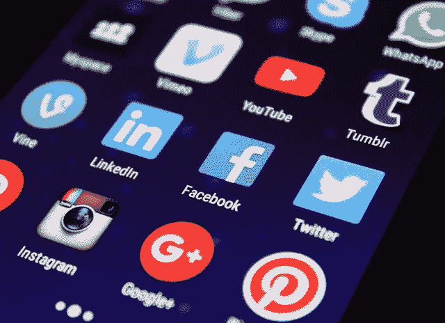

# 你的非营利组织应该退出脸书广告的 3 个理由

> 原文：<https://medium.com/hackernoon/3-reasons-your-nonprofit-should-quit-facebook-ads-7fb9cf806c63>

## **(也可能完全删除 FB)**

Image courtesy of Pixabay

如果你在非营利组织工作，社交媒体很可能会榨干你。如今，社交媒体几乎榨干了所有人。它会消耗你的精力、时间、注意力，对于非营利组织来说，还会消耗你宝贵的财政资源。

正如我的执行董事喜欢说的，“任何非营利组织总是在六个月后被遗忘。”我在这一领域三年的微薄经验与这条格言一致——终点总是在眼前，工作永远不会结束，如果你的组织要生存下去，脸书的每个人都需要知道这一点。至少，这是马克·扎克伯格希望你听到的信息。

尽管过去媒体对脸书的广告描绘得很美好，但不断有消息显示，数字广告的前景已经变得多么黯淡。这里有三个理由让你的脸书广告费花在其他地方会更好。

*   **脸书要求用户的银行分享你所有的个人财务信息**

整个 2018 年，我都在考虑删除我的脸书账户。那里的新闻让人感觉陈旧或虚假，大多数对话都是人们在说他们永远不会亲自说的事情，我很烦恼，因为我沉迷于我无法解释的原因。2016 年的[《剑桥分析》丑闻](https://www.nytimes.com/2018/04/04/us/politics/cambridge-analytica-scandal-fallout.html),我们仍然没有完全理解其范围，让我相信是时候开始考虑删除了，但我仍然不能扣动扳机。2018 年 8 月，当我在《华尔街日报》上看到一个标题[时，这一切都变了:](https://www.wsj.com/articles/facebook-to-banks-give-us-your-data-well-give-you-our-users-1533564049?mod=hp_lead_pos)

# 脸书对银行说:给我们你的数据，我们会给你我们的用户

脸书已要求美国大型银行分享客户的详细财务信息，以提高用户参与度

这篇文章很方便地放在付费墙的后面，继续说脸书在追踪你的账户余额、信用卡交易、银行提醒等。对于我这个个人用户来说，这是最后一根稻草。我立即删除了我的帐户。但这项政策(自 2018 年 8 月以来，主流媒体没有讨论过)对非营利组织有什么影响？贵组织的详细财务信息可能已经掌握在脸书手中了吗？代价是什么？

《华尔街日报》援引了脸书全球企业传播主管、脸书高管伊丽莎白·戴安娜的话，据说是为了消除这些担忧，她说“我们不会将银行或信用卡公司的购买数据用于广告。我们也没有与银行或信用卡公司建立特殊的关系、合作伙伴关系或合同来使用他们客户的购买数据做广告。“但这可能是事实吗？几乎没有。

你的非营利组织应该停止使用 FB 广告的原因二:

*   **无论您是否允许，脸书都会与第三方分享您的个人数据**

在非营利领域，我们依靠客户关系管理(CRM)软件在内部跟上所有来自我们数字门户的捐赠者和志愿者数据。这些数据通过特定的人口统计学定义了我们的组织:性别、年龄、政治倾向、财务状况和偏好的慈善机构。这些信息帮助非营利组织锁定潜在的捐赠者和志愿者，这是脸书的生命线。

如果你曾经在脸书上开展过广告活动，你就会知道所有的目标受众数据都是系统返回最佳结果所必需的。从一个非营利组织的角度来看，你为什么不使用你的 CRM 数据来更好地通知你的脸书广告受众？你需要你的数字广告投资的回报，所以你提供尽可能多的关于你的选民的信息。在数字时代，人们很容易认为这些数据中的大部分已经可以在网上获得，像脸书这样的社交媒体巨头有隐私政策来保护您组织的数据不被共享。但是脸书没有信守诺言。

虽然用户得到保证，所有输入的数据不会在未经同意的情况下与第三方共享，但脸书有着糟糕的欺骗记录。[数据共享丑闻最近在 2018 年 3 月浮出水面](https://www.investopedia.com/ask/answers/120114/how-does-facebook-fb-make-money.asp)，显示脸书不仅与雅虎、亚马逊和微软等科技巨头分享你的个人数据(包括电话号码、电子邮件地址和物理地址等联系信息)，还允许网飞和 Spotify 访问你所有的私人信息*。《纽约时报》[在 12 月对这种公然的政策矛盾进行了简要报道](https://www.nytimes.com/2018/12/18/technology/facebook-privacy.html)。*

*那么，如果你不在乎脸书是在你的组织的银行信息吗？如果你的选民不介意他们的数据在未经他们同意的情况下与第三方公司共享呢？你还是应该退出脸书广告公司。脸书也许正在犯营销史上最大规模的欺诈行为。怎么会？*

*   ***脸书的月活跃用户数增加了 50%以上***

*2018 年第四季度，脸书报告称，其平台看到[23.2 亿月活跃用户(MAUs)](https://www.statista.com/statistics/264810/number-of-monthly-active-facebook-users-worldwide/) 。从广告商的角度来看，在脸书做广告的价值似乎是显而易见的。如果脸书*真的有*23.2 亿独立用户使用他们的平台，*和*他们可以根据他们收集的数据告诉你你需要瞄准哪些人，几乎任何广告价格范围都是合理的。这种普遍的情绪使得脸书如此有价值——如此有价值，以至于该公司在 2017 年带来了 400 亿美元的收入。但是有一个主要问题——脸书实际上并不知道他们有多少账户是假的。*

*今年年初，脸书公开估计 36%的 MAU 账户是假的。单单这个数字就应该是惊人的——脸书根据有 23.2 亿独立用户准备点击定向广告的事实向他们的广告商收费。任何出售 36%假冒产品的实体公司都会被起诉，并立即被遗忘；然而，对于脸书自己承认的欺诈行为，似乎没有多少人感到愤怒。*

*Pivotal Research 的分析师布莱恩·威瑟说:“你可以运用你的判断力。”他去年发现，脸书声称它可能会影响到比人口普查局所说的更多的美国人。"我认为有理由对他们提出的数字表示怀疑。"*

*比这些发现更令人愤慨的是扎克伯格的前哈佛同学艾伦·格林斯潘在一份报告中概述的事实、统计数据和早期对话[，他预测了 2016 年的剑桥分析公司丑闻，并跟踪了脸书的丑闻(通常是非法的)上升到突出地位。格林斯潘认为，脸书的毛计数可能会被合并多达 50%。](https://www.plainsite.org/realitycheck/facebook.html)*

*当我们继续努力保持非营利组织的大门敞开，为我们的选民服务，让世界变得更美好的时候，我们都应该停止给像脸书这样的诈骗犯和骗子捐款。你可以把预算花在更好的事情上，比如改善你的内部数据保护政策。停止为无价值的广告付费，开始主动保护你自己和你的选民。我们不能不这样做。*