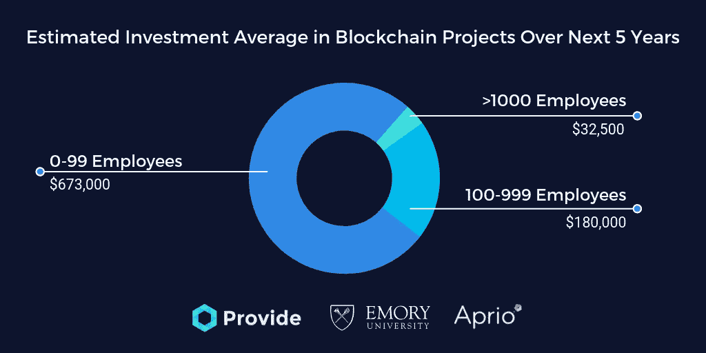
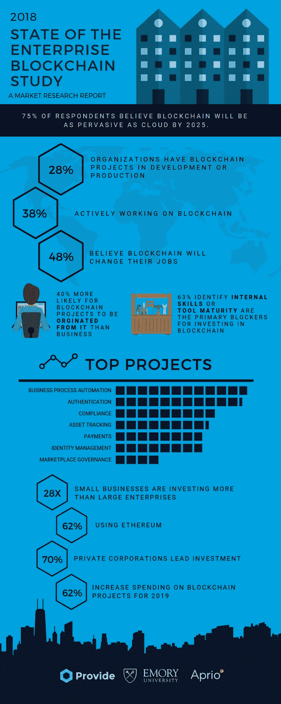

# 解释企业如何采用区块链的 4 个信号

> 原文：<https://medium.com/hackernoon/4-signals-that-explain-how-businesses-are-adopting-blockchain-7204ba901140>

企业区块链研究的新[状态](https://provide.services/state-of-enterprise-blockchain-study-report/)包含一些商业如何采用区块链技术的关键信号。这些信号表明了其进展，但也突出了与企业合作的最佳进展，以及行业在进展的基础上需要完成的工作。

# 1.需要更多的最佳做法。

虽然 75%的受访者认为区块链将在 2025 年成为主流技术，但企业——尤其是大型企业——仍在等待成功的模式，然后才会打开钱包。62%的人认为缺乏工具和内部技能是采用的障碍。50%的人需要使用案例或预构建解决方案的形式的进一步证明，以开发他们的区块链业务案例。

简而言之，对于大规模运营的繁忙 IT 企业来说，区块链仍然太难学，对它的理解也太差，不足以证明项目的合理性。为了改变这种情况，简化与区块链解决方案的交互的工具需要变得更加流行，并且需要出现更多具有公开证明的好处的交钥匙解决方案。

***全面披露:*** *我为 Provide Technologies 工作，其使命是通过* [*平台开发*](https://provide.services) *和类似*[*providepayments.com*](http://providepayments.com/)*的交钥匙解决方案让区块链开发者更有生产力。*

# 2.早期采用者很可能是小型私有组织。

受访者去年在区块链项目上花费了近 900 万美元，其中 82%来自员工少于 99 人的组织。其中 70%的投资来自私有企业。

这是新技术的典型采用模式。较小的公司通常具有更强的风险偏好——更积极地寻找竞争优势以赢得客户或建立新市场。较大的公司会等到具体的模式出现，这些模式可以节省时间、金钱或吸引新客户。然后有了更深的口袋和更大的资源池，大企业就赶上来了。

在平衡正常化之前，这种模式可能会存在几年。未来五年，区块链小公司的预算将继续超过大型企业。

# 3.区块链从它开始。

说到底，区块链是一种技术，所以它指导着今天的大部分采用是有道理的。如果决策明显来自业务或技术团队，那么 it 启动项目的可能性会增加 40%。事实上，它似乎是区块链项目启动的核心。75%的时间，技术团队要么发起业务，要么与业务合作，作为采用区块链的驱动力。

业务团队仍然参与使用区块链的一半以上的决策，但是参与的差距强调了业务主管很难识别(并证明)区块链的业务用例。

或者，也许他们确实在想象他们的市场在去中心化后会是什么样子，而他们正在抵制这种改变。不过，这是一个危险的观点。记住，网飞只花了三年时间就通过拥抱 Web 2.0 让百视达破产了。去中心化是今天正在进行的 Web 3.0 发展的核心，正如我在之前的文章中所描述的，T2 甚至连网飞都不安全。

无论如何，分散化仍然是一个非常技术性的讨论，技术公司和合作伙伴可以通过为技术团队提供成为区块链冠军的工具来更好地服务于未来的项目。

# 4.这是一个多链世界。

毫不奇怪，以太坊引领着企业采用的市场。62%的人将他们的区块链项目基于[以太坊](https://www.ethereum.org/)，这是一个为开发者设计的协议——允许他们使用智能合同将业务逻辑放到链条上。相当多的 42%的人使用比特币网络。

然而，真正令人印象深刻的数字是 78%的受访者表示支持两个或更多连锁店的项目。当然，这些项目中有许多涉及接受加密货币。

然而，合乎逻辑的是，当技术专家制定出最佳实践，软件提供商设计出交钥匙解决方案时，许多连锁店将扎根于利基市场并繁荣发展。类似于公司已经依赖于几个关系数据库来驱动他们业务的方方面面，我们应该期待看到连锁店遵循类似的模式。

# 关于企业区块链研究的现状

该研究抽样调查了从初创企业到大型企业的 82 个组织采用区块链的现状。中等规模的公司雇佣了 250 名员工，而中等规模的公司雇佣了接近 30，000 名员工。该研究始于 2018 年 12 月，以[本报告](https://provide.services/state-of-enterprise-blockchain-study-report/)结束。

[提供技术](https://provide.services/)，[埃默里大学](http://www.emory.edu/home/index.html)和 [Aprio](https://www.aprio.com/) 赞助了企业区块链研究的状态。特别感谢[Benn Konsynski](https://www.linkedin.com/in/benn-konsynski-2a4b001/)博士和 [Jagruti Solanki](https://www.linkedin.com/in/jagruti-solanki-11825810/) 帮助完成这项研究。

Source: [State of the Enterprise Blockchain Study](https://provide.services/state-of-enterprise-blockchain-study-report/)