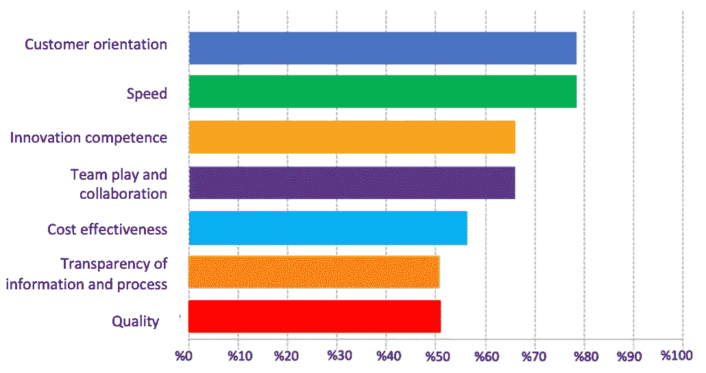

# 敏捷转型中的 5 个关键挫折

> 原文：<https://medium.com/hackernoon/5-critical-setbacks-in-agile-transformation-500d3925e83d>

> 由:专业 Scrum 训练师[买买提·伊曼](https://www.scrum.org/user/98)，【Scrum.org】T2

在过去的几十年里，我们经历了市场动态和经济模式的巨大变化。事实上，我们正在从一个巨型公司为王的世界转向一个客户为王的世界，换句话说，从一个以生产为导向的世界转向一个新的以服务为基础的世界。这种彻底而巨大的变化也影响了公司的结构和经营方式。今天，公司正试图摆脱由等级和官僚统治的庞大的金字塔组织的旧观念，这是 20 世纪的标准。如果我可以打开这一点，我可以说，利用规模经济的功能性组织机构现在被分成许多小的“初创企业”，它们专注于快速的价值生产，彼此独立但能够合作。总之，我们正在抛弃那些看起来像泰坦尼克号的旧组织。相反，我们已经进入了由许多大小船只组成的公司时代，这些船只可以更快、更灵活地移动，史蒂夫丹宁称之为“敏捷时代”。

然而，这并不是一个容易的转变。以至于当我们将旧的业务模型和组织结构与敏捷方法进行比较时，几乎不可能找到两者之间的共同点。因此，这个转变过程是一个充满挑战和容易出错的过程。为了不重复同样的错误，让我们看看我们遇到的 5 个基本挫折和实际的解决方案。

为了成功转型，我们需要首先回答这个问题:“为什么要转型？”。正如我提到的，转型是一个漫长的旅程。您应该清楚地确定您通过转型努力想要实现的目标，以便在这个旅程中不会偏离您的目标。你还应该在公司内部为每个人创造一个理解这个目标的共同点。随着变革之风的兴起，你可能会认为每个人都有共同点，协调可能会被遗漏。

例如，让我告诉你我对一家在欧洲地区服务的全球性公司的大约 20 名高层管理人员所做的一项研究。当我问他们，他们希望在一年之内通过他们正在进行的敏捷转型之旅改进哪“3 个主要”主题时，我得到了以下结果:

正如在这个例子中所看到的，在不同的经理有不同的目标和优先事项的转型研究中，要获得想要的结果并不容易。尤其是如果我们谈论的是一个激进的转型之旅，那就连取得一点进展都非常困难。因此，基于这个例子，上述 7 个方面的改进可以作为最终目标。然而，重要的是，至多处理两三个领域，以逐步实现这一最终目标，并就这一优先事项达成一致。否则，管理层目标的不协调可能会导致公司其他部门更加模糊。

***建立一个指导联盟，开始转型研究，并将其引导至某一点。该联盟应确定转型愿景，领导实现这一愿景的战略步骤，为组织实施转型工作提供指导，并提高所有这些研究的可见度。***

说到指导联盟，我建议你读一读约翰·科特的《我们的冰山正在融化》。

敏捷是一种文化转变，它不仅仅是一套应用于团队层面的实践。这意味着公司的整个工作方式演变成一种全新的形式。这其中的一个重要部分是管理者转变为下一代仆人型领导者的过程，离开他们旧的指挥链理解和实践。在经历敏捷过程的公司中，管理层应该首先开始改变自己的行为，并树立榜样。否则，在采用敏捷实践的团队和那些仍在使用旧实践的团队之间会有严重的紧张关系。随着这种紧张关系的积累，它将严重损害转化，并将使进化过程倒退。

根据 AgileTurkey.org 2018 年在土耳其进行的[研究](https://drive.google.com/file/d/16LGG9BCiQNjVj0FZnN-kDoURL87CLFrU/view) rch，发现敏捷转型的两个最大障碍是转型阻力和文化转型。为了应对这两大挑战，并转变为一家敏捷公司，当前的管理者有很多事情要做。管理者应该从自身开始，从他们的日常行为开始，成为变革的一部分，并且应该通过支持这一过程来指导整个公司。

***专注于管理层面的培训和辅导研究，让您的管理者抛弃陈旧传统的管理习惯，成为下一代敏捷领导者。开始转型研究时，不仅要关注你的团队，还要关注管理层。***

你上一次彻底改变自己是什么时候？这个变化花了多长时间？我问这些问题的人通常会思考一会儿，然后告诉我他们的上一次经历是在几年前。因此，也许对我们中的许多人来说，激进的改变不是我们在生活中习以为常的事情，也不是我们容易完成的事情。个人就是这种情况。想象一下，在一个多年来采用某种立场和习惯，拥有数百或数千名员工的组织中，实现彻底的文化转型需要多长时间。

正如我之前提到的，可能会有这样的情况，管理层没有将自己包括在过程中，并迫使团队尽快变得“敏捷”。然而，这种匆忙只会导致你创建看似“敏捷”的团队，并在中期产生问题。因此，你最终会看到一头大象假装成一只猎豹——就像我在本文开头分享的图片中的那只。此外，大象身上的染料只能经受几次风暴。

因此，首先要承认你开始了一段具有挑战性的漫长旅程，你将采取激进的行动，这需要时间。请记住，在这个复杂的转变过程中，你会犯一些错误，你会从中吸取教训，并不时改变方向。因此，从一开始就对错误持开放态度是件好事。记住，实验是敏捷最重要的价值之一。

***为了中期加速前进，必须从慢起步。在组织中具有战略重要性但相对较小的部分开始转型。根据您在这里的经验，将转型研究扩展到整个组织。***

除了建立我在第一个标题中提到的指导联盟之外，重要的是要确保转变是广泛的，并有广泛的参与到转变努力中来。否则，在一个强有力的指导团队的领导下，像快速开火一样开始的东西，只能是一个有远见的小团体采用的新方法。或者即使可以，也因为没有内化，没有完全吸收，所以对风暴没有抵抗力。要传播火势，必须有强风(我说的是指导联盟)以及不同点地面上的火花。总之，转型必须在两个方向并行进行，而不是自上而下或自下而上。

改变总是痛苦的。之所以会这样，是因为它通常包含很多不确定性，这是很正常的。这些不确定性引发了组织内部的担忧和恐惧。此时，最有效的方法是确保组织内的所有经验都可以公开共享。让您的团队或人员分享他们如何看待这一变化，他们如何经历这一变化，分享他们的良好做法并相互讨论。这种透明度将导致采用和改进。用工具(权威、时间、金钱等)支持他们。)以便他们能够自己解决问题。

让我告诉你我在一家公司的有趣经历。通常，在一家公司内，很难引发知识和经验共享，也很难创建一种社区文化。或者这些分享过程开始是出于善意和建设性的倡议，但不会持续很久。这有几个原因；内容可能不尽如人意，参与人数可能较少，揭示的问题可能没有得到解决。不过，前几个故事可能需要在内容方面得到指导或支持，以树立一个榜样。然而，仍然不可能建立收养关系并确保故事按照自己的意愿继续下去。在这一点上，我们利用“名气”使这些分享平台更具吸引力，从安迪·沃霍尔的话“未来，每个人都将世界闻名 15 分钟”中获得灵感。事实上，我们所做的非常简单；我们发布了有趣的公告交流工具，其中包括将分享某些东西的个人或团队的照片。这种简单的透明引起了公司内部的好奇心，并为许多人说“我也有话要说”铺平了道路。这个分享平台已经持续了三年，现在还在继续。

***创建基于能力和/或以实践为导向的内部社区。对这些社区进行投资，使其具有功能性和可持续性。授权这些社区成为转型的一部分。因此，你可以有一个组织，在那里人们不仅分享一些东西，而且采取行动。***

“敏捷”是一种全新的工作方式。因此，在前进的道路上，你的领导和团队都需要大量的支持。为了获得这种支持，选择对敏捷实践感兴趣并希望成为这一转变旅程的一部分的志愿者和有能力的人。支持他们作为变革推动者的个人发展。这些变革代理，也就是你的内部敏捷教练，将在正确实施敏捷实践，以及随着你的组织的变革加速和扩展，将这种新的工作方式转变为一种永久的文化中扮演关键的角色。

将敏捷蔻驰视为您的加速器，使您的组织能够实现自治并从中获得最大利益；以及使这种新的结构转化为最大限度的员工幸福和商业价值生产。在转变的旅程中，你的旧反射、旧观点和旧方式会多次浮现，这是很正常的。当你遇到困难时，你将非常需要你的敏捷教练的指导，以避免走回头路。

从建立一个小型的敏捷蔻驰社区开始，这个社区由你的组织中有经验和热情的人组成，比如敏捷团队成员、Scrum Master 和产品负责人。在外部专家的支持下培训和指导这个社区。至少他们中的一些人会成为你未来内在转变的成功代理人。

【https://www.scrum.org】最初发表于**。**