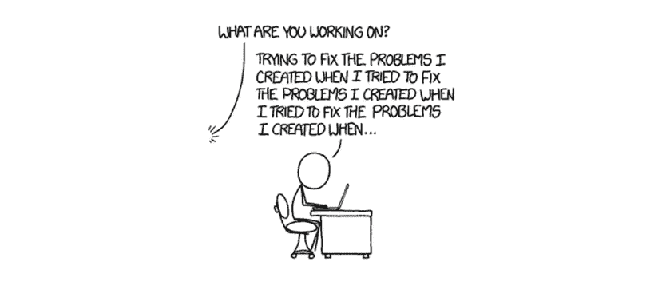
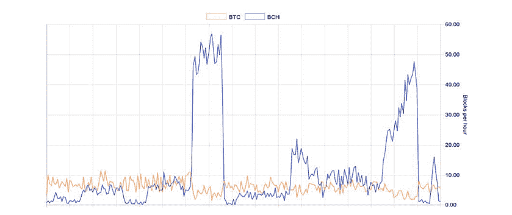
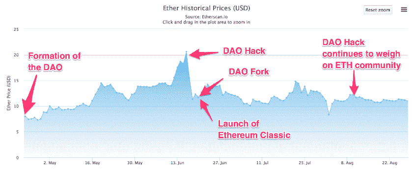

# 加密货币的 5 种亲社区治理模式

> 原文：<https://medium.com/hackernoon/5-pro-community-governance-models-of-cryptocurrencies-3c793324677d>

当你试图理解任何特定加密货币背后的技术时，该项目可能在组织层面上注定失败。治理过程更多的是人的问题，如果没有正式定义，即使从架构的角度来看网络是分散的，它也可以在其决策过程中保持集中。

在本文中，我们将探索保留分散化特征的治理模式，并检查谁在以最有利于社区的方式行事，如[telecon](https://telecoin.info)或 [Tezos](https://tezos.com/) 。

有足够多的坏例子，其中最糟糕的可能是 EOS，它只有[21 个受信任的实体](https://www.coindesk.com/vitalik-called-it-vote-buying-scandal-stokes-fears-of-eos-failure)定期选举维护区块链并因此获得奖励。EOS 似乎是为 block 生产者设计的，以支持其他 block 生产者。很明显，EOS 协议可能有一个不完整的治理方法，对他们的指控是理所应当的，直到他们愿意改变他们的方式。

抛开任何自私的原因，区块链的治理应该尽可能去中心化，以最大化网络对各种攻击的弹性。有时，甚至以牺牲效率和创新为代价。迄今为止，价值超过 20 亿美元的数字资产被盗，你不能指责任何人愿意将安全放在第一位！

# 治理模式有多重要

加密货币世界仍在发展中。即使它是不同的，而且我们支持被定义为一个完全[新的资产类别](https://cointelegraph.com/news/crypto-could-represent-new-asset-class-in-next-decade-says-bitmex-ceo)的提议，但它与股票市场有相似之处，在股票市场中，投资者追索权有明确定义的利益相关者结构。与治理体系目标相同的结构:保护投资者利益，防止流氓高管与公司一起胡作非为。

“在个人层面，真正的货币价值处于危险之中，这反过来又会引起投资者和支付保护方面的担忧，”[公司治理系统研究员 Philipp Hacker 说。](https://www.law.ox.ac.uk/business-law-blog/blog/2017/08/corporate-governance-complex-cryptocurrencies)

加密货币投资者拥有与公司股东相同的权利，因为他们直接受到区块链协议变化的影响。

[https://www.justcryptonews.com/242/game-coins-btc-vs-bch-comparison-charts](https://www.justcryptonews.com/242/game-coins-btc-vs-bch-comparison-charts)

如果变革仅由一组特定的利益相关者决定，那么大多数人可能会成为自身利益的受害者。在比特币的例子中，当比特币的核心团队在改变块大小时表现出抵制时，投资者是以区块链分叉为高潮的[大戏](/@shaggy_ks/how-segwit2x-met-dramatic-suspension-404aedeb5061)的旁观者，因此比特币现金被创造出来。

# [1。比特币](https://bitcoin.org/)

比特币基于[一套规则](/@pierre_rochard/bitcoin-governance-37e86299470f)，其中大部分继承自中本聪最初的设想。随着时间的推移，为了解决其脆弱性，增加了新的规则，同时修改了其他规则。谁做了这些决定？根据它的分散治理模型，任何个人都可以对开发人员或其他用户提出的“改进建议”进行“投票”。但是，为了使用在整个网络中投票的信号机制，您需要运行一个完整的节点。

根据 Satoshi 的理论，为了保持比特币的分散性，每个人都应该运行他/她的完整节点。实际上，只有那些积极挖掘比特币的人才会这么做。拥有比特币的普通人依赖于其他第三方服务，因此权力仍然掌握在矿商手中，更有可能的是，掌握在矿池管理者手中。

[http://www.etoday.ru/2013/04/illyustrator-sebastien-thibaul.php](http://www.etoday.ru/2013/04/illyustrator-sebastien-thibaul.php)

这就是比特币，有好有坏。现在，加密货币中还有其他一些有前途的治理模式吗？其中哪一个最能促进权力下放？

# [2。以太坊](https://www.ethereum.org/)

以太坊，如比特币，是围绕着没有集中控制形式的概念而建立的。然而，它拥有比比特币更先进的治理模式。当然，这是有争议的，但这就是为什么我们相信这是真的。

以太坊的治理是基于一个分散的模型，但它并不指挥区块链的进程。有[指定的开发人员](/blockchainspace/ethereum-governed-by-a-benevolent-dictator-2a2be8aa331a)负责决策流程后必要改进的实施。

在 DAO 黑客事件中，当价值 5500 万美元的以太被盗时，可以通过用最少量的以太进行交易来投票表决所提出的解决方案；0.06–0.08 左右，当时不到 1 美元。这场战斗是在冻结黑客的资金和让这些资金流失之间进行的，以保护区块链的不变性，或者硬切断链条并退还投资者。投资者赢得了投票，“代码就是法律”的规则在那天被打破了。

[https://blog.sfox.com/from-crowdfunded-blockchain-to-ico-machine-an-ethereum-price-history-ddb31c3134c4](https://blog.sfox.com/from-crowdfunded-blockchain-to-ico-machine-an-ethereum-price-history-ddb31c3134c4)

嘴巴不好的人可能会说“有钱人赢了”，尤其是因为投票记录显示参与率很低。但是那天投资者的权利得到了保护。安全漏洞超出了他们的控制范围，他们不应该为此付出代价，尽管有办法为他们弥补。

# [3。电话会议](https://www.telecoin.info/)

TeleCoin 是一个社区项目，旨在构建一种具有主节点功能的以隐私为中心的加密货币。其代码的改进和更新是通过由[去中心化的区块链投票系统](https://www.telecoin.info/wp-content/uploads/2018/11/Telecoin_Whitepaper.pdf)建立的共识来决定的。

说到分散治理模式，还有什么比基于区块链的投票系统更分散的呢？在该投票系统中，社区可以通过直接参与来实施变革和改进。当然，代码是由核心开发人员团队管理的，但实际上，他们是由网络间接拥有的。他们通过履行社区的职责，不断地保持着信任。要成为积极参与者，你只需要用 10，000 TELE 的抵押品获得一个 Masternode。

对于一个注重隐私的硬币来说，这是一个合理的方法。比特币尝试了类似的方法，但在规模和争论之间徘徊。Masternode 的参与确保了所有者有足够的股份来采取有利于网络的行动，以及一种技术解决方案来保证公平参与，而没有所有不必要的要求。

# [4。泰佐斯](https://tezos.com/)

Tezos 有一个正式的治理模型。如果以太坊的团队在 DAO 的案例中选择即兴发挥，Tezos 不同意他们的临时、无计划的模型。据其创始人亚瑟和凯瑟琳·布莱特曼称，“Tezos 是一个可以通过自我升级而进化的区块链。利益攸关方对协议的修正案进行表决，包括对表决程序本身的修正案，以就提案达成社会共识。”

[自我进化的治理模型](https://coinsutra.com/tezos/)可以随着它的需求而进化，而不是一次又一次地通过硬分叉变得支离破碎。通过这种类型的治理，制定变革的规则被编码到《区块链议定书》中。如果开发人员希望提出代码更改，每个节点必须投票决定是接受还是拒绝所提出的更改。

由区块链科技担任裁判的[在线投票系统](https://www.investopedia.com/terms/o/onchain-governance.asp)，再次证明了自己是最好的治理形式。

# [5。莫内罗](https://www.getmonero.org/)

Monero 的管理流程不在链上系统中。作为一种注重隐私的加密货币，识别投票人的公钥不容易泄露，这样的系统可能是困难的。相反，Monero 的目标是通过一个由社区运营的开源平台来实现“主权级审查抵抗”。

这是一个完全没有等级的松散结构，鼓励每个人都加入。不管怎样，Monero 核心团队由七个匿名的个人组成，他们在网络中有明确的职责，包括代表社区作为“论坛资助系统”的可信仲裁者。换句话说，他们用内部规则(费用、升级、变更等)管理代码库。)，分配 Monero 基金，并为项目确定一个总体方向。

他们可能受到了比特币的启发，作为一个匿名个人/团体的创造，比特币做得非常好。虽然你不能 100%信任 Monero 的人，但至少他们不代表一个集中的故障点。

加密货币治理未得到充分重视。去中心化是加密货币运动的定义。不注意协议决策背后的结构会导致不良投资。道投资者幸运地拿回了他们的钱。你不知道那是否会再次发生。保护投资者权利和组织公平的决策流程，同时跟上技术发展带来的快速步伐，是与加密货币协议本身的正确功能同等重要的关键点。