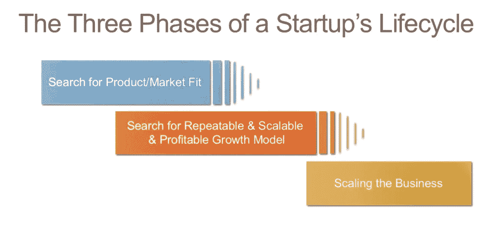

# 找到适合你的产品市场的 5 个步骤

> 原文：<https://medium.com/hackernoon/5-steps-towards-finding-your-product-market-fit-badf7844cf08>

Credit: [For Entrepreneurs](https://www.forentrepreneurs.com/search-for-product-market-fit/)

即使是解决世界饥饿的产品也需要营销。无论你的商业想法有多么宏伟或革命性，如果你对你的产品如何适应、生存和发展没有必要的了解，就很有可能会筋疲力尽。

换句话说，拥有伟大的产品只是创业成功的一部分。有很多重要的研究和理解，这肯定也是一个因素。

产品与市场的匹配是这项研究的一个重要方面。它有助于企业了解市场的健康程度，以及他们的产品或服务将在多大程度上满足市场的需求。

不幸的是，尽管这一要素是必要的，尤其是对于精益创业来说，但它经常不明确。这可能导致企业倒闭，主要有两个原因:

1.  市场还没有为这种产品做好准备
2.  市场不了解产品如何满足他们的需求

为了确保你不会陷入这些初创企业的毁灭性陷阱，这里有 5 个步骤来定义你的产品市场适合度，并更深入地了解如何扩大和营销你的产品。

# 第一步:了解你的目标受众

你的第一步是了解你的目标受众。谁是将从该产品中获益最多并容易被诱惑购买该产品的人？你心中可能已经有了一种类型的客户。然而，这个想法并不总是与现实一致，至少不完全一致。你方产品的市场可能与预期完全不同。或者，它可能比你想象的要大，这意味着有更多的潜在买家需要学习和了解。

有几种不同的方法可以确定你的目标受众:

●看你现有的客户；他们代表什么类型的市场？

●研究你的竞争对手和他们的目标受众

●就你的产品对消费者进行市场调查(调查、一对一访谈)

●纯粹的猜测和假设，然后在市场上检验这一理论

如果你没有马上确定你的目标受众也没关系。它可以在后面的步骤中进行调整，特别是当你对竞争格局有了更准确的见解时。

# 第二步:认识到未满足的客户需求

一旦你确定了目标受众(或者至少形成了一个假设)，你就可以开始考虑他们的需求以及你的产品如何满足他们。当你能提供满足未满足需求的产品或服务时，你就拥有了一个充满活力的市场机会。

所有产品都将面临市场竞争。这种竞争的程度将影响发现未得到充分满足的客户需求的难度。你的目标受众最终会根据竞争对手带来的东西来比较和评判你的产品。

识别市场上这些未满足需求的最佳方式是询问。与目标受众中的个人接触，询问他们对类似产品的痛点或不满之处。行业中的其他产品或公司在满足客户需求方面表现如何？有哪些可以改进的地方？

这些对话一定会产生一些关于你的产品如何提供市场所需的必要价值的最佳见解。请记住，有些情况下，客户对他们现有的解决方案也很满意，所以不会考虑你的解决方案。或者，对于您的解决方案带来的价值，市场可能还不够成熟。

# 第三步:开发价值主张

现在，您已经更清楚地了解了市场中缺少什么，您可以开始制定策略，如何比替代解决方案更好地满足这些客户需求。根据您所在的独特领域或行业的竞争情况，您的目标客户可能有多种需求，这些需求可以融入您的价值主张中。

这是产品市场匹配的本质:找到你的公司可以填补的空白。这保证了你的产品在市场上占有一席之地，吸引客户的注意。您将能够在竞争中脱颖而出，获得企业生存和发展所需的重要市场份额。

也就是说，您应该只关注可管理数量的价值主张。你所在的行业可能有很多缺口，但是试图一下子填补这些缺口会让你无法满足这些需求。

这是一句古老的格言，“任何值得做的事情都值得做好。”在一天结束时，如果你完全满足一个需求，而不是满足三四个不同价值主张的期望，你的客户会更满意。

对于需要迅速树立声誉的精益创业公司来说，尤其如此。因为一件事做得特别好而出名，顾客就会来了。 [Wavdev](https://waydev.co/) 声称他们是“真正理解你的开发者的新方法”，从而脱颖而出。 [Pocket Points](https://pocketpoints.com/) 脱颖而出，声称你可以“在课堂上和开车时提供无手机时间并获得奖励”。随着业务的增长，您可以扩大规模来利用这些差距。

# 步骤 4:创建和管理买家角色

一旦你有了一个充分发展的价值主张，你也就获得了一个市场现成的产品。所以，是时候把它带给买家了。这意味着从第一步开始重新调整你的目标受众，再次确认这仍然是你的产品(和新认识到的价值主张)的正确市场，然后开始学习如何有效地向这些人推销。

你的产品很有可能有多种不同类型的买家、行业或用途。因此，你必须为这些不同类型的客户创建不同的买家角色，因为他们可能需要不同的营销方法。不能保证对一个买家角色有效的方法对其他受众群体也有效。

与您的价值主张类似，确定一个狭窄的焦点对于创建和管理您的买家角色也是至关重要的。是的，你的产品可能会吸引很多不同的行业，有不同的用途，但试图一次卖给所有人可能会非常困难，尤其是对于资源有限的初创公司。

而是非常深入到一个单一的垂直；成为该领域的主流产品。一旦你在一个行业或买家角色中建立了声誉，你就可以更容易地转移到其他领域。你不仅会有口碑为你工作，但你也将有一个记录在案的，成功的销售和营销过程，你可以迅速适应新的领域。

# 第五步:测试，测试，测试

你的产品与市场的契合度总是在变化，因为市场仍在变化:客户行为、需求和态度的转变，新产品进入该领域，竞争加剧和缩小，等等。为了确保你总是能够适应环境的这些变化，你需要认识到你的产品与市场的匹配是动态的，而不是静态的。

有许多不同的组件组成了产品市场组合，它们都可以被测试和改进。尝试各种价格点或营销/销售策略，甚至转移到新的目标受众，都可能有益于(或有害于)您的业务。但是，你永远不知道，直到你做一些安全测试。

持续与客户保持联系也很重要。当涉及到加强你的产品与市场的契合度和定义你的价值主张时，它们无疑是你最大的资产。

为了测试你的市场产品适合度，你需要有正确的衡量标准。这为你的成功或失败提供了量化的数据。数据，如客户流失率、转换率或销售周期信息，可以帮助您用准确的、基于数据的见解来取代对产品市场适合度的猜测。

因此，你应该不断地跟踪、测试和衡量你的产品与市场匹配的成功，同时探索新的可能性来加以利用。

# 结论

你的产品市场策略有很多变动的部分，这意味着如果你不小心的话，很多事情都会出错。遵循这些步骤并不断努力改进您的产品以适应当前的市场需求和态度，将会带来更大的成功。

当你继续测试和改进你的产品与市场的契合度时，你可能会发现自己一遍又一遍地重复这些步骤。这是正常的，有助于加深你对未来如何创造更好的产品市场契合度的理解。

也就是说，有时候你的产品并不适合市场。这可能很难接受，但你越早发现产品与市场不匹配的早期预警信号，离开那个领域，转向其他有利可图的投资，损失就越小。

希望这五个步骤能让你和你的企业找到并利用市场中的战略缺口。