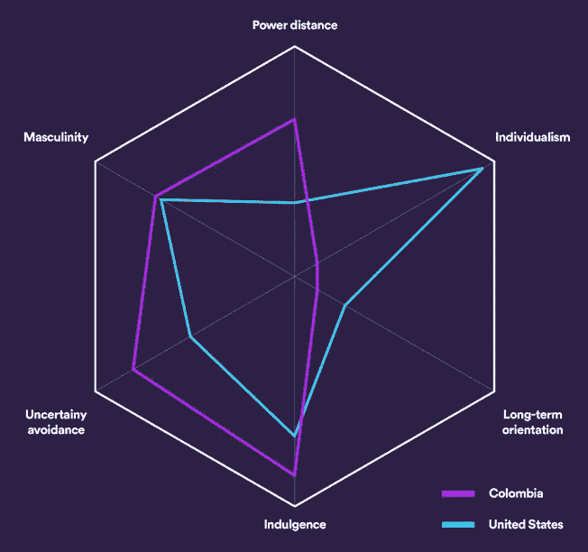
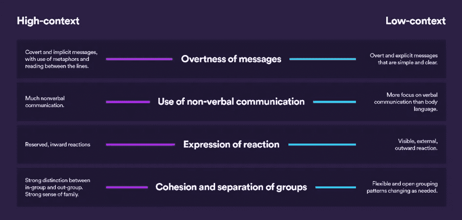

# 软件开发外包中有效跨文化交流的 5 个技巧

> 原文：<https://medium.com/hackernoon/5-tips-for-effective-intercultural-communications-in-software-development-outsourcing-ff59debcb252>

## 尽管技术进步使得软件开发外包比以往任何时候都更加有效和容易，但要取得成功，人的因素仍然是最需要关注的。

O 对于寻求构建尖端技术和推出最先进的应用程序和平台的公司来说，外包软件开发从未如此简单。

事实上，在大公司中，[IT 预算中分配给外包的平均百分比在 2018 年](https://www.computereconomics.com/page.cfm?name=Outsourcing)有所上升。虽然更先进的技术、云能力和协作工具继续发展，使跨国软件开发变得可行，但人为因素可能仍然是外包业务面临的最大挑战。

[PSL](https://www.pslcorp.com/) ，拉丁美洲领先的软件开发外包公司，与北美客户合作超过 15 年。这些经历让我们熟悉了在不同文化中工作时出现的许多沟通和交互的细微差别，并收集了克服文化障碍和确保外包软件开发项目中顺利沟通的技巧。

# 理解文化差异

认为有效的跨文化交流可以归结为电子邮件或通过视频电话的日常会议是不明智的。当一个失败的交互导致另一个失败时，面临完全阻塞的沟通渠道或破裂的管道的团队通常很少了解误解最初是从哪里开始的。

尽管没有完全意识到，跨文化团队在从等级制度到个性和长期定位的各个领域都形成了鲜明的对比。根据他们在这些方面的相似或不同程度，沟通可能是顺畅的，也可能是紧张的，这会直接影响团队之间的信任。

例如，根据 Hofstede 的 6-D 模型，当比较哥伦比亚和美国的文化价值观时，我们可以看到两种文化在一些方面非常相似，但在一些方面却截然不同。

Hofstede 的洞见《哥伦比亚和美国的民族文化比较》改编自 [Hofstede 的国家比较工具](https://www.hofstede-insights.com/product/compare-countries/)。

虽然在男子气概和放纵方面相似，但哥伦比亚和美国在个性方面有很大的差异。这意味着对于哥伦比亚人来说，属于一个紧密团结的圈子很重要，而美国人更喜欢个性。

然而，尽管 Hofstede 等框架可能有助于了解特定国家的特征，但在更个人或公司层面持有的价值观可能会有所不同。为了理解在特定的外包活动中沟通会受到怎样的影响，你可能需要更仔细地看看组织的价值观。

领导者可以采取某些步骤来确保与外包开发团队的成功协作，方法是记住以下提示。

# 1.研究你的外包团队的文化差异

当创造一个高度复杂的、基于知识的产品时，人的因素至少是挑战的一半。内部团队和部署团队之间的价值观、习惯和沟通风格的差异无疑会影响动态和交互。

> 内部团队和部署团队在价值观、习惯和沟通风格上的差异无疑会影响动态和互动。

因此，对这些文化方面的了解和敏感对于实现有效的跨文化协调是至关重要的。通过了解已部署团队的文化背景，您将能够**预测和减轻风险，以及更好地计划发挥他们的优势**。

除了 Hofstede 的模型，Edward T. Hall 的[文化因素理论](http://changingminds.org/explanations/culture/hall_culture.htm)可以为高低语境文化的交流风格提供一些见解，如下所示。

霍尔用“信息的公开性”、“非语言交流的使用”、“反应的表达”和“群体的凝聚和分离”来解释文化因素改编自 changingminds.org 大学 Edward T. Hall 的跨文化因素理论。

例如，在一个高度语境化的文化中，等级和协议被高度重视，交流通常会采取演绎的路线，并在到达某一点之前包括非常宽泛或详细的解释。在低语境文化中，简洁和直接的交流更有价值，这可能会令人沮丧甚至粗鲁。

在这些情况下，领导者可以充当高上下文部署团队和内部团队之间的桥梁。他们还可能试图使供应商对与层级结构相关的问题敏感，以促进团队中每个人的参与，甚至是初级专业人员。

最重要的是，领导者必须做足功课，找出是什么让他们的外包团队的文化独一无二。

# 2.找到一种对两个团队都有效的沟通方式

实现有效外包合作的下一步是了解对方的沟通风格。

即使在内部团队中，沟通也是困难的，至少可以说，在软件开发中，沟通不畅的代价是巨大的。像**手势或某种说话方式这样的事情会影响一个团队对另一个团队的看法**，这可能支持也可能阻碍合作。因此，像电子邮件中的问候或对截止日期的误解这样的小事会导致尴尬或不适。

美国公司可能会发现与高语境文化的沟通很尴尬，因为高语境文化的本质是保守和不表达的。对于美国团队来说，这种保留可能会让他们觉得他们部署的团队没有完全参与到项目中，只是对所有事情做出肯定的回应。

在这种情况下，建立一套基本规则和动态，让团队中的每一个成员——无论是部署的还是内部的——都可以而且应该畅所欲言，提出问题，并参与健康的辩论，从而确保共同做出决策。

双方都可以利用团队中每个人的经验、知识和技能。

# 3.努力发展牢固的关系

最终，只有当客户和外包软件团队之间的关系建立在信任的基础上时，良好的协作才能实现。在软件开发中，当一方相信另一方的能力、知识，并且相信他们会做道德上正确的事情时，信任就表达出来了。

团队建立更强纽带的一个方法是鼓励他们**建立融洽关系并相互了解**。

这可以通过面对面的访问来支持，让团队成员面对面地交流，更好地相互了解。

在 PSL，客户经常拜访他们的外包团队，或者让一些团队成员到现场拜访他们，进行面对面的合作，从一开始就建立起牢固的关系。

# 4.就流程和方法达成一致

对于软件开发，通过建立外包和内部团队都同意的方法或过程集，可以很容易地避免误解。

分享做事的方式让每个人都在同一页上，为目标和期望建立路线图，并制定一些基本规则。[尤其是敏捷开发](https://www.cs.vu.nl/~hans/publications/y2012/ICGSE2012-RUPtoScrum/Agile%20and%20GSD/Kussmaul2004.pdf)，已经证明通过透明和频繁的进度报告有助于建立信心。

敏捷是团队建立一些共同点的良好起点，但是**公司首先了解他们部署的团队的文化**并利用这些信息更好地管理他们的团队是至关重要的。

例如，具有非常高的不确定性回避指数的文化(像一些东欧国家)可能期望客户比他们想要的更快地做出决定。他们也可能不想中途转动产品，以便在参与时感到舒适。

尽管这可能与敏捷冲突，具有高跨文化智能(ICI)的领导者可以找到适应这些文化微妙之处的方法，并且仍然可以从他们的敏捷过程和团队中获得最大收益。

在方法上达成一致很重要，这样就不会出现混乱或不满意的结果。

# 5.调整对工作量和团队动态的预期

尽管由于强烈的集体主义意识，一些文化可能会接受加班，正如霍夫斯泰德的模型所解释的那样，外包应该是持久的。这意味着要像对待内部员工一样尊重你的外包团队。

因此，**重视外包团队的健康和福利，尊重他们的宗教和国家节日**，从长远来看，将会带来更高的生产力。

全面的规划考虑到发布时间表、产品复杂性和功能性、团队规模和能力，并考虑到任何可能出现的挑战必须放在首位。

与其指望一个部署好的团队经常开夜车，不如从一开始就考虑员工将用于特殊节日、假期和宗教活动的时间，并据此制定计划。

所有这些因素都是为了确保发布日期的实现和团队目标的实现。

# 以开放的心态前进

总的来说，确保外包软件开发团队与他们在岸的同行享有良好沟通的步骤需要**基于同情和尊重**。

与其关注差异，不如根据团队的文化价值观找到激励团队的方法，以鼓励个人和团队的表现。

之后，组建一个高性能的软件开发团队需要双方明确他们的政策、期望和价值观，并就能够实现顺利开发实践的过程达成一致。

实现在岸团队和外包团队之间的无缝协作可能需要一些时间，但是在生产力、创造力和动力方面的回报是值得等待的。

[*本文原载于 2019 年 3 月 6 日的 Clutch 上，作者 Camilo Gomez。*](https://clutch.co/developers/resources/tips-for-effective-intercultural-communication-software-development-outsourcing)