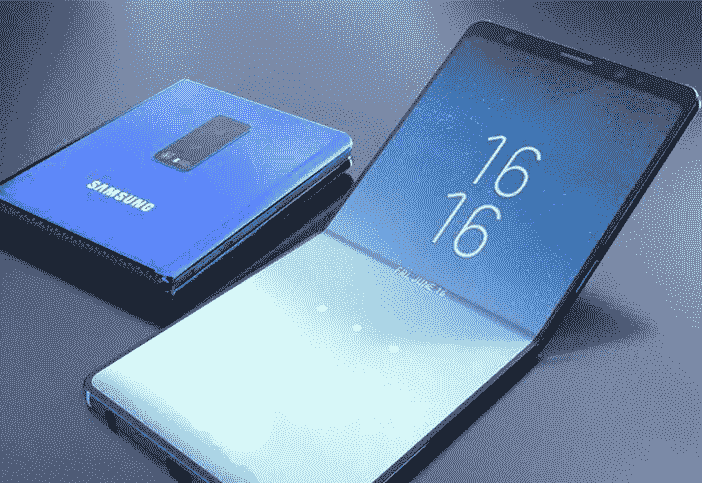
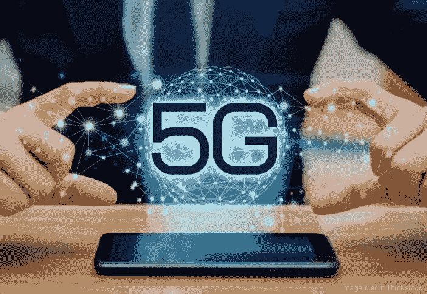
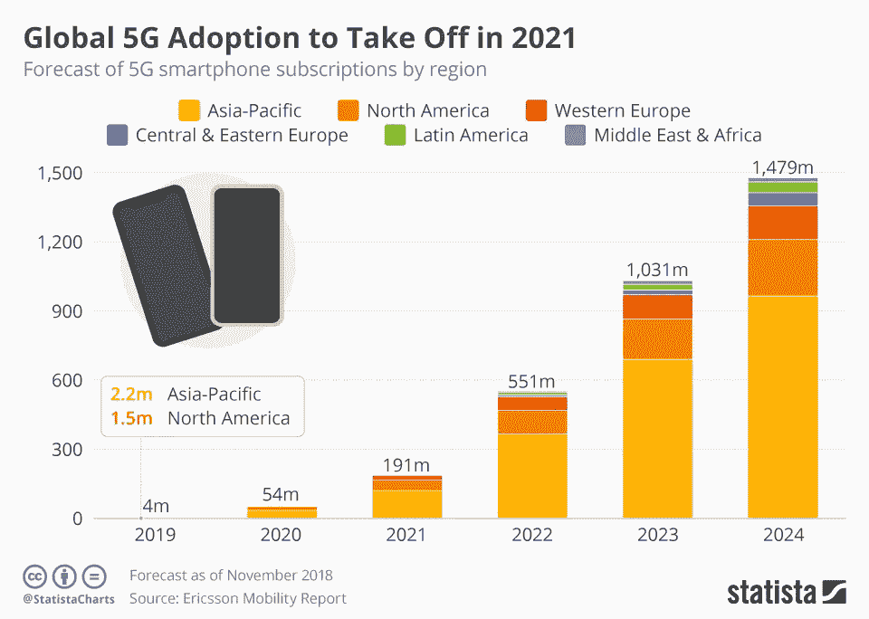
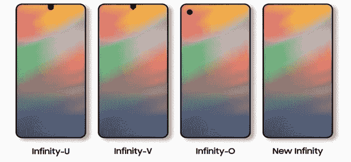
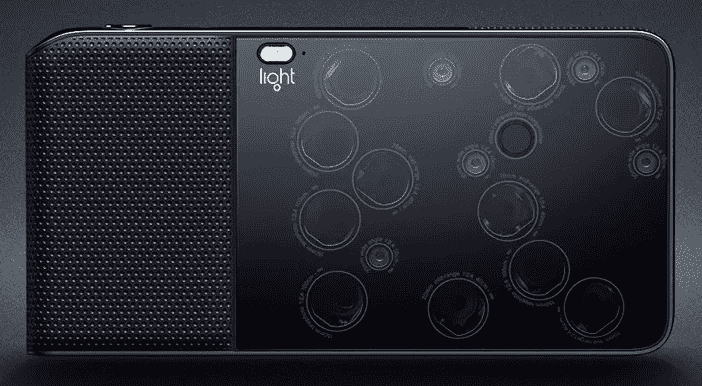
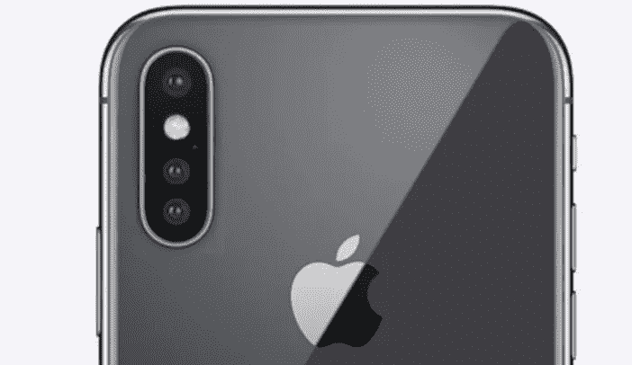
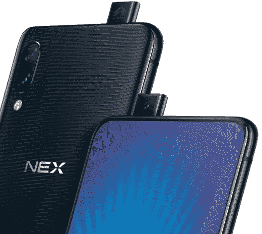

# 2019 年值得关注的 6 大智能手机趋势

> 原文：<https://medium.com/hackernoon/6-interesting-smartphone-trends-to-look-out-for-in-2019-2aa7865b3039>

2018 年是智能手机惊人的一年。我们看到今年出现了许多新的技术进步。人工智能、增强现实、三摄像头设置、无边框显示屏(各种凹口)、显示屏内指纹扫描仪和无线充电等功能，是我们在 2018 年大多数智能手机上看到的一些常见技术趋势。但是，现在我们已经快过完 2018 年了，那么 2019 年的智能手机会给我们带来什么呢？年复一年，我们看到许多技术进步，尤其是在智能手机市场。

如果谣言工厂是可信的，那么在即将到来的智能手机**方面，明年会有很多东西。智能手机制造商明年都将凭借更好的创新占据领先地位。事不宜迟，以下是我们挑选的 2019 年智能手机值得关注的 6 大有趣趋势。看一看！**

# **可折叠智能手机**

****

***Foldable Smartphones making their debut***

**多年来，我们一直在听人们谈论可折叠智能手机的发布。围绕可折叠智能手机的讨论始于三星透露它正在开发一款可以弯曲或折叠的智能手机。我们预计三星将在 2018 年推出他们的可折叠智能手机。然而，这并没有发生。但是，现在三星透露，它最终将在 2019 年初推出可折叠智能手机。除了三星之外，许多其他 [OEM 也在研发将于明年首次亮相的可折叠智能手机](https://www.tomsguide.com/us/foldable-phones-release-date,news-28705.html)。我们将看到华为、LG、摩托罗拉、苹果、Royole 和中兴等公司的可折叠设备。**

**即将到来的 CES(消费电子展)2019 将见证相当多的可折叠智能手机进入智能手机市场。可以肯定地说，这些设备将会非常昂贵。有了可折叠智能手机，便携性和多任务处理将变得容易。此外，与所有的 [**双摄像头手机**](https://www.pricekart.com/mobile/dual-camera-mobiles-price-list) 或三摄像头手机不同，这些设备将只需要一个出色的摄像头。**

# **5G 智能手机(7+5)**

****

***5G smartphones***

**最近几年，我们一直在使用 [**4G VoLTE 手机**](https://www.pricekart.com/mobile/4g-volte-mobiles-price-list) 。毫无疑问，4G 是迄今为止我们用过的最快、最好的网络。然而，从明年开始，情况会变得更好。2019 年，我们将最终看到 5G 智能手机。即将到来的 5G 网络将使你的智能手机速度更快。然而，尽管 5G 智能手机将于明年亮相，但 statista 的一份[报告显示，该技术要到 2021 年或 2022 年才会起飞。](https://www.statista.com/chart/9604/5g-subscription-forecast/)**

****

***A graph shown by Statista on the trend for 5G smartphones***

**除了 5G 网络，明年的智能手机将采用 7 纳米处理器。这些芯片组将非常强大。苹果和华为已经在其最新的智能手机上推出了这些 7 纳米芯片组。这些强大的处理器与 5G 相结合，将智能手机体验提升到一个全新的水平。明年有望在 5G 网络上工作的智能手机包括三星 Galaxy S10、一加 7/7T、华为 P30、Oppo 5G、Honor 5G 和小米 Mix 3。**

## **缺口的演变**

****

***Evolution of the notch***

**我们都一直在等待看到一款真正的无边框显示屏智能手机。在显示屏上增加一个凹槽是增加屏幕尺寸的一个步骤。在即将到来的这一年，我们将会看到 notch 的进一步发展。三星正在开发不同级别的智能手机，分别名为 Infinity-U、Infinity-O、Infinity-V 和新的 Infinity 显示屏。这些凹槽将为智能手机提供更多的屏幕空间。以下是对这些缺口的描述:**

*   **Infinity-U: 形状为 U 形，这个凹槽看起来很像最近大多数最新智能手机上看到的水滴凹槽。这个缺口最有可能在中档智能手机上看到。**
*   ****Infinity V:** 形状为 V 型，这个凹口与 Infinity-U 凹口差别不大。即使是这个级别也很有可能出现在中端智能手机上。**
*   ****Infinity-O:** 形状为 O 型，这个缺口与其他两个即将出现的缺口不同。这个槽口不是放在顶部，而是放在侧面。此外，这个缺口肯定会提供更多的屏幕空间。**
*   ****新款 Infinity:** 新款 Infinity 将提供真正的无边框显示体验。三星 Galaxy S10 可能是第一款采用新 Infinity 显示屏的智能手机。**

# **越来越多的摄像机**

****

***Increased number of cameras on smartphones***

**今年，我们已经看到手机上的摄像头传感器数量在增加。2019 年，这个数字只会上升。我们不仅会看到双摄像头或三摄像头模块，还可能会在智能手机上看到多达五个或九个摄像头。诺基亚正在开发一款 5 摄像头的智能手机，另一方面，Light 正在开发一款 9 摄像头的智能手机。这两款智能手机预计将于明年推出。事实上，像三星和苹果这样迄今为止一直坚持单摄像头或双摄像头设置的公司也将在 2019 年开发具有三摄像头设置 的 [**智能手机。明年，各家公司肯定会竞相在智能手机上增加最大数量的摄像头。**](https://www.pricekart.com/mobile/triple-camera-mobiles-price-list)**

# **3D 映射 AR 三摄像头设置**

****

***3D-sensing AR camera on upcoming iPhones***

**因此，有很多传言称三星和苹果将在明年推出三摄像头智能手机。然而，第三个摄像头可能是用于 AR 和手势识别的 3D 感应镜头。到目前为止，智能手机上的三摄像头设置是这样工作的:**

****

**但是，在三摄像头设置中，情况有望发生变化。第三个传感器将用作 3D 传感相机，用于增强现实和手势导航。3D 感应相机将允许用户在不拿着虚拟物体的情况下扫描它们。这是 2019 年智能手机的最大趋势之一。**

# **滑动摄像头模块**

****

***Sliding or pop-up camera modules***

**当 Vivo NEX 和 Oppo Find X 首次亮相时，我们已经看到了滑动和弹出相机模型。这些是目前寻求真正无边框体验的用户的最佳选择。2019 年，越来越多的智能手机将采用这一概念。上滑或弹出相机—打开相机应用程序时向上滑动。隐藏了前置摄像头，就有了其他功能的空间。此外，这些手机看起来很美观。看到这些弹出式摄像头的好处，可以肯定的是，2019 年的智能手机将会配备这样的摄像头模块。**