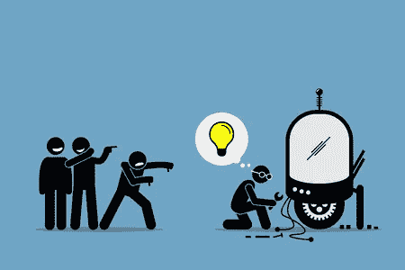

# 有抱负的开发人员可以从 J.D .塞林格那里学到的 6 课

> 原文：<https://medium.com/hackernoon/6-lessons-self-taught-developers-can-learn-from-j-d-salinger-da4f739aa0d3>

Tattoo The Catcher in The Rye by [Thomas Gibsonx](https://www.redbubble.com/people/thomasgibsonx?ref=artist_title_name)

在我十几岁的时候，小说《麦田里的守望者》是学生中最有名的小说。

这在我们学校是一种炒作，在大多数学校是被禁止的。

我仍然记得当我通过我的一个朋友收到这本书时的激动心情。我有一周的时间来阅读整本书，因为它是共享的，而且拷贝很少。

快进到 2019 年，当我看电影《麦田里的反叛》时，我意识到了一些关于 J.D .塞林格生活的非凡因素，这些因素可以提高你作为自学成才的开发人员的生产率。

任何踏上开发之旅的人都可以从 J.D. Salinger 当年所做的事情中受益。

关于 J.D .塞林格的生活，有一些非凡的因素可以提高你作为一名有抱负的开发人员的生产力。

他一生只出版了一部小说，1951 年的《麦田里的守望者》，但这是一部多么精彩的小说啊。

以下是来自 [BuzzFeed](https://www.buzzfeed.com/danieldalton/people-are-always-ruining-things-for-you) 的关于[麦田里的守望者](https://amzn.to/2RDLfpH)的一些有趣事实:

> ——《麦田里的守望者》自 1951 年首次出版以来，已售出 6500 多万册。
> 
> -每年大约售出 25 万本[书](https://amzn.to/2RDLfpH)，几乎每天 685 本。

# **1。沉浸感是关键**

Photo by Fancycrave on [unsplash](https://unsplash.com/photos/W1FheOplgck)

第二次世界大战期间，J.D .塞林格创作了《麦田里的守望者》。他过去常常写作，甚至在危险的情况下，士兵们不得不呆在洞里几天，但正如他几次提到的那样，对自己性格的思考是他保持动力并在写作中取得进步的原因。

他曾经说过:

> “如果不是这本书，我可能已经死了。”

记住当你第一次开始学习编码时，你的第一个动机是什么？是为了改善你的职业前景吗？一个应用创意？解决一个烦人问题的无情感觉？

不管它是什么，想想它，会让你走上正轨，并帮助你毫不费力地完全沉浸在编程中。

# **2。接受拒绝**

Photo by Dmitry Ratushny on [unsplash](https://unsplash.com/photos/O33IVNPb0RI)

在电影《麦田里的反叛》(T21)中有一个场景，J.D .塞林格的教授告诉他:

> “你必须接受你可能永远不会出版…
> 
> 你能一辈子都这样吗？"

人们有如此多的理由去学习编码，事实上，这些动机和想要成为作家的人相似。

如果你是为了做一个价值 10 亿美元的应用程序或马上创建一个独角兽初创企业，你不会持续很久。

但是如果你有建造东西的诀窍，并且想用你的创造力来解决问题，你就在正确的轨道上。

# **3。总会有反对者**

> “如果你因为听了你妈妈、你爸爸、你老师、你牧师或电视上某个家伙告诉你该怎么做而结束了无聊悲惨的生活，那你活该。”
> ― **弗兰克·扎帕**

会有人跟你说你没天赋，你该放弃。

那些批评你而不是为你加油的人。他们会说“你疯了吗？这永远行不通。你不是做程序员的料。”

J.D .塞林格的父亲希望他继续他们的家族事业，他总是质疑自己对写作的热情。

你的生活中甚至脑子里可能都有类似的人(负面想法)。我们头脑中都有负面的声音。

我记得我在 StackOverflow 上收到的所有来自刻薄程序员的新手问题的反对票。有时这让我感觉很糟糕，但我通过思考他们是多么容易忘记他们自己曾经是一个新手来度过它。

他们现在解决这个问题真的很好。

我也从一些积极的程序员那里得到了巨大的帮助，但总的来说，如果你自己在学习一些东西，你必须从那些巨魔那里得到这些东西，但你必须学会克服他们不专业的行为。

在一天结束的时候，唯一能帮助你的人是你自己，所以一定要增强你的内在精神。

# **4。移除干扰**

Photo by Mohamed Nohassi on [unsplash](https://unsplash.com/photos/odxB5oIG_iA)

在 J.D .塞林格的案例中，是人。

对你来说，可能是社交媒体或网飞这样的现代娱乐。

使用某些工具来管理你对社交媒体的使用。这篇[文章](/swlh/become-10x-more-productive-kill-your-distractions-and-improve-your-focus-ddfa6c7397c8)将帮助你做到这一点。

在他的书《深度工作》中，卡尔·纽波特提到了消除干扰将如何帮助你获得令人难以置信的结果。

以下是他的书中的一些摘录:

> 当马克·吐温在纽约采石场农场的一个棚子里写《汤姆·索亚历险记》时，他正在那里度过夏天。马克·吐温的书房与主屋隔绝，以至于他的家人习惯于在吃饭时吹喇叭来吸引他的注意力。
> 
> 众所周知，微软首席执行官比尔·盖茨每年举办两次“思考周”,在此期间，他将自己隔离起来(通常在湖边小屋),除了阅读和思考大问题，什么也不做

# **5。寻求支持(我们都需要导师)**

Photo by Neil Thomas on [unsplash](https://unsplash.com/photos/SIU1Glk6v5k)

当你情绪低落时，找一个能支持你的导师或一群人。

就 J.D .塞林格而言，他的母亲和教授(惠特·伯内特)指导并激励他追求自己的写作热情。事实上，是[的惠特·伯内特](https://en.wikipedia.org/wiki/Whit_Burnett)启发他以霍尔顿·考尔菲德这个角色为基础写了一部小说。

对于新程序员来说，这种支持可以来自在线论坛，如 [/r/learnprogramming](https://www.reddit.com/r/learnprogramming/) 或 [freecodecamp](https://www.freecodecamp.org/forum/) 。

你不会相信在这些论坛上人们有多支持你。

# **6。冥想**

Photo by Hans-Flöckinger on [unsplash](https://unsplash.com/photos/t1XLQvDqt_4)

当 J.D .塞林格从战场上回来时，他正遭受着创伤后应激障碍的折磨。他一天几次回想起战争，这导致他最初感到恐惧、愤怒和困惑。

这也是他经历文思枯竭的时候。

对他来说，这是一个改变一生的事件，有一次他看到公园里有一群人在冥想。那次邂逅之后，他熟悉了冥想，并将其融入自己的生活。

冥想帮助他克服了 PTSD 症状，极大地提高了他的写作水平。

学习编码可能是一条艰难而孤独的道路。你可能会感到精疲力竭，每天都在努力跟上学习进度。

你可能感到疲倦和沮丧，或者再也不想看编程了。

尝试每天冥想 30 分钟。这将对你的生产力产生巨大的影响。

根据我自己的经验，散步是最好的冥想。

Photo by Hello I’m Nik on [unsplash](https://unsplash.com/photos/z1d-LP8sjuI)

> “这是你的路，只有你一个人的路。别人可能陪你走，但没人能替你走。”**——**[**鲁米**](https://en.wikipedia.org/wiki/Rumi)