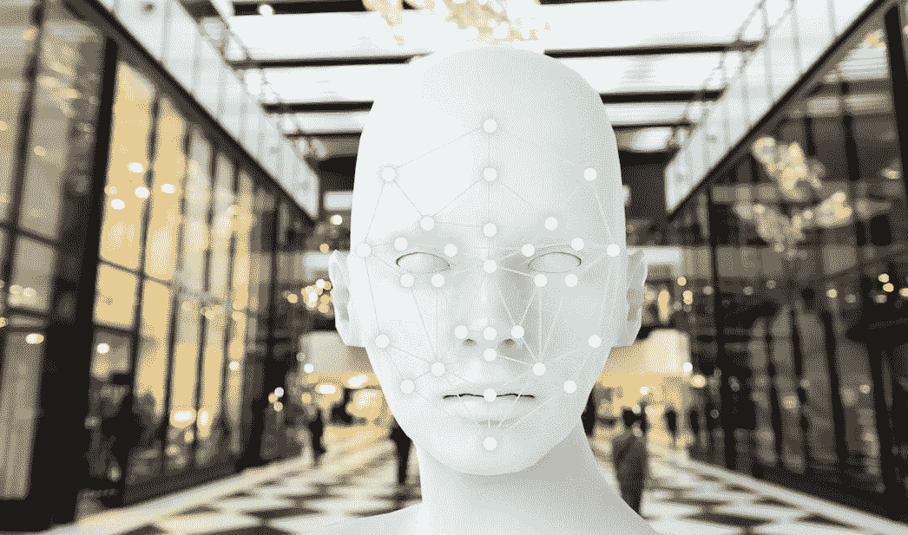
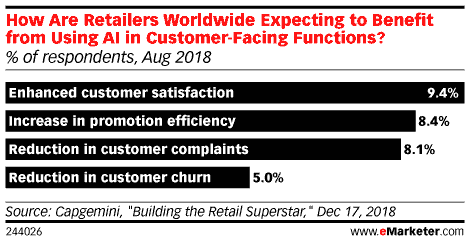

# 人工智能在零售业的 6 个真实应用

> 原文：<https://medium.com/hackernoon/6-real-world-applications-of-ai-in-retail-c50736028efd>

随着世界走向数字时代，传统零售商面临着来自亚马逊和沃尔玛等巨头的生存威胁。为了创造公平的竞争环境，随着购物者采取多渠道方式进行购物，线下零售商也开始转向人工智能。从通过视觉搜索帮助客户找到商品，到通过聊天机器人个性化他们的娱乐体验，人工智能正在以多种方式变革零售业。像星巴克和劳氏这样的主要零售商使用[人工智能来改善客户体验](https://www.indigo9digital.com/blog/2018/4/9/scy56197gztjv1pfr8y1qa6vqroiwt)。

公司在人工智能上投入了大量资金，以保持领先地位。事实上，到 2022 年，全球零售商每年在人工智能上的支出将达到[73 亿英镑。这项技术在零售业中最受欢迎的应用是搜索、内容推荐引擎和数据科学。像贝宝这样的公司正在使用](https://www.retaildive.com/news/retail-spending-on-ai-to-reach-73b-by-2022/516170/)[人工智能来发现欺诈性收费](https://www.americanbanker.com/news/how-paypal-is-taking-a-chance-on-ai-to-fight-fraud)。为此，它使用了一个用开源工具构建的本土人工智能引擎。在人工智能的帮助下，还可以完成更多的事情。

emarketer.com

# 为什么 AI 在零售领域？

根据凯捷对 400 名零售业高管的调查，到 2022 年，人工智能可以通过提高多个流程和运营的效率，帮助零售商每年节省 3400 亿美元。以下是零售商转向人工智能的几个原因:

*   人工智能正在成为零售商的首选，因为它通过取代人类给运营带来了效率。人类容易出错，但这项技术有助于消除人类带来的低效率运营。重复性任务可以通过自动化轻松执行，性能更好。Forrester 最近的一份报告认为，到 2025 年，人工智能将取代美国 7%的工作岗位。
*   运营效率的提高意味着公司利润的增加。从降低生产和运输成本到提供更个性化的客户体验，零售商可以从人工智能中受益匪浅。根据 [Tractica](https://www.tractica.com/newsroom/press-releases/artificial-intelligence-revenue-to-reach-36-8-billion-worldwide-by-2025/) 的数据，人工智能和自动化可以帮助将全球收入从 2016 年的 6.437 亿美元增加到 2025 年的 368 亿美元。
*   在人工智能的帮助下，工人可以专注于完成需要人类关注的高优先级任务。不要再浪费时间做无意义的工作。

# 人工智能究竟是如何变革零售业的？

根据 [IBM 的一份报告](https://newsroom.ibm.com/2019-01-15-IBM-Showcases-New-AI-Innovations-at-NRF-2019-to-Help-Retail-Industry-Accelerate-Customer-Experience)，该报告调查了 23 个国家的 1900 家零售和消费品公司，85%的零售公司计划到 2021 年实现供应链规划的智能自动化，零售商认为人工智能的引入将带来 10%的年增长率。像 PosQuote.com[这样的公司也在接受人工智能对销售点的影响。自动化 POS 分析可以实时发现消费者购买了什么。让我们看看 AI 将如何变革零售业。](https://posquote.com/pawn-shop-pos-systems/)

# 更好的客户服务

人工智能有能力通过使网上商店成为可能来彻底改变零售业，帮助公司根据消费者过去的购买和搜索习惯来营销他们的商品。线下商店也可以在许多方面受益于人工智能。下次你去商店的时候，你可能会遇到一个友好的机器人，而不是售货员。消费者可以自由地向机器人问尽可能多的问题，而这些问题通常是他们不愿向真正的销售员提出的。无论你是在寻找超薄皮革 macbook 外壳还是一些杂货，友好的机器人都可以给你所有你需要的产品信息。因此，整体体验变得互动。这样的机器和机器人也可以节省很多时间。

# 地图监控

最低广告价格(MAP)是零售商为销售产品做广告的最低价格。产品售价低于地图价格会严重影响零售商的业务。它也溶解了顾客眼中的品牌。因此，追踪违反地图定价的卖家非常重要。零售分析公司 Intelligence Node 使用人工智能来帮助在线销售的品牌防止违反其[地图定价](https://www.intelligencenode.com/blog/minimum-advertised-price-win-win-retailers-manufacturers/)。它实时跟踪并监控产品。如果观察到地图违规，品牌将收到一份关于经销商的报告，他们可以对其采取行动。

# 更好的数据积累

人工智能可以帮助零售公司更好地积累和组织海量的客户数据。利用这些数据，人工智能可以得出结论，并为用户创造更个性化的购物体验。当你有了用户数据，你就知道他们喜欢什么。它有助于根据用户的兴趣和爱好为他们创造更吸引人的体验。此外，零售商可以通过学习过去来预测产品在市场上的表现。这有助于他们做出更好的战略决策。

# 有针对性的营销活动

使用人工智能算法，零售商可以开展有针对性的营销活动。通过根据客户所在的地区、偏好和购买习惯制作针对客户的广告，转换率会飙升。通过根据用户的兴趣制作广告，企业可以将转化率从 2%提高到 3%。有针对性的营销提高了客户忠诚度和客户保留率。留住客户非常重要，因为[80%的未来利润](https://www.retentionscience.com/blog/customer-retention-should-outweigh-customer-acquisition/)来自 20%的现有客户。

# 虚拟审判室

虚拟审判室可以通过人工智能成为现实。尝试不同的服装可能会让人不知所措，同时也很耗时。此外，不可能尝试你拥有的每一个选项。虚拟试衣间配有数字镜子，购物者可以不用穿就能试穿不同的衣服。购物者可以使用基于触摸的界面来体验他们的服装。化妆品公司也能从中受益匪浅，因为顾客不用实际涂抹产品就能看到产品在他们身上的效果。

# 数字助理

Lowe 的 LoweBot 是机器人改善店内顾客服务的一个很好的例子。该机器人帮助客户找到他们正在搜索的商品，并提供其他产品信息。Lowe's 于 2016 年在其旧金山门店推出了这款机器人。顾客可以通过语音或触摸面板询问他们需要定位的产品。它还能够执行实时库存跟踪。

这些是人工智能改变零售业面貌的一些方式。人工代表了现代商业的未来。对于零售商来说，要想在竞争中保持优势，是时候好好利用人工智能了。