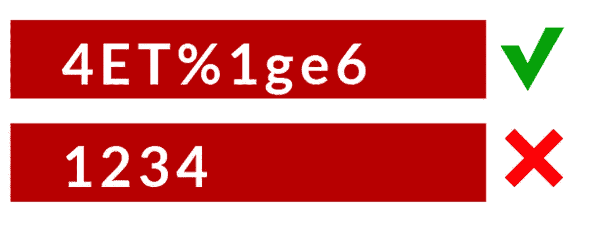
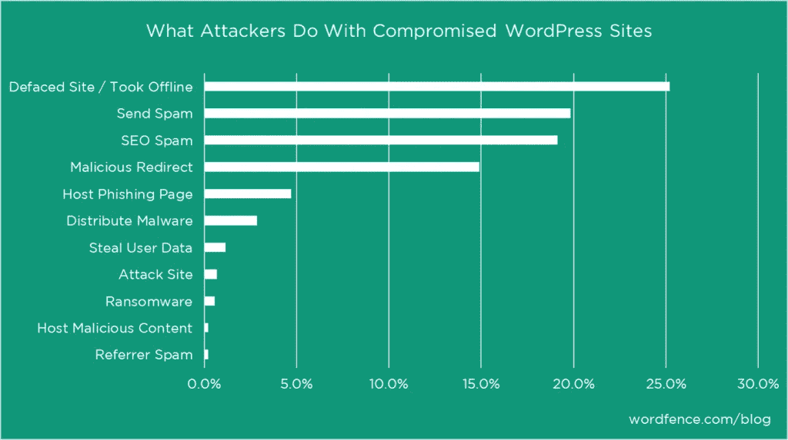
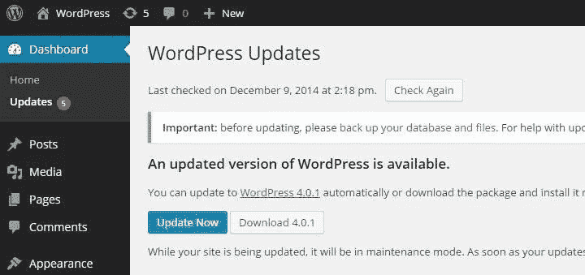

# 保护你的 Wordpress 网站免受黑客攻击的 6 个安全提示

> 原文：<https://medium.com/hackernoon/6-security-tips-to-protect-your-wordpress-website-from-hackers-1733ca70a278>

Web Security Tips

你的网站可能看起来没有什么可被黑客攻击的，但是网站经常被入侵。大多数网站安全漏洞通常不是为了扰乱您的网站布局或窃取您的数据，而是试图使用您的服务器作为垃圾邮件的中继，或创建一个临时 web 服务器来提供文件，通常是非法的。被入侵的网站也可能以其他方式被滥用，例如使用你的服务器挖掘[加密货币](https://hackernoon.com/why-everyone-missed-the-most-mind-blowing-feature-of-cryptocurrency-860c3f25f1fb)，或者作为僵尸网络的一部分。也可能被勒索软件击中。

黑客攻击通常是由自动化脚本执行的，这些脚本被编写来搜索互联网，并试图利用网站和软件中已知的安全问题。以下是帮助您和您的网站保持在线安全的九大提示:

# 1.始终确保您的软件是最新的

这似乎有点显而易见，但是保持你所有的软件都是最新的对于保持你的网站安全是至关重要的。这不仅适用于你可能在网站上运行的任何软件，如论坛或 CMS，也适用于服务器操作系统。如果在软件中发现了[网站安全](https://hackernoon.com/7-tips-to-fortify-your-drupal-7-websites-security-e4c48c1905f4)漏洞，黑客们通常会很快尝试并利用它们。

如果你使用的是托管解决方案，你不必太担心为服务器操作系统应用定期的安全更新。这是因为托管公司会为你处理这件事。

尽管如此，如果你在你的网站上运行第三方软件，如论坛或 CMS，你应该确保及时安装新的安全补丁。大多数供应商通常有一个 RSS 提要或邮件列表，在那里他们详细说明了任何网站安全问题。WordPress 和 Umbraco 等 CMSs 会在您登录后立即通知您是否有任何可用的系统更新。

许多开发人员使用诸如 [NPM、Composer 或 Ruby Gems](https://stackoverflow.com/questions/30462969/php-composer-compared-with-ruby-gems-and-bundler) 这样的工具来管理他们的安全漏洞和软件包中的软件依赖，他们可以依赖这些工具而不必关注更新，因为这是一个容易被发现的方法。然而，重要的是要确保您的所有依赖项都是最新的，并拥有诸如 Gemnasium 之类的工具，以便在您的某个组件中发现漏洞时自动向您发送通知。

# 2.密切关注 SQL 注入

当攻击者使用 URL 参数或 web 表单字段来访问或操纵您的数据库时，就会发生 SQL 注入攻击。如果您使用标准的 Transact SQL，很容易在不知不觉中向查询中插入恶意代码，攻击者可能会利用这些代码来获取信息、更改表和删除数据。通过使用参数化查询，可以很容易地防止这种情况。幸运的是，大多数 web 语言都有这个特性，而且实现起来非常简单。

还有跨站点脚本(XSS)攻击，这种攻击在您的网页中注入恶意的 JavaScript 代码，然后在用户的浏览器中运行。这些可以改变页面内容，甚至窃取信息并发送给攻击者。

例如，如果您的站点在页面上显示未经验证的评论，攻击者可以提交包含 JavaScript 和 Script 标签的评论，然后这些评论将在每个用户的浏览器中运行，并窃取他们的登录 cookie。反过来，这将允许攻击者控制查看评论的每个帐户。您必须确保您的用户不能在您的任何页面中插入活动的 JavaScript 代码或内容。

在现代 web 应用程序中，这是一个关键问题，因为页面现在主要是从用户内容构建的，在许多情况下，它们生成 HTML，然后由前端框架如 Ember 和 Angular 解释。这些框架理想地提供了 XSS 保护，但是混合客户端和服务器渲染也创造了新的和更复杂的攻击途径。将 JavaScript 注入 HTML 不仅有效，还可以通过使用 Ember 助手或插入 Angular 指令来注入运行代码的内容。

关键是关注用户在你的网站上生成的内容如何会超出你的预期，并被浏览器解释为与你的意图不同。这实际上相当于防范 SQL 注入病毒。如果 HTML 是动态生成的，请使用可以公开执行您正在寻找的更改的函数(如 element.textContent 和 element.setAttribute，它们将由浏览器自动转义，而不是手动使用 element.innerHTML ),或者使用模板工具中可以自动转义的函数，而不是设置原始 HTML 内容或连接字符串。

Source: [Wikipedia](https://en.wikipedia.org/wiki/Content_Security_Policy#/media/File:ContentSecurityPolicy3_diagram.png)

[内容安全策略(CSP)](https://en.wikipedia.org/wiki/Content_Security_Policy) 是 XSS 防御者工具箱中的另一个强大工具。它是服务器中的一个头，告诉浏览器限制 JavaScript 在页面中执行的内容和方式，例如不允许浏览器运行任何不在您的域中托管的脚本，禁用 eval()或不允许内联 JavaScript。Mozilla 提供了一个很好的指南，里面有详细的配置示例。所有这些都有助于使攻击者的脚本更难工作，即使他们成功地将它们带到您的页面。

# 3.小心处理错误消息

要特别注意你在错误消息中透露了多少信息。最好在你的站点上有最小的错误，这样你就可以避免泄露服务器上的秘密，比如数据库密码或者 API 密匙。也不要给出完整的异常细节，因为它们会使 SQL 注入和其他复杂的攻击变得容易得多。仅向用户显示他们需要的信息，并在服务器日志中记录详细的错误。

# 4.在两端验证

您应该始终在服务器端和浏览器端执行验证。浏览器可能会捕捉到一些简单的错误，比如必填字段为空，或者用户在“仅数字”字段中输入文本。但是，这些都是可以绕过的，您应该采取措施来确保这些在服务器端得到验证和确认。如果不这样做，脚本代码或恶意代码很容易被插入到数据库中，或者在您的站点上导致其他不良结果。

# 5.检查您的密码

当然，你应该使用复杂的密码，但不是每个人都这样做。为你的服务器和网站管理仪表板使用强密码是至关重要的。为了保护用户帐户的安全，坚持良好的密码实践同样重要。虽然许多用户不喜欢它，但实施强有力的密码要求，例如至少有 8 个字符，包括一个数字和大写字母，从长远来看有助于保护他们的数据。

当涉及到存储密码时，它应该只作为加密值，理想情况下通过哈希(单向)算法，如 SHA。使用这种方法，意味着在对用户进行身份验证时，只比较加密的值。但是为了额外的安全，给每个密码添加一个新的盐是一个好主意。

如果有人入侵并窃取了您的密码，使用散列密码可能有助于破坏限制，因为解密它们是不可能的。攻击者能做的最好的事情是暴力攻击或字典攻击，理想情况下猜测每个组合，直到找到匹配。对于 salt 密码，破解大量密码的过程甚至更慢，因为对于每个 salt +密码，每次猜测都将被单独散列，这在计算方面非常昂贵。

幸运的是，许多 CMS 提供了开箱即用的用户管理，具有这种内置的安全特性，尽管可能需要一些额外的模块或配置来使用加盐密码(Drupal 7 之前)或设置密码的最低强度。对于那些使用。NET 中，使用成员资格提供程序是值得的，因为它们在很大程度上是可配置的，提供了内置的网站安全性，并带有方便的密码重置和登录控件。

# 6.避免文件上传

允许你的用户上传文件到你的网站会给你的网站带来巨大的安全风险，即使只是改变他们的头像。这种风险主要是由于任何上传的文件，无论它看起来多么无害，都可能包含一个在您的服务器上执行时可以完全打开您的站点的脚本。

如果你的网站允许任何形式的文件上传，你应该非常怀疑所有的上传。如果你的用户被允许上传图片，你不能仅仅依靠模仿类型或使用文件扩展名来验证文件是否是图片，因为它们很容易被伪造。使用检查图像大小的函数或打开文件并读取文件头并不是绝对安全的。大多数图像格式都允许存储一个注释部分，其中可能包含可以由服务器执行的 PHP 代码。

# 但是你能做些什么来防止这种情况呢？

好吧，最终，你会想要限制用户能够执行他们上传的任何文件。默认情况下，web 服务器不会尝试执行包含图像扩展名的文件。但是，不要仅仅依赖于检查文件扩展名，因为已知会检查带有 image.jpeg.php 名称的文件。

一些选项是在上传时重命名文件以确保它具有正确的文件扩展名，或者更改文件权限以使恶意文件不能被执行。如果您使用*nix，您可以选择创建一个. htaccess 文件，只允许访问某些文件，理想情况下可以防止双重扩展名攻击。

最终，理想的解决方案是阻止对上传文件的直接访问。这可以确保用户上传到您站点上的文件以 blob 的形式存储在 webroot 之外的文件夹中或数据库中。如果不能直接访问您的文件，您必须创建一个脚本，从私有文件夹或中的 HTTP 处理程序获取文件。NET 并把它们发送到浏览器。

大多数主机提供商将代表你处理服务器配置，但是如果你在个人服务器上托管你的一方，有许多事情你需要检查:

确保您设置了防火墙，并且所有不必要的端口都被阻止。如果可能，创建一个只允许外界访问端口 443 和 80 的非军事区(DMZ)。但是，如果不能从内部网络访问您的服务器，这可能是不可能的，因为您必须打开端口才能上传文件，并通过 RDP 或 SSH 远程登录到您的服务器。

如果可能，让您的数据库运行在与 web 服务器不同的服务器上。这意味着该数据库只能从您的 web 服务器直接访问，并且对外界是隐藏的，从而将您的数据暴露的风险降至最低。

不要忘记对访问你的服务器设置物理限制。

# **使用强密码和用户名保护您的博客**

如果你用安全密码锁定安全网，黑客就很难攻破它。使用字母数字关键字和一些特殊字符足以创建一个强密码。不要使用一些简单的密码或你所爱的人的名字或日期作为你的密码，因为这些是黑客通常熟悉的东西。创造一个非常创新和独特的，没有人能打破它。如果你想保存一个博客或网站，并且不精通技术术语，那就联系安全公司，比如 Rootgatehacks、T2、Quickheal、T4、卡巴斯基和许多其他公司来修复它。

## **使用安全软件**

你需要知道你的博客和你的电脑系统直接相关。因此，用完美的安全软件来保护你的计算机系统变得非常重要，这样除了你之外，没有人可以不惜任何代价得到或访问它。此外，保持您的安全软件定期更新，以保持您所有的一般和高级程序的安全。

## **创建完美备份**

黑客有时也会对你电脑系统中存储的数据造成严重损害。因此，为其创建一个完美的备份也是非常有益的。博客通常会提供不同的免费和高级插件选项，但肯定不会为你的所有数据提供备份。因此，有一个适当的备份设置可以节省你的恶劣条件。

## **利用虚拟专用网**

虚拟专用网络(VPN)是所有互联网用户的福音，通过加密连接保存您设备上的数据。这种 VPN 连接通常用作隧道，进一步在您的 IP 地址上创建一个掩码，从而为您提供更高的安全和隐私级别。

## **更新 WordPress 版本**

为了在博客的世界里前进一步，你需要持续更新 WordPress 版本。持续升级有助于用户通过不同的补丁来填补和修复你的博客中存在的安全漏洞。

# **结论**

人们应该记住的是，保护你的博客不被黑客攻击对于保持其真实性、声誉和性能至关重要。你需要努力提高你的网站或博客的活跃性和防御能力，以免被网络黑客攻击。只要不断更新你的博客，并密切关注它，以便检查它是否正常工作。如果你发现一些不一致的地方，上面提供的想法可以帮助你避免你的博客被黑。