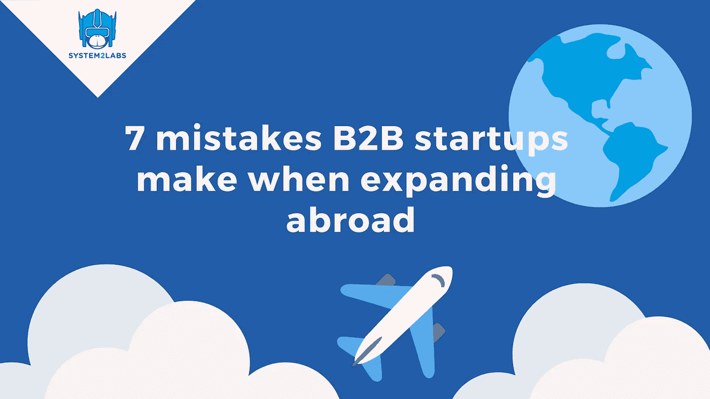

# B2B 初创公司在海外扩张时犯的 7 个错误

> 原文：<https://medium.com/hackernoon/7-mistakes-b2b-startups-make-when-expanding-abroad-4ab345f7e27e>

7 mistakes B2B startup founders make when expanding abroad

“我如何拓展海外市场？”是早期和成长期 [B2B 初创公司](https://hackernoon.com/tagged/b2b-startups)经常问我们的问题。这个问题对于欧洲的初创公司和在新兴市场运营的公司尤其重要，如拉美、印度、俄罗斯和东南亚。如果你的大本营不是一个巨大的国内市场(像美国或中国)，并且你有很高的增长雄心，那么国际扩张很快就变得非常重要。

下面的错误列表是基于我们在 100 多家不同阶段和规模的 B2B 公司中看到的成功和失败，并辅以顶级风投注意到的最佳管理实践和模式。在你的国际扩张之旅中避免这 7 个错误将会节省你的时间和金钱，甚至可以避免致命的失败。

# 1.过早进行国际扩张

我喜欢 Matrix Partners 的 David Skok 提出的可重复、可扩展、可盈利增长的 9 个步骤。在 System2Labs，我们认为这些步骤是正确的，根据我们的经验，在第 5 步“证明非创始人可以销售”之前扩张是一个灾难。

> 如果你还没有找到适合市场的产品，还没有产生可观的收入，或者还没有证明非创始人可以销售，你应该在国际扩张之前集中精力解决这个问题。

这并不是说你应该总是从你的国内市场或单一市场开始。这只是表明扩张本身不太可能解决这些早期阶段的挑战。就像[搬到一个新的国家](https://www.psychologytoday.com/us/blog/design-your-path/201512/will-moving-make-me-happier)不一定会让你更快乐，向海外扩张也不一定能解决你的核心业务挑战。

我听到许多初创公司说，他们的产品对国内市场来说“太早”或“太贵”，这是去欧洲和美国的一个原因。虽然这可能是真的，但您应该小心这种逻辑，并收集一些事实。你的国内需求可能确实有限，但你应该确保无论你在哪个地区，都没有基本的产品或需求问题阻止你销售。

让我们来看两个例子。UiPath 是一家机器人流程自动化创业公司，它起源于罗马尼亚，现在价值超过 1B。他们什么时候进行国际扩张的？他们在美国开设了办事处**之后，他们赢得了一些主要的**全球**客户和合作伙伴，并从顶级风投那里获得了资金，因此他们有能力进行扩张。Earlybird Venture Capital [的合伙人丹·卢普评论道](http://business-review.eu/news/the-story-of-uipath-how-it-became-romanias-first-unicorn-164248)“该公司在美国没有任何实际业务，但他们得到了美国客户的大量关注，顺应了非常及时的趋势。”Contentful 是另一个从欧洲[扩展到美国](https://www.youtube.com/watch?v=RM4dHoNT3WU)的成功创业公司。在看到美国对他们产品的巨大需求，并与在美国柏林时区工作的人进行试验后，他们在美国设立了一个办事处。**

# **2.国际扩张太晚**

**相反的错误——扩张得太晚——在欧洲创业公司中也很常见。Earlybird 等许多欧洲风险投资公司和分析师将欧洲创始人的“赢得本地投资的心态”列为主要原因之一[欧洲在风险投资方面远远落后于我们](https://static.crunchbase.com/reports/annual_2016_yf42a/crunchbase_annual_2016.pdf)。我喜欢 Messagebird 创始人罗伯特·维斯在网络峰会专题讨论中所说的:“创始人的想法不够宏大。在荷兰，你会看到很多人说，“我要去赢得比荷卢”，我不知道这里是否有很多人知道比荷卢是什么。[……]这基本上是欧洲最小的三个国家”。关键是**

> ****当你赢得[在此插入单一市场或地区]时，你的美国竞争对手可能会赢得全世界。****

**早期的国际扩张是欧洲独角兽成功旅程中的重要一步。欧洲顶级风险投资公司 Balderton 收集了数据，对欧洲和美国估值为 1B+美元的公司进行了国际扩张时间的比较，发现“欧洲公司的国际扩张速度比美国同行快 19 个月。”**

**由于巨大的国内市场，“扩张太晚”对美国初创公司来说可能不是那么严重(很少是致命的)的错误，但它仍然很重要。太迟走出国门的经典例子是谷歌和脸书(Alex Schultz 在此谈论此事)。部分由于美国公司缓慢的内部化，俄国有谷歌的 Yandex 和脸书的 VKontakte。**

# **3.一次去太多国家**

**在国内市场取得一些初步成功后，许多公司开始制定出国计划。如果这是一个不来自这些国家的创业公司，名单通常是这样的:美国，英国，德国。有时，邻国或大型亚洲市场也会出现这种情况。当然，这是合乎逻辑的，因为这些可能是最有吸引力的市场，但同时去所有这些市场是非常困难和昂贵的。你知道很多成功的 B2B 创业公司是如何一次打开几个大市场的吗？**

**根据不同市场对你的业务的吸引力和你的获胜能力来评估这些市场是非常重要的。然后决定先专注哪个市场，制定扩张计划。巴尔德顿在他们投资的公司中看到了以下[的国际扩张模式](https://www.balderton.com/build/the-balderton-playbook-for-i18n-part-2-where/):**

*   ****直奔美国****
*   ****欧洲小市场>英国>美国****
*   ****逐个市场的欧洲扩张****

**正确的道路将取决于你的商业模式、阶段和可用资源。例如，如果您的业务是特定于地点的(例如，医疗保健、金融科技、某些类型的市场)或者需要大量的法规遵从性，那么一个接一个地进行就更加重要了。如果你的产品不贵，需要很少的本地化，并且有自助服务的元素，你可以考虑立刻启动几个新的市场。**

# **4.带着新产品进入新市场**

**创始人通常认为他们需要一种新的或不同的产品来赢得新的市场。这很危险。精益创业已经普及了这样一种观点，即创业公司应该专注于重新承担业务风险，即[从风险最高的业务开始测试他们的假设](https://mvpworkshop.co/validate-riskiest-assumption/)。带着新产品进入一个新市场是两个主要风险的结合，由此产生的风险可能高于两者之和。从学习的角度来看，如果你带着新产品去一个新的市场却失败了，你不会知道这是因为产品还是市场。**

**当然，我们并不是说你应该带着现有的产品出国。你绝对应该做基本的市场调查，在新市场进行客户访谈、测试和试点。我们要说的是**

> ****最好带着已经过客户测试和“验证”的核心产品进入新市场**。**

**它应该是您知道如何销售、如何服务的产品，并且是现有客户高度重视的产品(例如，具有高 NPS、低流失率)。正如前面提到的 UiPath 和 Contentful 示例，**

> ****最成功的 B2B 扩张是那些公司在正式向海外扩张之前测试其产品的国际需求的企业。****

# **5.不测试市场就扩张**

**我们提到测试和获得一些需求是重要的成功因素。事实上，没有先花时间测试就扩张到一个新市场是初创公司创始人常犯的错误。但是你实际上是怎么做的呢？虽然正确的答案总是特定于公司的，并且需要我们在博客中提供更多的细节，但这里有一些最佳实践:**

*   ****定义你对国际扩张最危险的假设**，做出假设，并决定如何以最简单、最快、最便宜的方式测试它们。这个阶段最好的练习之一是开一个管理研讨会，讨论你可能失败的原因(想象一下事后分析)。然后集思广益，设计简单的实验来测试这些原因。**
*   ****了解市场:**谁是潜在客户，他们和你国内的客户有什么不同，市场是如何结构化的(谁是玩家，我的产品类型卖的怎么样)，有哪些常见的销售流程。采访潜在客户和竞争对手是做这项研究的最好方法之一。确保面试是商业对话(不是市场调查，也不是推销),并以一种不带偏见的方式测试你的假设。**
*   ****让创始人或知识渊博的高管参观** **市场**并与潜在用户交谈。我们有时会听说创始人太忙而没有时间做这件事。这可能是一个危险信号。在早期和成长阶段，作为一个创始人，你应该只在一个新的大的新市场具有战略重要性的情况下进行扩张，即 3-5 个最重要的计划之一。如果创始人没有时间完成这项任务，那么现在要么不是扩张的最佳时机，要么创始人应该重新审视他们的优先事项。**
*   ****尝试远程**获取一些客户 **。在许多情况下，在新的国家设立办事处之前，你可以从你的市场做一些事情，例如，你可以要求销售和服务部门的人在客户时区工作，你可以投资几次商务旅行，或者进行专门的客户获取实验。你可以从你的目标市场雇佣一个人在当地为你工作，例如，在你柏林的创业公司雇佣一个美国销售代表(这是 [Wooga 采用的](https://www.youtube.com/watch?v=RM4dHoNT3WU)方法)。****
*   ****在“全押”之前设置一个试点**。你可以在新目标市场的一个城市建立一个小团队。这可以由创始人或雇佣的高管来完成，或者在某些情况下由有经验的第三方来完成(例如，顾问或临时国家经理)。应该仔细设计试验，以测试您在第一步中定义的假设。**

# **6.通过雇佣销售代表来测试新市场**

**在计划试点时，许多创始人会考虑在新市场雇佣一些销售代表，试图远程监督他们，并希望这能以某种方式实现。根据我们的经验，这种方法很少奏效。不先了解市场，很难找到具备相关技能的销售人员。这也给这些销售人员设定了不切实际的期望——他们实际上应该表现得像所在区域的国家经理或首席执行官。你可能会非常幸运地找到一个会魔法的人，但很难指望这是一个可靠的策略。**

**像大多数商业招聘决策一样，招聘销售人员永远不应该是你决策的第一步。雇佣销售代表是执行的一部分(方法)，而不是策略(内容)。这是一种手段，而不是目的。你只需要做你的研究和市场情报，进行测试和试点，并定义什么。在这项工作的基础上，你可以为国际市场设计上市模式，定义最小可行的组织结构，以及销售人员应该具备的基本技能。只有在这之后，你才准备好下一步，这很可能包括建立一个小办公室和雇佣第一批销售人员。**

> ****创造一个可靠的收入引擎的关键是最大限度地减少对奇迹的需求，即创造一个普通人也能赢的环境。****

# **7.依靠渠道合作伙伴打开新市场**

**在 B2B 技术创业领域，渠道合作伙伴通常是软件分销商、系统集成商或 IT 顾问和外包公司。通常专注于一类软件(例如，安全或文档管理)或一个垂直行业(例如，医疗保健或政府)。**

**一些创始人认为，在新的国家获得渠道合作伙伴是最好的扩张方式。根据我们的经验，这在某些情况下可能有效，但不经常有效。在以下情况下，与渠道合作伙伴一起向海外扩张可能会很有效:**

*   **该公司在国内市场已经建立了良好的声誉，例如，它已经设法获得了可观的收入(比如超过 1000 万 ARR)，并根据一些明确的采用指标获得了融资(例如，B 阶段)**
*   **该公司立足于发展成熟的市场(如美国、大型欧洲市场或拥有世界级专业知识的其他市场)，并通过渠道合作伙伴(如一家美国公司与欧洲小国的合作伙伴)向较小的市场扩张**
*   **该公司有一个独特的解决方案，可以满足大量的有机需求，但是团队无法独自满足这些需求**
*   **该公司已经在当地市场建立了一定的地位，需要渠道合作伙伴来扩大规模(这是渠道合作伙伴非常有用的地方，但这与国际扩张没有太大关系)**

**然而，如果你是一家位于欧洲、亚洲或拉丁美洲小市场的小型初创企业，你希望通过合作伙伴进入美国或英国，成功的几率相当低。首先，获取渠道合作伙伴很难。**

> **如果你规模小，不知名，获得好的渠道合作伙伴并不比获得自己的客户容易多少。**

**即使你设法获得他们，也不意味着他们会自动带来销售。渠道合作伙伴的投资组合中可能有数百家供应商，他们的销售人员不一定对你的产品足够了解，足以进行销售。您还应该知道，许多渠道合作伙伴依靠制造商来创造需求(“拉动”)并向他们介绍销售线索。**

**一些创始人询问代理人——从销售中赚取佣金的个人。创始人可能希望这些人销售他们的产品或做有用的介绍。如果幸运的话，你可能会得到一些机会销售，但这通常是一个非常不可靠的欧洲和美国市场的路线。代理商在西方市场和技术销售中并不常见，也不总是被专业买家所认可(甚至认为是合法的)。**

**对于渠道合作伙伴和代理商，您也失去了客户的所有权。您可能会发现自己处于一种难以接近客户、理解客户、交叉销售和追加销售的境地。**

**话虽如此，如果你出于正确的原因使用渠道合作伙伴，他们对于早期和成长期的科技初创公司来说是非常有价值的。他们可以成为市场情报的重要来源，因为他们非常了解自己的客户需求。就像 UiPath 的[案例一样，花时间与合作伙伴在一起可以让他们释放产品的潜力，“我们有一个好产品[…]，但我们还不知道我们可以用它做什么。直到有人告诉我们‘你可以用它来造飞机。’"](http://business-review.eu/news/the-story-of-uipath-how-it-became-romanias-first-unicorn-164248)**

*******

***我希望这份清单对希望向海外扩张的初创公司创始人和高管以及风投和其他投资者有所帮助。订阅* [*system labs*](https://www.system2labs.com/)*拥有与美国和欧洲大部分主要市场的 B2B 公司合作的丰富经验。我们开发了工具和方法来帮助任何来源的创业公司向海外扩张。如果您对最适合您企业的扩展方法有任何疑问，请联系我们。***