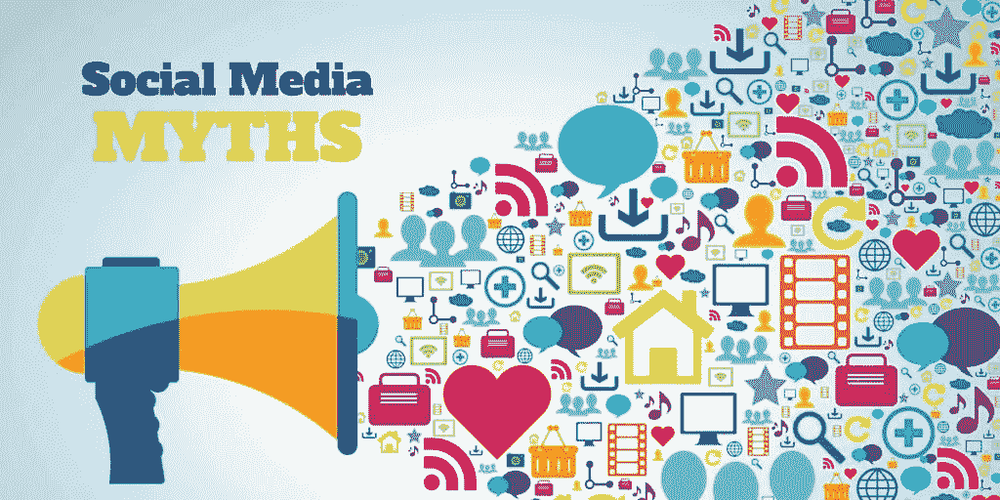
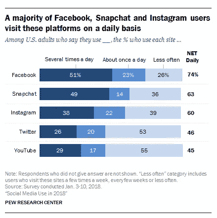
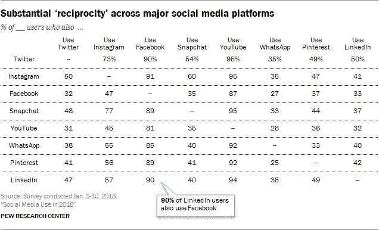

# 8 个社交媒体营销神话被终结

> 原文：<https://medium.com/hackernoon/8-social-media-marketing-myths-busted-f9ab17a2a179>

在这一点上，毫无疑问，社交媒体已经超出了“美好拥有”的范畴。它已经成为社交媒体营销的一个巨大渠道——98%的数字消费者都在使用这个渠道。如果某人有生意，那么使用某种形式的社交媒体来宣传该生意很有可能是个好主意。

然而，像这个世界上的其他事情一样，社交媒体营销受到误解的困扰。为了让你的生意成功，你需要能够看穿误解——打破神话。以下是最常见的误区，以及打破这些误区的事实。

# **神话 1。** **你需要活跃在每个社交媒体平台上**

有一个常见的神话是，如果你想让你的公司成功，那么你需要活跃在每个社交媒体平台上。不过，这只是*接近*真相。

是的，拥有社交媒体的确很重要——但是你需要在重要的平台上工作。根据业务类型的不同，一些社交媒体渠道可能比其他渠道更有效。

例如，如果你是一名离婚律师，LinkedIn 账户是必不可少的，而 Pinterest 账户可能没那么有用。你需要在你的观众花费大部分时间的平台上有一个账户。

# **误区二。** **你可以随时在社交媒体上发帖**

虽然您可以随时点击“post ”,但不建议您这样做。你*可以*，不代表你*应该。*每个社交媒体平台都不一样，吸引“顾客”的时间也不一样。

一个建议是使用以前营销活动的分析数据，看看哪里的用户最活跃。例如，报告称，周二和周四添加的 LinkedIn 帖子获得了最多的参与度——尽管这也取决于业务。

理想情况下，你可能想使用谷歌分析，看看什么时候是理想的发帖时间。

# **误区三。** **贴得越多越好**

一些企业主认为，你在社交媒体上发布的内容越多，对你的业务越有利。你发了很多帖子——所以这意味着这会让你更受欢迎，对吗？

不对。积极的推广实际上会惹恼你的粉丝——所以，如果他们在新闻订阅上看到的都是你的帖子，你可能会被取消关注。试着把你的帖子限制在一个合适的时间框架内——例如，周一、周三和周五。当你发布的时候，发布一些实质性的东西——给读者带来价值的东西。

# **误区四。** **你会一直跟着回来**

一个常见的误区是，如果你在 Instagram 上关注人们，他们也会关注你。然而，情况并不总是如此——即使如此，也不总是长久的。

[Instagram 关注者](https://upleap.com/blog/Buy-instagram-followers/)会根据你能给他们提供多少价值来关注你。如果他们出于团结而追随，他们会在那里保持几天——如果你不提供任何有价值的东西，他们可能会不追随你。

一旦追随者意识到你发布的内容确实给他们带来了价值，他们就会去你的网站。否则，他们只会不跟随，你最终会浪费时间。为了避免这种情况，跟随那些看起来已经对你的领域感兴趣的用户——而不是随机跟随那里的每一个人。

# **误区五。** **你不该拿个人**

我们知道你在说什么:把生意当做生意，把个人因素排除在外。应该是符合逻辑的吧？顾客只关心他们购买的服务或产品，所以你没有理由把你所有的感觉都放在那里，对吗？

不完全是。事实上，虽然“过度分享”确实无关紧要——老实说，没人在乎——但客户喜欢在一个品牌中看到一些个性。虽然你应该[用你的帖子来瞄准](https://kenji.ai/how)某个群体，但是记住你也必须试着和他们建立联系。

你可以试着写一些有个性的帖子，甚至添加一些“幕后”图片。它可能与你的行业没有直接关系，但它肯定会让读者与你产生联系。毕竟，他们将能够*感觉到*他们正在与一个真实的人联系——而不仅仅是一些机器人或系统。

# **误区六。** **社交媒体营销只针对年轻人**

很多人认为，如果他们的受众是在晚年，他们与社交媒体无关。“社交媒体是年轻人的，”他们会说。然而，最近，情况发生了变化。越来越多的人加入了社交媒体平台，其中很多人都超过了 50 岁。

大约 52%的 55 岁以上的人拥有社交媒体账户，大约 95%的成年人活跃在脸书上。因此，如果你认为社交媒体不适合你的生意，请三思。

重要的是，大多数活跃用户活跃在不同的网络上。根据[pewinternet.org](http://www.pewinternet.org/2018/03/01/social-media-use-in-2018/):

> 与之前的社交媒体使用调查一样，在本次调查中，不同网站的用户之间存在大量重叠。最值得注意的是，这些社交平台的绝大多数用户也表示他们使用脸书和 YouTube。但是这种“互惠”也延伸到了其他网站。例如，大约四分之三的 Twitter (73%)和 Snapchat (77%)用户也表示他们使用 Instagram。

# **神话 7。** **社交媒体营销免费**

它可以免费加入——但这仍然是一项投资。诚然，与其他类型的营销相比，它通常更便宜——但有些投资可能会让你付出合理的费用。你不会认为那些不断出现的脸书广告是免费的吧？

# **神话 8。** **标签至关重要**

事实上，标签对于将你加入某个对话趋势非常重要——尤其是如果你正在标记某个事件。然而，你不必为了你的帖子成功而用标签来填充你的描述。它们不仅难看，而且如果有这么多，很可能有些也是通用的。而且通用的标签也帮不了你多少。

# **底线**

如你所见，社交媒体营销并不那么简单。随着所有这些神话的终结，你现在可以像老板一样推广你的业务了。