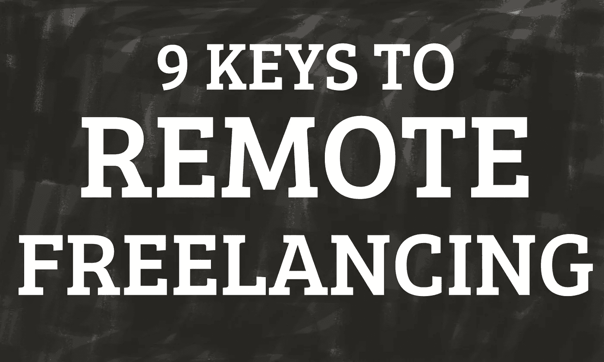

# 远程自由职业的 9 个关键

> 原文：<https://medium.com/hackernoon/9-keys-to-remote-freelancing-c060727fda40>

Image by Rebecca Hoover

## 基于现实生活经验的高度实用指南

上周我发布了[“远程自由职业的 4 个障碍。”因为这篇文章是关于自由职业者，而不是就业，我担心它会失败。](https://www.linkedin.com/pulse/4-hurdles-remote-freelancing-scott-hoover/)

我错了。当来自世界各地的读者收看时，反应之热烈令我震惊。这就像这个话题击中了要害。一篇关于远程自由职业者的 ***栏*** 栏的文章，似乎反而推动了这项运动向前发展！

出于这种反应，我决定写一份更有思想、更完整的远程自由职业指南。这些建议来自我作为自由职业首席财务官的真实经历。我还收录了上周文章读者的一两点精彩观点。

这些提示是按照你在自由职业旅途中需要的顺序松散地排列的。请记住，这些只是对我有用的实用想法。你需要调整它们以适应你独特的情况。

# 远程自由职业的 9 个关键

## 关键#1 —提供客户实际需要的优秀解决方案(远程)

先说“实际需要”的部分。仅仅因为你是一个伟大的打字员，并不意味着客户需要打字员。仅仅因为你是一个伟大的技工，并不意味着技工商店正在寻找远程工人。

文案写作、金融和编码是远程客户**实际需要并愿意为**付费的服务的流行例子。任何成功的发行都必须满足这两个标准。

这把钥匙的第二部分是“杰出的解决方案”。我不想这么说，但是如果你没有什么杰出的贡献，你可能不会成功。自由职业者已经充斥着平庸之辈。

基本上有两种公司寻找远程自由职业者:

1.  那些寻找廉价劳动力来更有效地完成日常工作的人。
2.  那些寻找当地社区无法立即提供的优秀解决方案的人。

你绝对希望与第二组合作，这意味着**能够交付出色的结果**。

我是 ***而不是*** 说你需要 10 年或 20 年的经验。经验是有帮助的，但最终，能力、速度、可靠性和解决问题的能力更重要。我会雇佣一个有 5 年工作经验和这四个特征的注册会计师，而不是一个有 20 年工作经验的普通人。

在文案写作这样的创意领域，*我觉得根本不需要经验*。你只需要知道如何写出引人注目的文案。这很简单。

## 关键#2 —了解您的平台选项

这个世界不会因为你想做自由职业者就找上门来。其实你就算去他们家门口也很可能进不去！

进入自由职业者网站。与在 Indeed 或 craiglist 上发布职位的公司不同，在自由职业者平台上发布职位的客户默认对远程自由职业者模式开放。流行的自由职业平台包括 [Upwork](https://www.upwork.com/) 、 [Toptal、](https://www.toptal.com/) [Graphite](https://www.graphite.com/) 和 [Fiverr](https://www.fiverr.com/) 等等。

我的个人旅程经历了向上的工作和最近的谈话。两家公司都是声誉卓著的公司，但它们采取了完全不同的方法，是两个极端中的极端。下面是我对这两者的快速分析:

**向上工作**。Upwork 是一个大型的、随心所欲的在线市场。建立个人资料后，你可以自由地对发布在平台上的工作进行投标。如果客户喜欢你的出价，他们通常会主动要求电话或视频面试。如果你被客户聘用，Upwork 的费用一般是你收入的 10%，但也有 5%到 20%不等。

> 为了继续工作，你需要花几十个小时，甚至几百个小时来起草提案和找工作，但通常都不会成功。我得说，我花了将近 6 个月的时间才获得任何吸引力。然而，当牵引力开始时，它就像一列离开调车场的货运列车一样不断加速。

如果你坚持下去，Upwork 会有很多好处。我喜欢固定费用合同选项。我也喜欢被允许雇佣员工(至少是固定费用雇佣)。此外，较低的准入门槛吓跑了一些精英专业人士和大公司，这为坚持到底的有爱心的自由职业者留下了相当多的开放道路。

**Toptal** 。Toptal 则完全相反。只有有经验的专业人士才能加入，而且有一个广泛的筛选过程。一旦进入，Toptal 在让你感觉自己是团队的一部分方面做得很好。

比如有个人发展的机会。我开始写博客是因为给他们的金融博客写稿。在某些高需求领域，Toptal 给新进人员提供签约奖金，甚至给团队成员发提成(比如我！)进行招聘。有鉴于此，欢迎随时申请 toptal.com 大学！

在 Toptal，自由职业者设定自己的时薪，并通过 Toptal 获得报酬。在选择利率时，你必须对市场保持敏感，但利率往往会偏高。Toptal 招聘人员为客户和自由职业者牵线搭桥，并处理所有费用讨论和发票事宜。对于某些领域(如编码和某些金融学科)，对于有经验的专业人士来说，Toptal 可能是一个不错的选择。

**其他线上平台**。我不太了解其他平台，但我对 Graphite 的印象是他们倾向于 Toptal，而 Fiverr 可能在天平的向上一端，或者更高。我知道某些领域也有专门的自由职业者网站(比如网页设计师的 99 设计)。或许有其他推荐的读者？

**当地呢？**我最初是一名当地的自由职业者，服务于威斯康辛州中部市场。本地客户可能比远程客户更容易找到，但这取决于你的位置和职业。如果你喜欢往返于当地客户和现场工作，这可能是一个不错的选择。

权衡选项，选择最适合的平台。你甚至可以尝试多种选择，然后迅速锁定适合你的 1 或 2 个。

## 关键 3——学会写伟大的、简短的、介绍性的提案

写作是远程自由职业的基础。几乎毫无例外，你与任何客户的第一次接触都是书面的。事实上，如果你不能提出一个有效的介绍性建议，我担心你的自由职业生涯。

我从自由职业者丹尼·马奎尔斯那里学到了很多关于提案的知识，他的公司致力于帮助自由职业者在 Upwork 上取得成功。他自己也是一名文案作家，他已经收集了一些有效提案的[伟大指南](https://freelancetowin.com/writing-upwork-proposals/)。

以下是我自己或从丹尼那里学到的一些实用的想法:

1.  不要浪费时间解释你能做的所有伟大的事情。
2.  **对客户产生兴趣**。根据你的经验，提出一个对他们想做的事情有效的建议。
3.  不要害怕挑战客户。我最近为一个需要财务模型帮助的客户写了一份建议书。他们列出的预算是 100 美元。在我的介绍性提案中，我建议任何愿意以这个价格做这项工作的自由职业者，可能会把这个项目向后推*(重点是后加的)。我被录用了。*
4.  ***如果你的出价高，谦虚地解释为什么**。不管怎样，你需要克服价格异议。我发现询问客户是否在寻求结果，或者仅仅是最低的成本是很有效的。这让他们思考他们真正需要的是什么。*
5.  ***镜像客户的职位发布**。如果客户的帖子只有两行，他们可能不需要 2 页的介绍性提案。然而，当我看到一份非常详细的招聘启事时，我会回复一份更详细的提议(并提到这就是为什么它更详细)。在客户的招聘启事中寻找具体的词语或事实，并尽可能在你的建议中使用这些词语。*

*撰写介绍性提案需要时间来掌握。你需要找到你的“声音”，而这可能不会在你的前 10 次尝试中实现。耐心学习！*

## *关键 4——只关注如何进门*

*我想这可能是我从丹尼身上学到的另一点。当一个潜在客户最终对一个介绍性的提议做出回应时，冷静下来并记住这一点:**你不是在试图推销一个项目……你是在试图进入这个领域**。你只是想被邀请到他们的虚拟客厅。*

> *客户不了解你，也不信任你。你不了解也不信任客户。如果你和客户都是有信誉的，你们都会愿意一起工作——如果你能建立这种信任的话。你们都需要一种方式来相互了解，这样你们就可以决定是否要在这个大项目上合作。*

***你如何进入建立信任的大门？以下是一些建议:***

1.  *提供几个建议的面试时间和日期。此外，将时间转换为客户端的时区。你需要给潜在客户一个“简单按钮”。如果你的建议都不合适，告诉他们建议一个合适的时间。*
2.  ***通过提问和诚实回答建立自信**。到了电话面试阶段，这一点尤为重要。**问很多(好)问题**。问题给你时间去思考(当客户回答的时候),并且经常挖掘出重要的事实。当客户问你问题时，努力做到完全透明和诚实。专注于你擅长的，但是不要害怕承认项目中有你需要思考的地方。*
3.  ***花时间进行几次对话或电子邮件**。一些从业者可能会在这个问题上和我争论，但有时它是有效的。我去年做了一个项目，需要一些免费的电话交谈才能启动。这些会谈转化为一个低成本的“in”项目(见下一点)，并最终成为一个为期数月的项目，产生了近 2 万美元的收入。重要警告:我也可以给你很多故事，但结果却不是那样！*
4.  ***打造低成本的“in”服务**。几乎我所有成功的约定都是从一个小项目开始的(对我来说，这通常是会计科目表的重新启动)。我帮助客户清理他们的会计科目表，如果我们合作得好，这为未来的每月财务监督奠定了基础，这就是支付账单的原因。这是会计领域的一个例子……根据你的想法调整一下。*

*正如一位读者上周指出的那样，一旦客户相信你能做好工作，他们通常会与你长期合作。我完全同意，但是**首先你得进门**！*

## *关键 5——掌握落地大项目的艺术*

*大型项目对自由职业者的生存很重要，原因有几个:*

1.  ***他们吸收更少的客户获取时间**。比较 24 个项目，每个项目支付 1，000 美元(总共 24，000 美元)，与一个经常性项目，每个月支付 1，000 美元，持续 24 个月(总共 24，000 美元)。落地 24 个独立的项目几乎肯定比落地一个大的重复项目需要更多的努力。*
2.  *他们产生更高的收入。一个需要 4 周完成的大项目通常会比 4 个需要 1 周完成的项目每周产生更多的收益。这是因为较小的项目将共同消耗更多不可计费的项目管理时间(除了前面提到的客户获取时间)。*
3.  ***它们释放压力**。手里有一个大项目可以消除绝望的感觉。它还能在投标其他项目时增强信心。这一点非常重要，我认为每个自由职业者在成为全职自由职业者之前，都应该考虑安排至少一个大型项目或工作。你现在的雇主可能是一个好的开始。*

*那么，你实际上是如何获得一个大项目的呢？**回答**:非常小心。*

*这里有 11 条建议帮助你起草一份成功的大型项目建议书:*

1.  ***提供选项**。例如，一个自由职业的首席财务官可能提供三种级别的服务:A)全面的首席财务官服务，B)仅准备月末财务报表，或 C)对客户准备的财务状况进行每月 4 小时的基本审查。理想情况下，你认为客户会选择的方案应该在清单的中间。*
2.  *根据您的建议，将每个选项或里程碑分成 3 到 5 个子任务。如果你简单地说“我会花 8000 美元把你的 QuickBooks 文件迁移到 Sage 300”，客户很可能会退缩。但是，如果你将任务分成 3-5 个类别(旧系统的数据备份、新系统中的会计科目表设置、供应商/客户的迁移、新报告的设置等)。)它突然变得更容易理解为什么这是一个 8000 美元的项目。但是，**T3T5【不要过分】。太多的细节让普通客户难以承受。***
3.  *给出一个广泛但合理的时间范围。在每个子任务旁边列出一个时间范围。“进门”阶段的一部分(关键 4)是有机会了解大项目将花费多少时间。即使那样，你也不能完全确定。诚实地猜测，并以合理范围的形式给出(例如 15-25 小时，而不是 5-100 小时)。将范围相加，最后给出项目范围的汇总范围。*
4.  ***解释可能影响工时范围的具体变量**。通过突出不确定性的具体领域，你展示了你的专业知识，并帮助客户理解范围背后的“为什么”。**警告**:不要让你的免责声明给提议一个消极或不确定的基调。保持乐观、快节奏的风格，简单地列出变量作为关键的补充意见。*
5.  ***强调客户可以帮助降低项目成本的方式**。客户是企业家，可能正在寻找他们的团队能够降低项目成本的方法。对此保持开放的态度，甚至提供实现它的方法。*
6.  ***明确你需要客户做出的承诺/交付成果**。这增加了提案的可信度和真实性。在内心深处，客户知道一个不清楚客户需要做什么的自由职业者，很可能是一个目光短浅的自由职业者。作为这一点的一部分，确保你清楚地指出你的建议 ***没有涵盖*** 的项目部分。清晰能建立信心，减少以后误解的机会。*
7.  *对客户的计划提出改进建议。Danny Marguiles 曾经提到过，客户经常“不知道他们想要什么”。根据我的经验，他是对的。如果你能帮助客户找到最佳路径，将对达成交易大有帮助。**警告**:通常情况下，建议大规模的改变(例如更换会计软件)是不明智的。彻底的改变会把客户踢出他们的舒适区，这不是一件好事。*
8.  *不要说你有多棒，而是给出过去工作的相关例子。没有人喜欢听到自我表扬，但客户确实喜欢听到过去的项目。用例子包装你的提议。比如说“我帮助西海岸的一个承包商从 Xero 迁移到 QuickBooks Online。”这样的评论向客户展示了你的经验:A)远程工作，B)与承包商合作，C)与会计软件合作。 ***这比说“我是一名才华横溢的会计师，是会计软件迁移方面的专家”更有说服力的****
9.  ***如果是多里程碑项目，在每个里程碑提供选择退出的机会**。这一条款保护了你们双方，也使客户不必马上承诺全部 10，000 美元。他们可以放心，如果第一阶段进展不顺利，他们只会损失 2000 美元。*
10.  ***在提案中直接告诉客户，从成本角度来看，你可能很贵*，但从结果角度来看，你可能不贵*** 。如果你是一名高级自由职业者，90%的战斗是将客户的目光从他们的钱包 ***转移到结果*** 。我感到惊讶的是，有多少客户根本无法理解一个 150 美元/小时的自由职业者在 10 个小时内可能比一个 15 美元/小时的自由职业者在 100 个小时内做得更好。如果你已经“进门”了，很可能你已经为这次讨论打下了基础，但是现在是时候把这一点讲得更透彻了。*
11.  ***在*一页*上总结您提案的财务组成部分，并将其作为附件**。我对几乎任何东西都坚持一页纸的概念，尤其是提案(关于这一点见另一篇[文章](/swlh/the-one-page-rule-255e2c636740))。精心制作一个醒目的页面，总结你在提示 1-3 中创建的信息。第 4-10 条建议可以放在电子邮件的正文中，并附上一页纸的建议书。*

*现在重要的时刻来了:点击“发送”按钮。*

*如果暂时什么也没发生，不要感到惊讶。事实上，我经常在几天后发一封随意的跟进邮件或短信，只是为了检查一下，看看发生了什么。可能需要打几个电话和发几封电子邮件，直到你最终得到绿灯(或者有时是可怕的红灯)。*

*如果客户喜欢建议，但不喜欢价格，该怎么办？这可能表明客户对你或你的计划不太感兴趣。不要只是让步和降低你的价格，而是问问客户，这个提议是否有不合理的地方。如果你和客户一起审阅建议书，并强调每一点背后的逻辑，这可能足以将事情带到一个“临界点”。*

> *如果价格紧张仍然存在，**不打折整个项目**。相反，考虑只在第一个里程碑降低固定费用或小时费率。*

*我最近在一个小项目中这样做了。客户质疑我的价格，我同意前 3 个小时正常价格的 2/3。客户喜欢这份工作，并支付了全额费用。*

*别忘了第五题的题目是“掌握落地大项目的 ***艺术*** ”。“艺术”这个词不是偶然出现的。一个著名的艺术家不会在绘画的第一天就画出一幅杰作。自由职业的第一天，你可能不会有一个主提案。要有耐心，不断学习！*

## *关键 6——像项目经理一样思考(因为你就是项目经理)。*

*自由职业者需要两种技能，这两种技能几乎和在你的行业中胜任一样重要。一个是**营销**(我已经在第 3 至第 5 节中介绍过了)，另一个是**项目管理**。*

*项目管理是一项很难掌握的技能。这里有一些提示:*

1.  ***考虑一次标准的周会**。如果客户同意，向项目的关键决策者发出每周一次的日历邀请。或者，在您自己的日历上设置提醒来安排项目更新会议。有效的会议几乎总是提前安排好的。*
2.  ***提前寻找瓶颈，安排“瓶颈”会议**。你的作品不是你的作品；你的工作是寻找瓶颈。你缺少什么信息？未来两周需要做出哪些关键决策？弄清楚这一点，然后安排专门的会议来讨论。如果你一直等到遇到瓶颈，这个项目就会停滞不前，甚至死亡。*
3.  ***提前通知离开，询问客户何时离开**。最近，我向一位客户解释了一般项目的进展情况。我(开玩笑地)说:“我们马上开始，然后突然之间，就在我需要信息的时候，你会离开一个星期”。他的回答是:“是的，但是我可以在离开之前给你这些信息。”原来，他实际上计划在几天后去度一个 10 天的假！我艰难地认识到，客户和自由职业者 OOO(不在办公室)的时间对项目的成功有很大的影响。*
4.  ***找理由沟通**。你不想霸道，但需要保持联系。不要蹲下来写 10 天的代码，除非你已经说过那是你要做的。每隔一两天，提出一些深思熟虑的问题和想法。客户不知道你是否真的在工作，而那些显示你已经深入项目的问题会给客户很大的安慰。瓶颈会议(技巧 2)是实现这一原则的好方法。*
5.  ***将付款申请纳入项目会议**。获得报酬是一门真正的艺术。不管你已经提前花了多少钱在利率和付款计划上(**)，你应该这么做！**)，第一次付款请求仍然是一个艰难的时刻。为了更顺利，在实际要求付款的前几天，委婉地提醒客户。理想情况下，当你发出付款请求时，是在一次很好的会议之后，会上你已经解决了项目中的问题，或者向客户展示了一些非常好的东西。在这样的会议结束时，不经意地提及你将发送下一次付款请求。**不要突然或在长时间没有联系后简单地要求付款。***
6.  ***最重要的是，感受什么都没发生的重量**。一个运行良好的项目就像一条移动的人行道——无情地向前移动。当移动的人行道停下来时，你需要带着巨大的恐惧。我不是说停一个星期的时候。我的意思是当它停止(无意的)一两天。停止通常意味着你没有预测到瓶颈或询问客户缺席的情况。不管停下来发生了什么，关键是要再次前进。接受一个不方便的电话会议，建议一条不同的道路，跳到第二阶段……尽一切努力继续前进。*

*像项目经理一样思考，因为作为一名自由职业者，这就是你！*

## *关键 7——把你的沟通技巧提高几个层次。*

*这个键是项目管理的近亲，但是大到足以成为它自己的点。一个好的自由职业者必须是一个出色的沟通者。*

*以下是我对伟大沟通的看法:*

1.  ***超快**。试着在几分钟内回复，或者最坏的情况下，在同一个工作日内回复。*
2.  *如果是书面的，语法和拼写都是原始的。在点击“发送”之前，痛苦地花时间使它变得完美。*
3.  *不仅仅是商业。以“早上好，我希望你一切都好”开始邮件。不要只是一头扎进一个 12 缸的问题。这一点可能有点过了，但个人接触大有帮助。而且，为了让它真正发挥作用，你必须真正关心它。*
4.  ***完成了客户的“方式”**。不要假设你的客户首选的沟通渠道是电子邮件。提前询问客户他们的沟通“方式”是什么。数量惊人的客户更喜欢发短信或打电话，而普通的自由职业者可能更喜欢电子邮件。 ***沟通好了就搞定了客户端的方式*** 。*

*总的来说，如果你不喜欢写作，或者不擅长写作，我建议你去上写作课。这是因为写作是远程自由职业客户的连接点。*

> *一个不能写好文章的自由职业者，就像一个不善于与人打交道的上门推销员。当一个客户在一个项目的 2 到 3 个候选人之间犹豫不决时，我有一种感觉，他们会倾向于 3 个候选人中最好的作家。*

## *关键 8——学习获得良好反馈的艺术。*

*这可能是列表中的第一点，但这不是因为**你实际上必须做一个项目来获得反馈**。在远程自由职业中，在线反馈是你的声誉。*

> *反馈确实是一个难题。你需要好的反馈来得到工作，但是你需要工作来得到好的反馈。这就是为什么像 Upwork 这样的平台需要这么长时间才能上线的原因。*

*好的一面是，一旦你有了反馈，它就会以书面形式呈现给全世界。*

*好的反馈不会自动出现。首先，你必须赢得接收它的权利。其次，在客户坐下来给出反馈之前，你必须帮助他们理解反馈有多重要。*

*我总是要求我的客户提供深思熟虑的反馈(如果这是我应得的！)这将有助于其他考虑聘用我的企业家。 ***客户之所以会提出这样的要求，是因为他们在最初雇佣我的时候很可能依赖于反馈*** 。如果你不解释这一点，客户会简单地输入“伟大的自由职业者！”(或者什么都不做)继续生活。*

*你可以花几个小时创建一个引人注目的个人资料页面，但最终，客户的反馈才是关键。人们在个人资料里写各种自私自利的东西，但是外部反馈， ***尤其是一长串明明来自很多不同当事人的****要客观得多，引人注目得多。**

**下面是我的亲身经历。经过很长时间的努力，我终于找到了一个来自波士顿的客户，他愿意雇用我做一个紧急的短期项目。这远远低于我的目标计费率，那天晚上(早上)我不得不工作到凌晨 2 点才完成。但最后，他给了我第一个反馈(关于“他在 Upwork 上见过的最物有所值的东西”)。那篇评论是未来项目的垫脚石，比金钱更有价值。**

## **关键 9——学会茁壮成长。**

**我喜欢自由职业。有时候我会想这是不是我应该做的事情，但是当我想到要去做一份白天的工作时，我就是无法在精神上实现它。如果我的家人在挨饿，而一份工作是把面包放在桌子上的唯一选择，我会毫不犹豫地成为一名雇员。但如果没有这些，我可能永远都是一名自由职业者。**

**但问题是。自由职业有缺点。我想到的两个问题是孤独和拒绝(就像一个有前途的客户一句话不说就消失了)。金融不确定性是另一个原因。这些缺点足以让一个自由职业者沉沦。**

**如果你喜欢自由职业，并想长期从事下去，这里有一些实用的建议:**

****建议一**。**让工作环境与你的个性相匹配**。你喜欢办公室环境中的友情吗？如果是的话，在家工作最终会成为一种拖累。考虑一下当地的自由职业者，或者在咖啡馆或合作空间工作。一位读者建议把在家和在外面的时间分开，这样可以把事情混在一起。**

**另一方面，如果在家工作听起来像一个梦，这里有一个提示:确保你的家人理解什么时候可以打断你。可以和我的妻子和孩子说话是自由职业的一个重要部分，但是有时候我想大喊“走开！我很忙！”如果我提前解释这将是忙碌的一天，我需要集中精力，这对我们大家都有帮助。**

**除了工作地点的选择，确保利用自由职业者的特权。例如，我喜欢在中午散步。不幸的是，我并不总是为此腾出时间。这增加了精疲力竭的可能性。**

****建议二。学会处理拒绝**。我最近和一个人聊过，他刚刚被一个从未谋面的人严厉批评了。他的回答是:“我很久以前就学会了不要让别人对我的看法困扰我。”他对此并不怨恨，后来当这个话题再次出现时，我能感觉到他对这种情况完全没有恶意。**

**哦，我可以有更多的这种精神！当我被拒绝时，我会让它困扰我好几天。这阻碍了我成为自由职业者的能力。**

****建议三。认真思考财务**。对大多数人来说，没有财务计划就从事自由职业是不明智的。根据您期望的小时工资率和可用的 ***计费*** 工作量，您能履行您的财务义务吗？**

**我听说一个很好的经验法则是收取你每小时工资的两倍。如果你的工作报酬是每小时 30 美元，那么你的自由职业报酬应该是 60 美元。以我的经验，至少应该是那样。较高的税率有助于弥补不可计费的时间，也有助于支付自雇税(美国自由职业者)。**

**自由职业永远不可能没有风险，但对财务计划持现实态度将有助于减轻压力。压力越小，你作为自由职业者长期生存的可能性就越大。**

**自由职业并不适合每个人。但对于那些重视灵活性并愿意忍受艰难时期的人来说，这可能是一种很好的谋生方式。祝你自由职业之旅顺利！**