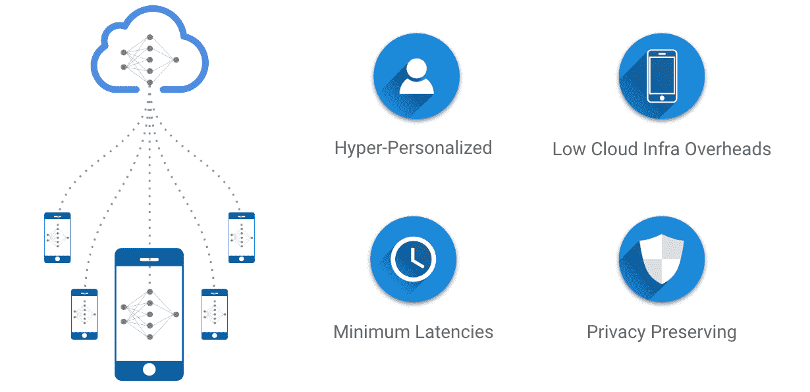
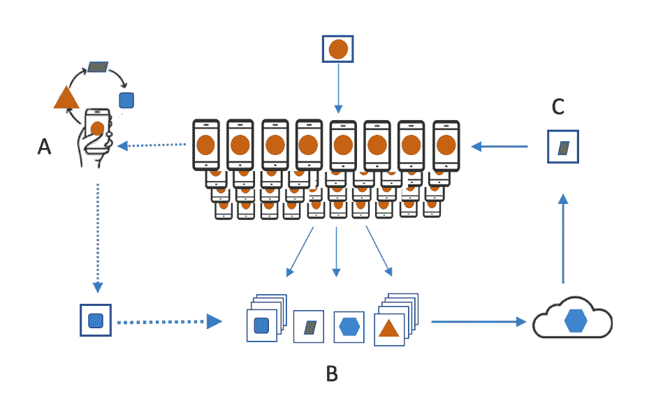

# 联邦学习初学者指南

> 原文：<https://medium.com/hackernoon/a-beginners-guide-to-federated-learning-b29e29ba65cf>

*我们预测联邦* [*学习*](https://hackernoon.com/tagged/learning) *的增长，这是一个人工智能(AI)模型开发的新框架，分布在数百万个移动设备上。联合学习模型对用户来说是高度个性化的，涉及最小的延迟、低基础设施开销，并且通过设计来保护隐私。本文是联邦学习的初级入门。*

> **免责声明**:作者是联合学习初创公司 [S20.ai](http://s20.ai) 的投资人和顾问。如果你想知道，S20 代表“软件 2.0”。

人工智能市场由科技巨头主导，如谷歌、亚马逊和微软，提供基于云的人工智能解决方案和 API。在传统的人工智能方法中，敏感的用户数据被发送到训练模型的服务器。

最近，我们看到了一种分散式人工智能模型的开始，称为联邦学习，诞生于设备上人工智能、区块链和边缘计算/物联网的交叉点。与传统的人工智能方法相比，联合学习将模型带到数据源或客户端设备进行训练和推理。设备上模型的本地副本消除了由于不断与服务器共享数据而导致的网络延迟和成本。由于是本地的，模型响应对于特定用户来说是高度个性化的。联合学习利用用户设备上的计算和存储资源，甚至大规模减少云基础架构开销。此外，联合学习技术是通过设计来保护隐私的。

Figure 1\. Federated learning models are hyper personalized for a particular user, involved minimum latencies and low infra overheads and are privacy preserved by design

## **联合学习的方法**

联合学习主要可以分为**单方**或**多方**。在**一党制**中，只有一个实体参与分布式数据捕获和流系统的治理。这可能有几种形式，如智能手机或物联网应用程序、网络设备、分布式数据仓库、员工使用的机器等。模型以联合方式在所有客户端设备上具有相同结构的数据上训练，并且在大多数情况下，每个数据点对于设备或用户是唯一的。例如，一个音乐推荐引擎，它在一个应用程序上为用户推荐音乐，可以通过这种方式进行联合。

Figure 2: Federated Learning model development. Figure 2: A user’s phone personalizes the model locally, based on her usage (A). Many users’ updates are then aggregated (B) to form a consensus change © to the shared model. This process is then repeated

在**多方系统**中，两个或更多的组织或特许经营者组成一个联盟，通过联合学习在他们各自的数据集上训练一个共享模型。对于每个参与实体来说，保持数据私有是联合学习的主要附加值，以实现一个共同的目标。数据结构和参数通常是相似的，但不需要相同，并且每个客户端都需要大量预处理来标准化模型输入。中立的第三方可以参与提供基础设施以汇总模型权重并在客户之间建立信任。例如，多家银行可以通过联合学习来训练一个通用的强大的欺诈检测模型，而无需相互共享敏感的客户数据。

## **联邦学习的技术和框架**

一些流行的和最近的联邦学习框架包括 TensorFlow Federated，这是 Google 的一个开源框架，用于在分散数据上进行机器学习和其他计算的实验。PySyft 是一个基于 PyTorch 构建的开源库，用于加密、保护隐私的深度学习。Federated AI Technology Enabler(FATE)是一个开源项目，由微众银行的 AI 小组发起，旨在提供一个安全的计算框架来支持联邦 AI 生态系统。

一些新的创业公司如 [S20.ai](http://s20.ai) 、 [Owkin](http://owkin.com) 和 [Snips](http://snips.ai) 已经在这个领域出现，围绕联邦学习和其他跨不同垂直领域的安全计算技术创建新的工具和企业解决方案。

## **早期，以及限制和挑战**

联合学习仍处于早期阶段，在设计和部署方面面临许多挑战。

例如，其可行性高度受限于边缘设备执行本地训练和推理的能力。虽然这可能不会成为进入的主要障碍，因为大多数新推出的智能手机和物联网设备都配备了 GPU 或足够的计算硬件来运行强大的人工智能模型。今天，在不损害设备性能和用户体验或者压缩模型并诉诸较低精度的情况下，训练网络仍然是不可能的。

监督模型的局部训练需要标记的数据，而这些数据在大多数情况下是不可用的或难以产生的。解决这一挑战的一个好方法是通过定义联合学习问题和设计数据管道，以便以隐含的方式捕获标签，例如，用户的交互、基于所采取的某些动作或所触发的事件的模型响应的反馈等。

在现实世界中，与传统的集中训练方法相比，联合设置中的模型收敛时间更长。由于连接性问题、不同的应用使用模式和模型训练时间、不规则或错过更新等，可能存在可靠性问题，其中并非所有设备都参与联合学习过程。只有当数据的规模和从分布式来源聚集的成本非常高时，才应该考虑联合学习。客户端之间不一致的模型版本不会对重要时间窗口的体验产生太大影响，并且中央模型可以在客户端参与最少的情况下收敛。

最后，大公司为了竞争优势而集中聚合数据和创建孤岛的思维模式将是推动采用联合学习的一个主要挑战。有效的数据保护政策和适当的激励措施以及围绕分散数据的商业模式可以解决这些问题，并发展联合人工智能生态系统。

我正在写一系列关于数据科学、机器学习、联邦学习、产品管理和职业成功故事的博客。你可以跟着我把这些放进你的培养基里。

***下一个故事:*** [*打分一个牛逼的产品经理面试*](https://towardsdatascience.com/cracking-an-awesome-product-manager-interview-2baa902791a1)

***上一篇:*** [*印度贫困地址的影响:一年 100-140 亿美元*](https://towardsdatascience.com/economic-impact-of-poor-addresses-in-india-10-14-billion-a-year-11cc97cb40fc)