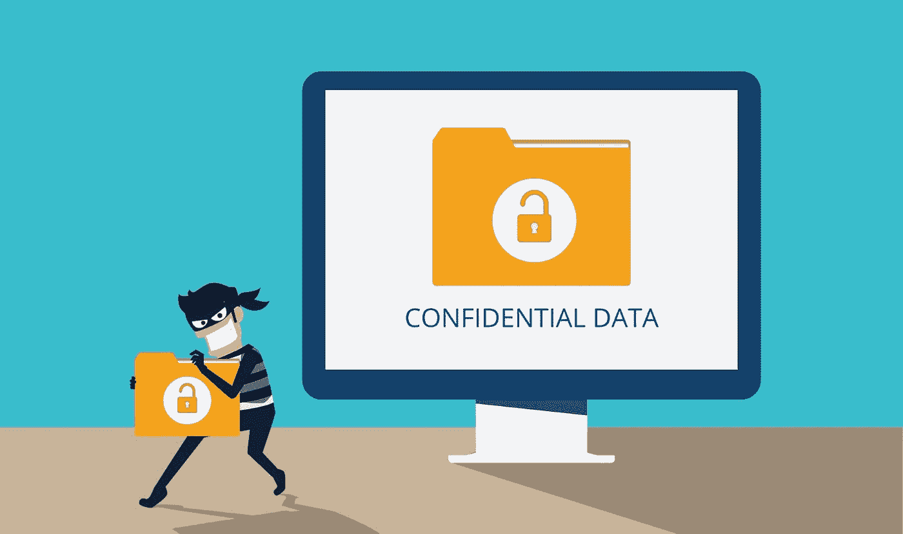
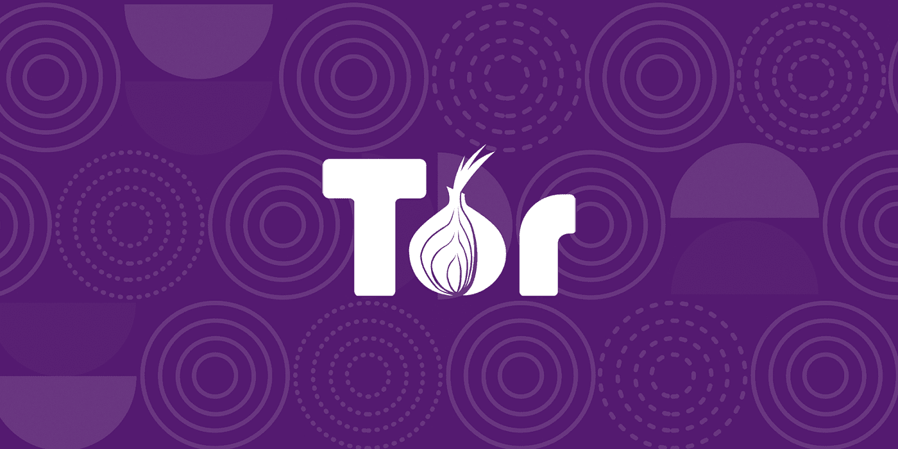

# 在线个人隐私初学者指南

> 原文：<https://medium.com/hackernoon/a-beginners-guide-to-personal-privacy-online-33f4dd20fc43>

## 启动工具包

## 今天，您应该采取七项入门级措施来保护您的在线活动以及相关的个人数据。

## 你在网上被监视已经不是秘密了。

从大规模数据泄露到毁灭性的网络钓鱼诈骗，在这个数字时代，用户的隐私总是处于危险之中。鉴于我们在互联网上花费大量时间，我们都更认真地对待我们的个人隐私是很重要的。

## 既定事实——数百万人使用的“值得尊敬的”网站，如脸书和谷歌，在不断跟踪你，收集你的数据。

它在很多情况下是有用的，因为它让他们的服务免费，我们看到个性化的广告。但是像脸书-剑桥分析公司丑闻这样的数据泄露引起了很多关注。幸运的是，您仍然可以控制您的数据。

***这里有一些小贴士，帮助你开始保护你的网上个人信息。***

# 不要用公共 WiFi

虽然公共 Wi-Fi 网络非常方便，但它们不加密流量。这意味着任何人都可以轻易窥探你，侵入你的手机或笔记本电脑。黑客可以很容易地监视你，跟踪你的在线活动。此外，通过公共 Wi-Fi 网络劫持通信不需要任何黑客技能。如果你必须使用公共网络，考虑使用 VPN 因为它会屏蔽你的 IP 地址并加密你的在线活动。虽然这不是万无一失的，但它确实增加了一层额外的安全保障。另外，不要访问缺少 SSL 的网站。确保它们以 https 开头。

# 切换搜索引擎

大多数搜索引擎会跟踪你的活动，收集你的数据，这样它们就可以根据你的兴趣显示广告。每当我们需要寻找某样东西时，我们就谷歌一下。事实上，全球 90%的搜索都是在谷歌上进行的。但是谷歌也会跟踪你，这样他们就可以给你展示你感兴趣的相关广告。如果你不喜欢你的数据被使用，你可以换一个不跟踪你的数据的搜索引擎。此外，还有许多[道德产品替代品](https://www.ethical.net)供您选择。这里有几个搜索引擎，你可以考虑。

## **DuckDuckGo**

[DuckDuckGo](https://duckduckgo.com/) 是少数几个不跟踪你的搜索引擎之一。一些搜索引擎跟踪你的搜索，即使你已经隐姓埋名。幸运的是，DuckDuckGo 保护了用户的隐私，避免了个性化搜索结果的过滤泡沫。由于它不存储你的搜索历史，你就没有针对性的广告。

## **信任导航**

[TrustNav](https://www.trustnav.com/en) 是另一个伟大的搜索引擎，它不会跟踪你的在线活动。它还可以阻止你访问的网站上的广告追踪器。您可以享受安全和隐私的浏览，而不必担心您的数据被未经许可使用。TrustNav 也不会保存你的搜索历史。他们也有防病毒和广告拦截器，使您的浏览体验更加愉快和安全。

# 使用不同的浏览器

切换到不同的浏览器是保护你在线隐私的另一个方法。像 Chrome 这样的浏览器会记录你的浏览习惯。你可以用 Tor Browser 这样的浏览器完全匿名。它旨在保护您的位置、浏览器历史和您的个人数据。另一个很好的选择是勇敢的浏览器。这是一个免费的开源网络浏览器，可以阻止广告、网站追踪器，并提供快速浏览体验。

# 不要在社交媒体上分享太多

保护你在线隐私的最好方法是限制你在社交媒体上分享的信息量。共享太多信息会让网络罪犯获得您的个人信息，如您的财务详情和其他机密数据。完整的个人资料使网络罪犯更容易冒充您。即使你已经填写了足够的信息，也要确保检查你的隐私设置。这将让你知道陌生人可以看到多少你的私人信息。

# 盖住你的摄像头

黑客可以闯入你的电脑，打开你的摄像头，看看你在做什么。因此，在不使用网络摄像头时将其录制下来非常重要。当你想用它的时候，你可以拿掉胶带。脸书创始人马克·扎克伯格分享了他的一张照片，上面贴着他笔记本电脑的麦克风和网络摄像头。如果扎克伯格遮住了他的相机，也许你也应该遮住？

# 不同的网站使用不同的密码

为不同的网站设置不同的密码可以保护您的帐户。这是一个很好的实践，但令人惊讶的是很少有人这样做。不同网站使用相同的密码会使你更容易受到攻击。如果黑客获得了您的一个帐户的访问权限，他也将能够访问所有其他帐户，因为它们共享相同的密码。这将使您的机密信息面临风险。使用密码管理器，你可以跟踪你所有的密码。此外，建议您使用强密码。尽可能对您的帐户进行两步验证。

# 不要在社交媒体上使用第三方应用

当你在脸书等社交媒体平台上使用第三方应用时，它们会要求你提供太多信息。总是回顾他们要求的信息。这些应用程序将你的数据用于营销目的，有时甚至更糟。如果你拒绝提供他们要求的信息，一些应用程序将无法工作。建议您仅使用您信任的应用程序。

## 遵循这些建议，你可以开始保护你的网上隐私。你不想成为骗局的受害者，你肯定不想你的数据被用来对付你。