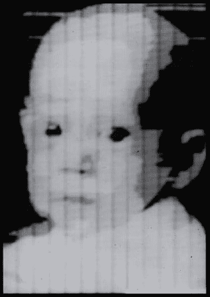
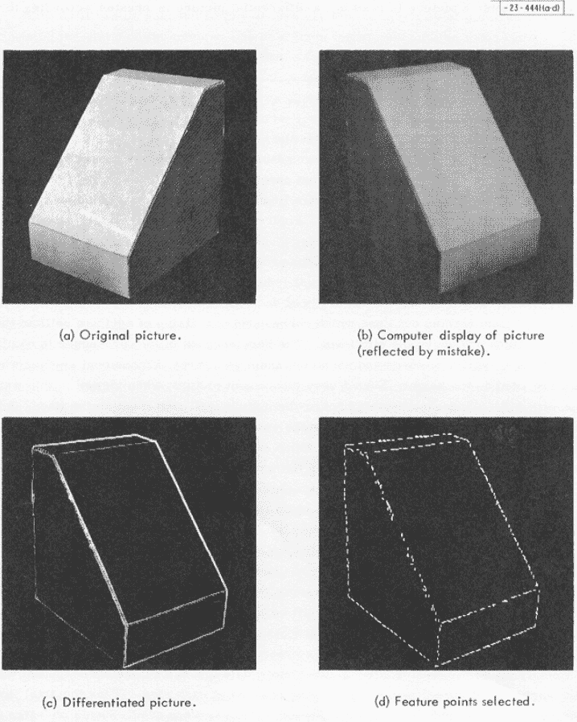
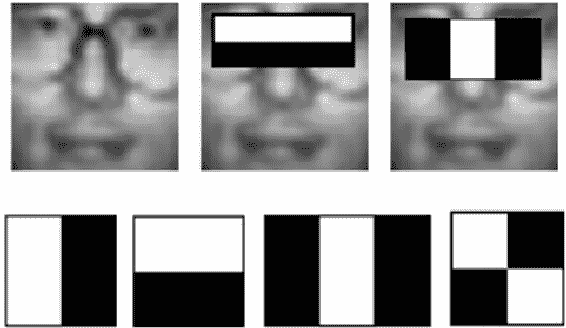

# 计算机视觉(和卷积神经网络)简史

> 原文：<https://medium.com/hackernoon/a-brief-history-of-computer-vision-and-convolutional-neural-networks-8fe8aacc79f3>

尽管计算机视觉(CV)最近才爆发(突破性的时刻发生在 2012 年，当时 [AlexNet 赢得了 ImageNet](https://en.wikipedia.org/wiki/AlexNet) )，但它肯定不是一个新的科学领域。

迄今为止，全世界的计算机科学家一直在努力寻找让机器从视觉数据中提取意义的方法，大约 60 年了，而大多数人不太了解的计算机视觉的历史令人深深着迷。

在本文中，我将尝试阐明主要由卷积神经网络驱动的现代 CV 系统是如何产生的。

我将从一部 20 世纪 50 年代末问世的作品开始，这部作品与软件工程或[软件测试](https://www.kualitatem.com)无关。

计算机视觉领域最有影响力的论文之一是由两位神经生理学家大卫·胡贝尔(David Hubel)和托尔斯滕·威塞尔(Torsten Wiesel)于 1959 年发表的。他们的出版物名为“ [*猫纹状皮层中单个神经元的感受野*](https://www.ncbi.nlm.nih.gov/pmc/articles/PMC1363130/) *”，*描述了视觉皮层神经元的核心反应特性，以及猫的视觉体验如何塑造其皮层结构。

两人进行了一些非常精细的实验。他们将电极放入麻醉猫大脑的初级视觉皮层区域，在给动物展示各种图像的同时，观察或至少试图观察该区域的神经元活动。他们最初的努力没有结果；他们无法让神经细胞对任何东西做出反应。

然而，研究进行了几个月后，他们相当意外地注意到，当他们将新幻灯片放入投影仪时，一个神经元激活了。这是一次幸运的事故！在最初的一些困惑之后，Hubel 和 Wiesel 意识到，让神经元兴奋的是载玻片锋利边缘的阴影所产生的线条的移动。

[*图像来源*](https://goodpsychology.wordpress.com/2013/03/13/235/)

研究人员通过他们的实验确定，初级视觉皮层中有简单和复杂的神经元，视觉处理总是从简单的结构开始，如定向边缘。

听起来很熟悉？嗯，是的，这本质上是深度学习背后的核心原则。

CV 历史上的下一个亮点是第一台数字图像扫描仪的发明。

1959 年，Russell Kirsch 和他的同事开发了一种设备，可以将图像转换为数字网格——二进制语言机器可以理解。正是因为他们的工作，我们现在可以用各种方式处理数字图像。

首批数码扫描照片中的一张是拉塞尔幼子的照片。这只是一张 5 厘米乘 5 厘米的颗粒状照片，捕捉到的像素为 30，976 像素(176x176 阵列)，但它已经变得如此出名，以至于原始图像现在保存在波特兰艺术博物馆。

[*图片来源*](https://www.engadget.com/2010/06/30/russell-kirsch-helped-create-them-now-he-wants-to-kill-square-p/)

接下来我们讨论劳伦斯·罗伯茨的《*三维立体的机器感知》，*发表于 1963 年，被广泛认为是现代计算机视觉的先驱之一。

在那篇博士论文中，拉里描述了从 2D 照片中获取固体物体 3D 信息的过程。他基本上将视觉世界简化为简单的几何形状。

[*图像来源*](http://www.packet.cc/files/mach-per-3D-solids.html)

他开发并在论文中描述的程序的目标是将 2D 的照片处理成线条图，然后从这些线条中构建 3D 表示，最后显示物体的 3D 结构，并移除所有隐藏的线条。

Larry 写道，从 2D 到 3D 构建，再到 3D 到 2D 显示的过程，是未来计算机辅助 3D 系统研究的良好起点。他绝对是对的。

*需要注意的是，劳伦斯在计算机视觉领域的时间并不长。相反，他加入了 DARPA，现在被认为是互联网的发明者之一。*

20 世纪 60 年代，人工智能成为一门学术学科，一些研究人员对该领域的未来非常乐观，认为用不了 25 年就能创造出一台像人类一样智能的计算机。这是麻省理工学院人工智能实验室教授西蒙·派珀特决定启动 [*夏季视觉项目*](https://dspace.mit.edu/handle/1721.1/6125) 并在几个月内解决机器视觉问题的时期。

他认为，一小群麻省理工学院的学生有能力在一个夏天开发出视觉系统的重要部分。在 Seymour 本人和 Gerald Sussman 的协调下，学生们将设计一个平台，该平台可以自动执行背景/前景分割，并从现实世界的图像中提取非重叠的对象。

这个项目不成功。五十年后，我们仍然没有解决计算机视觉的问题。然而，根据许多人的说法，这个项目是 CV 作为一个科学领域的正式诞生。

1982 年，英国神经学家大卫·马尔(David Marr)发表了另一篇颇具影响力的论文——《[*视觉:对人类视觉信息*](https://mechanism.ucsd.edu/teaching/f18/David_Marr_Vision_A_Computational_Investigation_into_the_Human_Representation_and_Processing_of_Visual_Information.chapter1.pdf) *表征和处理的计算研究》。*

基于 Hubel 和 Wiesel 的观点(他们发现视觉处理不是从整体对象开始的)，David 给了我们下一个重要的见解:他确立了视觉是有层次的。他认为，视觉系统的主要功能是创建环境的 3D 表示，以便我们可以与之互动。

*他引入了一个视觉框架，其中的低级算法可以检测边缘、曲线、拐角等。，用作对视觉数据的高级理解的垫脚石。*

David Marr 的代表性愿景框架包括:

*   图像的原始草图，包括边缘、线条、边界等。，都有代表(这显然是受了胡贝尔和威塞尔的研究的启发)；
*   一个 2 D 草图表示，其中表面、关于深度的信息和图像上的不连续性被拼凑在一起；
*   根据表面和体积图元分层组织的 3D 模型。

大卫·马尔的工作在当时是开创性的，但它非常抽象和高级。它没有包含任何关于可以在人工视觉系统中使用的数学建模的信息，也没有提到任何类型的学习过程。

大约在同一时间，日本计算机科学家 Kunihiko Fukushima 也深受 Hubel 和 Wiesel 的启发，建立了一个由简单和复杂细胞组成的自组织人工网络，可以识别模式，不受位置变化的影响。网络 [Neocognitron](https://en.wikipedia.org/wiki/Neocognitron) 包括几个*卷积*层，其(通常为矩形)感受域具有权重向量(称为过滤器)。

这些过滤器的功能是滑过输入值(如图像像素)的 2D 阵列，并在执行某些计算后，产生激活事件(2D 阵列)，用作网络后续层的输入。

福岛的新认知神经可以说是第一个配得上深度这个绰号的神经网络；它是当今康文网的鼻祖。

几年后，在 1989 年，一位年轻的法国科学家 Yann LeCun 将反向投影式学习算法应用于福岛的卷积神经网络架构。在这个项目上工作了几年后，LeCun [发布了 LeNet-5](http://yann.lecun.com/exdb/lenet/)——第一个现代 convnet，它引入了我们今天仍在 CNN 中使用的一些基本成分。

就像之前的福岛一样，LeCun 决定将他的发明应用于字符识别，甚至发布了一款用于[读取邮政编码](http://yann.lecun.com/exdb/publis/pdf/matan-92.pdf)的商业产品。

除此之外，他的工作导致了手写数字的 [MNIST 数据集](http://yann.lecun.com/exdb/mnist/)的创建——这可能是机器学习中最著名的基准数据集。

1997 年，伯克利的一位名叫吉坦德拉·马利克的教授(和他的学生时剑波一起)发表了一篇论文，在论文中他描述了自己试图解决感知分组的尝试。

研究人员试图让机器使用[图论算法](http://ranger.uta.edu/~chqding/cse5311/Lectures/GraphTheory.pdf)将图像分割成可感知的部分(自动确定图像上的哪些像素属于一起，并将物体与其周围环境区分开来)。

他们没有走多远；感性分组的问题仍然是 CV 专家们纠结的问题。

在 20 世纪 90 年代末，计算机视觉作为一个领域，在很大程度上转移了它的焦点。

大约在 1999 年，许多研究人员不再试图通过创建对象的 3D 模型来重建对象(Marr 提出的途径)，而是将他们的努力转向基于特征的对象识别。大卫·劳的作品 [*从局部尺度不变特征中识别物体*](https://www.cs.ubc.ca/~lowe/papers/iccv99.pdf)**特别能说明这一点。**

**该论文描述了一种视觉识别系统，该系统使用对于旋转、位置和部分光照变化不变的局部特征。根据 Lowe 的说法，这些特征有点类似于在下颞叶皮层中发现的神经元的属性，这些神经元参与灵长类动物视觉中的物体检测过程。**

**此后不久，在 2001 年，保罗·维奥拉和迈克尔·琼斯推出了第一个实时工作的人脸检测框架。虽然不是基于深度学习，但该算法仍然具有深度学习的味道，因为在处理图像时，它学习了哪些*特征*(非常简单， [Haar-like](https://en.wikipedia.org/wiki/Haar-like_feature) 特征)可以帮助定位人脸。**

****

**[*图像来源*](https://www.researchgate.net/figure/Haar-features-used-for-Viola-Jones-face-detection-method_fig1_268348020)**

**Viola/Jones 人脸检测器仍然被广泛使用。它是一个强二元分类器，由几个弱分类器组成；在学习阶段，在这种情况下相当耗时，使用 [Adaboost](https://en.wikipedia.org/wiki/AdaBoost) 训练弱分类器的级联。**

**为了找到感兴趣的对象(人脸)，该模型将输入图像划分为矩形块，并将它们全部提交给级联的弱检测器。如果一个补丁通过了级联的每一个阶段，它就被分类为阳性，否则，算法会立即拒绝它。这个过程以不同的规模重复多次。**

***论文发表五年后，富士通发布了一款具有实时人脸检测功能的相机，该功能依赖于 Viola/Jones 算法。***

**随着[计算机视觉](https://perfectial.com/blog/convolutional-neural-networks/)领域的不断发展，社区迫切需要一个基准图像数据集和标准评估指标来比较他们模型的性能。**

**2006 年，Pascal VOC 项目启动。它提供了用于对象分类的标准化数据集以及一套用于访问所述数据集和注释的工具。从 2006 年到 2012 年，创始人还举办了一年一度的比赛，以评估不同方法对对象类识别的性能。**

**2009 年，Pedro Felzenszwalb、David McAllester 和 Deva Ramanan 开发了另一个重要的基于特征的模型——可变形零件模型[。](https://www.google.com/search?q=A+discriminatively+trained%2C+multiscale%2C+deformable+part+model&rlz=1C1GCEA_enUA836UA836&oq=A+discriminatively+trained%2C+multiscale%2C+deformable+part+model&aqs=chrome..69i57j0l3j69i64l2.757j0j4&sourceid=chrome&ie=UTF-8)**

**本质上，它将对象分解为部分集合(基于 Fischler 和 Elschlager 在 20 世纪 70 年代引入的[图形模型](http://citeseerx.ist.psu.edu/viewdoc/download?doi=10.1.1.118.7951&rep=rep1&type=pdf)),在它们之间实施一组几何约束，并对作为潜在变量的潜在对象中心进行建模。**

**DPM 在对象检测任务(使用包围盒定位对象)中表现出色，并击败了模板匹配和当时流行的其他对象检测方法。**

**你可能听说过始于 2010 年的 ImageNet 大规模视觉识别竞赛(ILSVRC)。遵循 PASCAL VOC 的脚步，它也是每年举办一次，并包括一个赛后研讨会，参与者可以讨论他们从最具创新性的参赛作品中学到了什么。**

**与只有 20 个对象类别的 Pascal VOC 不同，ImageNet 数据集包含超过 100 万张手动清理的图像，跨越 1k 个对象类别。**

***自成立以来，ImageNet 挑战赛已经成为大量对象类别的对象分类和对象检测的基准。***

**2010 年和 2011 年，ILSVRC 在图像分类方面的错误率徘徊在 26%左右。但是在 2012 年，多伦多大学的一个团队将一个卷积神经网络模型(AlexNet)加入了比赛，这改变了一切。该模型的架构与 Yann LeCun 的 LeNet-5 相似，错误率为 16.4%。**

***对于 CNN 来说，这是一个突破性的时刻。***

**在接下来的几年里，ILSVRC 中图像分类的错误率下降到了百分之几，并且自 2012 年以来，获胜者一直是卷积神经网络。**

**正如我之前提到的，卷积神经网络从 20 世纪 80 年代就已经存在了。那么，为什么它们过了这么久才流行起来呢？**

**好吧，有三个因素导致了 CNN 的爆炸:**

*   **多亏了摩尔定律，现在我们的机器比 20 世纪 90 年代 LeNet-5 发布时的速度快得多，功能也强得多。**
*   **英伟达的可并行图形处理单元帮助我们在深度学习方面取得了重大进展。**
*   **最后，今天的研究人员可以访问大型、带标签的高维可视化数据集(ImageNet、Pascal 等)。因此，他们可以充分训练自己的深度学习模型，避免过度拟合。**

***结论***

**尽管最近取得了令人印象深刻的进展，但我们仍然没有接近解决计算机视觉的目标。然而，已经有多个医疗机构和企业找到了将由 CNN 支持的 CV 系统应用于现实世界问题的方法。而且这种趋势不太可能很快停止。**