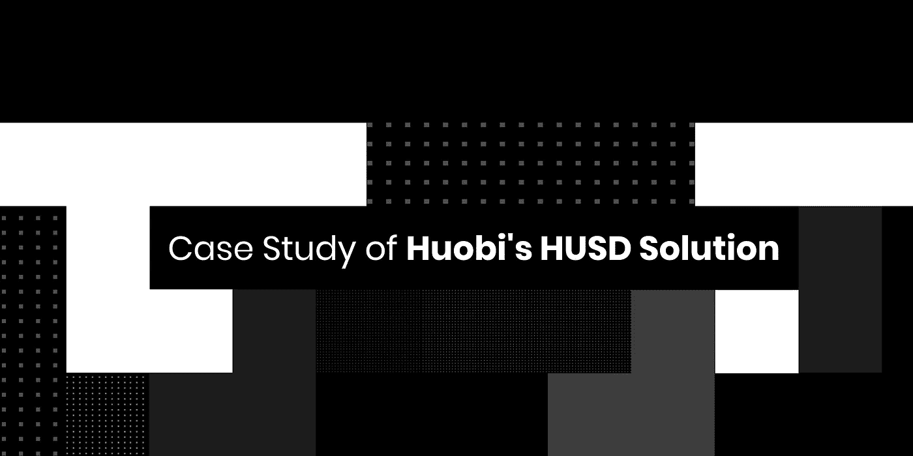
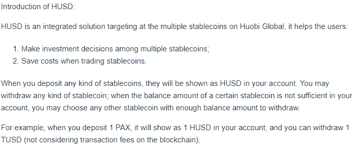
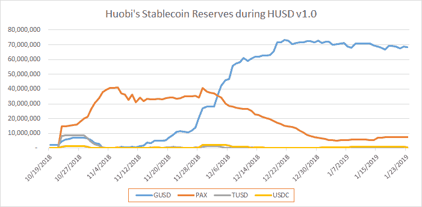

# 霍比 HUSD 方案案例研究

> 原文：<https://medium.com/hackernoon/a-case-study-on-husd-752b16a2d1f8>

火币网最近宣布对他们的 stablecoin 服务进行测试升级，现在名为 [HUSD 解决方案 V2.0](https://huobiglobal.zendesk.com/hc/en-us/articles/360000210661-Huobi-Global-Upgraded-HUSD-Solution-V2-0-Trial-Operation-) 。Huobi 的目的是通过支持 Paxos Standard (PAX)、True USD (TUSD)、USD Coin (USDC)和 Gemini Dollars (GUSD)之间的可互换性来满足用户对 stablecoins 的需求。用户可以在他们的交易所使用这些 stablecoins，其中这四个令牌在一个名为 HUSD 的报价货币下表示。

有趣的是，在[的第一个版本](https://huobiglobal.zendesk.com/hc/en-us/articles/360000170601-Announcement-on-the-Launch-of-HUSD-solution-on-Huobi-Global)发布后的第三个月，这个首次展示才在*公开。哪里出了问题？这篇文章的目的是强调 HUSD 的设计缺陷，并概述由于它发生的事件。详述这些情节很重要，因为它提供了关于加密市场生态系统如何工作以及参与者如何相应应对的见解。*

Snippet from the announcement of the HUSD solution

HUSD 的首次推出允许 PAX、TUSD、USDC 和 GUSD 之间 1:1 的互换性。这似乎是一个直观的理性，因为所有这些都是菲亚特支持的稳定硬币——这意味着它们都可以兑换 1 美元。其目的是让人们更容易交易不同的、受支持的稳定币对。此服务中忽略的一点是 *stablecoins 不能以 1:1 的比例互换，即使它们的可兑换价值相当。它们不一样的原因有很多，所有这些都促成了事件的展开。*

这些稳定的硬币都有不同的:

*   感知的交易对手风险
*   价格波动
*   赎回时间表
*   KYC/反洗钱程序
*   向做市商提供的折扣

我们最终看到的是这样一种情况，各种稳定的信贷机构[以一定的折扣向人们发放代币，以提高流动性](https://www.ccn.com/paxos-standard-hassling-ethereum-traders-trying-to-redeem-stablecoin-pax-for-dollars/)。然后，交易员利用这种情况，利用 HUSD 解决方案进行全价赎回和套利。在这种情况下，HUSD 提供的稳定债券 1:1 的比率不成立，做市商趁机快速获利。Huobi 忽略了这个设计缺陷，这导致了众所周知的这些交易者的“免费午餐”。如果一个交易台[获得任何种类的低于 1 美元的稳定币](https://www.theblockcrypto.com/2019/01/04/gemini-gave-trading-firms-a-stablecoin-discount-and-it-caused-big-headaches-for-one-of-its-rivals/)，他们可以锁定利润而不直接进入市场，当这些稳定币以 1:1 的比例在 HUSD 流通时，他们就是这么做的。这一点被发现并很快得到了利用——HUSD 解决方案实施的时间越长，这一策略的应用就越多。只要机会存在，套利就会继续存在。

接下来发生的事情可能发生在菲亚特支持的四家 stablecoin 公司中的任何一家，但不幸的是，Paxos Standard 是一些交易商转向菲亚特的首选工具。Paxos Standard 确实有更宽松的赎回标准，但他们也有纽约州的监管支持。当这些交易员希望将风险从资产负债表上移除，并通过 stablecoin 赎回菲亚特时，该公司收到了大量赎回请求，有时一天内接近 2000 万美元。Paxos Standard 发现这种行为有严重的影响。为了管理他们的请求并维护合规性标准，他们开始调查这些活动，这在密码交易社区中并不受欢迎。交易者的 Paxos 标准账户一度被无限期冻结或关闭，有些账户的金额高达数百万。

Mildly invasive questions asked by Paxos Standard

更糟糕的是，交易商也在[规避 KYC/AMC 对火币](https://www.paxos.com/uncategorized/regulation-in-crypto-world-stablecoin-pax/)的宽松限制。为了绕开公司规定的 10，000 美元的取款限额，人们创建了许多账户来转移超过通常允许的资金。

One of Huobi’s wallets showing PAX outflow under the 10,000 limit. Src: [etherscan](https://etherscan.io/token/0x8e870d67f660d95d5be530380d0ec0bd388289e1?a=0x6748f50f686bfbca6fe8ad62b22228b87f31ff2b)

为了应对所有这些活动，Huobi 需要回到绘图板，为解决方案构思一个新的设计，因为原始设计被利用了。除了主要在霍比交易所进行交易外，HUSD 还打算在稳定的货币之间进行转换。由于 Huobi 没有直接从市场或回扣中计算价格差异，交易所本身不得不亏损以维持其服务。以下是在 1.0 版期间，这些稳定货币从火币钱包流入和流出的总额分析

Huobi wallet activities, Src: [etherscan](https://etherscan.io/accounts?l=Exchange)

根据这种观点，很难完全评估哪些流动活动可以直接归因于套利或 HUSD 的预期解决方案。我们可以通过对火币拥有的储备和不在他们控制下的钱包的流入和流出进行细分，来更清楚地描述这些转移。我们还可以假设内部转移是为了运营，而外部转移是从套利活动中产生的。

The inflow and outflow numbers for in-between transfers are shown as a sanity check and to avoid double counting

上图是这一时期火币稳定储备的图表。如您所见，大部分活动都发生在 PAX 帕克思和 GUSD。Gemini 推出了他们的 stablecoin，并向交易员提供折扣，以在交易所提供流动性。然而，这些交易员只是绕过市场，用 GUSD 换成 PAX，以锁定快速利润。因此，霍比实际上拥有超过 70%的代币，而不是合理分配 GUSD。交易者抓住了眼前的机会，把双子座和火币留在一个不太理想的环境中清理。

在检查交易的性质后，我们确定 HUSD 解决方案被滥用，超出了其预期目的。在 Huobi 钱包之间发送的 stablecoins 的总量与实际转移的总量相比是非常小的。从 Huobi 转出的金额也大于每种 stablecoin 的当前储备，这表明主要用途是套利，而不是将用户资金保留在交易所，以交易 Huobi 的 stablecoin 市场。

我们可以从这些细分中估计，在这么短的时间内，在不考虑价格偏差的情况下，大约有价值 2 . 34 亿美元的 stablecoins 被套利(根据价格差异和回扣，可能高达 3 美分的差异)，因此，毫不夸张地说，Huobi 正在亏损几百万美元。此外，从第一张表中，我们可以看到，人民币外汇储备严重倾向于某些稳定货币，这可能导致流动性失衡问题。

HUSD 现在推出了一个 2.0 版本的试用版，以取消 1:1 的固定汇率，根据定价和各种其他因素调整稳定货币之间的价值，希望提供一个有意义的解决方案。从公告中可以得出一些重要的观察结果:

*   HUSD 价格基于法定加密市场
*   对潜在稳定债券定价的方法由主流交易所的数据决定
*   用户必须独立地指定时间和数量来交换稳定的硬币，从自动交换变为手动交换
*   HUSD 提供的报价还会根据稳定的币头寸的可用提取金额计算额外溢价，并对 Huobi 的优势设置下限/上限，以防止可能的损失
*   2.0 版本将运行一个月，在此期间可以迭代可能的改进

在试用期间，看看新版本如何影响交易行为、活动以及由此产生的稳定的平台货币汇率将是一件有趣的事情。尽管我们仍然可以对 v2.0 的设计做一些评论:

*   HUSD 不是一个可以从 Huobi 转出的产品，因为它只作为这个交易所的报价货币。因此，当扩展到更广阔的市场时，产品本身具有有限的效用和益处
*   帕克思/GUSD/TUSD/USDC 仍然是从您的账户中赎回的唯一可行选择。因为有两个偏移(到和来自 HUSD)，当想要从不同的底层离开时，必须进行补偿。这一点，加上 HUSD 提议的汇率有下限/上限的事实，意味着在 HUSD 两种抵消差异很大的稳定货币之间的互换可能不会在平台上提供有利的汇率
*   HUSD 价格本身与法定加密市场明确绑定，而潜在的稳定的货币汇率则不受其约束；这可以被视为该公司在受到支持的稳定信贷产生信贷风险的情况下对冲自身风险的一种方式。这对用户来说可能是不利的，因为在存入或提取稳定的存款时，使用该平台会产生额外费用
*   HUSD 的一个目的是进入 Huobi-specific stablecoin 市场，这并不是一个独特的优势，因为还有其他交易所拥有类似的货币对和更高的流动性。当存在其他选择时，这为交易者创造了不必要的时间和成本
*   HUSD 解决方案的另一个目的是互换稳定的货币，尽管收益可能并不有利，因为利率与 Huobi 储备的集中风险、抵押品和流动性相关。如果市场上有另一种替代品可以提供更好的报价和易用性，HUSD 就缺乏有竞争力的用例，如果没有支持它的活动，可能无法管理抵押品和流动性。
*   HUSD 的实际宣传目标对用户来说是未知的，所以不清楚火币会如何在这方面为用户服务
*   在大幅波动期间，集合产品必须证明自己的价值。由于新设计下的定价方式，在动荡的市场中管理流动性风险可能会成为一个问题

即使有这些批评，我们也只能猜测 HUSD 的试用版会如何，只有时间才能证明这项服务在不被利用的情况下是否有用。然而，鉴于这三个月的时间跨度，还有更多悬而未决的问题:菲亚特支持的 stablecoins 的商业模式结构是什么，以及对市场参与者的影响？；建立一个更加开放的金融体系是否涉及监管问题；提供一项没有充分考虑市场影响的服务会有哪些陷阱？；看似有价值的工具之间的市场流动性的作用是什么？

在 Neutral 这里，我们已经注意到 stablecoin 模型/服务的问题，我们正在寻求创造更好的东西。[中性美元](/@neutralproject/intro-to-neutral-dollar-98f95d1ff9f4)是一种可交易的稳定货币，表现出透明度和较低的波动性。这种代币是由基础的稳定货币互换提供动力的，这种货币互换是流动性和汇率中性的，以提高效率，这意味着我们的解决方案对所有参与者来说都更有市场和益处。中性美元还受益于更具活力的流动性，因为它是一个聚合的、非集中化的篮子。我们平台的机制调整交易行为，并鼓励抵押品平衡，从而在所有市场周期中保持产品的稳定性。我们认为中性美元对于所有稳定币的使用来说是一个更加公平和透明的解决方案，希望能够普及这些代币和加密货币的使用。

— — — —

如果您有兴趣了解更多关于我们团队和产品的信息，[请访问我们的网站](http://www.neutralproject.com/)或通过 [Telegram](https://t.me/neutralproject) 或 [Twitter](http://www.twitter.com/neutral_project) 与我们展开对话。