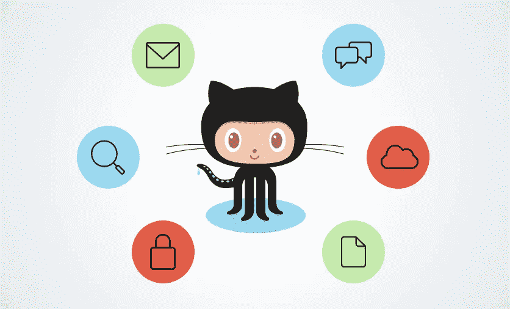
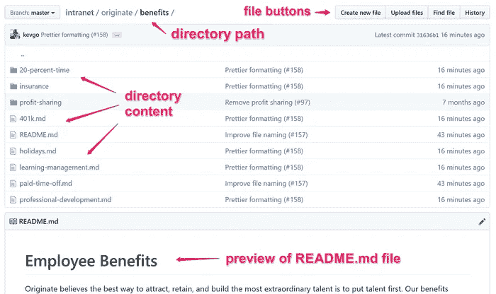
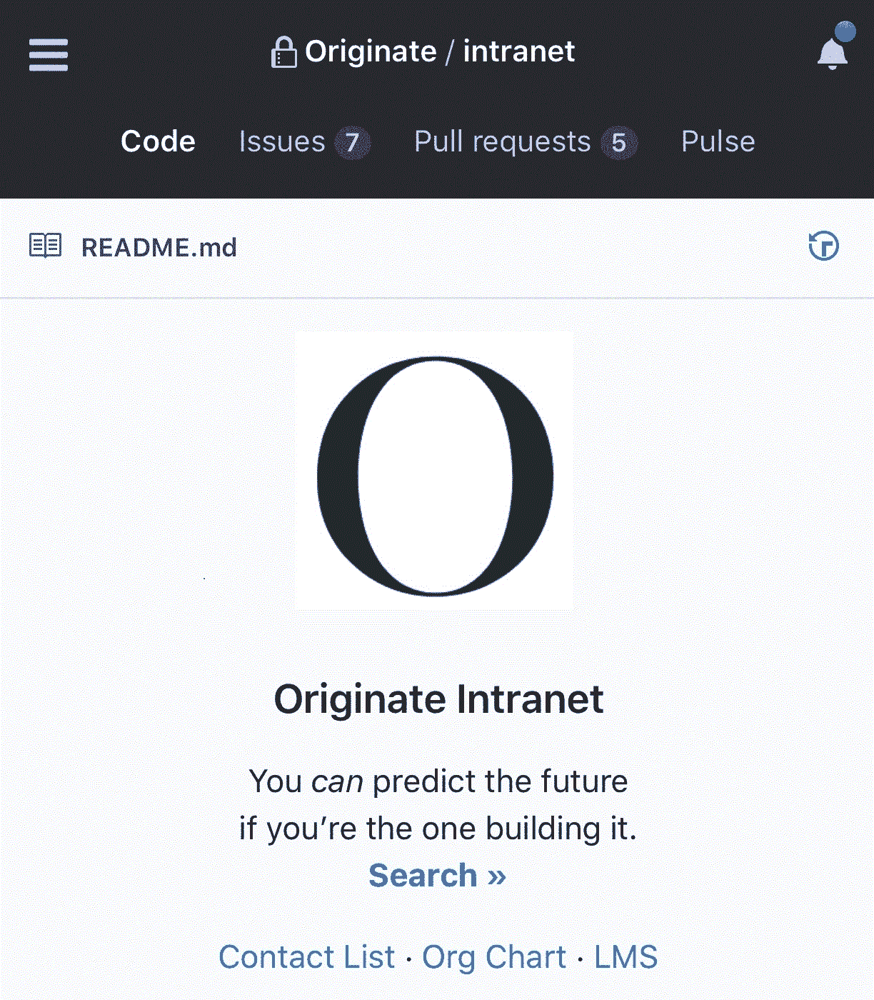

# 基于 GitHub 的协作内部网

> 原文：<https://medium.com/hackernoon/a-collaborative-github-based-intranet-4bd7bd10a91b>

# tl/dr

像代码库一样，构成一个公司的政策和最佳实践是共同开发和拥有的文本。Github 是一个很好的平台，可以和一大群合作者一起开发这两者。我目前工作的公司(Originate)就使用 GitHub 作为这样的内网平台。这实现了前所未有的协作水平，但更重要的是为所有员工提供了授权和透明度。

# GitHub 是一个协作平台

在过去的十年里，GitHub 已经从(可以说是)T2 最好的 [软件](https://octoverse.github.com/projects) [开发](https://resources.whitesourcesoftware.com/blog-whitesource/git-much-the-top-10-companies-contributing-to-open-source)平台发展成为最具生产力的通用协作和社区平台之一，可以开发各种内容，而不仅仅是源代码。GitHub 团队付出了巨大的努力，使得非技术用户可以通过 GitHub 的 web 界面轻松访问 GitHub 的几乎全部功能。

如今，很多人使用 GitHub 做的事情远不止开发软件。数以千计的社区，例如 [ReactJS](https://github.com/reactjs/reactjs.org) ，使用它作为他们网站和博客的*内容管理系统*。GitHub 被数据科学家用来收集和分享*数据集*。一个例子是[总务管理局](https://www.gsa.gov/)的[公共数据集](https://github.com/GSA/data)。无数非技术社区，如 [LegalMattic](https://github.com/Automattic/legalmattic) 或 [Open Austin project](https://github.com/open-austin/project-ideas) 在 GitHub 上合作，并结合多种形式的非技术知识。[数以百计的法律实体](https://government.github.com/community)如政府或公司通过在 GitHub 上公开制定[政策](https://github.com/collections/policies)来与公众互动。德国议会(联邦议院)在 GitHub 上发布所有德国法律。哥伦比亚特区在 Github 上开发其法律代码[，给公众一个在线改正错误的机会](https://github.com/DCCouncil/dc-law)[。](https://arstechnica.com/tech-policy/2018/11/how-i-changed-the-law-with-a-github-pull-request)

很多公司用 GitHub 做内网。一个例子是[地图框](https://github.com/case-studies/mapbox)。他们构建了自己的内部网解决方案，但员工最终更喜欢直接使用 GitHub 进行交流和协作。Originate 也使用 GitHub 作为内部网。让我们仔细看看我们到底是如何做到这一点的。

# GitHub 如何工作

GitHub 是一个围绕几个出色概念的组合而构建的平台，这些概念使协作尽可能高效:

*   Git 是一个非常强大的工具，可以作为一个团队共同创建文本内容，并跟踪谁在什么时候改变了什么
*   拉请求是异步协作的理想形式
*   一个**开放平台**架构允许通过机器人和第三方服务扩展 GitHub 的内置功能
*   像 **Markdown** 这样的开放文档格式支持一个生动的工具支持生态系统

在基本层面上，GitHub 只不过是云中的一个共享文件夹，包含可以包含文本、图像和其他数据文件的文件和子文件夹。Git 的主要用例是将文件和文件夹下载到您的计算机上，以便您可以在本地编辑它们，但这与此无关。Originate 的内部网使用 GitHub 的 web 界面。

GitHub 的 web 用户界面显示了许多常见文件类型的预览，如文本、图像、PDF、Photoshop 等。当浏览 GitHub 上的文件夹时，你会看到该文件夹中的文件列表，创建或上传新文件的按钮，然后是默认文件的预览(名为`README.md`)。

如果您浏览某个文件，您会看到该文件的预览以及编辑或删除它的按钮。GitHub 可以被配置为要求对此类变更进行审查和批准。

有一个移动 web 视图，但手机在风景模式下也可以显示桌面 UI。GitHub 可以使用 [Git-LFS](https://git-lfs.github.com/) 插件高效地存储非常大的文件。

# 作为内部网平台的 GitHub

将所有这些放在一起，Originate 的内部网由富文本文件、图像和 pdf 组成，可以使用 GitHub web 界面的预览功能直接浏览。我们使用 [Markdown](https://en.wikipedia.org/wiki/Markdown) 作为富文本格式，因为它已经成为富文本的通用语言，即使是非技术人员也可以在不到一个小时内学会。

GitHub 只是一个起点。并非所有内容都必须存储在其中。GitHub 还可以链接到其他网页，如谷歌文档、工作表或幻灯片。

# 浏览内部网

浏览 Originate 的内部网类似于浏览网站。人们通常从主页往下钻。GitHub 的主菜单项对应于在内部网中完成的主要活动:

*   *代码*指向文档
*   *问题*引出公司范围内的行动项目、问题或讨论
*   *拉动请求*引出当前或过去的改进建议
*   *洞察*导致统计

还有一个简单的使用 GitHub 的代码搜索功能的全文搜索。

# 编辑内容

我们来看看编辑内容。Originate 是一个合作组织，每个人都帮助定义和塑造。我们的最佳实践代表了共识。领导者决定总体方向，而“在现场”的人负责细节，因为他们最清楚什么可行，什么不可行。在这种情况下，团队会提出、讨论并同意许多变更。选择 GitHub 的一个重要原因是，它使这个工作流程极其高效。

让我们看一个具体的例子，看看这在实践中是怎样的。一名员工，姑且称她为 *Alice* ，发现大多数项目中的 sprint 计划会议都毫无条理。她没有抱怨，而是决定通过与公司其他人分享她主持这些会议的模板来帮助解决这个问题。她没有 GitHub 的旅程会是这样的:

1.  爱丽丝不确定谁负责改变这些会议的官方结构。此外，联系这个人的最佳方式是什么？写邮件？打电话？安排一次会面？她是否应该准备一张幻灯片，介绍她想法的背景？如果是高层的人，用这样的细节去打扰他们可以吗？
2.  在她的主管*鲍勃*的帮助下，他们找到了一个副总裁级别的人，这个人觉得对此事负有责任，并能被说服提供帮助。让我们称她为*卡米拉*。
3.  他们进行了 30 分钟的通话，在通话中，Alice 向 Camilla 介绍了她对更好的会议模板的想法，并解释了为什么其中的一些元素很重要。卡米拉回答道:“好的，让我在下次领导会议上提出这个问题，看看其他团队对此有何看法。”
4.  大多数情况下，这将是爱丽丝最后一次听到这个消息。卡米拉并不是这一努力的热情拥护者。她自己不参加 sprint 计划会议，所以对她来说，和其他团队一起解决这个问题只是她已经很忙的日程中的一件琐事。她无法为 Alice 的议程向其他团队提出令人信服的理由，而且有太多的来回和担忧“这是从哪里来的”,让她无法通过办公室政治来推动这一点。
5.  假设我们完成了这一步，现在我们需要找一个有管理员权限的人用新的 sprint 规划指南更新内部网。我们就叫他*唐*吧。我们必须再次向唐解释我们到底想改变什么。这些事情需要时间，需要一些来回以及后续行动和提醒。
6.  许多团队认为新议程是有用的。鲍勃和卡米拉因“促成此事”而受到称赞。这个过程花了几个星期。Alice 花了几个小时的工作时间和几个晚上的私人时间与其他团队领导接触，并与他们一起解决细节问题。她得出的结论是，这样的改变不值得付出那么多努力。下次她会和一些朋友分享她的想法。

听起来很熟悉？需要如此多官僚努力的小变化对公司来说是不经济的。结果，这些小的改进大部分根本不会发生。内联网上的大多数指南是不完整的、过时的、与现实不同步的。

让我们看看当使用 GitHub 作为内部网时，同样的过程是如何进行的:

1.  Alice 进入内部网，找到 sprint 计划会议的指南，点击编辑按钮，添加她提议的模板，并提交一个包含此更改的代码评审。这花了她 15 分钟，包括格式化的东西。
2.  GitHub 在拉请求中自动标记 Camilla，因为 Camilla 被列为 sprint 规划会议的[代码所有者](https://blog.github.com/2017-07-06-introducing-code-owners)。Camilla 收到一封电子邮件通知，简单看了一眼 Alice 的更改，并标记了一些她希望作为一个小组做出决定的其他团队领导。这花了她 3 分钟。
3.  拉动式请求看到了团队领导之间的建设性对话。人们感谢 Alice 的倡议，确认了大多数 sprint 计划会议确实是不一致的，并为改进后的会议议程添加了其他想法。Alice 对她的建议所产生的动力感到惊讶，并学到了一些东西，帮助她更好地召开自己的 sprint 规划会议。
4.  一旦小组同意使用新模板，Camilla 就合并拉取请求。这用 Alice 的修改更新了内联网上的官方 sprint 规划会议指南。这里不需要鲍勃和唐。
5.  许多团队认为新议程是有用的。因为 Alice 发起了拉取请求，所以她得到了荣誉。Alice 觉得这样做既快速又有趣，她希望以后还能这样做。

像 GitHub 这样的协作基础设施使团队合作达到了新的水平，这是我们通常使用的 20 世纪的技术(电子邮件、文档、幻灯片)所无法实现的。让我们更详细地看几个方面。

# 代码所有者

合作开发最佳实践并不容易。我们可以走[维基](https://en.wikipedia.org/wiki/Wiki)的路线，给每个人写访问整个内部网的权限。问题是，如果没有一些监督，人们将不可避免地把东西放在错误的地方，或者添加没有得到广泛支持的不成熟的想法。内容和结构会变得凌乱。清理会造成更多的混乱，因为它破坏了深层链接，人们再也找不到他们放在网上的信息了。

为了防止这种情况，我们可以封锁内部网，只给一小组编辑写访问权。我们已经在示例中看到了这种模式是如何笨拙地工作的，因为它引入了瓶颈，并且在提议、讨论和实施政策变更时，需要在电子邮件、幻灯片、聊天、文档和内部网之间复制和粘贴内容。

如示例所示，最理想的方法是代码所有者模型:每个人都可以实现和提出想法，每个文件的所有者审查它们，并确保更改的结构正确。这大大减少了代码所有者的工作量，防止他们成为瓶颈。这个模型非常适合在 GitHub 上进行软件开发。它同样适用于文档，只要这个文档被表示为代码。

# 透明度和赋权

> 透明有助于我们审查最好的想法，不管它们来自哪里。GitHub 帮助我们扩大规模。”—林赛·扬， [*地图框*](https://github.com/case-studies/mapbox)

开源结合了全球数百万开发者的技术专长。我们的协作内部网使用相同的机制来整合整个公司的集体经验。Originate 的所有流程都记录在我们的内部网上。任何对我们如何做事感兴趣的人都可以查阅。任何看到需要改进的地方的人都可以提出如何做得更好的建议。这为公司创造了高度的透明度。

通过直接修改其他人的文档来提出修改会很尴尬。谷歌文档中的建议会让每个人都暂时无法阅读文档。在 GitHub 上，对文档副本的修改不会影响主版本。在文档所有者向所有人公开更改之前，只需提议更改，并选择进行对话和调整提议。这是一个更好的合作模式。

# 历史，可追溯性

Git 强大的版本控制特性保留了内容的先前版本，以及谁做了哪些更改的信息。这告诉我们是谁在何种背景下出台了某些政策。了解这一点有助于改进或清理过时的政策，因为它给我们提供了额外的线索，告诉我们应该向谁谈论这些政策。在 GitHub 上为特定文档做出贡献的人员列表也是识别公司领域专家的一个很好的起点。

# 提高技术素养

基于 GitHub 的内部网相当“高科技”。这是好事，也是有意为之:

首先，软件是新的数学，这意味着它在我们的生活和经济中变得如此普遍有用和主导，以至于那些不熟悉它的人处于严重的劣势。我们想让每个人至少在基础知识上更加舒适和流畅。学习将文档编程为代码是进入编程世界的一个很好的开端。与学习 Python 或 JavaScript 之类的通用编程语言相比，它的学习曲线更短，对非开发人员更有用。

第二，创造生命，呼吸基于技术的创新。这是我们的主要产品。技术是我们业务和文化的核心。我们设计我们的成功，甚至我们的内部流程和他们的文件！我们的许多非技术员工都很自豪，他们也在 GitHub 上用 Markdown 用简单的英语编写代码。

# 开放性和长期可用性

我们所有的内部网内容都以开放的标准化格式(Markdown)存储在开放平台(Git)上。有许多第三方工具可用。没有供应商锁定。这确保了长期可用性。当需要时，很容易从 GitHub 获取所有信息。许多第三方内部网即服务解决方案在几年后将不复存在。使用 Git 存储和可视化 Markdown 的平台将会存在几十年。

# 简单和灵活

最后但同样重要的是，Git 和 Markdown 关注的是简单的 T1 而不是简单的 T3。这是一个重要的区别。许多工具试图通过各种魔法(我们不理解的技术)尽可能多地自动化典型用例来变得易于使用，因此人类只需做很少的事情。然而，总有一些边缘情况，我们需要“逆着纹理”去做，做一些与工具内部的魔法工作方式不同的事情。在这些情况下，让工具内部的复杂机制做我们想要的事情通常是不明显的，甚至是不可能的。这些边缘案例使得过于固执己见和自动化的解决方案看似简单，实际上在现实生活中更难使用。让事情变得简单又不碍事的好魔法很难做对。

因此，使用*简单的*系统往往更好。当一个工具总是清晰直观地知道事物是如何工作的，以及如何让工具做我们想要的事情，甚至是相对复杂的事情时，它就是简单的。简单的代价是做一件事需要多走几步才能完成。但至少所有的东西都一直在工作，没有在最后一刻出现意外。

简单性也允许灵活性。GitHub 足够通用，不仅可以取代我们旧的基于 Google 站点的内部网，还可以取代我们网站和博客的旧内容管理系统。现在我们只需要学习和维护一个简单的系统，而不是三个“简单”的系统。总的来说，这要经济得多，也不那么复杂。

# 有待改进的领域

没有完美的解决方案，GitHub 也不例外。全文搜索是存在的，但是很笨拙。不可能在拉取请求之外的现有内容中添加注释。GitHub 的用户界面可以做得更加精致和直观。使用 GitHub 并不难，但是很多非技术人员，一直到高层管理人员，都在为当前 GitHub UI 的陌生外观和感觉而挣扎。所有这些事情都可以通过更多的 UI 修饰和 Markdown 的所见即所得编辑来解决。