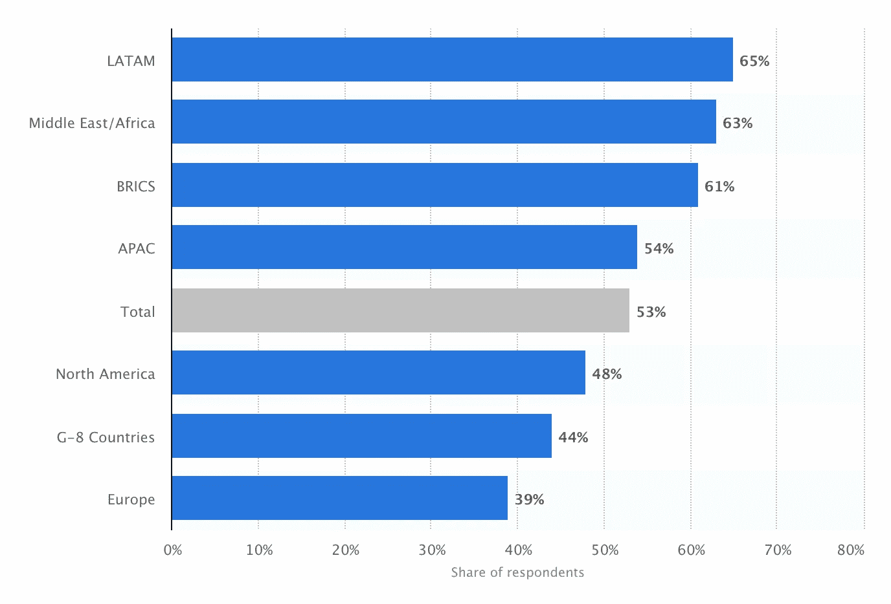
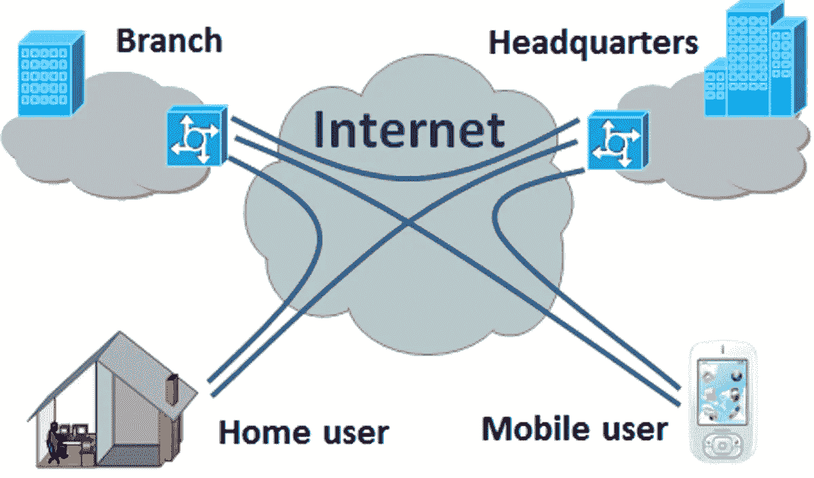
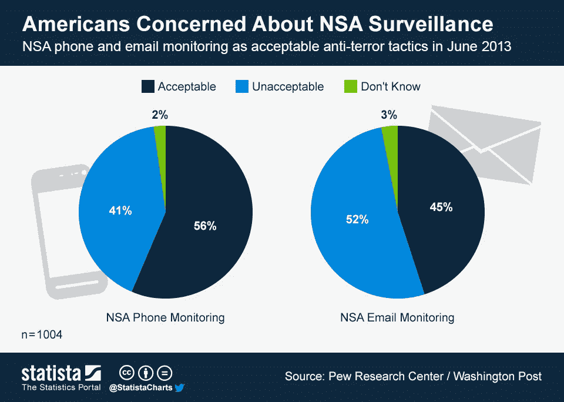

# 基于区块链的去中心化虚拟专用网络可能是私人通信的未来

> 原文：<https://medium.com/hackernoon/a-decentralised-blockchain-based-vpn-network-could-be-the-future-of-private-communication-ee93b664a604>

概括地说，有三方在隐私和网络匿名上打游击。政府机构、网络罪犯和我们普通的互联网用户，他们大多把我们所有的信息交给脸书，然后在脸书抱怨我们的隐私问题。

与 2019 年 2 月相比，全球 53%的用户[现在更加关注](https://www.statista.com/statistics/373338/global-opinion-concern-online-privacy/)他们的在线隐私。

(Image showing the percentage of users who are now more concerned about their online privacy compared to a year ago (February 2019). Image Source: [Statista](https://www.statista.com/statistics/373338/global-opinion-concern-online-privacy/))

随着 21 世纪技术的进步，黑客的能力和威胁也在增长。但是，现在的趋势是更加开放、透明和安全地使用互联网，并采取积极措施保护隐私。许多人转向虚拟专用网，但是他们有意愿和方法比这种传统的预防措施[走得更远。](https://hackernoon.com/where-vpns-fail-to-protect-you-7320a4c9d044)

# **VPN**

Image Source: [The Conversation](https://theconversation.com/explainer-what-is-a-virtual-private-network-vpn-12741)

[虚拟专用网(VPN)](https://www.howtogeek.com/133680/htg-explains-what-is-a-vpn/) 是两条消息之间的隧道基础设施，确保它们不会被 ISP(中间人)窃取，并作为加密消息与连接到全球网络的终端服务器交换。VPN 本质上给你一个不同于你正在使用的 IP 地址。它能让你看起来像是在不同的地理位置冲浪。这对于在某些国家访问审查或不可用的网站特别有用。大多数[VPN 被设计为](https://hackernoon.com/6-tips-for-choosing-the-right-vpn-for-personal-use-5125d8aed601)提供安全性和隐私性，然而当使用传统的 VPN 服务时，仍然存在需要解决的集中问题。

# **集中式 VPN**

传统的 VPN 服务器由一家特定的中央公司托管，每笔数字交易都通过该公司进行。这些集中式治理服务器通常由一个商业实体控制，该实体收取订阅费用并出售数据和带宽。当地法规允许披露用户数据。也就是说，这些公司很有可能保存和储存你的个人数据。

没有一个中央服务器是安全的，可能容易受到黑客的攻击。当谈到首先满足用户对 VPN 的需求时，它们实际上是违反直觉的。

# **基于区块链的分散式 VPN**

基于区块链的分散式 VPN 网络不依赖于中央控制点。由于没有单一的权威，这个系统自然变得更加公平和安全。数据记录到[区块链上的方式体现了](https://hackernoon.com/wtf-is-the-blockchain-1da89ba19348)去中心化的真正价值。

(Image showing centralized vs distributed ledger. Image Source: [Tradeix](https://tradeix.com/distributed-ledger-technology/))

简单地说，一个分散的 VPN 结合了许多计算机的流量，并使用对等系统进行通信。因此，每台计算机都充当服务器。来自区块链技术的额外帮助允许节点做出影响 VPN 的决定。这意味着分散的 VPN 不能被黑客攻击，因为为了这样做，每个计算机节点都必须被黑客攻击才能访问系统。

如果私人通信的未来真的依赖于分散的区块链虚拟专用网，立即开始是明智的。一些[最安全的 VPN 服务器](https://www.techradar.com/uk/vpn/best-vpn)可以在 ExpressVPN、NordVPN、Private Internet Access、PureVPN 和 Perfect Privacy 中找到。

我们现在正看到私人通信初创公司的崛起，它们提供一种旨在保护 GSM 系统中电话通话和互联网连接保密性的全方位解决方案。

提供的一些服务包括:

禁止地理数据传输

*   随机路径选择
*   提供替换出局号码
*   与订户的匿名通信
*   修改语音功能
*   用于来电的虚拟电话号码租赁
*   匿名用户连接

然而，你不应该期望支付我们都习惯了的包括无限数据和通话的标准手机网络费用。私人通信网络可能会变得相当昂贵。

# **私人通信的未来**

除了从数字世界中彻底消失(实际上是不可能的)之外，你没有什么办法可以避免被数字巨头追踪。

鉴于几乎一半的美国人认为国家安全局的电话监控是不可接受的，现在是考虑你的隐私的最好时机。

Image Source: [Statista](https://www.statista.com/chart/1177/americans-concerned-about-nsa-surveillance/)

为了避免你的个人数据被泄露，一个分散的基于区块链的 VPN 是私人通信的最聪明的途径，原因如下。

让我们重申这一点，并强调区块链上分散式 VPN 的潜在安全性。由于没有信息存储在一个中心位置，网络罪犯几乎不可能入侵。这是因为当信息被记录在区块链的分布式账本中时，它不能被更改、删除或篡改。该网络提高了您运营的网络的透明度和安全性。

目前，“现代电信远未饱和，根据 GSMA 的数据，全球渗透率达到 63%”，首席财务官兼 [Irbis Network](https://safecalls.io/ieo/) (SafeCalls)的联合创始人 Maxim Ploskonosov 说。

传统的通信网络基于集中式服务器。它们都使用包含元信息交换的信息包来建立通信，然后中央服务器对该通信进行调解。通过去掉中央服务器，私人通信变得真正私密。

少数集中的 [VPN 服务器](https://hackernoon.com/the-evolution-of-vpns-from-business-security-to-privacy-protection-b45a3bbf490f)的寡头垄断违背了区块链经济的原则；平等、公平和合理的逻辑。结合分散的 VPN 网络，由于完全竞争，公平的价格有望被设定。