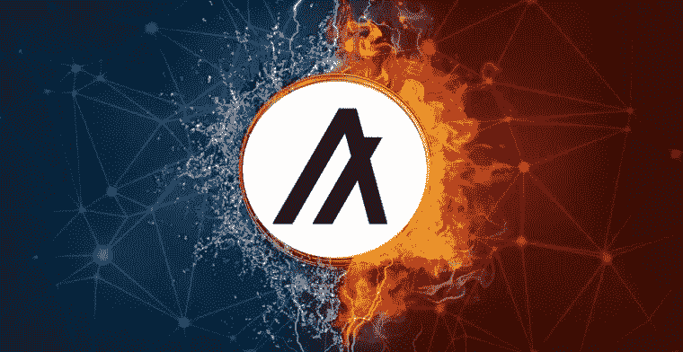

# 阿尔格兰德公司的一个致命缺陷:·王教授剖析了他们著名的共识协议

> 原文：<https://medium.com/hackernoon/a-fatal-flaw-in-algorand-professor-yongge-wang-takes-apart-their-renown-consensus-agreement-4c111286cdbb>

5 月 11 日，就在[algrand](https://www.algorand.com/)main-net 发布的前几个月，北卡罗来纳大学专攻密码学和区块链的教授[王教授发表了一篇题为《再看 algrand》的论文，这篇论文在 Twitter 上受到了业内领先的专家的关注和赞扬:](https://webpages.uncc.edu/yonwang/)

**他讨论了 Algorand 共识协议的致命缺陷，揭示了该协议不能保证系统及其用户的安全。**

## 背景

为了解决区块链的“[不可能三角形](https://cdn-images-1.medium.com/max/1600/1*ku6BQndRRq9BmqX8mWv_oQ.png)”问题，64 岁的图灵奖得主、麻省理工学院计算机科学与人工智能实验室(MIT CSAIL)教授希尔维奥·米卡利提出了阿尔格兰德项目。根据其白皮书，阿尔格兰德是一个“真正的分散化区块链”，他们声称他们的分散化设计方法不同于其他现有的区块链解决方案。

algrand 使用一种利益证明(PoS)的变体作为他们的共识协议，其中 algrand 网络上的交易记录在由一个独立委员会生成的[块](https://en.wikipedia.org/wiki/Blockchain)上，该委员会是从所有用户(或“矿工”)的集合中随机选择的。在委员会的选择过程中，Algorand 的独特方法是加密抽签，这意味着用户是唯一知道他或她是否是委员会成员的人。任何潜在的恶意参与者都不知道其他委员会成员是谁，因此他们无法贿赂或发起拒绝服务攻击。Algorand 每次都会更换块生产者，这意味着不需要固定的委员会，这反过来又使恶意用户更难操纵交易历史。Algorand 的出现引起了业界的广泛关注，由于其创新的技术和杰出团队的支持，该项目被认为是区块链行业的新标杆。

Algorand 的出现在学术界引起了争论，许多学者和专家对该项目进行了深入细致的研究，包括王教授。经过一段时间的严格论证，王教授得出了一个与他在学术论文中所解释的阿尔格兰德白皮书不同的结论。

## 阿尔格兰德的致命缺陷

在王教授的论文中，他指出 Algorand 协议中的一致性协议很少作出致命的假设，这些假设前提不能保证整个系统的安全性。

缺陷一:在许可的 Algorand 环境中，假设至少 2/3 的用户是诚实的，在没有进入门槛的 Algorand 环境中，假设至少 2/3 的货币单位是诚实的。在这些假设下，阿尔格兰德·区块链分叉的概率最多是 1/109。

缺陷二:Algorand 协议假设大部分用户(或拥有最多货币单位的节点)是诚实的。特别是，它假设所有诚实的用户都不会泄露他们的临时密钥，并且这些密钥在达到目的后会被销毁。

针对以上两种误解，王教授在文中作了详细的论证。他认为，在阿尔格兰德协议中，如果攻击者控制了 1/3 的货币，那么他们就可以有效地恶意分叉区块链。同时，诚实节点不会泄露其自己的密钥的假设不成立。在恶意经济利益的驱动下，下面的任何节点都可能有泄漏临时密钥的动机，这将损害整个生态系统。

阿尔格兰德队官方尚未对此事做出回应。根据最新消息，Algorand 的主网络技术已经准备就绪，主网络将从用户的小型可信网络开始慢慢铺开。一旦协议完全公开，王教授关于 Algorand 的问题将得到事实的验证，我相信，随着时间的推移，“真正去中心化”的网络将得到检验。

Kinsa Durst 是 SperaX 的营销经理，SperaX 是开源硬件节点上第一个去中心化的后量子安全协议。