# Git 和 GitHub 简介 ELI5 方式

> 原文：<https://medium.com/hackernoon/a-gentle-introduction-to-git-and-github-the-eli5-way-43f0aa64f2e4>

一个软件开发团队通常由两个或更多的人组成，他们为一个特定的项目在同一个代码库上工作。这使得开发人员以一种容易理解和轻松的方式了解团队其他成员随着时间的推移所做的新变化变得非常重要。

这其中一个 ***版本控制系统的概念【VCS】***派上了用场。Git 是一个广泛用于软件开发的 VCS。

通过这个强大而简单的机制，所有的团队成员都能够通过一个良好记录的方法在一个单一的代码库(也称为主分支)上工作。

xkcd ❤ btw git isn’t complicated at all

# 什么是 Git 存储库？

Git 存储库指的是一个在线容器，您可以在其中存储、贡献和管理您的源代码。它类似于工作站上的智能文件夹，可以记录自启动以来对其所做的所有更改。

如果您对存储库的结构有适当的理解，您可以在现有代码的基础上进行构建，而不是从头开始，由他人以奇怪的方式运行它。

# 如何在 GitHub 上建立 Git 存储库

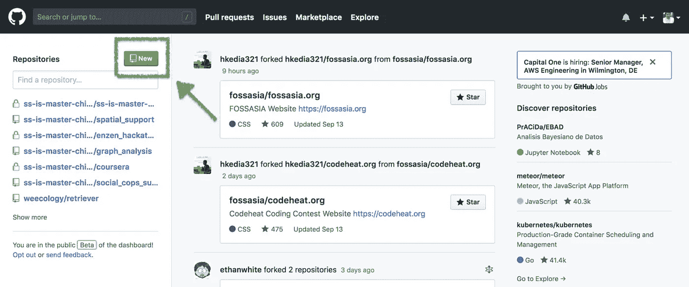

GitHub landing page after logging in

点击 ***New*** 后，您将看到以下字段，用于填充和初始化您的新存储库。存储库可以是 ***私有*** (仅限于贡献者)或 ***公共*** (对所有人免费开放)。

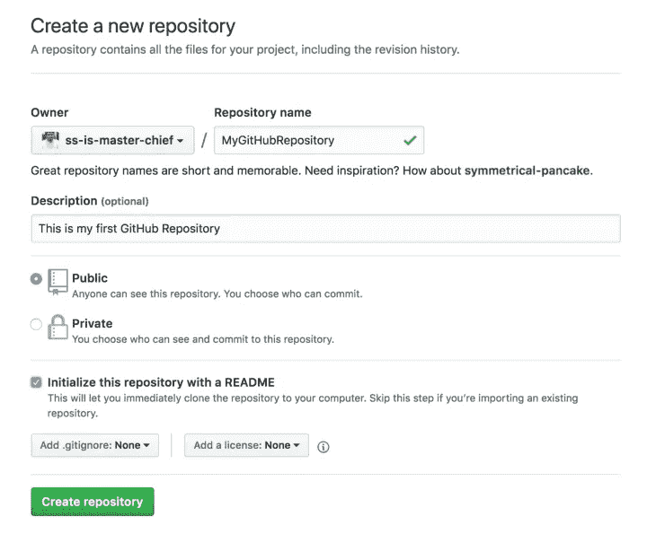

***自述文件*** 是你的存储库中最重要的降价文件之一。作为一种最佳实践，您应该始终用指示您的进度、调试信息的文本填充它，或者作为访问者如何在他们的个人工作站上运行您的项目的一般(或全面)指南。完成后，您会看到存储库。

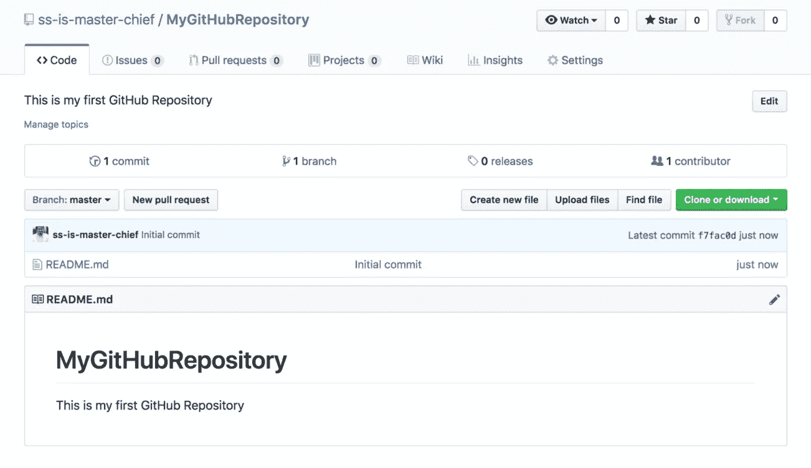

GitHub Repository landing page

# GitHub 存储库的基本工作流程

# 克隆(下载)您的资源库

Cloning a repository

您可以使用 ***下载 ZIP*** 选项简单地下载您的存储库，或者使用 Git 的 ***命令行界面(CLI)*** 向您介绍一个无限可能的世界。如果你的系统上还没有安装*Git*，你可以在这里参考这个神奇的指南[。](https://linode.com/docs/development/version-control/how-to-install-git-on-linux-mac-and-windows/)**

# **使用 CLI 克隆 GitHub 存储库**

****CLI 命令:** *git 克隆<仓库-url > <目的地-目录>***

**以下示例说明了仅使用 URL 对存储库进行简单克隆。但是如果您想将整个结构放入您选择的文件夹名称中，您也可以添加目标目录参数。**

**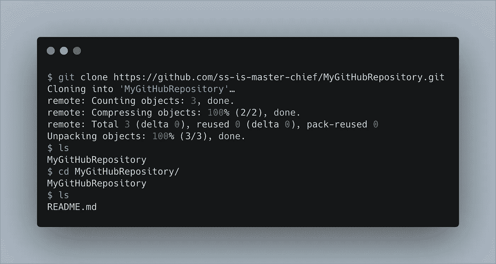**

# **什么是遥控器？**

****

**与本地存储库(离线)相比，远程存储库是指 GitHub 使用的云平台上托管的存储库。*https://github . com/ss-is-master-chief/mygithubrepository . git*是我们之前创建的这样一个存储库的例子，可以使用 URL 进行引用。**

**但是，每次我们需要通过 git 执行操作时，都使用整个 URL 是很繁琐的。为了方便起见，我们可以在这里为存储库 URL 分配一个 ***别名*** 。默认情况下，URL 被称为 ***原点*** ，必要时可以更改。**

1.  *****Fetch*** 指的是从我们的存储库所在的服务器上获取/下载变更/数据。**
2.  *****推送*** 指的是将变更/数据从我们的本地机器上传到存放我们的存储库的服务器。**

****

**出于演示的目的，假设我们希望在上游添加另一个名为*的遥控器，它是同一个 URL 的别名—*https://github . com/ss-is-master-chief/mygithubrepository . git****

****

**使用 ***上游*** 远程从我们的主存储库(可能是其他人的版本)获取文件并推送到我们自己的存储库 ***origin*** 是一个很好的做法。**

**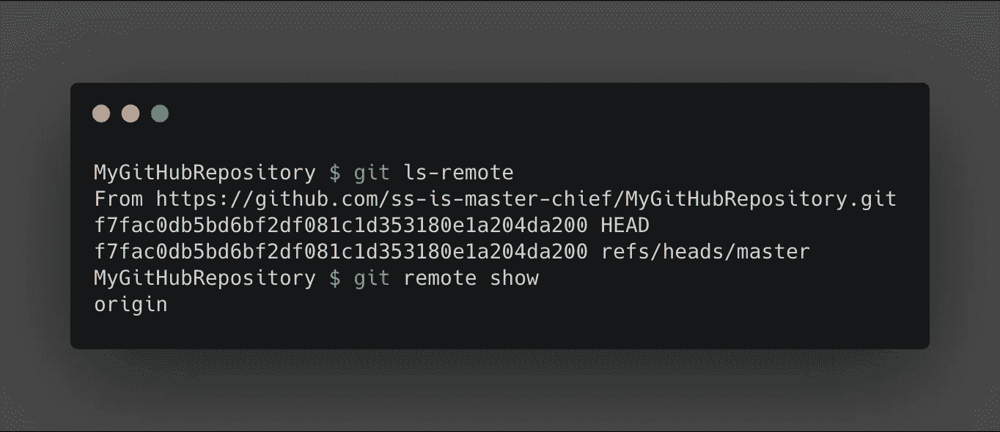**

# **我们来谈谈分支**

**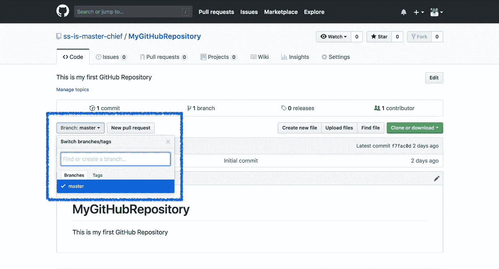**

**如果你打开你的 GitHub 库，点击 ***分支*** ，你会看到你(或贡献者)创建的分支列表。目前，由于我们刚刚建立了资源库，您将只看到一个，即 ***主*** 。 ***主*** 分支是你的最终代码应该存在的主要分支。**

**现在，如果你脑海中有一个还处于实验阶段的特性，该怎么办呢？这就是创建和处理一个新分支的地方。**

**“分支”是以当前的`master`代码作为基础代码开始的新轨道。它已经通过下图进行了演示。您可以在名为`BigFeature`的新分支上工作，而不会影响您的主代码库。两个分支`master`和`BigFeature`可以独立工作。**

**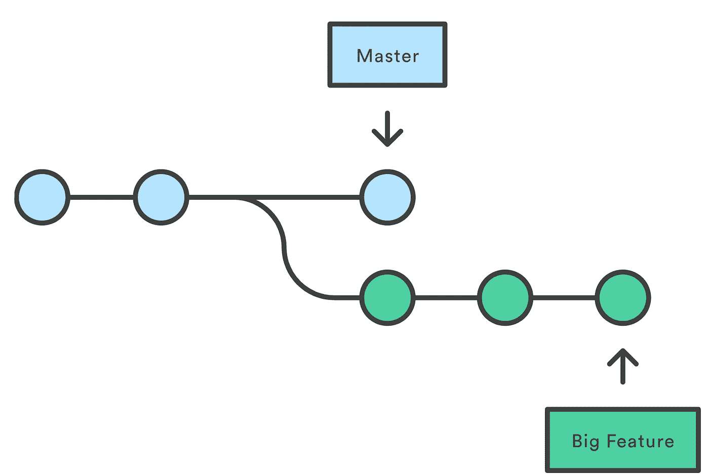**

**在命令行中，我们可以使用命令`git branch`返回我们当前拥有的所有分支。`*`指的是我们目前正在做的分支。**

**我们使用 **CLI 命令:**
`git checkout -b <Branch-Name>`创建一个新的分支。**

**我们也可以使用命令`git checkout <Branch-Name>` ***切换到另一个分支。*** 如果我们想删除一个分支，我们可以使用`git branch -D <Branch-Name>`**

**让我们使用 Git CLI 建立一个分支。**

**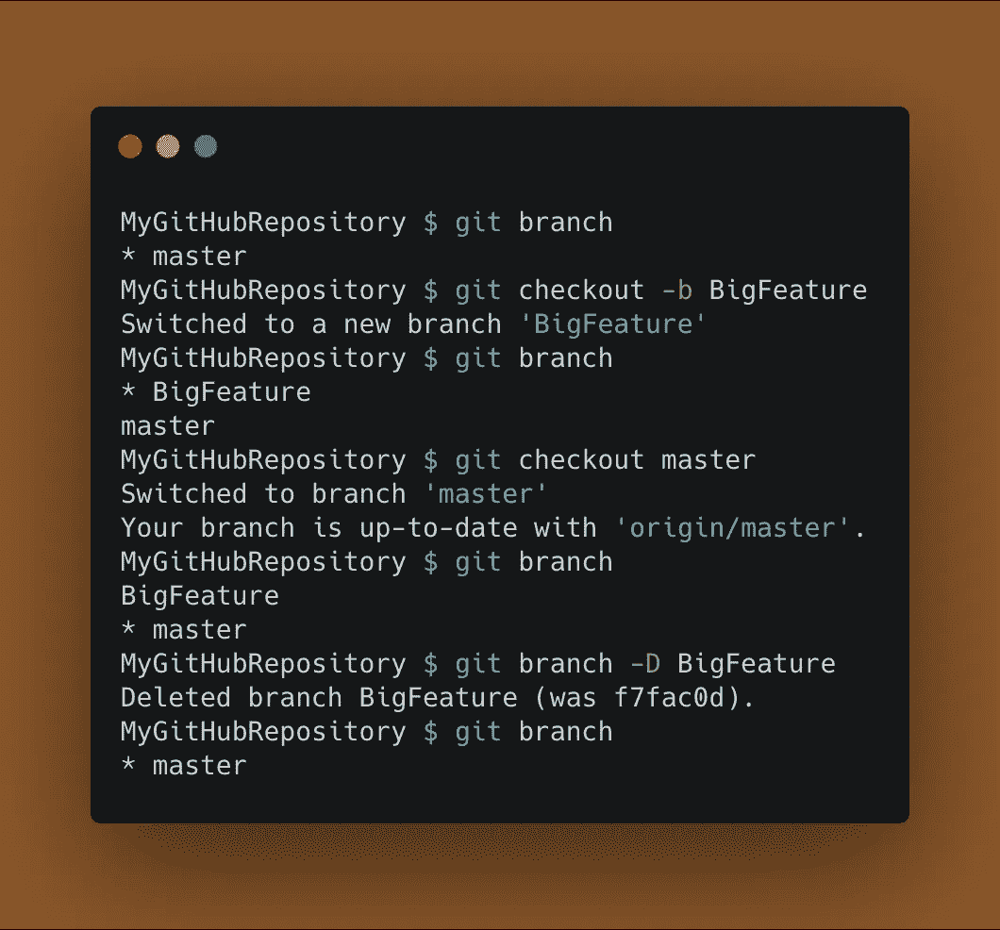**

**以上改动都是局部进行的。这意味着还没有任何东西被反映回我们的 GitHub(在线)存储库。**

**让我们创建另一个名为`test`的分支，对其进行一些修改，并将其上传到我们的主存储库。**

**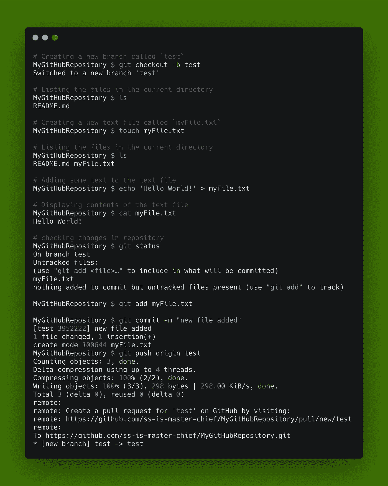**

# **什么是 Git 状态？**

****

**Git 状态是指您修改的文件当前所处的状态。例如，一旦您对“README.md”文件进行了一些更改，该文件现在就被“修改”了。但这并不意味着，我们可以立即将变更上传到存储库。为了确保程序确认您的更改，我们必须将 ***修改后的*** 文件添加到 ***暂存区*** 。**

**考虑一个 10 个学生坐在礼堂里的例子。他们中的 5 个人被告知要打扮，即 ***修改后的*** 并被要求上台。这意味着这 5 名学生在 ***集结区*** 。现在，学生们已经准备好表演，即 ***提交*** 到剧中。**

**让我们通过 Git 来表示这个场景。我们将对 ***README.md*** 做一些改动。我们在文件末尾添加了一行“*这是一些更改”*。**

**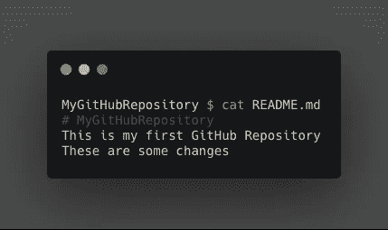**

**我们可以使用 **CLI 命令:** `git diff`来检查发生了什么变化**

**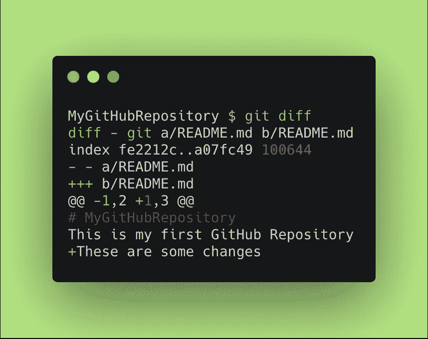**

**要检查哪些文件被更改，我们可以使用 **CLI 命令:** `git status`。它将返回临时区域的状态。在下面的演示中，我们注意到“README.md”被标记为“modified ”,并以“红色”表示(在您的终端窗口中)。**

**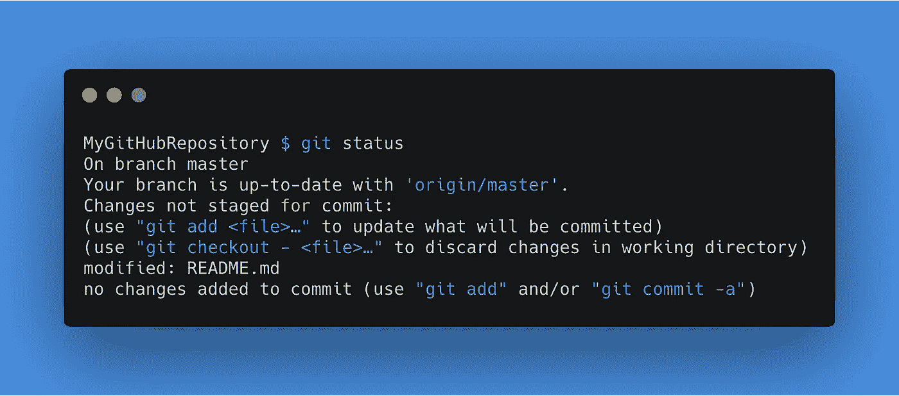**

**现在，我们将把(我们选择的)变更添加到临时区域。基本上，我们试图管理我们想要上传到存储库的变更(但可能不是全部)。我们将使用 **CLI 命令:** `git add <file-name>`。修改后的标签现在将变为“绿色”(在您的终端窗口中)。**

**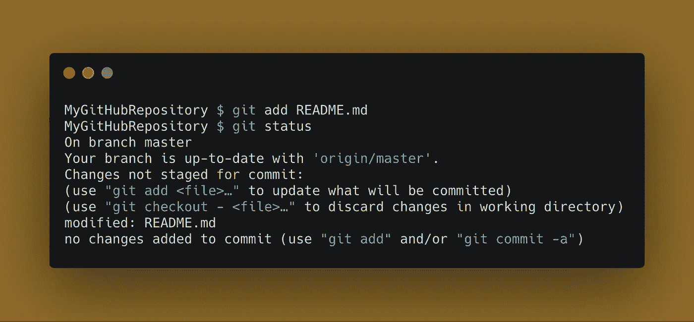**

**一旦我们添加了文件，我们将 ***提交*** (上传)对我们库的 ***主分支*** 的更改。**

**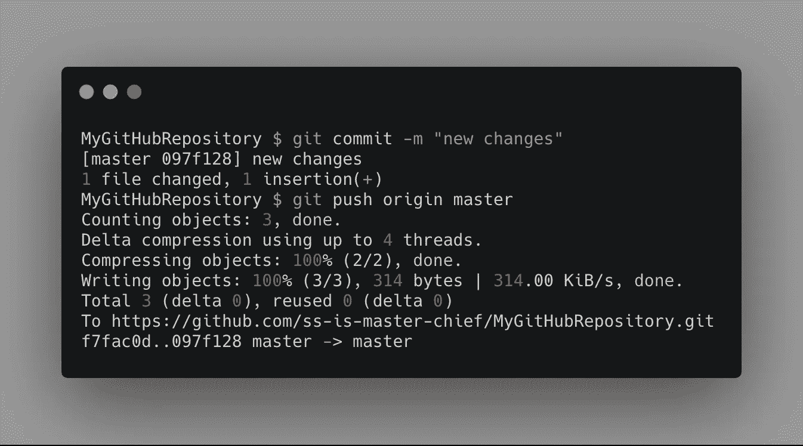**

# **合并**

**让我们创建一个名为`new_branch`的新分支，并通过创建一个名为`new_branch_file.txt`的新文件对其进行一些更改。我们在`new_branch_file.txt`中增加了一行“这是一个新的分支文件”。**

****

**两个分支`master`和`new_branch`相互独立。`new_branch`中的变化不会反映在`master`中，直到我们希望它反映出来。下面的代码片段展示了独立性。**

**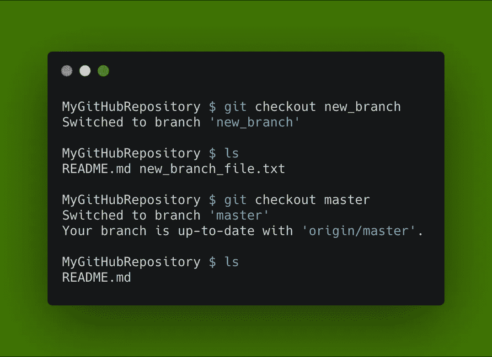****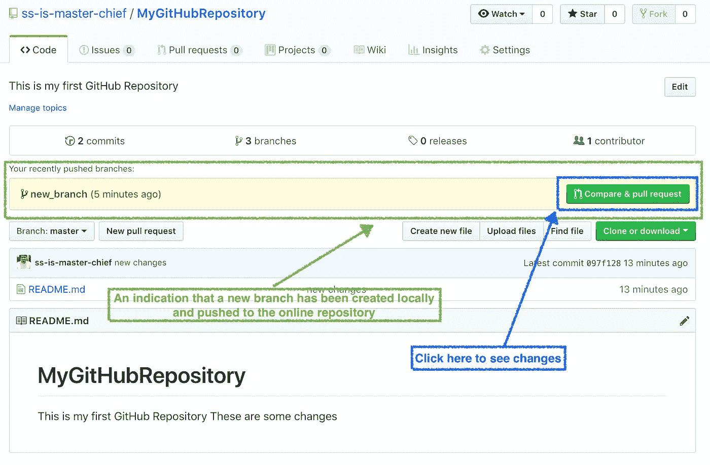**

**Your repository landing page shall indicate if there are any changes between the master and any other branches created by you or any of the other contributors to your project.**

**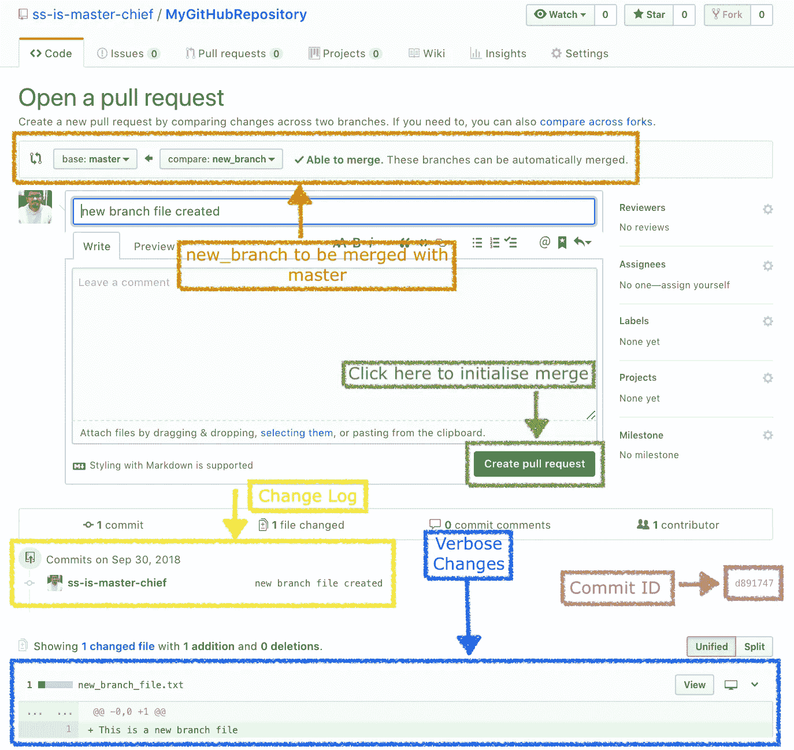**

**Through the Pull Request mechanism, you can review the changes proposed by a developer. Moving on, you could either let it slide or merge it into the destination repository.**

**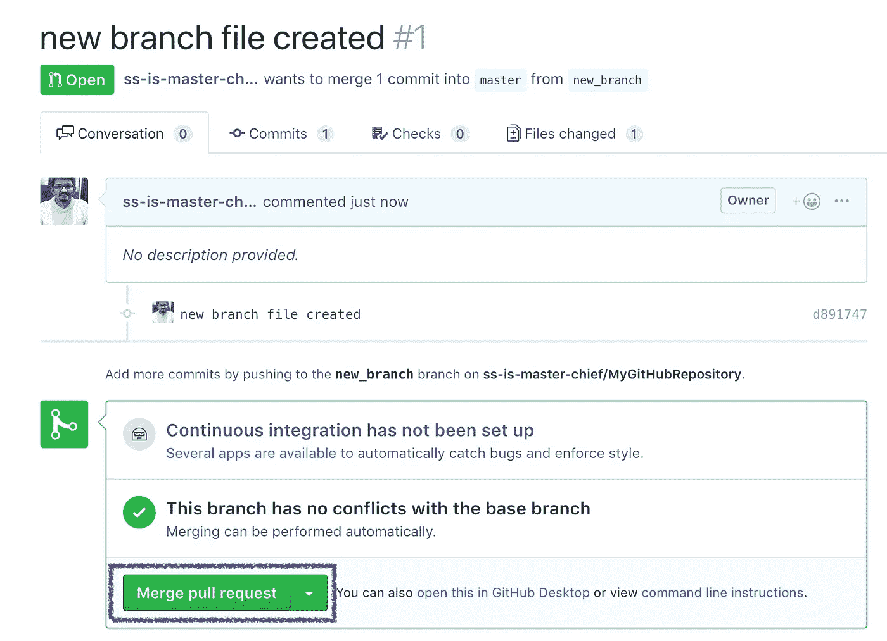****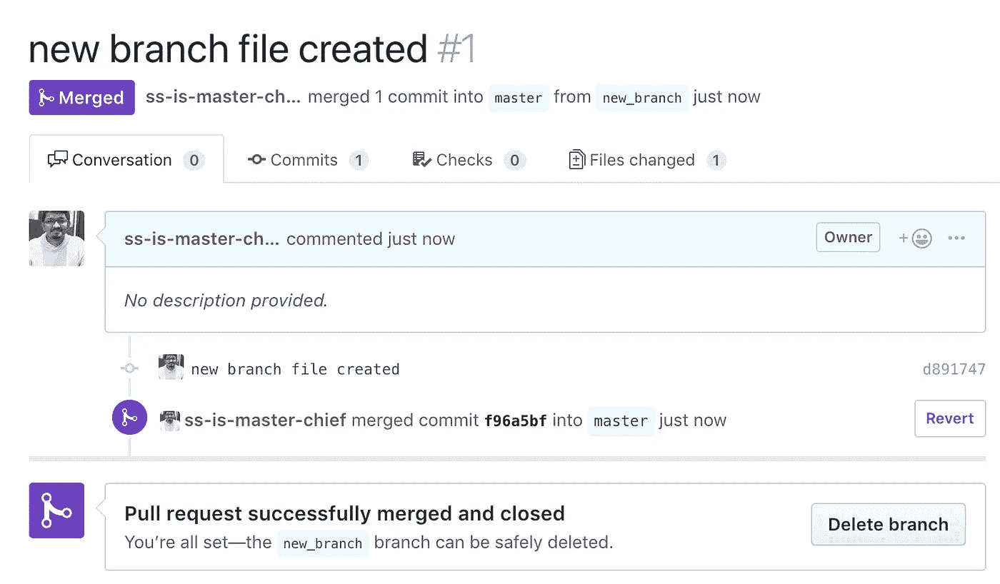**

# **合并 CLI 方式**

******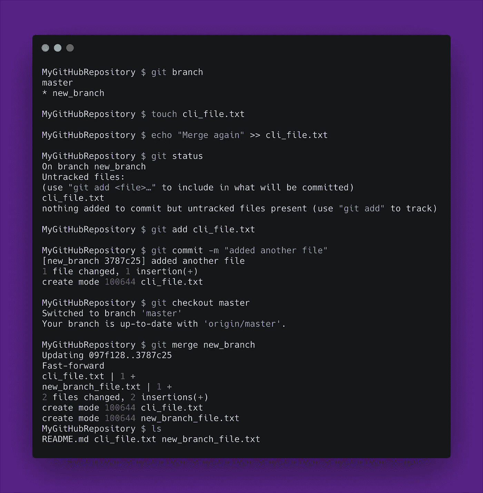**

**咳..太多了。**

**感谢您阅读我解释如何开始使用 Git 和 GitHub 的尝试。请随意评论我应该如何提高我的写作，如果你喜欢，请鼓掌分享！**