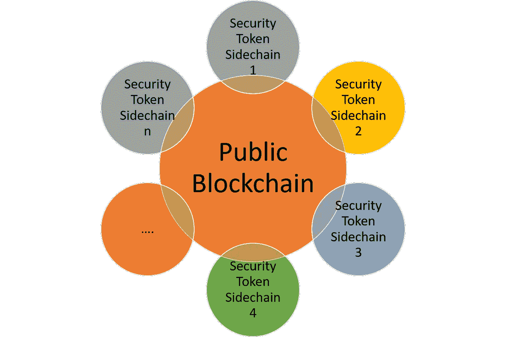

# 一个局部极大值悖论:许可区块链和安全令牌

> 原文：<https://medium.com/hackernoon/a-local-maximum-paradox-permissioned-blockchains-and-security-tokens-ec43d75cf52>

安全令牌已经完全演变为公共区块链场景，但这种趋势似乎正在迅速转变。在过去的几个月里，我已经和至少 12 家初创公司谈过，它们正开始为获得许可的区块链构建加密安全平台。这些类型的解决方案显然旨在使银行和机构投资者的基础设施能够利用安全令牌，同时降低公开区块链的风险。尽管许可区块链用于安全令牌的价值主张可能在短期内看起来很清楚，但对于这一趋势的长期可行性，应该考虑一些非常有趣的经济和技术论点。今天，我想提出一些关于安全令牌空间中的许可区块链模型的想法。

对于大型机构投资者参与生态系统的要求，支持证券代币许可区块链模式的观点似乎是显而易见的答案。在大型金融机构看来，如今公开区块链的风险显然超过了象征化的好处，这为采用这种新的金融工具设置了障碍。乍一看，许可区块链似乎消除了公共区块链运行时的风险，同时允许机构利用加密证券的好处。然而，当您考虑到安全令牌生态系统的可能发展时，这一价值主张变得更加模糊。

# 局部最大值问题

当考虑安全令牌的许可区块链时，我发现一个非常有用的比喻，就是数学上所谓的局部最大值问题。给定特定问题和时间线，局部最大值是在给定时刻为一组相邻解找到最优解的过程。然而，给定一个足够大的时间表，解决方案的最终目标是在整个候选解决方案范围内找到一个全局最大值或最优解。通常，达到局部最大值会阻止解决方案向全局最大值优化。

局部最大值和全局最大值之间的冲突起初很难看到，因为人类的本性是将每个大问题都框定为一系列小问题。然而，就技术市场而言，短期内的一系列最优解决方案并不等同于长期的最优解决方案。一个经常被用来描述当地最大挑战的比喻就像“带着失忆症在浓雾中攀登珠穆朗玛峰”。你看不到未来的全局解决方案，也很难评估短期内的进展。

在安全令牌的上下文中，许可的区块链模型可以被视为局部最大值问题。虽然许可区块链模型的价值主张明确解决了大型机构在采用加密证券时的直接问题，但从长远来看，它可能会产生反效果。更具体地说，*安全令牌行业的全球最大挑战是为大型机构和散户投资者创造有效的运行时间，其他一切都是本地最大挑战*。这一论点绝非无关紧要，需要更深入的分析，所以让我们深入探讨细节。

# 安全令牌的许可区块链模型的利弊

公开的与许可的区块链之间的争论可以引发安全令牌社区中最深刻的激情。然而，通过实用主义的镜头来看待这个问题，我们可以列出双方的一些坚实的论据。

支持安全令牌的许可区块链运行时的一些要点包括:

**隐私:**公共区块链缺乏隐私模型，这对采用安全令牌是一个巨大的挑战。许可区块链提供本地隐私功能，可以在客户网络的范围内托管。

**可扩展性:**尽管安全令牌没有展示任何相关的交易量，早期采用者仍然将以太坊区块链的可扩展性限制视为一个主要挑战。许可的区块链提供可伸缩性和网络增长模式，可以适应特定客户的要求。

许可的区块链模型也为安全令牌的早期采用者带来了重大挑战:

**可交易性:**根据定义，许可的区块链模型将把证券令牌限制在一小部分大型机构投资者手中，从而限制了这些资产的潜在可交易性。

**碎片化:**想象一个金融生态系统，其中的资产在异质且不兼容的区块链上发行。采用许可的区块链架构将使安全令牌生态系统的碎片化增加一个相关的数量级。

**与交易所的互操作性:**安全令牌交易所处于非常早期的阶段，但没有人怀疑它们将成为生态系统中非常重要的组成部分，以实现流动性和可交易性。许可的区块链模型本质上假设流动性将被限制在一小部分投资者手中。为了利用安全令牌交换，许可的区块链体系结构将需要自定义集成工作，这为其价值主张增加了另一层复杂性。

缺乏协议:我们在区块链公共场所使用的大多数优秀的加密金融协议都需要大型网络才能有效。从这个意义上来说，没有一个明确的许可区块链模式来利用现有的知识产权，从很早的阶段就产生了技术债务。

**有限的可编程性:**根据定义，安全令牌的许可区块链模型并不关注在加密证券中实现可编程性。鉴于我相信可编程性是整个安全令牌生态系统的最大好处，我发现这是许可区块链方法的一个主要限制。

## 房间里的大象:构建许可的安全令牌网络

我觉得为安全令牌构建许可区块链平台的初创公司忽视的头号挑战是，在这种受限的生态系统中有机增长网络的难度。甚至像 IBM 这样拥有无限资源的公司也在努力为 Hyperledger 解决方案建立大型联盟网络。建立一个强大的区块链网络需要几个因素的罕见组合，包括适当数量的参与者、正确的激励机制、可扩展的共识模型以及参与者对生态系统增长做出贡献的积极承诺。如果没有这一点，任何区块链网络只不过是一个美化了的账本。

在安全令牌的情况下，小型网络意味着有限的网络效应，这首先否定了安全令牌的许多好处。此外，网络效应的缺乏限制了相关协议的采用，并使网络容易受到各种攻击。

# 安全令牌中许可的区块链架构的两种替代模型

像任何其他局部最大值问题一样，平衡安全令牌的许可区块链的优点和缺点的挑战并不简单。我们知道公共区块链的局限性，以及基于前面的分析，纯粹许可的区块链模型的风险。试着从更长远的角度思考，我认为有几个想法值得在这个领域探索:

## 许可的安全令牌侧链和公共区块链

在安全令牌中的公共和许可区块链之间实现某种程度的平衡的一个有趣的模型是将许可安全令牌侧链与公共区块链挂钩。在这种架构中，机构仍然可以享受许可区块链的可扩展性和隐私优势，同时依靠公共区块链来扩大对散户投资者的访问，并实现与交易所和其他协议的互操作性。

## 一种内置隐私的安全令牌网络

与侧链拓扑相反的是考虑一个单一的安全令牌网络，其中大型金融机构充当验证者和合规执行者，但散户投资者也可以参与其中。在这种模式中，隐私将作为一等公民强制执行，允许将对网络不同部分的访问限制到特定的参与者集合。这个想法隐含地要求您相信安全令牌需要一个全新的区块链网络，这是社区中一个活跃的争论领域。

在不久的将来，许可的区块链可能会成为安全令牌生态系统的一个相关元素。资金雄厚的初创公司和大型金融机构已经在这一领域采取行动。虽然近期的好处显而易见，但安全令牌空间的发展可能会在不久的将来挑战这些模型。实现一个在许可的和公共的区块链体系结构中工作良好的模型是安全令牌生态系统存在的挑战之一。