# 最小魔方解。

> 原文：<https://medium.com/hackernoon/a-minimal-rubiks-cube-solution-that-is-easy-to-teach-dd2a95ef0245>

## 一种易记的解魔方方法。这种方法不是为了加速立方体，但是对初学者来说非常有用。有经验的立方可以把这个教给他们的朋友和亲戚。

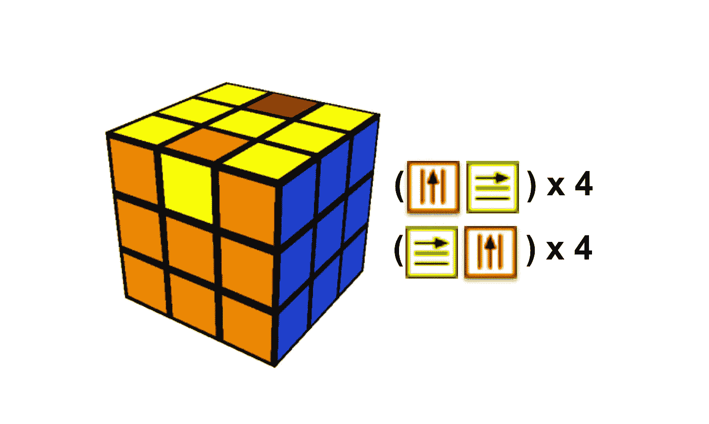

Sneak Peek, last step

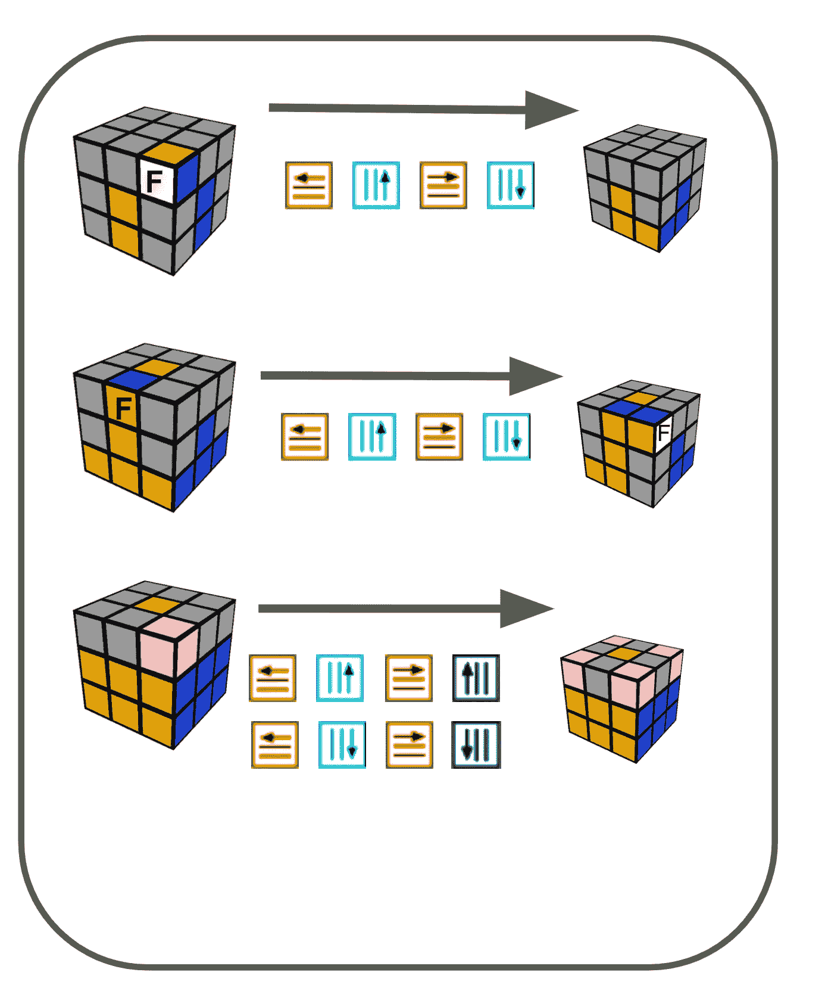

Review of the first three sequences. Note that all of them follow a similar pattern, see explanations below.

# 这封信是给你的吗？

这篇文章是写给两个读者的。
写给 ***魔方爱好者*** ，魔方 ***大多是不入流者***。如果你是第一组，你可能已经尝试过教它，这种方法很容易教。如果你是第二组，你会考虑娱乐性地学习它，但前提是要花大约 15 分钟。你很幸运！

有些立方体求解方法**快**。这个**小**，可以从基本原理算出。(相对于任意记忆。)它由简单动作的最小集合**组成，这些步骤之间有许多共同点。**

我们将在最后回顾这些共性，以便于记忆。

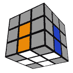

The edge colors line up nicely.

# 第 0 步:底部交叉。

你只能靠自己了。你可以在不打扰别人的情况下在它的位置放一个边。不要在这件事上浪费时间，就这么做吧。如果你被卡住了，在这篇文章的底部有教程的链接。

# 第一步:“下降”——放置第一层的角落。

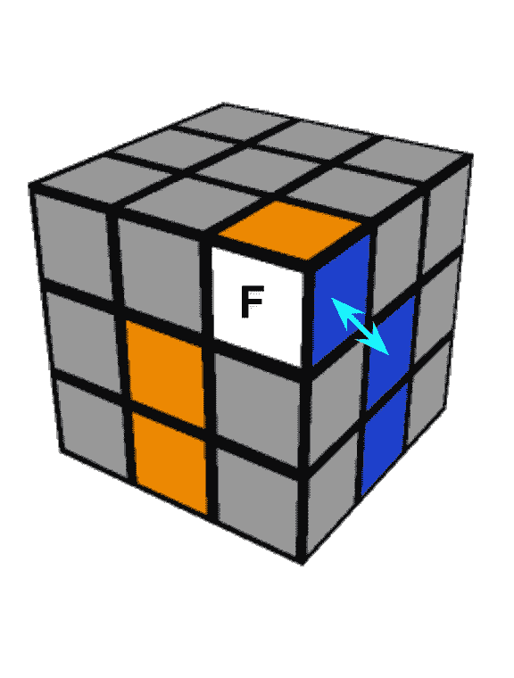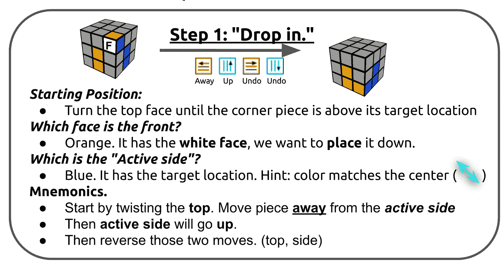

Remember the front face has the piece of interest (the white side of the piece.)

*对所有四个角都这样做。*

## 备选方案:

**如果角被扭曲**并且白色面面对蓝色面会怎样？**原则上没有什么变化**。前面的*面现在是蓝色的**面，因为它握着的 ***主动面*** 是橙色的**。(颜色匹配)*****

*******替代品**[⁽**⁾**](#aacd)****:
a)角已经到位但扭曲:**“step 1:drop in”x 2 **b)白色的一面在上面(不是一面):**“step 1:drop in”x 3 **c)错误的角在下面:**向下移动任意一个角继续。*******

# *****第二步。连接边-第二层边。*****

*****这一步包括利用我们所学的知识。
它有两部分，**步骤 2a** 向上移动拐角并连接到边缘
步骤 2b 实际上是**步骤 1** 。利用你所知道的。*****

*****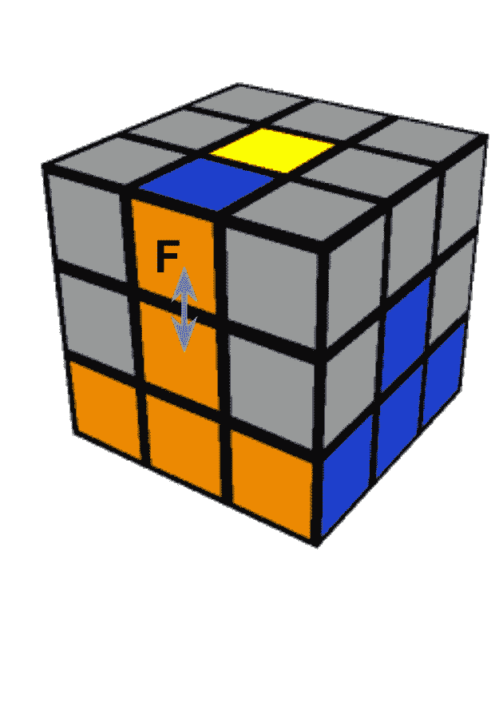**********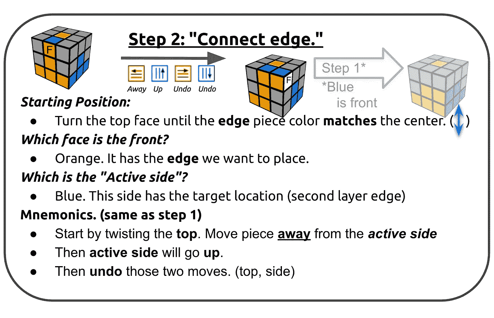*****

*****Remember- the Front face has the edge piece we are interested in. Color match of the center and the edge forms an upside down T.*****

*****对所有 4 个中间层边缘都这样做。*****

## *****助记符:*****

*****动作与步骤 1 相同，但是定义什么是**正面**和什么是**活动面**发生了变化。在第一步中，正面是具有角的白色边(小面)的面，因为那是我们感兴趣的，在这一步中，正面是具有我们感兴趣的部分的面。*****

*****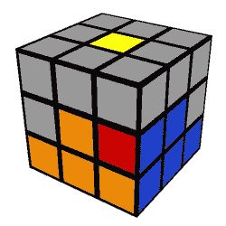*****

*****If you don’t have an edge that you need in the top row, it must be in the wrong place in the middle layer. move it up by moving the wrong one in.*****

## *****备选方案:*****

*****如果你在第一行找不到合适的边缘块，它一定在第二行的错误位置，或者在正确的位置但翻转了，使用此算法将“错误”的边缘放入该位置，它将弹出边缘。然后:**第二步。*******

# *****第三步:“乒乓球”，放置 3 个顶层角。*****

*****这种算法保持一个角不变，交换另外 3 个角。*****

**********

*****The Yellow, Orange, Blue corner piece is in its right place; nestled between the Yellow, Orange and Blue faces. It may not be oriented correctly. That’s fine.*****

## *****方向*****

*****在求解的这个阶段，我们只关心每个角是否放在正确的位置(3 个面与边的颜色相匹配),但是棋子可能以 3 种方式中的一种旋转。我们接下来会处理这个问题。*****

*****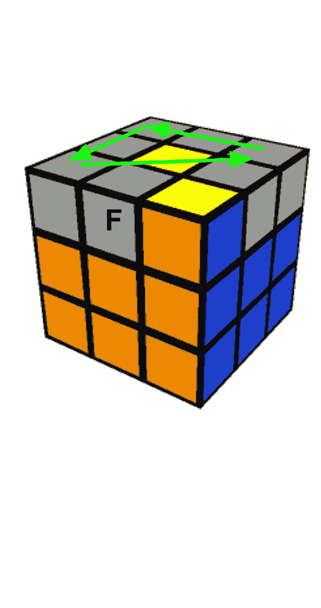**********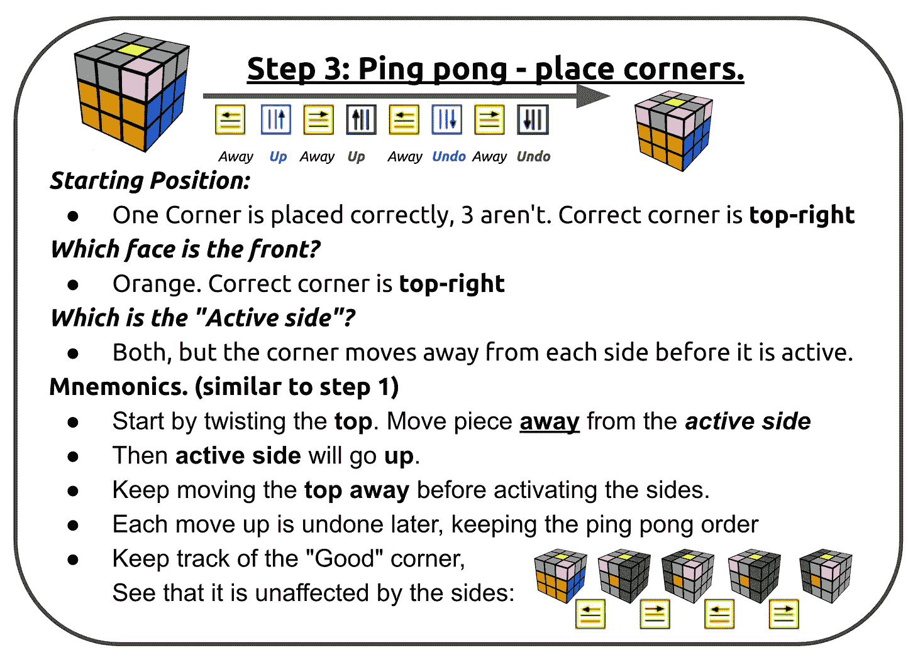*****

*****Don’t bother remembering the direction, instead remember that 3 repeats return to the first state, so repeating the pattern twice is like going the other way.*****

## *****替代品:*****

*   *****你还有 3 个错误的弯道？再做一次。(第三次将恢复到初始位置。)*****
*   *****如果你在正确的地方没有一个边缘…你可能有:
    **0 个角:**不停地转动顶面应该有东西排成一行。
    **4 个角:**全部搞定。恭喜你。
    **3 角:**不可能。第四个必须到位。
    **2 个拐角(相邻):**继续拐，你会发现一个右拐角处有个站牌。(然后**旋转**立方体，使一个是**右上** )
    **2 个角(对面):**挑任意一个角为“好”，运行一次算法，你就处于 1 个角的情况了。(您可能需要转动顶部并旋转立方体。)*****

## *****助记符:*****

*****注意右上角，它会沿着顶行往复移动，总是停留在前面，总是在一方向上或向下移动之前移动*****

# *****第四步:扭转三个角*****

*****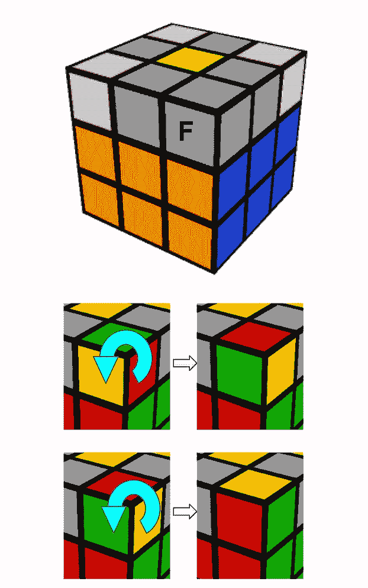***************

*****Don’t bother remembering the direction, instead remember that 3 repeats return to the first state, so repeating the pattern twice is like going the other way. Also notice that the edge corner pair is **never** **broken** by the active edge moving up and down (this is depicted as the **green-orange-white** pair in the final illustration)*****

# *****替代品:*****

******如果需要将* ***拧*****关*** *而不是* ***拧*** ***开*** *怎么办？*
**简单！**刚扭开**又扭开**！
(或者你可以做一个镜像，保持左上角不变)********

*******如果你需要扭转不同数量的角，如 2 或 4，该怎么办？***你需要表演两次，每次都要用不同的**右上角**。
选择一个**不正确**的角，运行该序列(一次或两次)。
第一个序列的结果将是正确扭曲的单个拐角。
为下一次运行制作右上方的正确拐角**。******

******我可以给出更多关于选择哪个角落来减少移动的规则，但我宁愿你做两次移动，而不是记住另一个事实。(这个你以后可以自己想清楚。)******

# ******第五步:洗牌的最后边缘******

******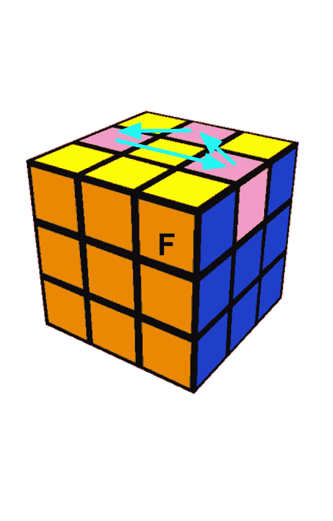************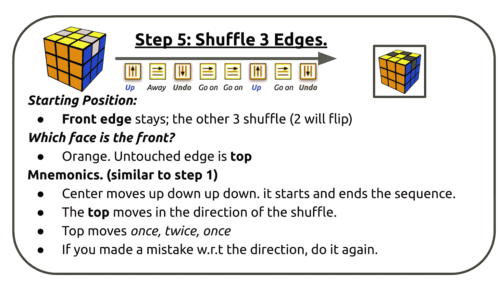******

******Don’t bother remembering the direction, instead remember that 3 repeats return to the first state, so repeating the pattern twice is like going the other way.******

******如果四个都不在合适的位置，你需要用这个方法让一个边在合适的位置，然后用那个面作为正面。在这个阶段的最后，你要么完成，要么需要翻转一些边缘。如果需要翻转边，请转到步骤 6。通过使用这个额外的技巧，你可能不需要第 6 步(这超出了食谱列表的范围，因为它使用了后边缘。)******

## *********高级移动(求解不需要):*********

*******步骤 5 也翻转了两条边(较短的箭头)。您可以通过将第 5 步的第一个和最后一个移动替换为背面的两次旋转来避免翻转。
助记法:序列第一步取顶面后面的边，放在底面后面。就像翻两次背一样。*******

# ******第六步:翻转最后的边。******

******你已经看过了，这是标题正下方的第一张图片。******

******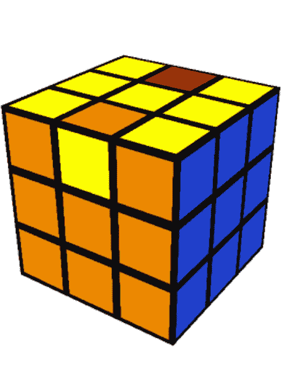************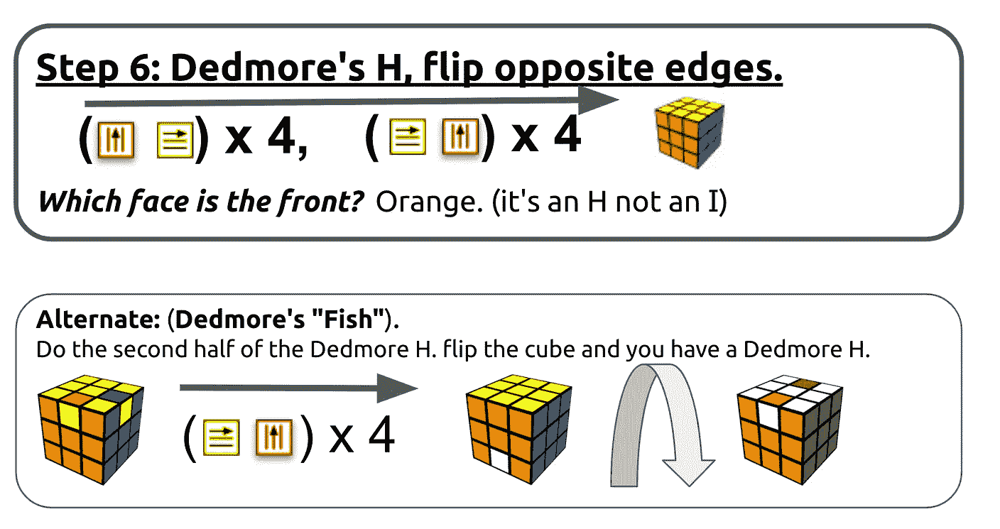******

******This is the same as the sneak peek you saw at the start.******

# ******摘要******

******这是立方体的最小解。你不应该记得太多。这些动作之所以被选中，是因为它们都符合一小套规则。******

*   ******最少的成分。******
*   ******移动或者取消，或者重复 4 次完成一个循环******
*   ******顶部从活动边缘移开******
*   ******移动 1-3 从顶面向外开始，4-6 从“向上”开始******
*   ******所有动作的特点是在**向下**之前**向上********

******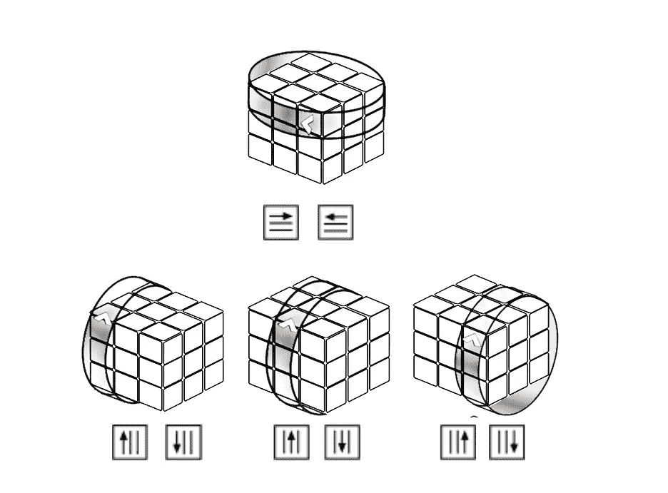************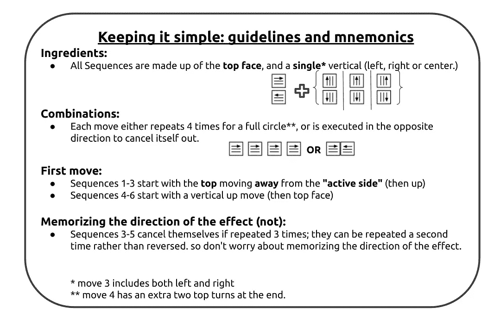******

******The ingredients for any sequence include the top face, and a vertical move******

# ******参考:******

******************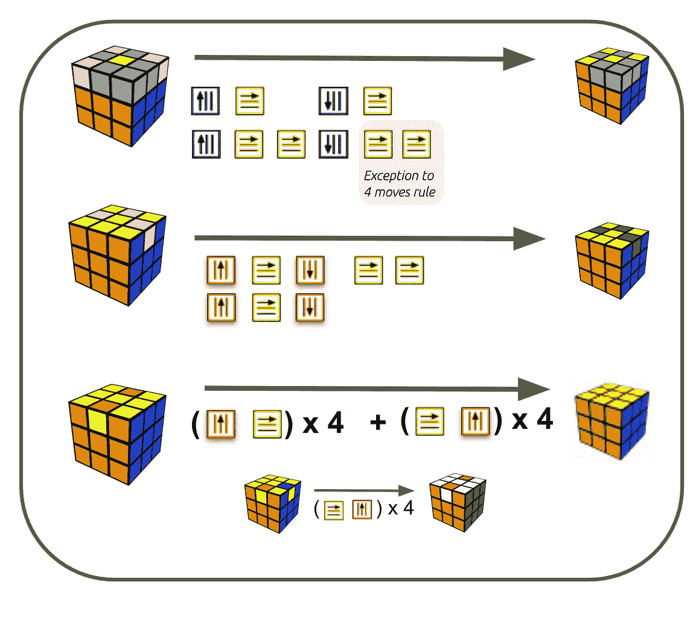******

# ******链接:******

******图像是用 [Ruwix](https://ruwix.com/online-rubiks-cube-solver-program/) 创建的。
箭头符号取自[chessandpoker.com](https://www.chessandpoker.com/rubiks-cube-solution.html)。
白色十字[的解决方案也在 Ruwix](https://ruwix.com/the-rubiks-cube/how-to-solve-the-rubiks-cube-beginners-method/step-1-first-layer-edges/) 上******

******[视频演练](https://www.youtube.com/channel/UCZWc2bmndr79wF76a495ORA)，******

# ******请求:******

******我试图确保涵盖所有可能的情况，如果你在任何地方遇到困难，说明不够，请告诉我。******

## ******脚注:******

******[【1】](#dd1e)组成“步骤 1”的 4 步棋中的每一步都交换上下角- >使用两次将角返回到原来的位置，但将它们扭转一个⅓。(敷 6 次就像什么都不做。)******