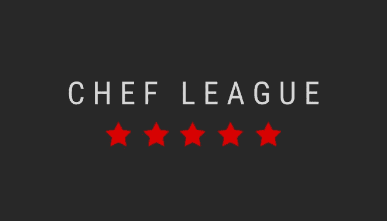
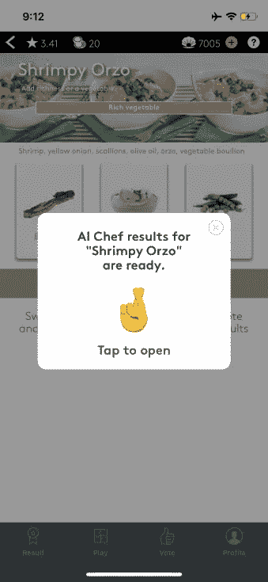

# 一个新的应用程序正在通过人工智能改变学习

> 原文：<https://medium.com/hackernoon/a-new-app-is-transforming-learning-through-ai-dc1722ac525a>

游戏化的人工智能如何被用来教导我们自己的品味。

当我们想到人工智能或机器学习时，我们通常会想到机器人或算法自动完成对人类来说很卑微的重复任务。我最喜欢的一个例子是[对象检测](https://hackernoon.com/tagged/object-detection):识别图像或视频中预先训练好的对象类别(比如人或汽车)。AI 的这种应用往往被视为与人类竞争；人工智能可以检测出制成品中的错误，可以取代过去从事质量控制的工人。

## **人工智能为人类增色**

当然，人工智能还有其他直接增强人类体验的应用，这在以前是不可能的。Spotify 的 Discover Weekly 播放列表背后的算法就是一个例子:该算法让你接触到你以前从未听过的音乐，丰富你的体验，提升你的音乐品味。

现在有一个应用程序正在使用人工智能来提高人类技能，这是一个我们大多数人都需要一点帮助的领域:烹饪。

刚刚在 app store 上推出的厨师联盟(Chef League)通过让用户与人工智能厨师对抗来教用户更好地烹饪，因为他们试图选择最佳配料来修复糟糕的食谱——特别是从互联网上刮来的一星评论的食谱。

正如大多数成功的人工智能实现一样，厨师联盟应用程序中的人工智能厨师依赖于大量数据，在这种情况下[数百万条在线食谱评论](https://www.seas.harvard.edu/news/2019/04/cooking-up-educational-competition)。该应用背后的工程师使用自然语言处理、情感分析和聚类算法来开发八种不同的人物角色，以描述最常见的口味。

当我联系该应用的创始人、哈佛工程教授贝丝·奥尔特林格时，她描述了构建人工智能厨师角色的过程，并将其与 Spotify 的 Discover Weekly 背后的策略进行了比较:“我花了三年时间通过 Flavor Genome Project 建立数据集，并开始识别与众不同的预测性评论者口味。我的意思是，这类似于 Echo Nest 这样的公司如何能够使用与歌曲数据匹配的真实评论数据来识别完全由数据驱动的新“流派”。我们一直在做类似的事情，将评论数据与食谱进行匹配，并发现数据驱动的味觉。最终，其中的一个子集成为了生活在厨师联盟游戏中的人工智能厨师教练。”(Echo Nest 是 Spotify 收购的公司，用于支持他们的每周发现算法。)

Chef League Founder Beth Altringer

## **烹饪出新的学习方法**

请注意在 Spotify 和 Chef League 中，人工智能并没有取代人类的理解，而是使人类能够以一种以前不可能的方式学习。当我们想到食物的味道时——我们喜欢的味道，或者不喜欢的味道(太咸，太苦)——我们经常认为这是一种高度主观的体验。然而，通过处理和聚类数百万份食谱评论中编码的主观偏好，Chef League 能够产生新的见解(以人工智能厨师的形式)，这是人类自己不可能产生的。即使你坐下来通读了数百万条评论，你也没有办法以令人信服的方式总结或使用这些信息。人工智能解开了这一信息，并使我们有可能改进制作美味佳肴的人类任务。

Altringer 坚信，将人工智能应用于教育有着巨大的潜力，特别是在我们可能难以充分描述我们体验的领域:“我从 Spotify 和 Pandora 以不同方式为音乐所做的事情中获得了很多灵感。他们让用户找到他们喜欢的音乐，即使他们缺乏专业词汇来找到它。你可以通过他们的算法找到你喜欢的东西，即使你不知道艺术家的名字、歌曲名称、每分钟的节拍、情绪、专辑名称、流派等。我喜欢这样。”

然而，Chef League 与 Spotify 和 Pandora 的不同之处在于，它实际上会帮助用户更好地理解他们自己的食物口味，而 Spotify 和 Pandora 尚未明确做到这一点，正如 Altringer 所写的那样，“我希望他们建立的东西有一个教育层，也能帮助我更好地理解我的音乐口味。风味也面临类似的挑战。人们一遍又一遍地消费同样的东西，并不是因为他们缺乏冒险意识，而是因为他们受限于他们所知道的用于搜索风味体验的语言。”

A screenshot provided by Altringer

## **AI 更光明的未来**

虽然人工智能对经济的破坏值得健康的怀疑——人工任务将继续自动化，同时新的工作岗位将被创造出来——但人工智能释放以前无法实现的洞察力和增强人类潜力的能力令人难以置信地兴奋。即使有了厨师联盟，Altringer 也已经计划使用更多数据来迭代应用程序:例如，使用食物浪费数据来鼓励用户成为更高效的厨师。

很容易看出这种人工智能训练也可以应用于其他学科:也许一个健身应用程序可以决定你应该更多地关注有氧运动还是力量训练(当然，它可能是有氧运动)，或者像 [Mint](https://www.mint.com/) 这样的消费应用程序可以训练你如何更好地管理你的财务。不过，最终，它将首先依赖于愉快的用户体验。谈到她对这款应用的目标，Altringer 写道:“我希望厨师联盟首先要做的就是让它变得有趣。如果失败了，整个事情就失败了。如果成功了，像这样的游戏可以做得更多。”虽然厨师联盟是第一步，但它为未来提供了一个窗口，在未来，游戏化的人工智能教给我们的东西比我们以前知道的更多。