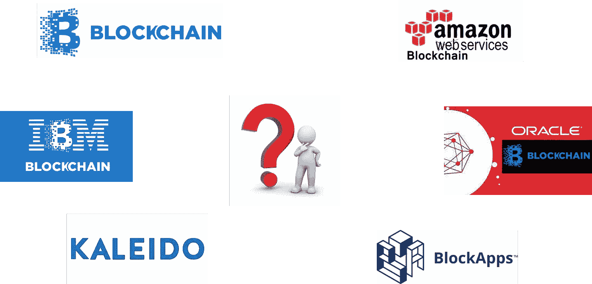
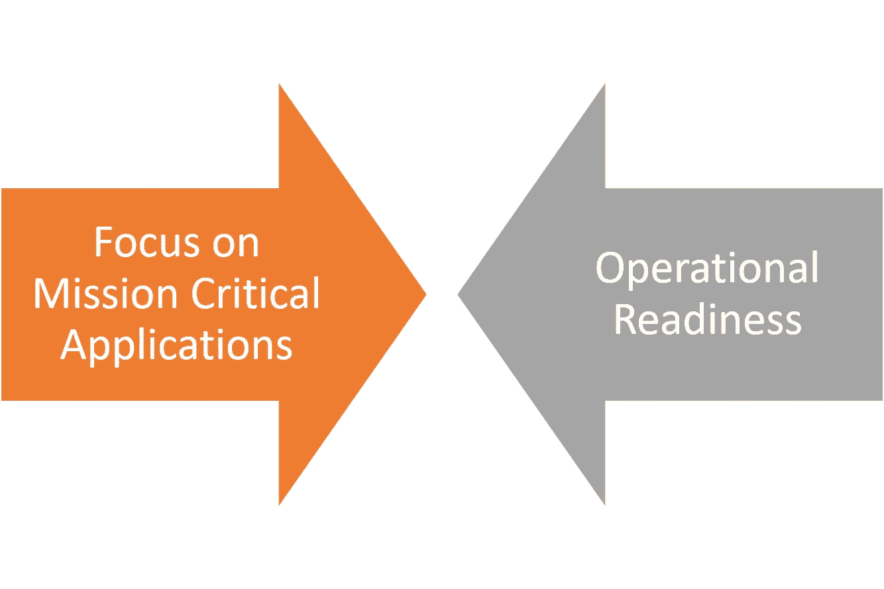
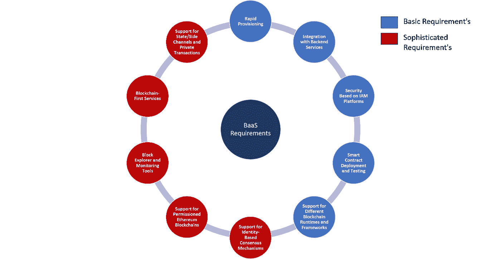

# 区块链即服务空间无废话指南第一部分

> 原文：<https://medium.com/hackernoon/a-no-bs-guide-to-the-blockchain-as-a-service-space-part-i-be07c97b54c0>

## 顶级云区块链运行时的务实视角

区块链即服务(BaaS)空间开始成为顶级云平台提供商和新一代企业区块链初创公司之间的新竞争前沿之一。越来越多的产品发布、合作伙伴声明或 BaaS 中的融资回合，使得区分信号和噪音变得越来越困难。今天，我想根据我们在 Invector Labs 的经验提供一个关于 BaaS 领域的实用观点。

企业环境中许可的区块链解决方案大多仍处于试点和试验阶段。虽然企业对区块链/分布式账本架构的兴趣越来越大，并且处理由区块链技术支持的行业特定解决方案的初创公司数量大幅增长，但生产工作负载的数量仍然相对较低。区块链有限的生产部署有两个主要原因:

1) **关键任务应用:**大多数区块链试点项目都致力于改善复杂的关键任务企业流程，如供应链管理或贸易结算。虽然区块链技术在这些场景中的价值毋庸置疑，但替换现有解决方案可能是一项漫长的工作。

2) **运营不成熟:**管理许可的区块链解决方案的生命周期仍然是一项基础设施成本高昂的工作。用于部署、监控和扩展区块链解决方案的工具仍然非常复杂，并且经常需要专业服务。

在当前的市场环境中，许可的区块链堆栈正在复杂的企业流程中使用，而其运营就绪性仍相对不成熟，因此快速试验、评估想法和展示增量成功的能力变得极其重要。BaaS 堆栈经常成为企业接触区块链解决方案的第一个平台，并迅速成为企业环境中最受欢迎的区块链实验运行时。

# 在 BaaS 平台中寻找什么？

在企业中选择 BaaS 体系时，我们经常看到企业犯两个基本错误:

i. **依赖他们已有的云提供商:**如果你是 AWS 或 Oracle 云的客户，在已经通过公司标准审核的相同运行时运行你的第一个区块链实验是非常有吸引力的。这可能是一个可怕的错误。在这一点上，云提供商对 BaaS 功能的支持相对有限，差异也足够大，值得进行自己的评估。

二。**依靠大型系统集成商:**企业中许多区块链解决方案的初始试点都受到了大型系统集成商(si)建议的影响。根据我们的经验，来自这些大型 si 的知识局限于第 1 层堆栈，如以太坊或 Hyperledger Fabric，但很少利用新的区块链协议和技术来支持公共区块链中的任务关键型工作负载。毫不奇怪，企业中的大多数区块链试点仍然停留在令人难以置信的基础技术上，未能利用区块链生态系统的技术资产。谈到区块链技术，深厚的技术严谨性和对区块链协议、工具和框架的丰富知识比垂直专业知识更重要。

如何为我的场景选择正确的 BaaS 堆栈？在为真实世界的区块链解决方案评估区块链即服务(BaaS)技术时，有一系列功能应该是首要考虑的。这些能力中的一些是显而易见的，而另一些则是重要的，并且在开发过程的高级阶段变得更加相关:

## 基本能力

1) **快速供应:**无需任何基础设施投入即可快速启动区块链网络的能力对于 BaaS 运行时的快速原型开发至关重要。

2) **与后端服务集成:**任何企业区块链解决方案都需要与后端系统和服务集成。对于开发团队来说，为这些集成开发 Oracles 成为了一个持续的斗争，这常常会阻碍生产力。BaaS 运行时应该支持与流行的云服务以及企业环境中流行的主流开源技术的现成集成。

3) **基于 IAM 平台的安全性:**许可区块链的全部目的是……嗯……在网络的不同部分建立许可。与身份管理平台的集成是将企业的安全功能扩展到其新的区块链应用程序中的最简单的方法。

4) **智能合约部署和测试:**智能合约是授权区块链应用程序中创作业务逻辑的主要工具。然而，区块链的不变性使得部署和测试智能合约的过程对于大多数开发人员来说是陌生的。用于测试、审计、版本控制和部署智能合同的工具应该是 BaaS 堆栈的一项关键功能。

5) **支持不同的区块链运行时和框架:**大多数 BaaS 栈支持流行的区块链运行时，如以太坊、Hyperledger Fabric 或 R3 Corda，但很少支持在许可的区块链应用中常见的补充框架和协议。寻找一个对各种区块链技术和协议以及相应的可扩展性机制提供一流支持的 BaaS 平台

## 复杂的功能

1) **支持基于身份的共识机制:**大多数区块链运行时都是基于计算密集型共识机制，如工作证明(PoW)或利益证明(PoS)，这在具有已知身份的环境中运行的企业解决方案中是完全不必要的。BaaS 堆栈应越来越多地支持授权证明(PoA)或类似的以身份为中心的共识模型等机制，这些机制将简化企业区块链解决方案中的交易处理。

2) **支持许可以太坊区块链:**以太坊仍然是市场上最受欢迎的区块链堆栈，但由于隐私或侧链支持等基本技术限制，它在企业中的适用性经常受到挑战。以太坊的变体(如奇偶校验或定额)非常适合企业区块链场景，但大多数 BaaS 堆栈中的支持仍然有限。

3) **Block Explorer 和监控工具:**对区块链应用程序进行监控和故障排除绝非易事。块浏览器是在区块链运行时中跟踪事务来源的常用工具。支持块浏览器并将其与主流应用程序性能监控工具集成应该是 BaaS 技术的一个关键特性。

4) **区块链优先服务:**像 IPFS、BigChainDB、Swarm、Truffle、Metamask、ENS 和许多其他技术都是区块链解决方案在现实世界中的常见构建模块。最终，BaaS 堆栈应该支持这些技术作为本地服务，从而简化开发人员将它们集成到其应用程序中的需求。

5) **支持状态/辅助通道和私有事务:**许多许可的区块链应用程序的计算发生在链外。然而，大多数 BaaS 栈都不支持状态通道或侧链，它们可以帮助从主链中卸载那些计算。提高这种能力确实可以在不久的将来简化 BaaS 运行时的采用。

考虑到上述要求，我们将如何对市场上的主要 BaaS 提供商进行排名？这将是本文第二部分的主题😉