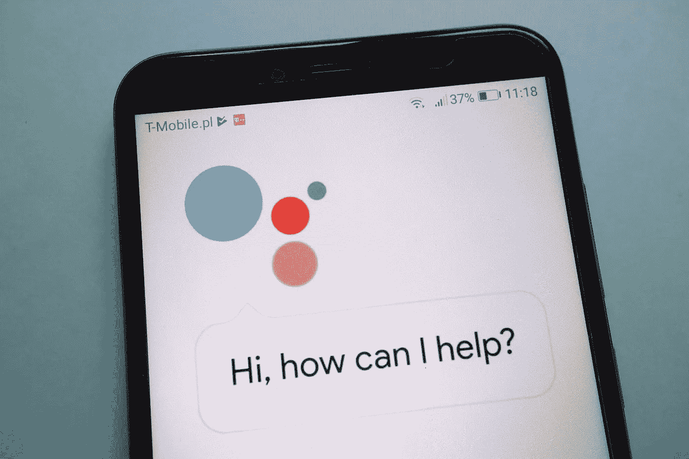
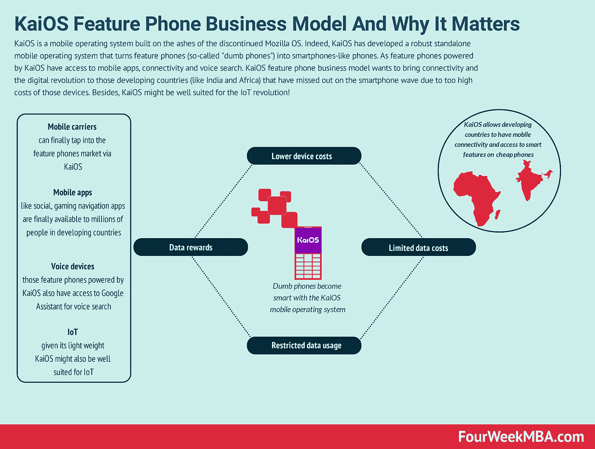
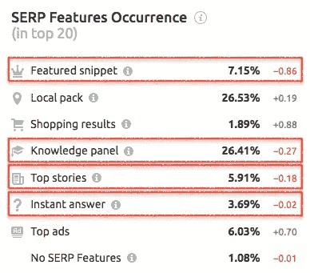

# 关于语音搜索的短文

> 原文：<https://medium.com/hackernoon/a-short-essay-my-notes-on-voice-search-4b285a7458f2>

作为 WordLift 团队的一员，我有幸看到了搜索和语音领域的发展。此外，在 FourWeekMBA 上，我在过去的两年里试验了谷歌的高级功能(旋转木马、知识面板和特色片段),这些功能让我们——我认为——对语音搜索可能的样子有了一个重要的概述。

此外，我已经谈过[语音搜索](https://fourweekmba.com/new-business-models-voice-search/)以及为什么我认为它对[谷歌未来的商业战略](https://fourweekmba.com/how-does-google-make-money/)至关重要。

让我从谷歌的几个举措开始，我认为这些举措显示了该公司在语音搜索上下了多大的赌注。例如，2018 年，谷歌投资了总部位于圣地亚哥的初创公司 KaiOS 。

这是一家为功能手机(智能手机的笨兄弟)开发操作系统的公司。KaiOS 令人难以置信的是，它在功能手机中创造了一些智能功能，如社交和生产力应用程序。KaiOS 还允许功能手机持有者安装谷歌助手。

太不可思议了。最后，世界各地，尤其是印度和非洲的数亿部廉价手机可以连接互联网，并访问过去十年影响全球文化传播的应用程序(如脸书、WhatsApp 和谷歌)。

如果谷歌设法在这些设备上广泛使用其语音助手，它将能够收集大量数据，并非常迅速地进入新兴市场。

还有，2019 年 1 月，谷歌收购了名为 [Superpod](https://searchengineland.com/google-buys-expert-community-and-answer-engine-superpod-for-60-million-310020) 的答题引擎。它为此支付了 6000 万美元。虽然我们不知道谷歌将如何使用它，但我们可以想象它将被用作答案的储存库，这将有助于谷歌增强其语音搜索方面。

如果这还不够，看看下图:

***来源*** *: SEMRush 传感器*

这是来自 [SEMRush 传感器](https://www.semrush.com/sensor/?db=MOBILE-US&category=&compare=serp!99)的图像。简而言之，这是一个基于搜索样本的工具，用来衡量有多少百分比的搜索被作为谷歌的高级功能。

其中一些功能包括[特色片段、知识面板](https://fourweekmba.com/what-is-seo-hacking/)、热门故事和即时回答。这当然只是一个参考点，并不意味着说这些是谷歌高级搜索的准确数字。

然而，它们足以让我支持这些功能是必不可少的论点，不仅因为作为一个企业主，它们可以通过它们给你的公司更多的可见性。

但它们显示了谷歌是如何向语音搜索发展的。事实上，特色片段是谷歌对特定问题的回答，也包括复杂的问题。下面举个例子:

当谷歌截获了一个用户的意图，而这个意图可能会被一个有特色的片段很好地服务。

其他功能，如知识面板、热门故事和即时回答，都是为了在搜索结果页面上推出一些信息，而用户不必点击谷歌提供的网站链接，这样用户就可以在不离开搜索页面的情况下找到信息。

从上图中，你可以体会到这些特征是如何削弱有机内容的可见性的。但它也展示了我们可能会如何走向语音搜索。

事实上，正如[我的博客](https://fourweekmba.com)所示，像精选片段这样的高级功能通常也会成为语音助手中的答案。

这是我的博客中的一个特色片段的例子，来自于“现金转换周期”这个问题，它也成为了谷歌助手的一个答案:

考虑到 2018 年，[谷歌助手](https://venturebeat.com/2018/05/08/google-assistant-is-now-on-over-500-million-devices/)已经在超过 5 亿台设备上运行。这证明了围绕语音的所有兴奋，以及它在网络未来发展中如此重要的原因。

除了伴随新技术而来的所有嗡嗡声、兴奋和乌托邦式的观点，让我们也来看看语音的负面影响。

# 语音搜索是否符合人性？

艾伯特·梅拉比安的经典研究指出，55%的交流是通过肢体语言进行的，38%是通过语气或声音——意思是音调和音乐——还有 7%是通过语言。

不管这些数字是准确的，完全偏离轨道的，还是杜撰的，让我们从一个不同的角度来思考这个问题。

如果我理性地思考这个问题，我倾向于相信我的大部分交流都是通过文字、口语和书面语来完成的。然而，这是想让我认为他是负责人的逻辑方面。

另一方面，我们都知道，每天都有几十个甚至几百个线索帮助我们经历和驱动我们。

从一个人脸上简单的表情，就可以推断出那个人的心情。从一个简单的手势，有整个世界。因此，我想我们可以同意，文字，无论是口语还是书面语，都只是我们交流的一小部分。

剩下的部分就是肢体语言了。就此而言，语音搜索似乎不是取代我们与科技设备互动的最佳选择。相反，身体姿势将发挥关键作用。

当我在街上耳朵里塞着一套 AirPods 的时候，我永远不会大声喊“下一首歌。”我更喜欢在我的左耳上轻敲几下来跳到下一首歌。这确实让我看起来像个傻瓜，但这样更舒服。

此外，随着越来越多的人使用这些设备，那些现在看起来很荒谬的手势可能会成为我们日常生活的一部分。如果我在左耳上敲两下，另一方面，同样属于“AirPods 圈子”的人会明白我也是同一个圈子的一员！

例如，在最近的一项研究中:

***来源****:*[*searchenginejournal.com*](https://www.searchenginejournal.com/new-study-reveals-what-people-are-buying-through-voice-assistants/287277/)

受访者提到不喜欢语音体验的主要原因是:

*   语音购物不舒服
*   非屏幕(适用于 Google Home 等智能音箱)
*   可以更快地打字以获得想要的内容
*   不喜欢说唤醒词(如“嘿谷歌”)

重要的是要注意到，这些设备仍然处于原始阶段，到目前为止，很难控制人们使用它们的体验。此外，这些设备通常很难理解我们。所以和他们说话不像和另一个人说话那么容易。

此外，当技术看起来违反直觉和我们的本性时，人类也会使用它们。我在我的四英寸智能手机上阅读整本书！多年来，人们一直基于关键词在网上搜索信息，而不是使用更自然的语言。

仅仅因为谷歌的语义能力跟不上用户的类人搜索。我们没有改变技术，我们坚持不懈，因为我们不知道任何更好的方法。

因此，单独使用这个参数是行不通的。人们使用科技，不仅仅是因为它有用。他们使用它也是因为他们想要归属感。事实上，当[建立一家公司](https://fourweekmba.com/business-model-framework/)时，科技企业家们很清楚[网络效应](https://fourweekmba.com/two-sided-marketplace/)的重要性。

有了网络效应，平台会随着每个新加入的用户而变得更好。此外，当达到临界质量时，人们会被“社会锁定”当你周围的任何人有一个应用程序时，你也需要有一个。

这些天来，我仍然很难向家人解释为什么我不使用 WhatsApp，或者为什么我多年来一直放弃社交媒体(在 2015 年再次激活社交账户之前，为了更容易地传播 [FourWeekMBA](https://fourweekmba.com) 的内容)。

因此，这些公司将尽可能多的设备放在人们手中的能力，以及进入正确渠道的适当的[分发策略](https://fourweekmba.com/distribution-channels/)，将是至关重要的。让我们来回顾一下。

# 关键外卖

我是语音搜索的信徒。我相信谷歌现在和将来都会在这方面大量投资。我也知道它的局限性。声音可能代表了一个巨大的转变，向另一种更先进的发现信息和与我们周围的物体互动的方式转变。

然而，我不确定这将是我们与事物互动的主要方式。当然，这可能被证明是错误的！

你对此有什么看法？

*原载于 2019 年 1 月 19 日*[*fourweekmba.com*](https://fourweekmba.com/my-notes-on-voice-search/)*。*