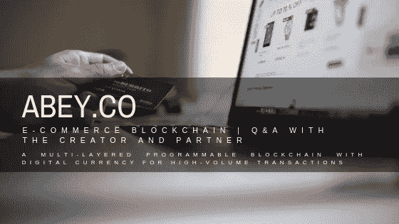
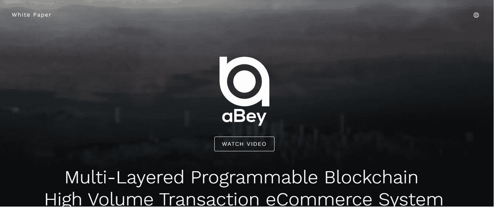

# aBey 电商区块链|与创作者和合作伙伴的问答。

> 原文：<https://medium.com/hackernoon/abey-e-commerce-blockchain-q-a-with-the-creator-and-partner-1561cf4c2f09>

[http://abey.co/](http://abey.co/)

aBey **一种多层可编程区块链方法，用于电子商务系统中的大批量交易的数字货币**

一种新的经济正在到来，它被称为数字经济。一种新的金融形式，一种新的经营方式和一种新的在线服务行业的方式。

在线服务行业呈指数增长，在最近一段时间内，全球电子商务销售额增长了 276.9%。区块链生态系统正在为此做准备，将其他成本节约属性和投资机会带入安全的市场。

在这里查看统计:[https://www . shopify . com/enterprise/global-ecommerce-Statistics](https://www.shopify.com/enterprise/global-ecommerce-statistics)

新的数字经济将在改进的在线市场中提供改进的金融工具，以便在一个公平的生态系统中更好地服务于从商家到附属营销商再到客户的供应链，在这个生态系统中，智能合同和矿商确保尽职调查。

改善交易量等领域，在这些领域，交易预计将通过无边界的低成本支付结构进行实时结算，同时确保用户友好的客户体验、后端流程的适当奖励系统和能源效率，以支持碳中和经济。

这种平台上数字货币的出现进一步增强了生态系统，推动了数字资产及其背后投资工具的价值。具有区块链效率的关键组件允许生态系统以最熟练的方式收集、存储和分析数据。

区块链技术的新时代为数学家、科学家、工程师、开发人员和研究人员提供了构建新系统的途径，这些新系统将使软件包能够改善在线供应链体验，但最重要的是改善业务开展的方式。

当然，关于这些新系统是如何构建的，以及有什么比直接找到 aBey 区块链的源头、创造者、积极的研究人员和联合创始人更好的方法，还有许多有趣的方面。
请允许我介绍西普里安·彭吉拉博士

阿贝

问与答(Question and Answer)

> **#Q1 Scalability: What is the difference between the “historical landmark” and Side Chains by design in this Blockchain model?**
> 
> Sidechains are mechanisms that have the potential to enhance the capabilities of blockchains in general, by moving assets to other blockchains, and they are extrinsic mechanisms associated with blockchains. By comparison, historical landmarks are intrinsic blockchain mechanisms (tightly integrated into the existing blockchain) because they allow for faster download times, faster integration with the blockchain’s mainnet and significantly less storage when doing so. Why download hundreds of GB worth of blockchain data (and waste bandwidth and time) to join a blockchain’s mainnet, when you could do the same with just a few MB?
> 
> **#Q2 Customer Refunds: The Mediators mining model on your Blockchain is an exciting industry first. How will this introduction to the Blockchain be tested before the launch and how does it affect scalability?**
> 
> We have worked on retrieving high-profile names in the e-commerce, marketing, and payment processing industries to support the efforts and join as Mediators in our upcoming blockchain. A number of these partners have already approved and confirmed their presence, and we are confident more will join, as our platform grows in popularity and virtual presence. By design, Mediators are meant to be acting through tightly-coupled roles into the blockchain — scalability is therefore achieved easier than with loosely-coupled elements. Plus, there is the potential of only a minimum number of Mediators to achieve consensus, which is outlined in the whitepaper to be 6 by default, just as in a real court of trial. As with any small-numbered consensus participants, especially in tightly-coupled systems, scalability should not become a concern. The tests we are performing involve simulating real-world fintech transactions, alongside refund requests (to a percentage which is commonly found in the real world of e-commerce), in our own testnet, for example starting with 6, 18 and 72 Mediators.
> 
> **#Q3 The Name function: Is the name function similar to EOS use case and will the Blockchain provide for all E-commerce functionality B2B, B2C, C2C, C2B, B2G, G2B, G2G**
> 
> The EOS Name function, as I understand it from the Cypherglass initiative, is meant to allow people to buy names in the blockchain — and it is not an intrinsic feature of the blockchain, it’s a paid service on top of the blockchain itself. By comparison, names in our ABEY blockchain are completely free, optional and open for everyone to use, and they are an intrinsic feature of the blockchain — their purpose is to allow users to locate their peers faster (should they, of course, want that).
> 
> **#Q4 Compatibility: How compatible will the Blockchain be with Linux or WordPress? Will there be a plugin version?**
> 
> The blockchain’s code is cross-platform compatible, so it could run on Windows, Linux and MacOS X. As for WordPress, because we understand the potential this could bring to e-commerce served throughout WordPress-based websites, we do plan to create in the near future at least one sample plugin for e-commerce integration of the blockchain functionality into WordPress-based websites.
> 
> **#Q5 UI Front End: Interaction between the different parties is very important. Equally the visual aspect of the products on offer.
> How is the designing of the front end going?**
> 
> The designing process is going well and so far, is on track. We have some very talented in-house designers in charge of UI/UX, and we aim to create an ergonomic, friendly user-experience, where people feel right-at-home when opening their wallet, for example, and the experience is intuitive enough to allow even newcomers to adjust quickly to the platform. Basically, we’re aiming for a feeling similar to that of e-banking, but with much less fuss and hassles, focusing on the practical and essential aspects of functionality only.
> 
> **#Q6 Trust & Privacy: How do you aim to gain the trust of E-commerce users from traditional websites and protect their online privacy?**
> 
> We understand trust is the major factor playing an important role in any e-commerce business. That’s why we have already acquired a few major partners to support the initiative, where the blockchain will be playing a major role in the way business is handled, and how it may be used to acquire products, goods, and services.
> 
> Additionally, as the coin grows in exposure, it will also attract more investors, which is why we are aiming to expand our presence in the crypto-exchange industry as well. So far, we have been listed on one public exchange, and are already in the talks with others about a near-future integration.
> 
> **#Q7 Affiliate Marketing: The lifestream of E-commerce, Affiliates. How will you ensure traceability, accountability and precise distribution of funds on all levels of % based commissions?**
> 
> Affiliates work with different business models in modern e-commerce. Some of those involve direct sales, others involve multi-level marketing, while some involve even more complex models. Because of this extrinsic complexity of the business use-cases, we introduce the Trusted Payment Gateway concept, which acts as a buffer between the merchant providing the product or service, and the affiliates making the sale to the final customer. The TPG is the one responsible for the distribution of funds, traceability, and accountability, and is business-specific and focused on the marketing-model used for it. As with many approaches we take in our platform, it is up to the merchant to choose which business model fits best for him, and for which products. He could choose to work with multiple such models of course, for maximizing profits. TPGs will be open for intrinsic competition in the blockchain, to the benefit of the customers and affiliates as well, and we will provide at least one full-disclosure open-source TPG for businesses to use for implementing the model.
> 
> **#Q8 Investment: A fascinating additional attraction to your Blockchain is the “Lending” Implementation for Investors. Can you explain to us how this will work?**
> 
> There are numerous ICOs nowadays for ensuring lending models in the blockchain. Because each model attracts a different type of investor (e.g. lenders), we have decided to simply open the door to making this a possibility — but it is up to the lender to cross that door and step further into the type of business model he wishes to use. To leverage the use-cases and improve the speed of development, we will provide at least one full-disclosure open-source use-case for lending, with technical details covered in the whitepaper. This way, multiple lenders can create a blockchain-focused marketplace for lending crypto, with different business models and intrinsic competition — which is generally to the advantage of the end-user.
> 
> **#Q9 Alpha, Beta, Launch: Share with us your Roadmap in short.**
> 
> An accurate roadmap shall be disclosed soon, as we have long-term ambitious goals and there is still a lot of strong research going on in many aspects of core functionality — some of which is reflected in past or upcoming research papers. In rough estimates, we plan to have a beta version of the blockchain itself by the end of the year, alongside its own dedicated programming language to support development coming shortly thereafter. Every functionality layer will follow afterward.

谢谢你，Ciprian，这是创造区块链技术的特权时代，更重要的是，区块链将改善真正的商业用例。

[http://abey.co/](http://abey.co/)

接下来是我对 Philipp Sauerborn 的采访，他看到了 aBey 电子商务区块链的潜力并与之合作。

> 问答
> 
> **#Q1 aBey 是一个基于区块链的解决方案，解决了当前区块链技术中的许多固有问题。你如何看待 aBey 区块链在 aPay 简化你的业务？**
> 
> 使用以交易为中心的区块链的专有方法作为 aPay 平台的核心，这一技术优势也在许多方面与阿贝区块链共享，我们可以从高度创新的阿贝区块链解决方案提供的技术优势中受益，同时显著增强闪电般快速交易处理的能力，这是当今电子商务的一个重要和核心方面。aBey 为人们提供了独特、创新和务实的大规模电子商务用例，这些用例可以建立在分散/公共区块链之上。aPay 和 aBey 是可互操作的，但它们同时在功能行为的核心方面仍然不同:aPay 将物理世界与电子商务的虚拟世界联系起来，而 aBey 通过以区块链为重点的新兴金融科技世界的创新性区块链用例，增强了电子商务的数字体验。
> 
> **#Q2 产品对您的电子商务至关重要。你如何看待区块链平台改善客户在线购物时的产品体验和整体体验？**
> 
> 我们位于区块链的研究和正在进行的项目的主要重点仍然是从两个不同的角度将金融科技的虚拟世界与物理世界联系起来:有形方面，通过 aPay 及其相关卡以及与加密市场的互操作性；开放/分散方面，通过 aBey 及其相关用例，在区块链实现真正的私人银行用例。我们的目标远高于许多 ICO，因为我们的用例更强大，涵盖了对电子商务业务至关重要的更广泛的功能。随着我们过渡到基于区块链的互操作性的未来，我们率先建立、管理和增强强大的一体化电子商务区块链基础设施和生态系统，将所有这些无缝地结合在一起。对最终用户而言，这意味着更高的透明度、更少的等待时间，而对企业用户而言，则意味着更稳定、更可靠的收入来源的更大潜力。
> 
> **#Q3 由于并非所有供应商都在区块链上，区块链和 Web2 模式之间的 B2B 通信(供应商&商家)是否有任何限制？**
> 
> 我们坚信，区块链和 Web2 模型之间的任何限制(无论是技术、功能还是本质上的官僚主义)都可以通过适当的基础设施设计和模块化来解决。由于 aPay 是一个支付处理器，它可以像 Visa 或 MasterCard 或 PayPal 一样使用——对整个 UX 几乎没有影响。
> 
> **#Q4 您是否会将您的整个 aPay 业务迁移到 aBey 区块链平台上，您预见到了哪些挑战？**
> 
> 我们预计目前 aPay 业务的处理或结构不会有任何变化。阿佩是一个允许的区块链，这是一个根本不同于没有允许的区块链的概念。虽然 aPay 和 aBey 仍然可以互操作，但它们本质上是完全不同的。然而，我们将最大限度地利用 aPay 和 aPay 协议的全部潜力。
> 
> **#Q5 比你的产品清单更重要的是你与客户的关系以及他们在新区块链上的购物体验。你打算如何在 aBey 区块链上扩大客户群、篮子规模和利润？**
> 
> 我认为你的问题更多的是针对零售商，或者会使用我们平台的企业。aPay 是一家平台即服务(PAAS)提供商。使用我们服务的企业将会发现，他们的客户将会体验到阿比区块链提供的潜力，以及 aPay 业务，尽管他们可能甚至没有意识到这一点。aBey 以前所未有的速度进入加密领域，并迅速成为下一代区块链。到目前为止，在 aBey 推出后的几个月内，已经有超过 10 万人采用了它。这是比特币早期增长率的 8 倍，这让我们对其未来和应用非常乐观。这证明我们不仅走在正确的道路上。早期的阿佩采纳者相信我们，相信阿佩区块链和技术的未来。
> 
> **#Q6 另一边是你的供应商。你打算如何简化你的电子商务业务的供应链责任和可追溯性？**
> 
> 对于使用我们服务的企业，根据实际使用情况，效率优势会有所不同。在一个服务驱动和面向服务的商业世界中，现在和未来，包括数百万自由职业者、小企业、家庭工作者、兼职企业家、学生，以及任何被要求或愿意部署技术来交付或管理其服务的服务提供商:使用 aPay 和/或 aBey 可以极大地促进问责制，这是两者的核心特征。可追溯性与服务提供中的责任密切相关，因为在达到某些/预先约定的里程碑后，您通常会向供应商收取发票。但是，如果可追溯性是一个想要的副作用，那么在任何区块链的采用中，可信度方面肯定扮演着至关重要的角色。首先，区块链技术的主要好处是:不信任。另一方面，在我们协议的情况下,“反向交易”的核心特征将极大地有助于使用我们技术的供应商的可信度，并增加他们服务提供的可信度。
> 
> SEO 和反向链接的目标受众是建立流量和让客户回到你的平台的一个非常重要的方面。你如何看待区块链解决方案来提高你的交谈率和留住客户？
> 
> 对于任何现代企业来说，基于数据的决策模型变得越来越重要。遵守包括 GDPR 在内的所有数据和消费者数据保护法规，不仅可以更有效地锁定目标受众。对于任何依靠提供高质量数据的公司来说，未来最大的收入模式之一是奖励那些自愿提供数据并在平台上互动的受众。区块链和代币/硬币的便利化已经从根本上增强了，如果甚至没有触发这一功能的话，最突出的案例是脸书(libra)和 Block1 (Voice，EOS)。然而，这实际上可以应用到区块链的任何用例中，包括 aBey 和/或 aPay 模型。奖励提供数据、分享、做调查、使用优惠、推荐客户、投票、比较、创作、喜欢、推广、测试、使用的客户——可能性是无限的。这在很大程度上绑定了客户，创造了信任并建立了关系——所有这些都是转化和保留的关键方面。
> 
> **#Q8 技术与其背后的团队携手合作，让这一切成为现实。你如何选择合适的人来推动你的电子商务业务，尤其是现在区块链集成？**
> 
> 我们的理念是，合适的人是那些受终生原则、长期信念和目标驱动的激情所领导的人。我们的目标是通过榜样的证明和我们完成的工作的透明度来吸引合适的人，但也通过对更美好未来的承诺来吸引合适的人——就在几年前，这似乎还是乌托邦。我们以身作则，通过将在许多方面改变世界的创新，我们正在重塑我们所知的金融科技的未来。

谢谢你，Philipp，对于企业来说，能够经历区块链整合的这个中间过程是非常重要的。对于未来发展壮大的企业来说，技术优势将使它们与竞争对手区分开来，并最终确保指数级增长。

莫纳·奥利维尔

#morneolivier

自由撰稿人|数字内容营销>区块链技术。

[领英](https://www.linkedin.com/in/morne-olivier-20406989/)

[免责声明](/@morneolivierblog/disclaimer-c22bc70d7a29)