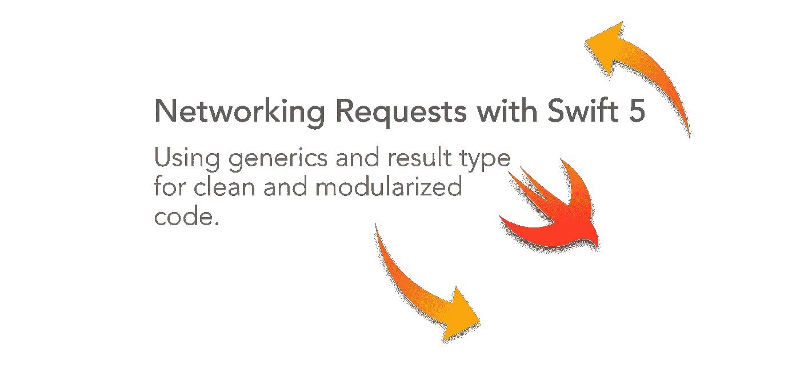

# 关于 Swift 5 中的网络层

> 原文：<https://medium.com/hackernoon/about-the-networking-layer-in-swift-5-4bb2704a1a4f>

## 使用泛型和结果类型构建清晰的模块化网络层



网络层可能会变得非常混乱，尤其是在从 API 或外部源读取或更新时。这可能涉及发送许多请求，从而导致编写许多代码非常相似的函数。☝️但是！我在这里是为了避免大家使用泛型创建许多重复的函数。

> ***泛型*** ***代码*** *使您能够根据您定义的需求，编写灵活的、可重用的函数，这些函数可以使用任何类型。您可以编写避免重复的代码，并以清晰、抽象的方式表达其意图。* 来源:[Swift 编程语言](https://docs.swift.org/swift-book/LanguageGuide/Generics.html)

让我们开始从头开始构建一个干净的网络层。这正好涉及到 2 个部分:
**1。路由器:**我们建立所有路线的地方。**②
。服务层:**我们在这里建立我们的网络请求。

出于示例目的，我将使用 Shopify 的路由，并通过以下 3 条路由调用它们的 API。

```
all sources: all information of the collections.
[https://shopicruit.myshopify.com/admin/custom_collections.json?page=1&access_token=c32313df0d0ef512ca64d5b336a0d7c6](https://shopicruit.myshopify.com/admin/custom_collections.json?page=1&access_token=c32313df0d0ef512ca64d5b336a0d7c6)all product ID's: product id of each product in a collection.
[https://shopicruit.myshopify.com/admin/collects.json?page=1&collection_id=68424466488&access_token=c32313df0d0ef512ca64d5b336a0d7c6](https://shopicruit.myshopify.com/admin/collects.json?page=1&collection_id=68424466488&access_token=c32313df0d0ef512ca64d5b336a0d7c6)all products info: product info for each product in the collection.
[https://shopicruit.myshopify.com/admin/products.json?ids=2759162243,2759143811&page=1&access_token=c32313df0d0ef512ca64d5b336a0d7c6](https://shopicruit.myshopify.com/admin/products.json?ids=2759162243,2759143811&page=1&access_token=c32313df0d0ef512ca64d5b336a0d7c6)
```

**建立 url** 如果您曾经向 Swift 中的服务器发送过 URL 请求，您可以使用 URL 字符串实例化并输入整个路由，也可以使用 URLComponents 逐段建立 URL。因为我们使用许多路由，所以我们将使用 urlComponents 来构建 URL。下面是 URLComponents 由什么组成的示例。


虽然我们可以从它的字符串初始化器中创建一个 url，但是当把组件附加到路径中时，它会变得非常混乱。尤其是在处理查询参数时。如果我们的 url 每次都需要不同的组件(例如，传入不同的产品 id 来获取每个产品的信息)，那么使用 URLComponents 结构将是最合适的。下面你将看到我们如何构造枚举来构建组件。更多关于 URLComponents [的信息，请点击](https://cocoacasts.com/working-with-nsurlcomponents-in-swift)。

# 路由器

让我们深入了解路由器，我们将在其中构建 3 条路由。

1.创建一个 enum——Router——其中的案例将代表您想要发送到 API 的请求端点。在这种情况下，将有 3 个案例，因为我们有 3 个不同的 url 请求。

2.创建适用于所有情况的方案变量。
3。创建适用于所有情况的主机变量。
4。创建一个路径变量，返回每种情况下的路径。
5。创建一个 URLQueryItem 数组来构建参数，因为所有路由都有多个参数。
6。回到 url 组件图像，正好有两个参数，每个参数都由&符号“&”分隔。一个 *URLQueryItem* 代表一个参数。每个实例化都需要一个*名称*，表示等号左边的参数名称，以及*值*，表示等号右边的字符串。因此，我们为每个路由中的参数创建一个 URLQueryItems 数组。由于我们每次都为该值传入访问令牌，我们可以创建一个变量来存储第 34 行的值。

7.创建一个方法变量，指示我们使用什么方法向服务器请求。如果所有情况(请求)都是“GET”方法，这就没有必要了，因为 url 请求默认是“GET”。

> 在这里找到路由器[的完整代码](https://gist.github.com/RinniSwift/fadb04ef6b339dba676711bc2a1cf9bc)。

# 服务层

我们的服务层将由一个设置整个请求的功能组成。这就是泛型出现的原因。在这种情况下，泛型**表示我们从请求**中解码的模型对象。因此，泛型(T)必须符合可编码协议。(一种可以从外部表示中解码或编码自身的类型。 *src:* [*苹果文档*](https://developer.apple.com/documentation/swift/codable) )
让我们一步步来了解一下。

1.  我们使用' class func ',所以我们可以直接在类上调用函数，而不必实例化它。我们继续添加通用产品。
    我们传入 1 个参数，该参数属于 Router 类型。
    我们创建一个转义完成处理程序来传递解码后的数据，或者创建一个错误对象，以便在函数返回后在其他地方使用。
    ·结果型救援！(在 Swift 5 中可用)我们声明第一个参数是对象类型，第二个是错误类型。
2.  从我们方便的路由器类中设置 url 的组件。
3.  请确保 url 有效，然后使用正确的方法创建 url 请求。
4.  用我们上面创建的 urlRequest 向服务器发出请求。不要忘记。resume()位于启动任务的函数之后，因为新初始化的任务以挂起状态开始。(苹果文档)
5.  使用 guard 语句确保没有错误，否则将错误传递到完成中并从函数中返回。
6.  通过这一步，我们保证有数据，响应，没有错误。从我们的模型开始解码 json 对象，稍后当我们调用函数时将定义这个模型。
7.  在调用完成处理程序之前分派回主线程，因为联网发生在后台线程中。或者，您可以选择在调用函数时使用响应对象时分派回主线程。
8.  在完成处理程序中传递解码后的对象，以便在其他地方使用它，即使函数返回时也是如此。**完成处理程序主要是用来触发函数里面的对象的一个动作。*在这种情况下，你会看到当我们稍后调用函数时，我们是如何使用对象的。*

## *🎉完整！*

*我们已经完成了网络层的设置！请随意使用这个模板来满足您的需求。根据您的喜好，添加和修改路由器中的任何案例或服务层中的类型。*

*下面，我将提供一个关于如何调用网络函数的例子，并为模型提供一些初始代码。(我假设您知道如何创建解码 json 数据的模型:查看[这篇文章](/@nimjea/json-parsing-in-swift-2498099b78f)了解更多信息)*

***车型***

> *现在，我们可以调用我们的网络请求，因为我们有模型来解码。如果你可能已经猜到了，当我们声明我们的泛型时，这些模型将是 T。那么，让我们看看我们实际上是如何告诉服务层“T”是什么的。*

*这个函数在任何你想要触发请求的地方被调用(在 *viewDidLoad* 、*I action*等中)。).正如您可能注意到的，我们直接在 ServiceLayer 类上调用请求函数，这是因为我们在 Service Layer 类中使用了关键字' *class func* '，这允许我们直接在类上使用它，而不必实例化它。我们传入将在构建路由时处理的路由器案例，并在完成处理程序中指定结果类型。一旦这个函数被触发，请求函数就知道要构建什么路由和从什么模型解码。一旦我们收到结果对象，这将是成功或失败的情况下，然后你处理在这两种情况下做什么。*

*我希望这能让你像我一样欣赏泛型！😄放下一些掌声👏👏👏如果你觉得这有帮助💡
接受所有反馈。📩*

# *资源:*

*[Swift 编程语言](https://docs.swift.org/swift-book/LanguageGuide/Generics.html)，泛型
[使用 URLComponents](https://cocoacasts.com/working-with-nsurlcomponents-in-swift) ，Bart Jacobs*

*📌点击 [LinkedIn](https://www.linkedin.com/in/rinni-swift-07b6b8169/) 和 [GitHub](https://github.com/RinniSwift) 找到我。😄*