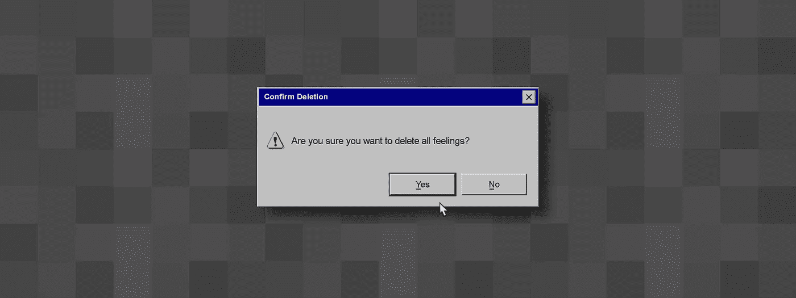

# 抽象我们的 Redux 确认模态模式

> 原文：<https://medium.com/hackernoon/abstracting-our-redux-confirmation-modal-pattern-9288a29d6cd5>



How many actions can an action chuck if an action could chuck actions

在第 34287 次写完`DeleteSomethingModalOpened`和`DeleteSomethingModalClosed`后，我们终于受够了。全局 Redux 动作和 reducers 应该可以让我们避免复制像这样的常见模式，但是由于新的确认模式只是复制了上一个确认模式，我们发现我们的存储中散落着确认模式特定的动作。如果你发现自己正滑下一座类似的山，那么这篇文章就是为你准备的！

情态动词是一个广泛的话题，但是这里我们只讨论确认情态动词。在要求用户采取一个额外动作的情况下，应用程序经常使用确认模式。有人真的打算删除应用程序中那个超级重要的对象吗？不总是。我们的目标是某种非常明确的“你确定吗？”体验。

进入第一个 [Redux Sagas](https://github.com/redux-saga/redux-saga) 模式，它真的真的感觉像是在帮助简化我们应用程序中的一个难题。还有其他方法来完成类似的事情，但这是一个真正伟大的方式来展示这些发电机的同步感觉的力量。下面是我们代码库中的一个常见示例，它展示了我们希望在继续最终操作之前等待确认步骤的模式。

Somewhere in your sagas

其中一个重要的注意事项是`meta`键中的`callbackAction`(我们的动作很大程度上遵循[通量标准动作](https://github.com/redux-utilities/flux-standard-action)标准)。您可能已经猜到了，但是如果动作被确认，这将是要触发的 Redux 动作。为了便于说明，此操作负载可能如下所示:

```
{
  payload: { id: 'abcd1234' },
  meta: {
    callbackAction: {
      type: 'RedirectToHome',
      payload: { message: 'wow that thing totally worked' }
    }
  }
}
```

这个传奇做的第一件事是`put`一个`ConfirmAction`动作。在我们的应用程序中，有一个连接的`ActionModal`组件，因此相关的 reducers 将监听该动作并更新状态以显示模态。该连接组件也只有两个动作创建者:

```
// containers/ActionModal.ts
const mapDispatchToProps = dispatch => ({
  onCancel: () => dispatch({ type: 'ActionCanceled' }),
  onSubmit: () => dispatch({ type: 'ActionConfirmed' }),
});
```

既然`ConfirmAction`已经发射，传奇就有了一个`[race](https://redux-saga.js.org/docs/advanced/RacingEffects.html)`来决定这两个动作中哪一个会先从模式中返回。如果是`cancel`，我们的 reducers 将处理取消动作，我们只需取消传奇。然而，如果是`confirmed`，我们会愉快地继续我们的道路，去做我们一开始就打算做的破坏性行动。如果那个破坏性的动作成功了，我们从元键中`put`那个`callbackAction`，我们就完成了！

# 我们能看到更多的动作模式吗？

虽然我们不介意炫耀它，但这是该模式中最特定于实现的部分。一些实现可能会走[门户](https://reactjs.org/docs/portals.html)的路线或者完全不同的路线，但是这种方法的一个好的方面是它没有规定 UI 是如何构建的。

例如，我们通过将连接的`ActionModal`组件拉到任何需要它的路径中来实现这一点。这样，我们可以传入诸如消息和按钮文本之类的道具，而不需要在 Redux 存储中添加特定于 UI 的细节。

希望有所帮助！尽管告诉我我错了，我很想听听其他人是如何解决这个问题的。✌️