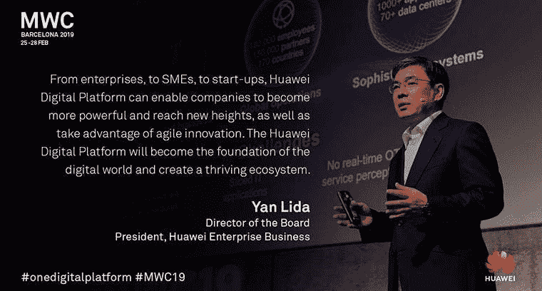
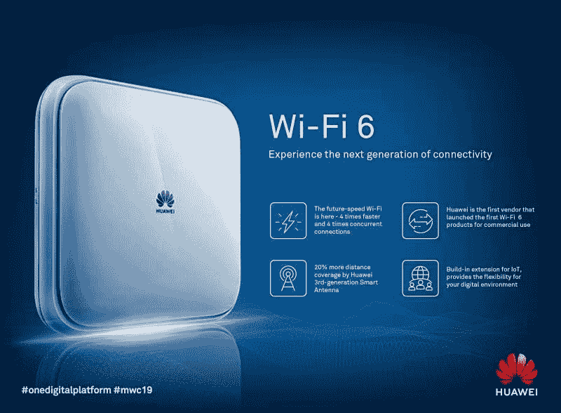

# 通过领先的连接和智能技术加速企业数字化转型

> 原文：<https://medium.com/hackernoon/accelerate-enterprise-digital-transformation-through-leading-connectivity-and-intelligence-8bd3a89f9f11>

Anastasia Dulgier

在引导大规模企业完成数字化转型过程时，组织会面临一系列独特的挑战和潜在风险。探讨为什么数字化转型对大公司尤其具有挑战性，行业先驱的核心要求和挑战是什么，这一问题很有帮助。是什么让数字化转型成为可能？

# 【2019 年世界移动通信大会—为企业转型搭建舞台

在此次活动中，华为企业在三个展区展示了其面向企业市场的旗舰产品:数字平台、无处不在的连接和无处不在的智能。华为企业还于 2 月 25 日在 2019 年世界移动通信大会上举办了[产业数字化转型峰会](https://carrier.huawei.com/en/events/mwc2019/huawei-digital-transformation-of-industries-summit)。峰会聚集了全球物流、铁路、金融、航空和智能城市客户，探讨他们数字化转型之旅中的最佳实践。

## **数字平台:用蓬勃发展的生态系统构建数字世界的基础**

华为企业业务集团总裁闫立达在峰会上发表演讲时表示:“在这个时代，企业、经济和整个社会的数字化转型给各个行业带来了巨大的机遇和挑战。华为认为，只有当数字世界和物理世界完全融合时，才能实现数字化。基于这种理解及其十多年的数字化转型经验，华为针对客户需求推出了面向企业市场的数字化平台。它是唯一一个可以横向集成新 ICT(包括云、人工智能、物联网、大数据、融合通信、视频和 GIS)以及纵向连接设备、边缘、网络和云的平台。它是综合的、智能的、可继承的。”

阎还举了一个数字平台如何推动其智能校园产品的例子。为了应对华为自身的业务复杂性、全球化挑战和复杂的系统，其数字化转型遇到了许多挑战，如庞大的旧系统、孤立的应用程序和缺乏实时监控业务状态的能力。

在华为，校园在人们的工作和生活中扮演着重要的角色。通过利用 ICT 技术，如云计算、物联网、大数据和人工智能，华为的智慧校园解决了传统校园面临的挑战，如管理效率低、服务体验差、能源浪费严重、综合安全薄弱和运营成本高等。它实现了行业园区的数字化转型，推动了创新行业的发展，并增强了服务体验。

闫表示，华为的数字平台重新定义了校园服务架构。该平台与各种终端兼容，并支持各种应用程序来集成数据、可视化校园状态、管理所有服务和控制事件。通过建设安全、舒适、高效、绿色和智能的校园，该解决方案为校园用户提供了更好的服务体验，为校园运营商提供了卓越的运营，从而释放出更多的商业和社会效益。

Yan Lida, President, Huawei Enterprise Business, MWC 2019

## **创造协同效应，实现敏捷创新**

数字平台以云为基础，通过优化新 ICT 和融合数据的集成，构建数字世界的基础，使组织能够实现业务协同和敏捷创新。该公司的平台支持跨行业的企业创建数字业务蓝图，以在智能时代竞争。

## **与数字化转型先锋合作**

华为还邀请多个行业的客户和合作伙伴在峰会期间分享他们的数字化转型最佳实践。

*   ***智慧城市*** :华为与意大利撒丁岛正在利用数字平台赋能智慧城市发展。
*   **金融**:华为和星展银行正在利用智能和数据能力，加速金融服务业的数字化转型。
*   **物流** : DHL 与华为共同开发了基于华为物联网技术的创新的多场景智慧物流解决方案，以提高物流效率，促进和实现整个物流流程的变革。
*   **航空**:华为和土耳其航空公司正在通过连接让航空变得更加智能。
*   **铁路**:奥地利联邦铁路(ÖBB)正在加强与华为的合作，基于华为的连接技术提供更高质量、更高效和持续改进的服务，引领欧洲铁路发展。

# **创新以满足数字化转型的需求**

## **无处不在的连接**

走向数字化是一个进化的飞跃，需要新的计划。数字计划的成败往往取决于网络，尤其是 Wi-Fi，因为它是物联网(IoT)设备和其他设备的第一个连接点。

在未来几年，4K/8K 超高清视频、物联网、虚拟现实(VR)、增强现实(AR)和自动导引车(AGV)等技术将广泛应用于教育、企业和工业自动化领域。这些创新技术在带宽、延迟、连接质量、传输效率和终端功耗管理方面需要持续的连接。

基于此，华为在 2019 年 MWC 上发布了 Wi-Fi 6 预测白皮书，为高质量的企业 Wi-Fi 定义了新标准。这份报告从标准、芯片、终端、设备、应用等方面，对 Wi-Fi 6 的大规模商用做出了客观的判断。该报告还结合了行业标准组织和行业分析师的意见，认为 2019 年将是 Wi-Fi 6 年，到 2023 年将有 90%的企业部署 Wi-Fi 6。简而言之，Wi-Fi 将是支撑企业生产和服务数字化的基础网络技术。

Wi-Fi 6, Huawei

## **无孔不入的智能**

除了每个产品的人工智能能力，包括人工智能计算、Ascend 系列人工智能处理器和主流异构计算组件，华为还展示了其新的 OceanStor Dorado3000 V3 入门级全闪存存储系统和 OceanStor Dorado 非易失性存储器 Express (NVMe)中端和高端全闪存存储。该公司声称，NVMe 实现了固态硬盘(SSD)和主机系统之间更快的通信，大幅降低了延迟，为客户和应用程序带来了优质的数据服务 OceanStor Dorado 中端和高端全闪存存储实现了 0.3 毫秒的延迟。华为表示，这些存储系统满足数据库、虚拟桌面基础设施(VDI)、虚拟服务器基础设施(VSI)和其他场景的需求，促进金融、制造和电信行业客户的数据中心步入全闪存时代。

## **世界移动通信大会超过手机**

今天的企业是由技术和创新驱动的。为了蓬勃发展，企业必须采用具有领先连接性和智能的数字平台，以响应不断发展的技术进步并接受颠覆性的进步，同时始终保持敏捷以支持调整。

每年，世界移动通信大会的亮点都是智能手机领域的重大发布。虽然华为凭借其 [5G 可折叠](https://www.androidauthority.com/best-5g-phones-926740/)手机引起了巨大轰动，但这家科技公司来到巴塞罗那是为了证明华为不仅仅是 5G 和智能手机，而且是企业数字化转型中连接和智能的领导者。