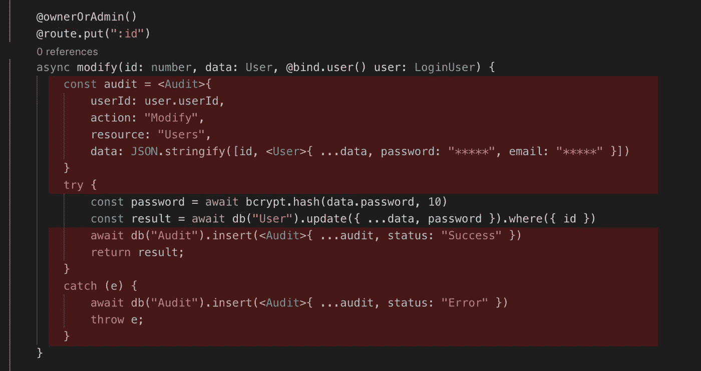
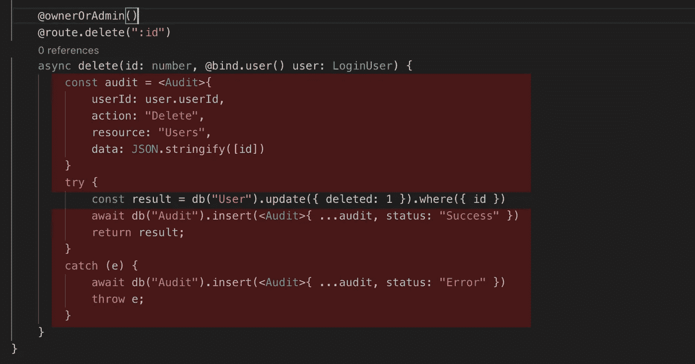
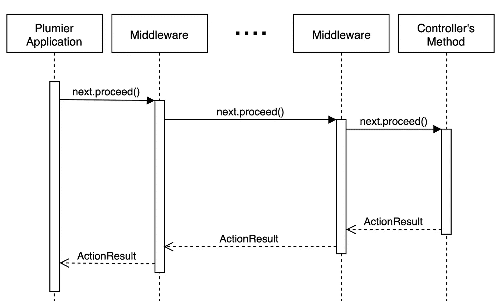
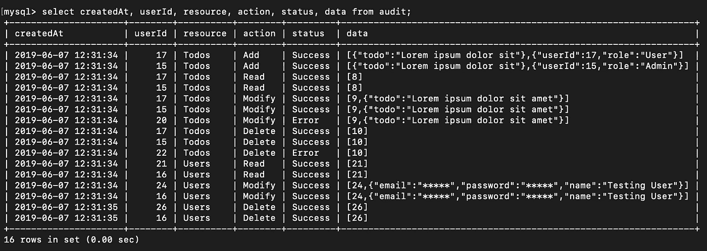

# 向 Rest API 中添加审计系统

> 原文：<https://medium.com/hackernoon/adding-an-auditing-system-into-a-rest-api-4fbb522240ea>

## 使用 AOP 和元编程

开发 Rest API 服务时，一个有趣的任务是向现有的 Rest API 添加一个特性，该特性的实现需要在每个 Rest 资源上重复，例如所有资源的审计系统。如果管理不当，这种类型的特性会增加应用程序的整体复杂性，并大大降低代码质量。

这个故事将向您展示如何使用面向方面编程(AOP)技术来管理和模块化您的代码，以创建一个适用于多个控制器的模块化代码，而无需修改现有的代码。例如，我们将创建一个简单的审计系统(75 行)来跟踪用户活动，并将其插入到使用 Plumier 创建的现有 Rest API 中。

Image by [Francis Ray](https://pixabay.com/users/Painter06-3732158/?utm_source=link-attribution&utm_medium=referral&utm_campaign=image&utm_content=3388163) from [Pixabay](https://pixabay.com/?utm_source=link-attribution&utm_medium=referral&utm_campaign=image&utm_content=3388163)

# 普卢米尔

如果您还没有听说过，Plumier 是一个新的 Node.js 框架，旨在使用 TypeScript 轻松创建健壮和安全的 restful API。你可以阅读[的完整故事](https://hackernoon.com/i-spent-a-year-to-reinvent-a-node-js-framework-b3b0b1602ad5)背后它是如何设计和创造的。

在这个故事中，我们不会使用特定的工具来执行 AOP 技术，相反，我们会像大多数 IoC 容器库一样，使用 Plumier 中间件来进行基本的面向方面的编程。就像 IoC 容器拦截器一样，Plumier 中间件具有拦截和元编程能力，这使它成为一个完美的工具。

正如在 Plumier 文档中处处提到的，Plumier 不是一个固执己见的框架，这意味着在 Plumier 中没有意见作为解决案例的指南。所以这种 AOP 技术并不是解决 Plumier 案例的唯一解决方案。您可以自由使用符合您需求的解决方案，Plumier 只是提供了实现这一点的构件。

# 应用审计

在这个故事中，我们将创建一个简单的审计系统来跟踪 Restful API 中每个请求的用户活动。信息将保存到如下所示的数据库中

以上数据将由应用程序的管理员或审计员使用。这些数据对于进一步分析用户行为非常重要，以便获得用户在系统中最常做的事情，从而生成喜欢/不喜欢报告。如果具有特定角色的用户可以访问私有资源等，这些数据也可以用作简单的安全审计，以获得关于安全漏洞的信息。

## 审查制度

与应用程序日志记录不同，审计系统需要管理员或审计员用于进一步分析的更具体的信息，例如上表中的`Data`列，它将提供有关用户请求(如查询和正文请求)的详细信息。

当审计中间件内部实现的流程时，它可以访问主体请求的原始数据，包括禁止管理员或审计员查看的数据，如电话号码、电子邮件甚至用户密码。将这些数据直接保存到数据库被认为是数据违规。此外，我们需要隐藏或审查部分数据，使其不会勉强保存到数据库中。

# 准备 Rest API

对于现有的 Rest API，我们将在这里使用 Plumier 文档中的示例代码。提供的示例是一个简单的 Rest API 托管 todo 数据，使用 Plumier 和 Knex.js 创建用于数据访问。该项目的完整源代码可以在[这个 GitHub 链接](https://github.com/plumier/tutorial-todo-sql-backend)中找到。

为了能够将审计数据保存到数据库中，需要创建一个新域和一个数据库迁移脚本。

1.  在文件的最后为审计域创建一个域模型`src/model/domain.ts`域是一个用一些属性声明的普通的 TypeScript 类，最后，它看起来会像[这个](https://github.com/ktutnik/tutorial-todo-sql-backend/blob/63da36f48485f33d68e82fbf7a4e841789bc3d8c/src/model/domain.ts#L52)。
2.  创建一个新的迁移脚本，将审计表添加到 SQL 数据库的`db/migrations`目录中，创建一个名为`1.1.0.ts`的新文件，并添加 Knex.js 迁移脚本。最后会是[这个](https://github.com/ktutnik/tutorial-todo-sql-backend/blob/master/db/migrations/v1.1.0.ts)的样子。

如果你想预览最终的项目，或者你懒得按照这个故事中提供的步骤，你可以在这里看到项目。

# 没有 AOP 的实现

为了更好地理解这个主题，我们将快速浏览一下在没有 AOP 的情况下审计系统通常是如何实现的。例如，我们将把审计系统添加到`PUT /users/:id`资源中。我选择这个资源是因为它是需要审查的审计的完美例子，所以代码覆盖了整个审计系统。

在开始将审计系统添加到控制器之前，让我们看一下原始代码，以便在添加审计系统之前进行比较。下面是托管资源的`UserController`(为了清晰起见，删除了一些控制器的方法)。

上面的代码看起来很简单。它只包含两个过程:使用`bcrypt`散列密码，然后将数据保存到`User`表中。下面是添加审计系统后的样子。

与原始代码相比，我们在当前逻辑中添加了大量代码，这使得控制器的整体复杂度增加。请记住，审计系统需要在处理不同 HTTP 动词的其他方法中实现，例如`GET`、`POST`和`DELETE`。下面是它是如何在 delete 方法上实现的。

基于上面的两个实现，您可能会注意到一些问题。

1.  添加、修改和修复审计逻辑需要大量的工作，因为它在每个方法中都是重复的。
2.  审计系统实施的每种方法都需要测试。
3.  如果不修改控制器，启用或禁用审计几乎是不可能的。

这足以使整个应用程序的复杂性急剧增加。

# 进入 AOP

就像其他编程工具一样，AOP 不是解决一切的工具。根据其在 [Wikipedia](https://en.wikipedia.org/wiki/Aspect-oriented_programming) 上的描述，AOP 最适合用于模块化横切代码，这些代码在应用程序中到处重复，如日志记录、全局错误处理、缓存等。

在选择 AOP 来解决编程问题之前，我们可以做一些简单的分析，看看新特性是否会影响现有的实现。让我们像下面的图片一样回顾一下我们以前的代码。

上图显示了 modify 方法的代码块。红色标记的代码是审计系统的代码。让我们与下面的 delete 方法的代码进行比较。

上图显示了 delete 方法的审计系统。delete 和 modify 方法中用于审计系统的代码块几乎是相同的，只是保存到数据库的数据因资源数据而异，并且在 delete 方法中不会发生审查过程。

上面两张图片清楚地显示了审计代码块是一个横切代码，在一些控制器的方法中重复。这个简单的分析是使用 AOP 技术重构复制的良好开端。

# 将复制重构为中间件

在我们进一步研究实现之前，我们将先看一下 Plumier 中间件，以便更好地理解 AOP 技术。我们来看看下面的序列图。

Plumier 中间件是一个调用序列，它使用执行链(称为中间件管道)一个接一个地运行。调用可以是处理当前请求的其他中间件或控制器的方法执行。就像前面提到的 Plumier 中间件，它被设计成具有拦截和元编程能力，可以用来执行简单的 AOP 技术。

基于我们之前的分析，我们可以将审计过程转移到 Plumier 中间件中，如下所示。

上面的代码显示了我们将审计系统从第 4 行到第 13 行移动到中间件中，该审计系统复制了内部方法。

第 4 行显示我们使用`createAudit`函数从调用上下文创建了一个审计对象，我们将在下一节讨论这个函数。

在第 3 行中，我们检查当前请求上下文是否有`route`信息和当前登录用户信息，如果不符合标准，它将立即执行下一次。

最重要的部分在第 6 行，我们调用`next.proceed()`来执行下一次调用。调用此方法将继续调用适当的控制器方法来处理请求。因此，如果请求是`PUT /users/:id`，那么调用序列将从中间件跳转到`modify`方法，如下图所示。

方法执行的结果将返回给中间件。它可以用于进一步的处理，但是在这个例子中，我们只是将它返回给前面的调用。

上述中间件如果在全局范围内注册，将在所有请求期间拦截所有方法的执行，这意味着所有方法将隐式执行审计系统。

# 元编程

上述中间件的另一个重要部分是创建由`createAudit`函数创建的`audit`对象。这个过程需要更多的努力，因为`audit`数据根据当前执行的方法而变化。

Plumier 有元数据信息，可以通过`Invocation`对象上的请求上下文来访问。请求上下文是注入了一些元数据信息的 Koa 上下文，例如。

*   `route` is 路由信息包含当前路由处理请求，包括控制器和方法元数据。
*   `parameters`是对象的形式或数组中的参数列表，作为参数绑定的结果，将用于执行该方法。数组数据已经被清理并转换为与方法的参数数据类型相匹配的适当数据。

基于上面的信息，我们可以像下面的代码片段一样轻松地编写`createAudit`函数。

上面的代码显示我们执行了一些元编程来创建`audit`对象。

1.  `resource`通过删除第 10 行和第 11 行的`Controller`字从控制器名称中提取的数据。
2.  `action`从当前 HTTP 方法中提取的数据，通过将其翻译成由第 1 行的`AuditActionMap`对象定义的适当单词。
3.  `data`提取自`parameters`属性，但在保存到数据库之前，我们需要做一些审查。

审查功能也可以使用元编程来完成。如果我们仔细观察，审查函数是基于参数数据类型应用的，而不是应用于当前方法。我们可以提供另一个地图包含一个功能，以审查如下数据。

上面的代码显示了我们从`context.route.action.parameters`中获取当前执行的方法的参数的数据类型。然后我们遍历参数值，并使用第 1 行定义的映射中适当的审查函数来审查数据。对于需要审查的另一种数据类型，可以在以后添加`CensorshipMap`。

这是创建用户活动审计系统的最后一步。接下来，您可以在启动代码中使用 Plumier 应用程序的`use()`方法直接注册中间件，或者使用 Plumier 工具注册它。在这个项目示例中，我们创建了一个`UserActivityFacility`来注册中间件，使其与其他配置保持一致。你可以在这里看到它是如何注册[的。](https://github.com/ktutnik/tutorial-todo-sql-backend/blob/master/src/app.ts)

# 测试

适当的中间件单元测试可以添加到项目的`test`目录中。Plumier 中间件是一个无状态类，所以相对来说更容易进行单元测试。在这个故事中，我们将不会创建一个特定的单元测试，但是我们将会通过从命令行使用`yarn test`来执行这个例子中提供的当前集成测试。执行过程应自动执行审计系统，并向`Audit`表添加一些记录，如下所示。

上图显示所有数据都正确保存到`Audit`表中。审查功能在`data`栏上也能正常工作。这意味着我们的审计系统工作正常。

就是这样！这就是如何在不修改现有代码的情况下，使用 AOP 和元编程将横切特性添加到现有的 Rest API 中。最重要的是，在您计划使用 AOP 技术解决您的案例之前，考虑一下这个故事。如果 AOP 能够解决这个问题，你需要做一些简单的分析，并确保不要过度使用它。

# 支持该项目

最后，这个故事旨在解释 Plumier 中间件的威力，下一个故事将会解释更多的特性。目前，Plumier 在 Node.js 世界中相对较新。构建一个框架最难的部分是构建和维护一个稳固的社区。如果你认为 Plumier 可以帮助你的工作并符合你的需求，请通过支持 [GitHub](https://github.com/plumier/plumier) 上的项目来帮助 Plumier 创造一个更美好的未来。