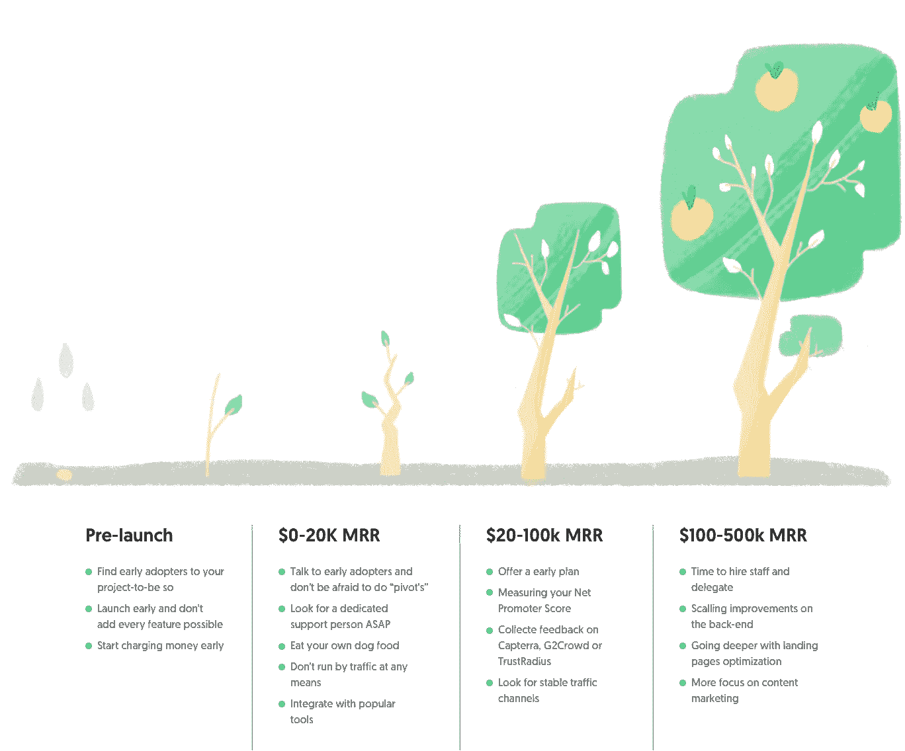

# 关于如何将你的 SaaS 扩大到＄130，000 MRR 及更多的建议

> 原文：<https://medium.com/hackernoon/advice-on-how-to-grow-your-saas-to-130k-mrr-and-further-b659512fa301>

大家好，

在这篇文章中，我将分享(并请他人贡献)我发展 SaaS 公司的经验。为了让它更有用，我想根据公司发展的某个阶段来拆分一些建议。依我看，小费通常因人而异。

如果你读了这篇文章，并有一些分享，请以类似的方式在下面留下评论。我先从我自己说起，举个例子。

**作者**:迈克·库拉科夫
**角色**:联合创始人、产品负责人
**产品** : [Everhour](https://everhour.com) (时间和费用追踪软件)
**阶段**:150 万美元+ ARR
**团队** : 15 人
**资助**:自举

# 发射前阶段

## 寻找你未来项目的早期采纳者

非常重要的是，在你发布的那一天，你得到了一些牵引，一些真实的反馈。除此之外，当你只有 1-2 个注册时，你和你的团队会非常沮丧。

创建一个非常简单的“即将推出”页面，提交给[测试列表](https://betalist.com/)和几个目录。当我们开始的时候，这给了我们大约 1500-2000 名早期用户。

## 尽早发布，不要添加所有可能的功能

不要试图添加每一个你认为重要的特性。最好是简化你的产品，快速发布，展示给真正的客户，收集他们的反馈，然后改进。总是寻找对你所有新特性的批评，并试着从各种来源中寻找。

在过去的几年里，我们一直在尝试增加和减少功能。可以肯定的一点是，80%的客户只使用了 20%的功能。你可以花很多时间，因为“多了一个特性”而推迟发布，但是没有人会使用它。

迈出更小的步伐。总是提供一些基本的东西，看看是否有需求。如果没有，请移除并重复。

## 早点开始收钱

这听起来是个好主意，先不要付费计划，先试水，然后再推出。但是我觉得这样不太好。

根据我们的经验，免费用户更经常联系支持，他们对你的失败反应更激烈，甚至可以询问完全不同的功能，而不是那些付费用户。同时，从免费到付费的转化率很低。

最好是立即了解你的产品是否值得支付，你的单位经济价值是多少。‏

# 0-2 万美元 MRR 阶段

## 与早期采用者交谈，不要害怕做“支点”

你的目标是尽快找到自己的竞争优势。一些能帮助你脱颖而出并赢得顾客的东西。这不可能是 10%的低价。

在我们的案例中，是我们与最流行的项目管理工具(如 [Asana](https://everhour.com/integrations/asana) 、 [Trello](https://everhour.com/integrations/trello) 或 [Basecamp](https://everhour.com/integrations/basecamp) )的完美结合。虽然我们没有免费计划，与竞争对手相比功能较少，没有移动应用程序等。许多用户仍然更喜欢我们。为什么？因为我们把一部重要的电影做得非常非常好。

当然，我们尽最大努力响应客户的要求，增加新的功能，但在一开始，我们没有太多的功能，也不可能一夜之间完成所有的事情。

我们没有立即意识到整合是我们的优势。这花了我们将近一年的时间和几个支点。

此外，因为你没有大量的付费客户，你可以尝试。以后会更困难，你要维护很多遗留的东西。

就像我们一样，我们不得不维护两个不同版本的应用程序，因为我们不能迁移老客户，有人也不想迁移。

## 尽快寻找专门的支持人员

用户会有很多问题和要求，特别是如果你添加了实时聊天。它会占用你很多时间。作为一个创始人，你最好专注于其他事情。我们理解得有点晚。

## 吃你自己的狗粮

使用你的产品。这样你会更好地理解哪里需要改进以及如何改进。给用户他们实际想要的，而不是他们说想要的。此外，通过每天使用你的产品，你会确信一切正常。综合测试有时会检测不出严重的问题。

## 无论如何不要在车流中奔跑

不要以任何方式追逐交通。确保你的个人资料在不同的目录中是相关的，不是一成不变的，你的博客内容是可操作的和独特的。少即是新的多。

## 与流行工具集成

当你这样做的时候，在他们的市场上上市。有些地方的上市过程是完全自动化的，有些地方则需要亲自联系。

不要犹豫，联系这些公司。如果你的集成为他们的用户提供了有用的东西，你就能让他们的产品更好，让他们的用户和他们呆得更久。但最好提前联系他们，因为这个过程可能需要一周甚至更长时间。此外，准备所有必要的资产和文本。专用的登录页面也是必须的。

# 20-10 万美元 MRR 阶段

## 提供年度计划

一开始，我们不想提供年度订阅。可能有某种自我怀疑。但是后来我们试了试，结果证明这是一个非常好的主意。

这将显著增加你的现金流，在我们的案例中，对 MRR 来说大约+15%。此外，这减少了每月失败和拖欠流失的数量。有些客户希望限制自己一年只开一张发票。很可能是记账上的某种节约。

## 衡量你的净推广分数

这样你就可以很容易地确定你最忠实的客户，并向他们询问一些事情。例如，留下反馈或填写调查。

## 收集反馈

尽早开始在热门网站上收集正面反馈，如 [Capterra](https://www.capterra.com/p/133409/Everhour/) 、 [G2Crowd](https://www.g2crowd.com/products/everhour/reviews) 或 [TrustRadius](https://www.trustradius.com/products/everhour/reviews) 。在准备一篇文章时，一些博主会根据这些网站上的评论和/或人气来决定包含哪些产品，因此积极的存在可以对潜在的免费广告和流量产生下游影响。

此外，这些网站本身会定期进行“前十名”评选和评级。

## 寻找稳定的流量渠道

在集成目录中列出对我们来说非常好。而这就是高质量的流量！来自合作伙伴目录的销售线索转化率约为 30%。

尽早尝试广告(谷歌、脸书等。).自己检查一下你是否能够使用这些渠道，你是否能够进一步依赖它们来进行扩展。对我们来说还不是很好，但我认为根本问题是我们笨拙的方法。我们一定会继续努力。

另一个伟大的，但长期投资是有机的。花一些时间创建内容和设置 SEO。为了让你有个概念，我们曾经写过一篇文章，将 Everhour 与其他两个流行的时间跟踪工具进行了比较。人们搜索比较这两家公司的文章，了解我们。在第一年，这篇文章给我们带来了每月 1000 个新访客！

# 10-50 万美元 MRR 阶段

我们只是在这个旅程的开始，所以在这里我将分享更多我们的计划，而不是经过验证的建议。

## 是时候雇佣员工和委派代表了

我们带着一个 7 人的团队到达了 10 万美元的 MRR。但是为了进一步发展，你需要更多。我们意识到我们不能保持期望的开发速度，不能提供足够的代码覆盖率，不能快速响应所有的客户请求，不能原型化新的想法。我们有机地成长到我们应该越来越多地委派任务以便更专注于成长的时刻。

我必须说，这并不容易，也不容易。对 7 个人有效的方法对 15 个人不再有效。在开发方法、站立会议、文档、设计系统开发等方面存在细微差别。

## 后端的扩展改进

一年前，我们每月向亚马逊支付 235 美元租用服务器。现在我们几乎要支付 2000 美元。此时，您也应该开始考虑架构、可伸缩性和可用性。

## 更深入地了解登录页面优化

现在，我们正在积极开发新的推广网站和新的非常优化的登录页面，以更好地展示 SERP。此外，独立的关键字导向页面非常适合运行谷歌广告活动。

我们也认为这是发展你的品牌的好时机。你不应该只是另一个 app，人们应该记住你，信任你。因为使用这种或那种工具的决定通常不是理性的，而是感性的。你的产品应该引起情绪。

## 更加注重内容营销

我们将会花更多的时间来制作经过深思熟虑的有用内容。

今天，市场上有大量的商业应用程序。一方面，这是好的，因为它鼓励更低的价格和更好的产品。另一方面，这也增加了购买者做出选择的复杂性。

有如此多的博客和评论网站是附属网站，只是简单地推广自己。那些名列前茅的人不一定是最好的，也不一定比你更好。但如果他们找不到你又有什么区别。如果你不能确保你能被谷歌搜索到，你甚至不会被列入候选名单。

# 我们正在寻求建议

正如我前面提到的，我们正开始迈向每月 50 万美元的旅程。因此，向已经超越它的人学习对我们来说是无价的。

请根据你目前的成长阶段分享一些有用的建议，告诉我们和其他企业家什么对你最有效，我们应该尝试什么。