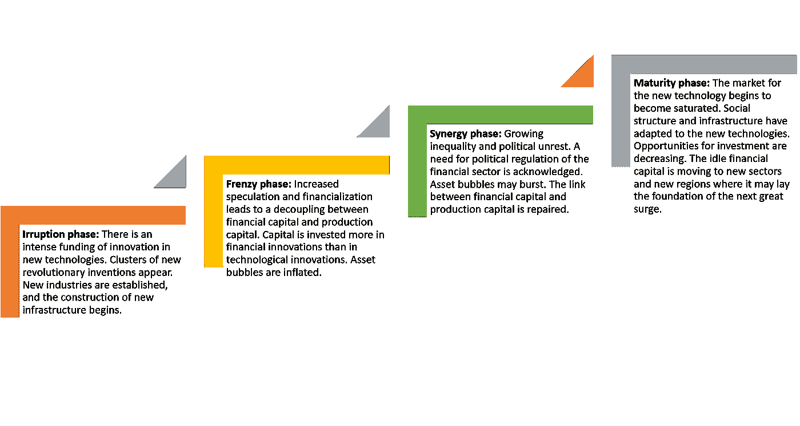
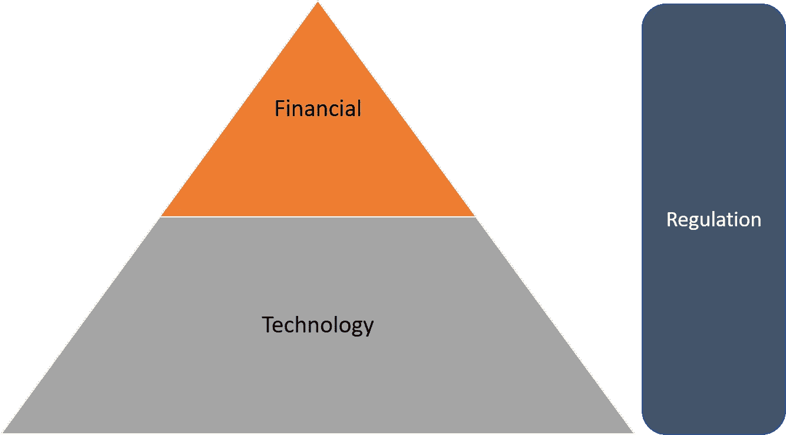

# 反对安全令牌纯粹主义

> 原文：<https://medium.com/hackernoon/against-security-token-purism-e40deeb55cd3>

这不是我关于安全令牌的典型文章。通常，我更喜欢关注技术话题，因为这是我觉得我能做出最大贡献的地方，我倾向于以积极的情绪写作，因为我天生是乐观主义者。今天，我想做一个小小的改变，并提高人们对一种现象的认识，我认为这种现象在新生的安全令牌行业中变得有些有害。由于缺乏更好的术语，借用比特币领域的一页，我打算将这种倾向称为“安全令牌纯粹主义”。在我们开始之前，让我澄清一下，这篇文章的目的不是批评任何公司或个人，而是写下一些关于行业论坛和会议中越来越普遍的趋势的思考。

安全令牌纯粹主义听起来有点夸张。在一个成立不到两年的行业中，我们真的有纯粹主义者吗？他们确实存在。在一个如此新兴和具有颠覆性的行业，最合理的立场是保持谦逊，接受有许多事情我们不知道，大多数答案将由该领域的技术发展决定。相反，安全令牌纯粹主义者似乎沉迷于绘制想象的边界来限制空间的发展，以适应他们特定的产品或服务。这几乎是因为他们太害怕发现安全令牌的真正潜力。如果不是这样，安全令牌纯粹主义几乎是可笑的，因为许多这些想法正在成为安全令牌论坛讨论的中心点。如何识别一个安全令牌纯化者？以下是一些可能有帮助的症状:

他们喜欢区块链，但讨厌比特币。

他们一直知道所有的 ico 都是骗人的，注定要失败。

他们不能区分公用令牌和 ico 来拯救他们的生命。

他们认为，分权是区块链无政府主义者的一个原则。

他们热爱监管，并相信加密证券的发展将完全由监管推动。

他们认为大部分加密证券的发行和管理过程应该像现在这样保持在链外。

他们不理解开源的价值。

他们喜欢安全令牌标准。

听起来很熟悉？我认为其中一些想法对于一场试图重塑证券业基础的运动来说是适得其反的。此外，它们在事实上是错误的，并且与我们所知道的关于技术和金融市场的历史相矛盾。对于 ico 的所有问题，他们验证了以太坊网络，并表明在应用中创造新的经济形式是可能的，更不用说他们是一些成功的应用。没有 ICOs，没有 STOs。安全令牌空间将在推动监管边界的技术突破的引导下不断发展，证券行业的许多传统原则将通过可编程性重新构想。这就是安全令牌给我们的。其他一切都是为纸质证书创建数字包装。有用，但不是特别开创性。

不要争论抽象的观点，让我们更实际一点，揭开我们从安全令牌纯粹主义者那里听到的一些核心观点的神秘面纱。

# 挑战安全令牌纯粹主义的关键思想

如果您关注加密证券行业，您一定会遇到一些安全令牌纯粹主义的想法。尽管这些想法有各种各样的形状和形式，但它们植根于一些基本原则，我想在这一部分挑战这些原则:

# 技术之前的监管

这个口号:“监管先于技术”经常出现在许多安全令牌会议和大量文章中，作为解释加密证券发展的一种方式。先监管后技术的想法不仅荒谬且不合逻辑，而且与技术和监管运动的历史相矛盾。英裔委内瑞拉学者卡洛塔·佩雷斯是我最喜欢的科技和社会经济发展思想家之一。在她的著名著作 [*《技术革命与金融资本》*](https://www.amazon.com/Technological-Revolutions-Financial-Capital-Dynamics/dp/1843763311)*中，佩雷斯女士从四个基本阶段解释了任何技术革命:入侵、狂热、协同和成熟。监管只出现在协同阶段，作为一种方式来防止技术的不平等使用，以利于特权少数。*

**

*安全令牌行业绝对需要监管，但监管是引导新技术发展的一种方式，而不是规定可以创造什么技术。监管应与安全令牌技术所带来的技术和金融进步同步发展和调整。说“先监管后技术”，就像说“先结婚后约会”；这种情况会发生，但不推荐使用。*

**

# *合规是权力下放的敌人*

*安全令牌纯粹主义的另一个常见原则是遵从性和去中心化不能共存。法规遵从性被视为一种本质上集中的活动，基于对特定权威的信任，那么它怎么可能是分散的呢？尽管在许多情况下，合规性检查点需要一个集中的权威机构，但概括地说，这似乎是一个非常受限制的立场。*

*区块链技术公司最大的突破是给了我们一个模型，在这个模型中，我们可以信任火柴和计算机科学，而不是人类来做群体决策。忽略这一价值就等于忽略了整个安全令牌行业基础中最有价值的资产。*

*安全令牌传输中很大一部分合规性规则可以以智能合约的形式表达，这是走向分散合规性的第一步。目前，security token 中的大多数合规性检查点仍然高度集中，因为大多数产品在没有网络的情况下孤立运行。然而，为了保持可防御性，随着去中心化程度的提高，安全令牌可能会慢慢演变成网络模型。我并不是说所有的遵从都将被分散。安全令牌的未来可能包括集中式和分散式合规性模型的混合，并且这些模型可以完全共存。*

# *离线流程与可编程性*

*安全令牌的关键承诺之一是当前证券生态系统许多方面的非中介化潜力。矛盾的是，安全令牌纯粹主义似乎痴迷于将现有的链外进程包装在每个安全令牌周围的想法。选择你认为可以通过安全令牌去中介化的证券业的任何领域，你很可能会找到将这些过程应用于加密证券的产品或服务。不足为奇的是，许多非连锁服务*

*可编程性是安全令牌的首要价值，它允许我们用今天不可能实现的产品来扩展证券业的视野。将更多功能性证券转移到智能合约中，似乎是该领域发展过程中不可避免的一步。越来越不相关的人仍然会需要链外流程。*

# *开源不是必须的*

*安全令牌纯粹主义因忽视开源的价值而臭名昭著。我认为其他人审查和验证他们的代码对他们来说似乎是陌生的。开源不仅是区块链的基本精神之一，而且创造了令人难以置信的防御网络效应。安全令牌纯粹主义者未能理解的一件事是 Github 回购比新闻稿更响亮。*

*好了，现在你知道了，这是我反对安全令牌纯粹主义的一些想法。我试图以最尊重的方式表达那些想法。我担心安全令牌纯粹主义正在成为这个领域中的主流观点之一，并且可能是极其有害的。在安全令牌行业的这个新生时刻，我们需要的是雄心和创造性思维，而不是教条和自我约束。*