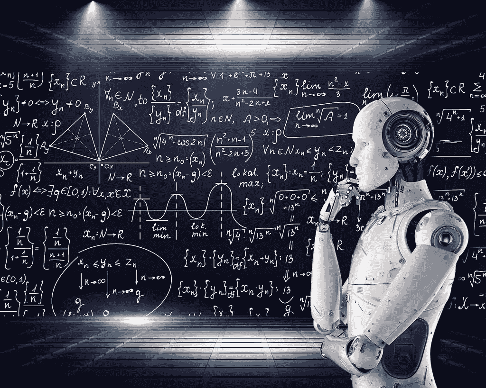
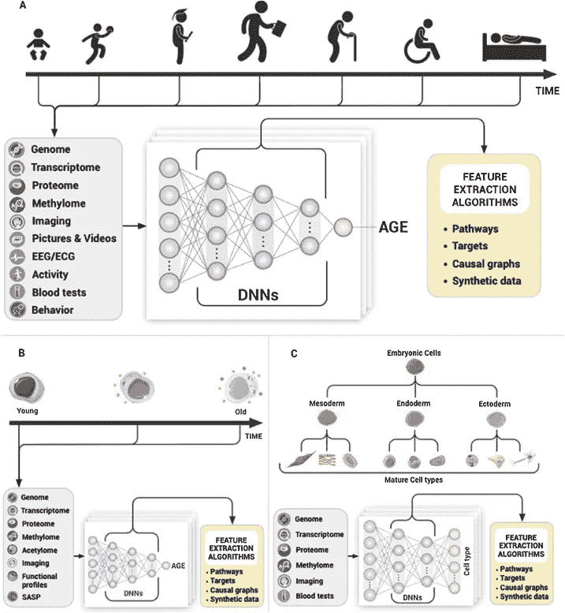

# 人工智能在衰老干预中的可能作用

> 原文：<https://medium.com/hackernoon/ai-and-aging-interventions-may-be-a-perfect-match-a52905794d65>

Artificial Intelligence (AI) may make a perfect partner in the quest to extend the human healthspan. Image: Flickr

人工智能技术的革命不仅可能成为帮助人们活得更长、更健康的努力的盟友，而且一个国际研究团队也表示，使用人工智能和机器学习来探索生物学可能会推动计算技术的发展。

在《衰老研究评论》1 月刊上发表的一篇评论中，研究人员概述了人工智能技术如何迅速成为对抗衰老和长寿的武器。[亚历山大·扎沃龙科夫](https://www.researchgate.net/profile/Alexander_Zhavoronkov)， [Insilico Medicine](http://insilico.com/) 公司首席执行官，该公司率先将人工智能用于衰老研究，该论文的作者之一表示，他们写这篇综述是为了促进人工智能开发者和长寿科学家之间的合作，以帮助解决一度被认为是人类生物学中难以解决的部分——衰老。

“这主要是为了帮助人工智能研究人员专注于衰老研究，反之亦然，”Zhavoronkov 说。“我们希望在这两个世界之间架起一座桥梁，并引入对抗衰老的概念。”

事实上，这两个领域可以相互交流，他补充说。他说，使用人工智能来研究延长人类寿命的方法可以帮助人工智能开发者学会如何让他们以前的黑盒人工智能更具可解释性，同时训练深度神经网络(或人工神经网络的一种)也可以让生命科学家对生物学有更全面的看法。

随着更多的数据——以及更多不同的数据集——可用，研究人员表示，DNNs 成为探索人类生物学和衰老的日益强大的工具。通过在 DNNs 中引入时间的概念，也可以推断因果关系。

根据研究人员的说法，人工智能可以帮助研究人员调查衰老的一个关键领域是通过发现衰老的生物标志物和确定干预措施。生物标记是表示某种现象存在的物质，如疾病或感染。对于医生来说，了解疾病的生物标志物可以帮助他们规划干预策略。

“人工智能不仅可以用于识别生物标志物，然后跟进潜在的干预策略，而且还可以跟踪这些干预措施的有效性，而不是仅仅等待人们死亡，看看干预措施可以在多大程度上延长寿命，”Zhavoronokov 说。

研究人员预计，深度学习是一种试图模仿人类学习方式的人工智能模型，称为深度学习，在玩视频游戏和图像识别方面已经等同甚至超过人类，将在衰老研究中找到一席之地，特别是在帮助揭示衰老的生物标志物方面。

虽然这个领域还很年轻，但研究人员乐观地认为，人工智能和长寿研究之间的合作将导致衰老治疗的深刻变化。例如，他们预计这种合作将改善治疗衰老的药物和干预措施。

Photo by [Rod Long](https://unsplash.com/@rodlong?utm_source=medium&utm_medium=referral) on [Unsplash](https://unsplash.com?utm_source=medium&utm_medium=referral)

他们在综述中写道:“可以预计，多学科方法结合了现代人工智能的归纳、学习策略、从学习到的特征中生成新模型、对象和数据的能力，以及精确的特征提取和因果分析方法，将在预防、再生和恢复医学的每个领域带来新的应用。”

Zhavoronokov 曾与 Insilico Medicine 制药人工智能系研究员科学家、牛津大学计算机科学系博士生 Polina Mamoshina 合作；Insilico Medicine 高级研究员 Quentin VanhaelenMorten Scheibye-Knudsen，哥本哈根大学细胞和分子医学系健康老龄化中心副教授；乔治梅森大学系统生物学学院的附属教员 Alexey Moskalev 和 Insilico Medicine 总裁 Alex Aliper。