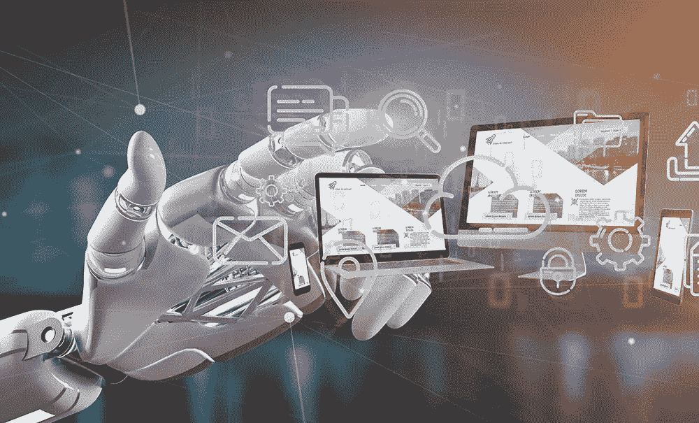
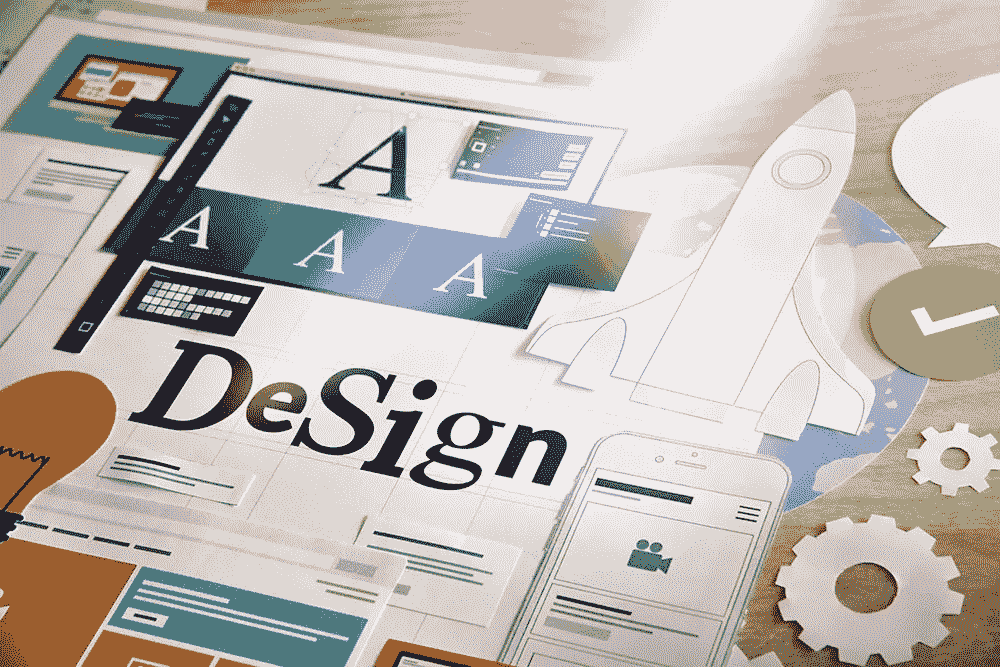

# 人工智能正在对网页设计产生巨大影响，而这仅仅是开始

> 原文：<https://medium.com/hackernoon/ai-is-having-a-big-impact-on-web-design-and-its-only-the-beginning-89bfa096bf2d>

Photo: Production Perig / Adobe Stock

早在 1993 年，[马赛克图形网络浏览器](https://www.zdnet.com/article/mosaics-birthday-25-years-of-the-modern-web/)的推出引发了公众体验和使用日益增长的互联网方式的一场革命。从那以后，全世界的网页设计师一直在努力建立和完善 UX 设计在网上的含义。一些发展是技术进步的结果，如支持多媒体内容的宽带互联网的兴起，或 HTML5 标准的发展。其他的来自数据驱动的研究，研究什么可行，什么不可行，以及一个达到完美的迭代过程。

然而，不管你怎么看，网页设计领域在过去的 25 年里成长并改变了我们对互联网能够和应该是什么样子的集体愿景。现在，一场新的技术革命——人工智能的兴起——已经准备好颠覆网页设计行业，其速度之快超出了几年前任何人的预期。让我们来看看人工智能已经在改变网页设计行业的方式，包括它目前的优势、劣势以及下一步可能的发展方向。

# 人工智能作为 UX 元素

Photo: Chaosamran_Studio / Adobe Stock

人工智能改变现代网页设计的第一个也是最明显的方式是在无数的人工智能工具中，这些工具正在成为现代设计的标准部分。最明显的例子就是聊天机器人的爆炸式增长，在过去的几年里，聊天机器人几乎成为了每个网站的必备工具。从理论上讲，它们旨在将这一鸿沟弥合成一种全新的网络界面，一种由对话而非触摸或点击驱动的界面。起初，聊天机器人仅仅依赖于简单的、预先编程的对话路径，这些路径决定了它们的有用程度。这导致了一些非常令人失望的结果，但最新的聊天机器人现在使用复杂的自然语言处理(NLP)系统来与访客创建有意义的[对话](https://www.nytimes.com/interactive/2018/11/14/magazine/tech-design-ai-chatbot.html)，而不是遵循照本宣科的路径。现在，这些新的人工智能聊天机器人正在走向成熟，它们几乎肯定会在不久的将来死灰复燃。

# 艾作为设计者

人工智能改变网页设计的一个更大更重要的方式是开始取代设计师本身。一个不断发展的人工设计智能(ADI)工具领域正在这样做，并推动网站建设方式的根本转变。然而，ADI 系统的最早例子还是令人印象深刻，很像早期的聊天机器人。最著名的例子是 Grid，它的目标是成为人工智能网页设计的第一个一站式商店，其自动化网页生成器名为 Molly。在引人注目的首次亮相后，他们的技术[没有达到最初宣传的效果](https://www.cmswire.com/digital-experience/the-grid-ai-powered-website-builder-doesnt-check-enough-boxes/)。然而，自那以后，ADI 公司的几个系统已经发展成为革命性的工具。来自 [Wix](https://www.techrepublic.com/article/new-wix-adi-uses-artificial-intelligence-to-design-your-small-business-website/) 和 [Bookmark](https://mobilesyrup.com/2018/07/30/bookmark-com-building-small-business-website/) 的产品现在可以在短时间内创建可信的网站，并有大量的选项供以后进一步定制。几年之内，很容易看到他们在整个网页设计市场上占据越来越大的份额。

# 人工智能通知结果

人工智能不仅仅被用来创造元素和设计；在找出什么样的设计效果最好以及如何改进它们这一至关重要的过程中，它也被利用了。为此，各种人工智能驱动的分析工具已经出现，以帮助 web 开发人员实时了解他们的设计是如何工作的。这些见解使像[这样的公司能够方便地](https://convincely.com/)提供以数据为中心的 CRO 服务，帮助网络资产最大化其对消费者的影响。在这个过程中，人工智能正在取代长期存在的迭代设计实践[，如 A/B 测试](https://www.concured.com/blog/why-ai-is-better-than-a/b-testing)，这曾经是改善网站设计以推动结果的主要方法。认识到这是一个自然适合人工智能的领域也很重要，因为它都是关于数据和纯分析的。这应该意味着，在不久的将来，这也是一个我们可以期待看到更多发展和更大突破的领域。

# 人工智能在网页设计中的未来

从已经对现代网页设计产生影响的人工智能应用，以及它们仍在发展的速度来看，很明显，我们只是看到了这项技术将在行业中发挥的破坏性力量的开端。展望未来，几乎可以肯定的是，人工智能将在网页设计和开发的每个方面发挥主要作用，并将推动被认为是网页设计艺术状态的新转变。例如，随着 NLP 变得更加强大，语音界面很可能会成为 web 上的新常态。

此外，人工智能似乎也为下一代网站个性化提供了动力，这可能会永远改变互联网的本质。想象一下，你会遇到这样的网站，它们会自我调整，在逐个用户的基础上提供完美的体验，而不是继续今天常见的一刀切的方法。通过支持当今 ADI 平台和分析系统的人工智能工具的发展，这很有可能实现。一旦发生这种情况，互联网将成为一个流动的、以用户为中心的地方，拥有自己的生命——仅仅在短短的 25 年前，谁会预测到这一点呢？