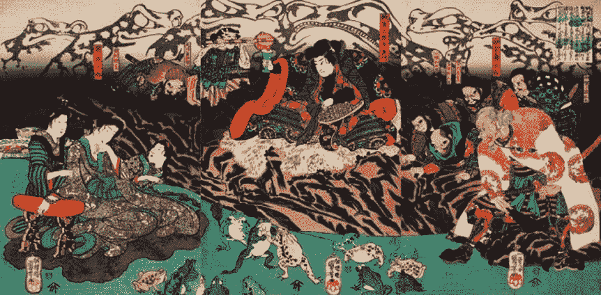

# 不要混淆互联网和现实

> 原文：<https://medium.com/hackernoon/all-media-work-us-over-completely-404858dabc1a>

> “所有的媒体都彻底地欺骗了我们。它们在个人、政治、经济、审美、心理、道德、伦理和社会方面的影响是如此之大，以至于我们的任何一部分都没有被触及、影响和改变。”
> 
> *–马歇尔·麦克卢汉*

想象一下，拿出你的手机，打开脸书或推特，你首先在屏幕上看到的是一个产品的广告。你是做什么的？你会简单地忽略它并向下滚动吗？你是否以开放的心态看待这件事(也许是因为你看到[科迪](https://www.youtube.com/watch?v=oo8CrY_ZfFk)和塔克已经喜欢上了广告人)？还是点击右上角的图标，选择隐藏广告？

无论如何，现在你已经忽略或者处理了弹出广告，你继续浏览，在只看到 4 或 5 个帖子后，又一个赞助广告出现了。

有时候，广告其实很有趣。一旦你不小心看了几秒钟广告或者点击了它，每次你访问这个页面，像这样的广告就会出现在你的屏幕上。

社交媒体服务为我们提供了大量潜在有用和有趣的信息，迎合了我们的个人兴趣。但是因为它们如此适合我们的行为，我们得到的是围绕这些平台对我们的“想法”而构建的另一个现实。

互联网很多都是这样的。在 cookies 的帮助下，网站会记住我们访问时的偏好，从而为我们未来的行为提供“预测”。虽然这提供了便利，但我们对事物的感知正在被或多或少未经我们同意而引起我们注意的事物所塑造。我们可以选择一个一个地隐藏或忽略它们，但我们不能改变基本规则，这些规则确保我们看到的一切都是为我们量身定制的。尽管互联网在每个人的生活中变得越来越重要，但大多数人都没有意识到这一点。

在网下，我们遇到的世界是按照它自己的方式存在的。但是在互联网上，不同的平台试图向我们投射图像和信息，将我们包裹在另一个世界里。如果我们不小心谨慎，这甚至会延伸到虚拟世界之外，影响我们现实生活中的行动和行为。

当我们走进大自然、书店或购物中心时，我们有意寻找新的东西，并对潜在的思维混乱保持开放。但是，当然，我们显然不希望一直这样，例如，当我们查看新闻提要或我们的朋友在做什么的时候。本来应该是私人时间的事情不应该被不相干的事情所污染。毕竟，当你在舒适的沙发上放松时，你有多喜欢被不需要的信息轰炸？

> 与其跑到一个角落里哭诉媒体对我们做了什么，不如径直向前冲，踢他们的电极
> 
> *–马歇尔·麦克卢汉*

然而，似乎我们无法阻止我们的在线交流和经历被琐事困扰。但幸运的是，还是有一些我们可以做的小事，所有这些都会以很小的便利成本来完成。这件事是否值得做，由你来决定。除此之外，保持对网络广告可能对我们造成的污染的意识和警惕无疑是朝着正确方向迈出的一步。