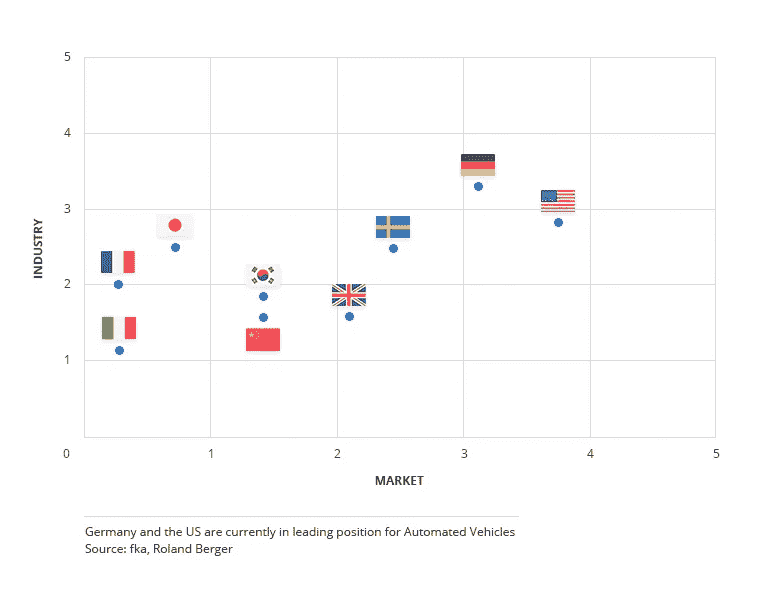
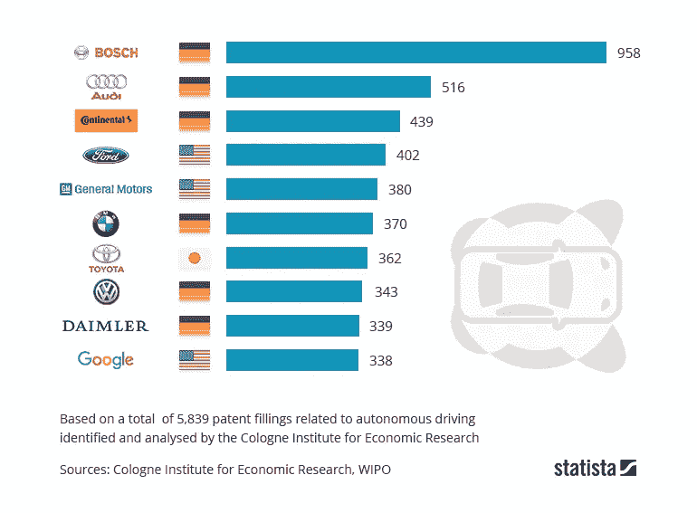

# 条条大路通…德国？认识新的自动驾驶中心

> 原文：<https://medium.com/hackernoon/all-roads-lead-to-germany-meet-the-new-autonomous-driving-hub-ce59ed5d34d9>

在当今自动驾驶汽车市场的激烈竞争中，几个国家正在争夺领先地位。欧洲的自动驾驶中心德国正处于领先地位。

中国、美国、瑞典、英国、日本和德国等主要汽车厂商正在努力控制无人驾驶汽车市场。然而，最近的[研究证明](https://www.rolandberger.com/en/Publications/Automated-Vehicles-Index-Q4-2017.html)德国不仅在欧洲，而且在全球捍卫着领导地位。

# 是什么给了德国优势？

随着美国和中国在一些汽车上实现部分自动驾驶功能，德国原始设备制造商现在在大多数量产汽车上提供驾驶辅助系统。尽管这有助于加强该国作为行业领导者的地位，但其他国家正在迎头赶上，加剧竞争。来自南韩和中国[的一系列汽车制造商已经宣布在他们的一些汽车中推出无人驾驶功能](https://www.intellias.com/who-takes-the-lead-in-the-autonomous-driving-race/?utm_source=medium.com&utm_medium=referral&utm_campaign=CM&utm_content=automotive%20in%20Germany)，并透露计划在市场上推出新的原型。但它会改变关键的汽车角色吗？

可能不会，因为德国肯定还有一些王牌。

## 市场占有率

德国是开发自动驾驶汽车技术的天然欧洲中心，因为它拥有一些世界上最强大的原始设备制造商。

德国以奥迪、宝马、奔驰(戴姆勒)和大众等大牌汽车而闻名。汽车部门是该国最重要的工业部门之一。

德国原始设备制造商服务于全球所有市场，生产全球 70%以上的高档汽车。与 2017 年€4260 亿美元的营业额相比，德国汽车工业是德国经济的基石。大约有 100 万名员工在汽车行业的中小型企业工作，也为不同级别的世界知名原始设备制造商和全球供应商工作。

原始设备制造商努力提供自动驾驶功能，增强每种车型的驾驶体验，并在欧洲创建自动驾驶技术中心。但是消费者准备好接受这样的创新了吗？

## 消费者接受度

根据[最近的研究](https://www2.deloitte.com/us/en/pages/manufacturing/articles/automotive-trends-millennials-consumer-study.html)，50%的德国人不会为配备自动驾驶功能的车辆支付额外费用。但专注于高端品牌，结果可能会有所不同，因为高端品牌的崇拜者可能更愿意为额外的舒适性和下一代驾驶功能付费。

2018 年的数据还显示，自动驾驶汽车的安全仍然是阻止消费者依赖自动驾驶汽车技术的头号问题。今年，63%的德国人声称，如果他们有既定的安全记录，他们会使用无人驾驶汽车，而 2017 年这一比例为 47%。

让德国处于领先地位的另一个因素是，在完全自动驾驶方面，消费者仍然青睐传统汽车制造商。有了一批成熟的汽车制造商，在德国采用 **a** 自动驾驶汽车应该会比在其他有自动驾驶初创公司甚至现有自动驾驶汽车技术公司的国家更快。

*来源:* [*德勤，2018 年全球汽车消费者研究*](https://www2.deloitte.com/us/en/pages/manufacturing/articles/automotive-trends-millennials-consumer-study.html)

## 政府支持

德国是第一个将完全自动驾驶系统合法化的国家。这有助于巩固其在自动驾驶和互联驾驶领域的领先地位。

直到 2017 年，只有持证司机才被允许驾驶车辆。但在 2016 年 12 月，政府宣布了在德国创建自动驾驶基础设施的目标。因此，议会于 2017 年 6 月推出了德国道路交通法修正案，允许司机将控制权交给车辆。今天，汽车可以完全自动驾驶，尽管司机必须保持警惕，并能够在紧急情况下抓住方向盘。

此外，德国的自动驾驶汽车技术公司最近获准在公共道路上测试无人驾驶汽车。

一些城市甚至采用了试点车队，在偏远地区的公共道路上重建常规交通，以测试这项技术。柏林有一个在 Charité大学封闭区域工作的自动班车服务。

随着宝马扩大其研究和创新中心，并在慕尼黑创办一所数字产品学校，巴伐利亚正成为自动驾驶汽车技术的另一个中心。该中心的首席数字官托马斯·泽勒(Thomas Zeller)将该项目的目标概括为“用创新的解决方案和以客户为中心的方法来应对行业的挑战。”德国使用巴伐利亚的 A9 高速公路进行自动驾驶车辆测试，并通过 5G 网络进行车对车(V2V)通信实验。

德国的自动驾驶汽车监管也得到交通和数字基础设施部的大力支持。该部门遵循道路交通领域的*自动化和互联*战略，并为自动驾驶解决方案的开发提供数百万欧元的补贴。该战略的目标是通过包括更多测试自动驾驶的测试场和道路，使德国成为自动化和联网汽车的领先供应商。

政府计划将整个国家的基础设施改造为全自动驾驶汽车，这将扩大德国与其竞争对手之间的差距。

## 技术会议

拥有大量汽车销售商和供应商的德国已经成为国际会议的温床。

## [1。TU-欧洲汽车](https://automotive.knect365.com/tu-auto-europe/)

TU-Automotive 在慕尼黑举行，是欧洲最大的会议，聚集了汽车和联网汽车领域的思想领袖。对于那些想率先了解自动驾驶与颠覆性技术结合趋势的人来说，TU-Automotive 是一个必须参加的活动。

## [2。自动驾驶汽车软件博览会](https://www.autonomousvehicletechnologyexpo.com/en/)

自动驾驶汽车软件博览会在斯图加特举行。它展示了最新的 2 级和 3 级 ADAS 创新，并主持了关于未来 4 级和 5 级自治的辩论。该博览会还提供技术密集的会议，包括自动驾驶汽车内部设计和技术研讨会，自动驾驶汽车测试和开发研讨会，以及自动驾驶汽车软件研讨会。对于任何在自动驾驶领域工作的人来说，这些活动都值得一去。

## [3。汽车教学。公元柏林](https://www.autonomous-driving-berlin.com/)

这是欧洲第一次应对 4 级车辆自动化技术挑战的活动。该会议将领先的自动驾驶汽车 R&D 专家和行业影响者联系在一起，旨在预测自动驾驶的未来，并定义下一代移动趋势。

这种专注于行业的活动有助于在德国推广无人驾驶汽车技术和自动驾驶汽车技术公司。在汽车技术会议上，德国聚集了来自全球的汽车专家，并吸引了新的商业合作伙伴。但有这么多汽车计划和自动驾驶软件项目，该国如何扩展其产能？

# 寻找快车道

除了当地的科技初创公司和科技巨头，德国还在寻找外部资源。在投资自治的 R&D 的同时，该国的汽车影响者正在与拥有坚实技术组合的东欧外包公司建立伙伴关系。德国原始设备制造商正在寻求与其他国家企业的合作战略，以加快上市时间并降低运营成本，因为在汽车行业工作的外包软件开发公司可以大幅提高耗时功能的效率。

# 引领无人驾驶竞赛

如今，德国的主要竞争对手是中国、英国和美国，因为这些国家正在为自动驾驶汽车测试立法。随着 Waymo 和特斯拉的趋势，占主导地位的德国汽车制造商没有时间放松。他们需要在未来几年提高自动驾驶技术，以保持竞争力。