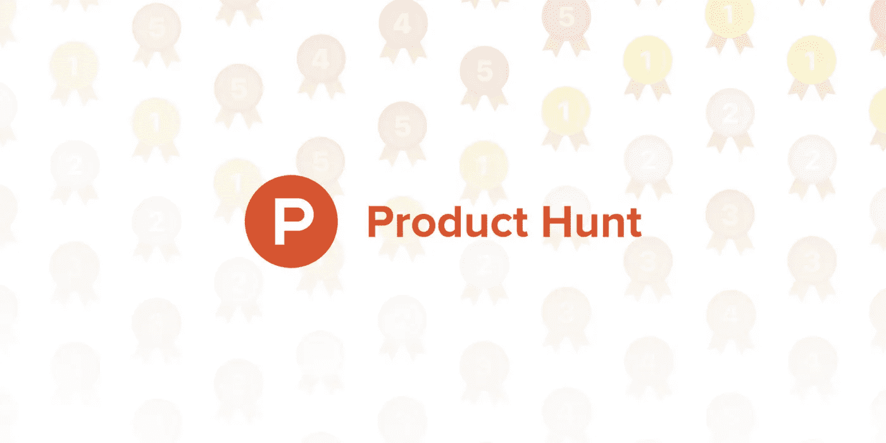
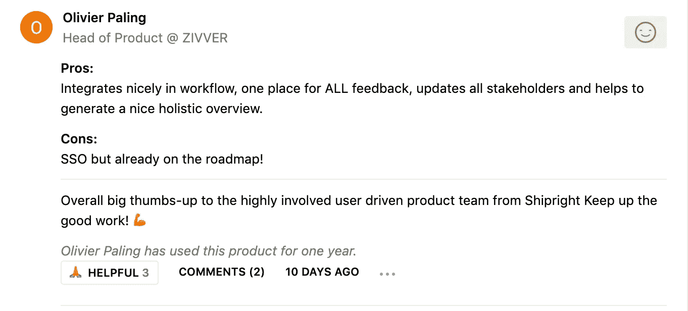

# 你需要知道的是准备你的产品搜索发布

> 原文：<https://medium.com/hackernoon/all-you-need-to-know-for-prepping-your-product-hunt-launch-692d0787e5ef>

## 问答、技巧和资源都集中在一篇文章中。

我们最近在产品搜索上推出了我们的 SaaS 产品。显然，我们做了一些研究来增加成功发射的几率。我看到了几十篇详细讲述成功/失败故事的文章。很有价值，但我花了一些时间来梳理。**最终，你只是在寻找问题的答案和可行的建议，对吗？**

因此；我决定创建一个列表，以问答的形式回答你在产品搜索发布会上可能遇到的大部分问题/一个可操作提示的项目列表。在以下制造商的帮助下，这些制造商最终也进入了产品搜索的前五名，我试图让它尽可能地包罗万象。所以，请随意问好并感谢[哈尔普](https://www.halp.com/)的[弗莱彻](https://twitter.com/fletchrichman)、[的](https://nucode.co/)[乔](https://twitter.com/cuhpajo)、努科德、利托的[萨米](https://twitter.com/sammyschuckert)以及[彼得](http://peterthaleikis.com)(几个项目，查看他的简介)🙌

如果你对我们如何使用 Shipright 感到好奇，以及我们如何能做得更好，请阅读这篇文章的结尾。

既然你是来看这个列表的，那么我们开始吧——你可以随意使用 cmd + F 来搜索它:

# ☝️综合医院

**什么是产品搜寻？**

如果您没有听说过 Product Hunt，您很可能不会跳到这篇文章中。让我们跳过这个😉

在产品搜索上发布有多大用处？
在开始所有的准备工作之前，问问自己谁是你的目标受众，这是否适合寻找产品的受众([通常是从小型创业公司到财富 500 强公司的技术人员、产品爱好者、创始人、投资者、记者、工程师、设计师、营销人员和早期采用者)。](https://www.producthunt.com/promoted-products)

如果合适，那就试试吧。想想你的目标。例如，你主要是想快速了解你的问题/解决方案吗？或者你已经验证了你的业务的关键部分，你主要是在寻找牵引力和客户的火花？获得正确的期望。

我的产品准备好了吗？恐怕我推出得太早了……
大家都是这么觉得的。正如里德·霍夫曼所说:

> 如果你对你产品的第一个版本不感到尴尬，那你推出得太晚了。

要知道你随时可以重新提交，重新启动。要么是因为你彻底检查了一个巨大的部分，要么是因为你正在引入实质性的补充——这就是产品搜索常见问题解答所说的。他们给了你两个例子:“一个移动应用的发布”或者“用新功能完成产品的重新设计。”

毕竟，很多公司使用产品搜索在平台上引入重大更新/新功能，所以你也可以。

**在产品搜寻发布会上，我能期待什么？**

*   相当大的流量和注册量(这取决于产品的类型，变化很大)。它也有自己的长尾——所以你可以预期久而久之会有一些流量，因为有相当多的人在产品搜索上搜索工具
*   可能是:一些投资者伸出了手(不要因此而分心)
*   可能:按，这可能会导致额外的流量。
*   尝试/注册你的产品的人的大量反馈(小提示和插件:[正确管理这些反馈](https://shipright.co))值得学习

💡**其他提示:**

*   为您的产品搜寻发布设定发布目标。你的发布什么时候会成功？你在看注册吗？活跃使用/保留(发布后的“x”天和/或周)？转换？在沙滩上划一条线有助于你庆祝和评估。
*   好好享受吧！产品搜索社区是一个热爱新产品、支持开发人员并庆祝产品发布的社区。利用这个机会和你的团队一起庆祝一下🎉

# 😬预发布

**我的产品是否足够好，可以进行产品搜索？如果你想快速了解一个产品或想法是否适合一群人，答案几乎总是肯定的(假设你的目标受众在场)。仔细跟踪解决方案对谁有效，对谁无效，这样你会更了解你的*确切的*目标用户。**

如果你在寻找吸引力/客户；通过预先验证你的部分业务，你显然增加了成功的几率(例如，对你假定的目标受众进行冷接触，看看问题/解决方案是否有共鸣。让他们用吧。看看他们是否转换/继续使用它。你知道该怎么做。).

关于你要推出的产品，有几件事要记住:

1.  *提供简单的产品* 简单易懂的价值主张。和产品。如果事情看起来很好，品牌是在点上，这肯定有助于获得关注。不过，这并不能说明你的产品是否会成功。
2.  *拥有坚实的基础* 用户从你的产品中获得的主要价值是什么？讲清楚，引导他们去做。提示:把它作为你产品的核心部分来考虑，不要把它看作是“事后”的东西。念[这个](https://www.intercom.com/books/onboarding)。
3.  *跟踪到位* 确保你跟踪用户行为(例如使用 [Mixpanel](https://mixpanel.com) )，并有一种跟踪所有定性产品反馈的方法。它将帮助你评估和学习你的产品。

**谁在“搜寻”我的产品重要吗？** 种的。产品搜索在对产品进行排名时，似乎会考虑很多因素。一个有影响力的产品搜索用户搜索你的产品的好处是，他/她的所有追随者都会在平台上收到通知。这将为你提供更多的曝光率。

[在一些文章中](/startup-grind/my-startup-launch-on-product-hunt-was-disappointing-ff5c8e70860)也有人说，当有影响力的搜索者搜索你的产品时，他们会直接出现在产品搜索的首页(这一点很重要，因为没有出现在首页=没有支持票=没有眼球=没有注册=没有东西可学)。我不确定那是否是真的…

**谁适合我的产品？**

*   有很多追随者的人。
*   与你正在建立的产品/业务类型对应的人(例如，我们有克里斯·梅西纳——前谷歌产品设计师，亨特·希普特。我们的工具正在帮助软件企业跟踪产品反馈，所以感觉这是一个很好的匹配)。这很有帮助，因为你的产品会引起更多的共鸣，当你要求一个狩猎+机会，他们的追随者也更好地与你的产品。

如何找到我的猎人？
使用[这个列表(前 500 名猎人)](https://500hunters.com/)找到一个前 5 名要联系的人。不要给他们发普通的垃圾邮件。针对个人，如果他们没有回应，再跟进几次(他们可能还有很多其他事情要做)。如果克里斯·梅西纳是你的对手:请他在这里猎杀你。

💡*提示*:使用类似 [Hubspot](https://www.hubspot.com/) 的工具，或者其他任何允许你使用电子邮件模板和序列的工具，这样跟进就可以被安排好，并且会自动发送出去(也有一些 Chrome 扩展可以让你使用 Gmail)。

我什么时候联系这些潜在的猎人？
在计划推出前至少 1 个月联系几个猎人*，以评估兴趣。如果他们同意，*在发布前两周*跟进必要的信息。确认他们是否在*前几天安排了你的产品*。*

**产品搜索帖子本身需要什么？** [这个](https://paper.dropbox.com/doc/Product-Hunt-post-product-pL6Mfd3eaDTjL9qQhNaFm)(喜欢的话就当模板用)。你也可以和你的猎人分享类似的东西。使用 Dropbox Paper / Google Docs 之类的东西来分享帖子的详细信息(比如[示例](https://paper.dropbox.com/doc/Product-Hunt-post-product-pL6Mfd3eaDTjL9qQhNaFm))，并为你的资产添加一个到 Dropbox / Google Drive 文件夹的链接。这将允许你在以后进行调整，而不需要麻烦的给你的猎人发送新的资源/信息。

你会在我链接的模板中找到一些额外的提示。

**在发布之前，我需要一个观众吗？** 我建议你这么做。主要原因:

*   有一个支持你的观众会让你在产品搜索平台上获得一些初始牵引力，这导致更多/新的人发现你的产品。
*   此外:这将有助于您提前验证问题/解决方案是否合适。这取决于你所处的阶段和你的目标。拥有经过验证的零件将增加赢得更多客户的几率。如果没有；产品搜索是一个很好的催化剂，可以让你很快了解更多。在设定发布目标和期望时，请记住这一点。

**在发布之前，我如何建立一个观众群？** 这完全可以是一个帖子本身。我们大部分时间都在进行冷外联和一系列调查，以了解我们的问题空间，然后重新连接以测试(部分)解决方案。这让我们建立了第一个用户/客户群，学习了一些东西(哪些有用/没用)，并为我们的发布接触了一些观众。

*   调查[产品搜寻船](https://www.producthunt.com/ship)以获得测试用户。让他们了解你的进展，并在你即将开始的时候伸出援手。
*   尝试像 [Growbots](https://www.growbots.com/) 这样的工具(或者像我们最初做的那样，自己创建一个流程)来联系你的目标受众中的一组人，进行采访/调查/测试。通常，你与之交谈的一部分人可能对尝试你的产品感兴趣。
*   通过评论产品搜寻产品和产品搜寻问题与他人互动。关注相关的人，参与他们的搜索(你甚至可以在 Twitter 上分享有趣的产品，并标记制造商)。
*   在一堆松散的群组中找到你的目标用户，开始一个快速的聊天来寻求反馈。问他们是否愿意尝试一下。让他们参与进来，并在发布时主动出击。
*   开始为你的目标受众写博客(个人/商业)，带来价值，在建立你的产品/业务的同时建立你的受众/追随者(我没有，真的，后悔。如果你打算呆在一个类似的空间，它肯定会帮助你。只是不是短期战术)

它基本上归结为评估所有可能的渠道，你会用它来为你的企业建立一个更可持续的客户获取策略。使用 [Julian Shapiro 关于评估这些渠道的指南](https://www.julian.com/guide/growth/ad-channels)(基于你的业务/产品类型)，这是令人惊讶的。

**在产品发布日，我可以通过什么渠道和方式来推广我的产品寻人启事？**

很多。确保你提前准备并预先安排了大部分活动(并在发布日添加准确的产品搜索帖子 URL)，和/或为你当天必须做的事情创建促销时间表。

*   **如果你在发布前做了一些重大更新，请给在**前试用过的人发电子邮件。询问他们是否喜欢“发布前访问”。在发布前一天和当天*再次安排一封电子邮件*。使用像 [Hubspot](https://www.hubspot.com/) (带模板/序列)、MailChimp 或 Intercom 这样的工具来安排事情。**
*   **向其他用户发送电子邮件。**使用 Hubspot(带模板/序列)、MailChimp 或 Intercom 等工具来安排事情。
*   **给你的导师/顾问/非正式投资者发送电子邮件/信息。**
*   **给你的(创始人)朋友/亲戚发电子邮件/(LinkedIn)消息**
*   **使用产品搜寻船**向 beta 注册用户发送消息
*   使用松弛组。我建议你在发射前请求接入&连接方式。例如，征求对你早期版本的反馈。使用[这个便利的网站](https://slofile.com/)找到与你相关的网站(至少使用那些专注于创始人/初创公司的网站)。请留意每一组的规则。不允许在每个群中共享“推广”内容。
*   **使用脸书组。**发布前请求访问&连接方式
    您可以使用的几种方式(显然取决于您的产品):
    留意这些群组的规则。不允许在每个群中共享“推广”内容。
*   **使用 LinkedIn 群组。**发布前请求访问&连接方式
    一些你可以使用的方式(显然取决于你的产品):
    留意这些组的规则。不允许在每个群中共享“推广”内容。
*   **使用 Reddit** [r/startup](https://www.reddit.com/r/startups/) ， [r/entrepreneur](https://www.reddit.com/r/entrepreneur) ， [r/sideproject](https://www.reddit.com/r/SideProject/) ，[r/trymthing](https://www.reddit.com/r/TryMyThing/)。找到与你相关的，并集中精力获得反馈。
*   **使用你的个人社交账户**在发布前分享信息，并在发布当天提醒他们。你可能有推特、LinkedIn、脸书、Instagram 等等。为你所有的社交渠道使用类似 Buffer 的东西来安排你的内容。在推特上发布你的 upvote 里程碑(100，200 等。)以一种有趣和创造性的方式。你能获得的有趣和有价值的内容越多越好(不要让它感觉像是一遍又一遍地发送相同的信息)。你永远不知道你会得到多少，但为前 4 个里程碑准备一些视觉效果可能是值得的。
*   准备脸书、Instagram 和 Twitter 上的广告。不要把他们引向你的产品搜索帖子，把他们引向你的主页，并确保你准备好了一个小工具(就像这个[产品搜索对讲小工具](https://www.intercom.com/app-store/?app_package_code=product-hunt-upvote&search=product%20hunt)),可以直接投票。这种流量是否只是在少数注册和/或投票中结束；不管怎样都没问题。
*   **在注册过程中促进口碑相传**例如，在注册后的页面上添加一行文字，允许用户在页面上发布推文(发布预定义的推文以减少摩擦)(感谢页面/您收到了您的激活邮件)

👆Pre-defined Tweet with a single click, after sign-up

**💡附加提示:**

*   查看与您的产品相似的产品，并了解它们的发布策略。窥探标题、标语、徽标、截图、评论和一般措辞。
*   为产品搜寻者创建特别优惠，并将其添加到登录页面。这刺激人们去报名。也在你的产品搜索帖子上的“制造商评论”中说明这一点。参见[这个模板](https://paper.dropbox.com/doc/Product-Hunt-post-product--AfdTcZBCmSGvE9XJ6_cbmWPBAQ-pL6Mfd3eaDTjL9qQhNaFm)，我在模板中为我们的产品添加了一条制造商评论。
*   如果你有一个 Chrome 扩展或应用程序，一定要试着从你的第一批用户那里获得一些评论。对我们来说，Chrome 扩展是产品和入职的核心部分。为了刺激快速安装，有一些评论/体面的评级是有帮助的，因为这通常在用户将要安装扩展/应用程序时显示。
*   制作一份媒体名单并发布，然后[找到相关的记者](https://jonapr.com/)来报道你的发布会。

# 🚀发动

**我应该在哪天和什么时候开始搜索产品？根据我在多篇文章中读到的:星期二和星期三最有效。我们也听说了周四。更重要的是:不要在苹果、谷歌或任何其他大公司推出新东西的时候推出。仔细检查一下。**

发布时间:最好在太平洋标准时间上午 12:01 发布。如果你在欧洲，或者从欧洲人那里得到很多支持，这将会给你一个好的开始。在美国人开始觉醒并准备偷窥之前，你会在名单上排名更高。

**在发布日，我的日程安排应该是怎样的？**

*   如果你们是多个联合创始人；有些角色已经就位。我们和 4 在一起，所以我们有人和 **1 打交道。**外联/营销 **2。**邀请/加入用户并提供支持 **3。** 2 名“消防员”,以防我们遇到任何关键问题(幸运的是，我们没有遇到，多亏了一段时间的预发布测试)
*   提前安排好你的一天。在你的发布日使用它来做宣传，做一些很难提前安排的事情，这样你就可以在混乱的几天里坚持一个粗略的计划/时间表。

**💡附加提示:**

*   瞄准前 5 名。你将最终出现在产品搜索日报(时事通讯)上，面向所有产品搜索用户。
*   如果你出现在最热门的帖子中，在发布日那天，推荐你的技术通朋友到产品搜索主页寻找你的产品。与通过主页访问的用户相比，来自直接 URL 的参与似乎对排名算法的影响较小(这是一种直觉，但得到了其他人的证实)
*   确保你回复了产品搜索帖子上的评论
*   查看在产品搜索上投票支持你的人的 Twitter 账号。大多数时候，用户的产品搜索句柄类似于他们的 Twitter 句柄。你至少可以感谢他们对你的支持(比如用一个有趣的 GIF)。这可能会让你获得一些额外的转发，从而将消息传播给他们的追随者。

# 🙌发布后

发布日之后会发生什么？
第一天之后，你仍然会有相当多的流量。这持续大约一周。密切关注你的用户并在需要的地方支持他们是很重要的。联系时，试着询问他们对你的产品有多喜欢，以获得一些反馈。有哪些好恶？他们遗漏了什么？产品符合他们的期望吗？为什么/为什么不？

**💡附加提示:**

*   写一些你的经验和教训，对其他人有价值。给它一点独特的扭转。喜欢这篇文章😉

# 📊我们如何做自己:

*   [Shipright](https://shipright.co) 是一款 B2B SaaS 产品，用于跟踪产品反馈，帮助团队打造更好的产品，提高客户满意度/忠诚度。
*   Shipright 更像是一个团队工具，而不是简单的个人工具。后者&面向 B2C 的技术往往表现更好一点(根据我的观察和研究)。
*   发布当天约有 300 张赞成票，一周内有 370 张
*   14 条评论([，它们非常棒](https://www.producthunt.com/posts/shipright-2/reviews)💝)

*   在发布当天，我们网站的访问量约为 1000 次，第二天约为 700 次，然后是 500 次、300 次等等。

*   大约 100 个团队在发布后的一周内注册
*   投资者兴趣(满满一手)

# 🧐:我们本可以做得更好:

*   **仔细检查我们的注册流程**
    我们在发布前几天经历了一个 bot 连续注册 Shipright。我们很快添加了一个 reCAPTCHA，但没有广泛地测试它。原来它在 iOS Safari 浏览器上出了问题。我们在发布日快结束时发现了这一点🤯(幸运的是，大多数人都是通过桌面访问的，所以我们可能只是错过了一些)
*   **在发布日的前一天给我们的支持网络提个醒**
    我在一周前给一些人提了个醒，而其他人根本没有被提前通知。有人支持我们，但也有很多人在我给他们发电子邮件或(LinkedIn)信息的第二天就回复了。

# 📚参考文章/有用阅读:

*   [让你的产品搜索发布大放异彩的终极剧本](https://blog.salesflare.com/the-ultimate-playbook-to-blowing-your-product-hunt-launch-out-of-the-water-238ebed90262?source=search_post---------0)
*   [Favorize——彻底击垮你的初创公司产品搜寻发布会的逐步指南](/startup-grind/my-startup-launch-on-product-hunt-was-disappointing-ff5c8e70860)
*   [e founders——在 4 次启动和超过 4000 次投票后，我们对产品搜寻的了解](https://blog.efounders.co/what-we-learned-about-product-hunt-after-4-startup-launches-and-more-than-4000-upvotes-e814e6360484)
*   [Haystack——如何在产品搜索上发布(或不发布)产品](https://productcoalition.com/how-to-launch-and-not-launch-a-product-on-product-hunt-6af8f6349fd2)
*   [如何通过产品寻线启动产品寻线](https://blog.producthunt.com/how-to-launch-on-product-hunt-7c1843e06399)
*   [站——帮自己一个忙，搞定你的产品发布会](/getstation/do-yourself-a-favor-nail-your-product-hunt-launch-61235e1c3d8d)
*   [way dev——如何在产品搜索中获得排名前 5 的产品，并获得他们的简讯](https://hackernoon.com/how-to-get-in-top-5-products-on-product-hunt-and-get-in-their-newsletter-2a2ac20e471f)