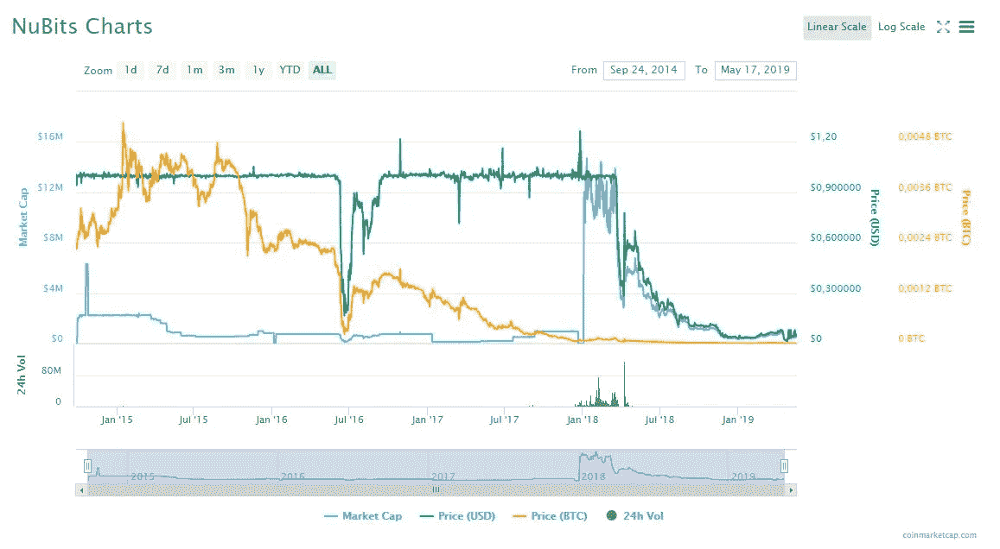

# 稳定密码资产的经济模型

> 原文：<https://medium.com/hackernoon/an-economic-model-for-stable-crypto-assets-b8d66631178c>

## 设计分散式稳定币


区块链技术减少了跨境汇款的时间和成本，避免了银行网络。但是，在接下来的几年里，我们将使用哪种加密资产来支付账单、购物或贷款呢？

我已经谈到了什么是令牌，如何基于这项技术发展 T2 自己的经济，但是我没有提到我们今天要讨论的问题:对稳定的加密资产的需求。

中央银行，大公司，甚至脸书这些天都宣布他们正在建立自己的支付加密资产。我会确保你明白这意味着什么。在本文中，我将介绍以下几点:

*   稳定的货币估价模型
*   博弈论
*   算法稳定币的设计

今天的加密货币不适合我们经济所依赖的标准金融合约。例如，如果我们达到顶峰，以太坊的波动性太大，不适合作为支付硬币。想象一下，你有一份每月支付 10 英镑的工作，但是你仍然用法定货币支付每月的账单。如果 ETH 的价格再次暴跌，你会怎么样？

任何金融业务都需要价格稳定来确保数字化转型。

现在商家不允许加密货币支付，我认为这将使他们未来的销售损失很大。实施这项技术会带来以下好处:

*   免受欺诈
*   交易费用可以比信用卡/借记卡低得多

我不是说要在所有地方都放一个 [PundiX](https://pundix.com/) POS，这样我们就可以用代币支付，我更保守一点，愿意创造一种**标准硬币**，它可以与我们今天拥有的任何其他数字货币进行交换。

如果你在一个机构薄弱、货币不稳定的国家，高通胀率和货币贬值更为常见。在这些市场，比如委内瑞拉，我预计对稳定的加密资产的需求会很高，因为任何金融合约(工资、贷款、期货和期权合约)都取决于价格稳定性。

**稳定的货币估值模型**

经济模型被理解为这样一种模型，当应用一系列算法时，它为货币在网络中的使用创造标准，在用户使用它时为用户带来价值，并建立规则以保护硬币免受市场波动或价格操纵的影响。

要了解加密资产的网络效应，我们必须关注给最终用户带来的价值。该设计是建立在[交换方程](https://en.wikipedia.org/wiki/Equation_of_exchange)的基础上，作为货币交易需求的经济模型。

该等式用于货币建模。你可以看看[克里斯·伯尼斯克](https://medium.com/u/2a8f9285c9aa?source=post_page-----b8d66631178c--------------------------------)和[亚历克斯·埃文斯](https://medium.com/u/b5b7faf7149d?source=post_page-----b8d66631178c--------------------------------)所做的巨大工作。

一个简单的定义是四个变量，它们描述了一个经济体中的购买量和流通货币量之间的关系。后面的公式 *[M V=P Q]* 的参数是这样定义的:

*   M =流通中的货币供应量
*   V =货币流通速度
*   P =货币的价格水平
*   Q =交易经济活动的产出水平

在评估它之前，让我们来看看我是如何理解稳定币的。

稳定的硬币场景并不是每次我用法定货币转账时，银行都会向我的钱包发放代币。一枚价格稳定的硬币并不意味着与法定货币完全挂钩。这不是去中心化，这不是给用户带来区块链价值，这只是用户在银行账户中的等量资金复制到他的钱包中。

这种方法已经在一系列音乐活动中发挥了作用，比如明日世界。那么，为什么银行想要创造一种新的稳定的加密资产呢？没什么意义。

如果我们回到交换的方程式，代币的供应会随着新交易的出现而增加，随着交易的增加，需求也会增加。

```
<velocity = total transaction volume / average network value>
```

这种情况下怎么学习提高速度？我们如何预测一枚稳定硬币带来的价值？

为了回答所有这些问题，让我们先来看看博弈论如何帮助我们建立一个新的稳定币系统。

# 博弈论

一个博弈论模型至少有三个组成部分:

*   玩家:决策者
*   策略:他们想采取的保持价格稳定的决定
*   回报:策略的结果

一个系统不能基于一个人的道德来发展；道德终究是不可量化的。这就是区块链真正的天才之处。区块链被设计成一种自我执行的纳什均衡。

博弈论适用于以下场景:

*   代币设计:用于预测代币持有者对嵌入激励的反应
*   金融市场:用于预测股票市场决策

考虑到这两种情况，人们对加密资产的定价不是基于他们认为其基本价值是什么，而是基于他们认为其他人认为他们的价值是什么，或者其他人在社交媒体上分享的预测平均价格。

这里的博弈理论暗示了银行何时会发行更多必要的代币，以及我们如何防止通货膨胀。

让我们想象一个游戏，用户必须投票来保持价格稳定。从纳什均衡的角度来看，我们可以定义用户将分布在不同的层次之间。最低的一个选择它维持在 0.97 和 1.03 之间的价格。下一个级别，用户，认为所有其他用户都是 1 级，所以，他们会投票选择更低的硬币价格之间的价差，让我们把它设为 0.99 和 1.01。这一概率比我们希望维持的价格高出近 2%。下一级用户会有比之前更好的投票价格，以此类推。

这种想象中的游戏在区块链上可以很好地工作。这种实现将始终保持我们设定的通货膨胀率之间的硬币，当然，我不会忘记任何博弈论的第三个组成部分，奖励。主要目标是激励用户保持价格稳定。

# 设计稳定币

任何货币都有三个基本功能:价值储存、交换媒介和记账单位。

为了使加密资产成为可行的交易媒介或记账单位，有必要保持价格稳定。

时至今日，已经有一堆稳定的代号，如[戴](https://makerdao.com/en/dai/)或[系绳](https://tether.to/)，仅用于交易目的。现有的 stablecoins 有没有给用户带来价值？为什么我们需要创建一个新的？让我们来看看 NuBits:



它们被称为“世界上最稳定的数字货币”。我不相信一种旨在与美元挂钩的中央集权、受控的货币。

如果我们可以创建一个分散的算法，而不需要智能合约在每次有新的转移时发行新的硬币，会怎么样？一种稳定的可以自我定价的加密资产。这将实施一项与各国央行所使用的非常相似的货币政策。

按照欧洲央行的说法，[货币政策](https://www.ecb.europa.eu/mopo/html/index.en.html)是为了保持价格稳定。欧洲央行的中期目标是通胀率低于但接近 2%。

对于德意志联邦银行来说，实现价格稳定是一个货币目标。然后，当前与特定货币目标的偏差使得货币当局改变利率，以避免价格在适当的时候偏离目标。

> 理想的货币是既能短期储存又能长期储存的货币。


## 公式

让我们来研究一下交换等式的右边，对一枚硬币来说，扩大需求是必不可少的。也被称为硬币的市值或人们对货币的估价。

```
<demand = crypto-asset price * number of coins in circulation>
```

为了调节价格，我们需要使用*需求*公式。假设 1 级用户投票决定价格为 1.02€，则:

```
<d = 1,02€ * nºcoins>
```

当需求保持稳定时，我们必须计算所需的流通硬币数量，也就是通货膨胀率。

```
<d = 1,00€ * nºcoins>//Requiered nºcoins to maintain the price stable 

<nºcoins' = 1,02 * nºcoins>
```

这意味着通货膨胀率将达到 2%。

无论哪种情况，当需求增加或减少时，由于对硬币缺乏信任，我们将分别出现 2%的通货膨胀或通货紧缩。

这可能是确定维持固定通胀率所需供应量的一种解决方案。你会问自己为什么我们需要一个通货膨胀率？为什么智能合约不能保持固定价格？这是因为它不是一个集中的解决方案，它不是一个当前的稳定硬币，所有者拥有所有硬币的控制权。价格取决于算法设计和社区行为。

# 最后的想法

一种可与比特币、以太币或任何实际加密货币互换的算法标准 Stablecoin 将为我们带来我们需要的支付方式。设计一种与法定货币挂钩的稳定货币并不是分权模式的解决方案。

从中央银行的角度来看，每个国家的经济可能会有不同的硬币，每一个硬币都会稳定地对抗 T2 HICP T3。万一维持该国 15%经济的两家大公司之间出现问题，那不会影响全球经济；这只会影响地区货币。

我们不需要重新发明轮子，经济可以从区块链技术中受益，这种技术提供了成文货币政策的问责性和透明度。

我们是仅仅为了自己的利益而创造一种加密资产，还是要创造一种新的可持续经济？让我们建造一些聪明的东西。