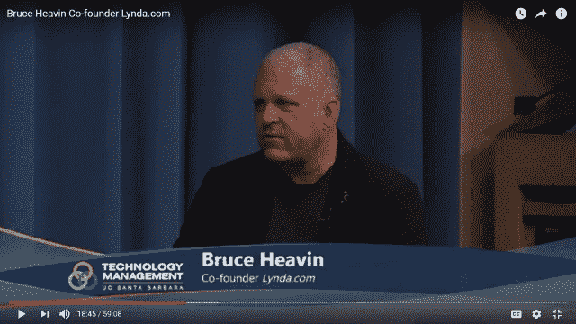

# 一只不可能的独角兽:Lynda.com 从车库到 13 亿美元销售额的旅程

> 原文：<https://medium.com/hackernoon/an-unlikely-unicorn-lynda-coms-journey-from-garage-to-1-3b-sale-ce801500edf3>

Image Credit: UCTV

> 这篇文章的一个版本曾出现在《福布斯》杂志上。

我最近采访了 Lynda.com 的联合创始人兼创新负责人布鲁斯·海文，这是加州大学圣巴巴拉分校 [创新者故事系列](https://www.uctv.tv/innovator-stories/)的一部分。布鲁斯和他的妻子琳达在他们的车库中创建了一家学习公司，最初是举办面授课程，后来通过邮购销售 VHS 磁带。在布鲁斯的创新指导下，该公司是互联网的早期采用者，早在 YouTube 等平台变得无处不在之前就创建了在线视频。

布鲁斯和琳达最终将他们的[创业公司](https://hackernoon.com/tagged/startup)发展成为一家全球巨头，为超过 400 万用户提供 5700 门课程和 255000 个视频教程。

2015 年，LinkedIn 以 15 亿美元收购了 Lynda.com，使其成为真正的独角兽。结果尤其令人印象深刻，因为该公司在最初的 17 年里完全自筹资金。

您可以在工作、跑步或玩耍时，在后台收听我们的讨论。如果你想在 iTunes 上免费下载我和布鲁斯的谈话，你可以点击这里。

对于那些没有时间听完我们整个演讲的人，我在下面强调了几个要点，以及相应的视频时间戳，以方便快速了解企业家感兴趣的问题。

1.  **沮丧的学生创建了一个崭新的学习公司**

这本书 [*夏山学校*](http://www.amazon.com/Summerhill-School-New-View-Childhood/dp/0312141378/ref=sr_1_1?ie=UTF8&qid=1293237402&sr=8-1) 对小时候的琳达影响很大。像一个真正的企业家一样，尽管她很年轻，但她掌握了自己的生活，并追求另类教育。

布鲁斯在学校也经历了一段充满挑战的时期，与 20 世纪 70 年代强调一致性而非创造性的公立学校教育的局限性作斗争。

*【3:27】**“我有各种我不了解的残疾，我三年级时不及格。我在阅读、写作、理解和很多社交能力方面有问题。当孩子们在操场上玩耍时，我在拖车里学习演讲，学习如何正确地写我的信，这真的很难，因为我每件事都做得很好，但有些地方，无论我多么努力，我都会失败，这让我真的讨厌每天去学校。我会去那里，知道我不能通过某些事情，这是非常令人沮丧的。”*

由于他们不令人满意的学术经历，布鲁斯和琳达都希望创建一个另类的学习组织，让学生只对自己负责。

1995 年，琳达写了第一本关于网页设计的书,《设计网页图形》。她第一本书的成功确立了她作为思想领袖的地位，并表明存在一个相当大的市场来教育非技术爱好者了解当时新兴的互联网。

*[04:29]“我及时了解到，学习有不同的方式和风格。我们没有任何单位，我们没有任何学分，我们没有任何测试。就像‘哦，我要学点东西，我要为了学而学。’你不需要向任何人证明，除了你自己。”*

教训:找出一个你热切希望解决的问题。

1.  **自学者教得好**

布鲁斯和琳达都是自学成才的技术专家。就布鲁斯而言，他很幸运，他的父亲是一名火箭科学家，这使他在很小的时候就接触到了计算机。

*[8:54]“我父亲是名副其实的火箭科学家。他在波音公司工作……1977 年，我可以在家里使用电脑。他们不让我玩电子游戏，所以我自己编程。我学了编程，Basic，上帝保佑，还有 COBOL 和后来的 Fortran。*

这些确实是我做的事情，为我走向其他方向和理解计算机图形奠定了基础，即使它们并不那么好。尽早理解这些东西……(这很重要，因为)当它们开始出现在消费者层面时，向消费者解释它们将会变得容易得多。”

教训:保持好奇心，永远不要停止寻求新知识。

1.  **失败的小刀推销员**

布鲁斯试图靠卖刀来支付上艺术学院的费用。他没坚持多久。有趣的是，琳达十几岁时在热狗摊工作，每月挣 80 美元。在这次采访中，她告诉我这次失败教会了她，*“做你讨厌的事情会让你的生活不快乐。总有办法得到你想要的东西，对我来说，那就是支付私人教育，即使看起来没有可能。”*

类似地，布鲁斯短暂的销售生涯进一步证明，他的才能更好地应用于创造技术，而不是试图销售技术。

*【10:10】“我彻底失败了。我做得不好。我做了大约两个星期，才发现自己是个糟糕的销售员。我不想给别人施加压力。我不是一个高压的人。我不会把自己推给别人，他们想从我身上得到的不是过去的我。*

了解自己不是什么非常重要……(这)是我们公司成长过程中最困难的事情之一。当你创办自己的公司时，你什么都做。你倒垃圾，你擦窗户，你去买办公用品。如果只是你和你老婆，或者你和另外五个人，那么小的规模几乎没有组织层次。你什么都做了。

随着你变得越来越大，你不得不不断放弃你的工作，但了解如何让真正聪明的人围绕在你身边可以帮助你弥补你的不足。”

然后，我指出了一个显而易见的事实:你必须有自知之明，才能招募到能够弥补你弱点的人。布鲁斯表示同意，他说:*【11:29】“要有自知之明是非常困难的。我只是认为我什么都擅长，但是太可怕了，有很多事情我就是不会做。销售就是一个很好的例子。我不是销售人员。”*

教训:通过了解你不是什么，你将离发现你是什么更近一步。

1.  工作的对立面是无聊

布鲁斯还分享说，一旦交易完成，他对交易的速度感到吃惊，导致他最初变得厌倦。

(最初)有很多无聊的事情，现在没有那么多了，但是你知道，我没有 B 计划，我不认为公司会这么快卖掉。从最初的“也许我们会买下你”到“我们会买下你”不到一个月，而当他们说他们会买下我们时，也不到一个月。事情过得很快，所以即使到最后一刻，我还在想，‘我认为这不会发生。’”

然后，我们探讨了布鲁斯最初是如何处理公司出售事宜的。考虑到交易完成的速度，他没有足够的时间去考虑离开 Lynda.com 后的生活会是什么样子。

根据布鲁斯的说法，在交易结束的第二天， *[16:50]“我只是坐在家里的沙发上。我有点傻眼了。这不是我的目标，也不是我的最终目标。我以为我所做的事情有更大的目标。我以为我可以走得更远，所以说实话，我有点震惊。*

*当你实际销售时，你知道这是一个第一世界的问题。我对自己在那里所能做的事情很有自信。我更像是一个制造者和创造者，所以当我在做的时候，当我在制作的时候，当我被夺走的时候，我会更开心，我会说，'哇。'我想我在那家公司投入了太多，以至于当我离开的时候，我不知道我拥有什么，所以我花了一点时间来适应。”*

*教训:不要纠结于你可能的退出，而是投入足够的时间来深思熟虑地考虑你创业后的生活。*

*可以在推特上关注约翰:*[*@ johngreathouse*](https://twitter.com/#!/johngreathouse)*。*